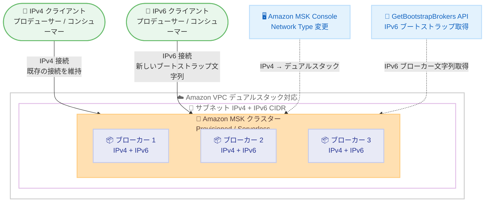

# Amazon MSK - 既存クラスターでのデュアルスタック (IPv4/IPv6) 接続のサポート

**リリース日**: 2026 年 2 月 17 日
**サービス**: Amazon Managed Streaming for Apache Kafka (Amazon MSK)
**機能**: 既存 MSK Provisioned / MSK Serverless クラスターのデュアルスタック接続

📊 [このアップデートのインフォグラフィックを見る](https://takech9203.github.io/aws-news-summary/20260217-aws-msk-dual-stack-ipv4-and-ipv6.html)

## 概要

Amazon Managed Streaming for Apache Kafka (Amazon MSK) が、既存の MSK Provisioned および MSK Serverless クラスターに対してデュアルスタック (IPv4 および IPv6) 接続をサポートしました。これにより、IPv4 と IPv6 の両方のプロトコルを使用して Amazon MSK に接続できるようになり、IPv6 環境へのアプリケーションのモダナイゼーションを IPv4 互換性を維持しながら進めることが可能になります。

Amazon MSK Console、AWS CLI、SDK、または CloudFormation を使用して、クラスターの Network Type パラメータを IPv4 からデュアルスタックに変更することでデュアルスタック接続を有効化できます。更新が成功すると、MSK は既存の IPv4 接続を維持しながら IPv6 対応のネットワークインターフェイスをプロビジョニングし、サービスの中断なく移行できます。新しい IPv6 ブートストラップブローカー文字列は GetBootstrapBrokers API で取得できます。

**アップデート前の課題**

- MSK Provisioned および MSK Serverless クラスターは IPv4 アドレッシングのみをサポートしていた
- IPv6 ネイティブ環境との接続には追加のネットワーク変換レイヤーが必要だった
- IPv6 対応が求められるコンプライアンス要件を満たすために回避策が必要だった
- 将来的な IPv4 アドレス枯渇に対する準備ができていなかった

**アップデート後の改善**

- 既存クラスターで IPv4 と IPv6 の両方のプロトコルを使用した接続が可能になった
- Network Type パラメータの変更のみでデュアルスタックを有効化可能
- 既存の IPv4 接続を維持しながら IPv6 を追加でき、サービスの中断がない
- GetBootstrapBrokers API で IPv6 ブートストラップブローカー文字列を取得可能
- 追加コストなしで利用可能

## アーキテクチャ図



この図は、デュアルスタック対応の Amazon MSK クラスターに IPv4 と IPv6 の両方のクライアントから接続する構成を示しています。Amazon MSK Console で Network Type を変更し、GetBootstrapBrokers API で新しい IPv6 ブートストラップブローカー文字列を取得します。

## サービスアップデートの詳細

### 主要機能

1. **既存クラスターのデュアルスタック対応**
   - MSK Provisioned および MSK Serverless の既存クラスターで IPv6 を有効化可能
   - Network Type パラメータを IPv4 からデュアルスタックに変更するだけで有効化
   - 新規クラスター作成時にもデュアルスタックを選択可能

2. **シームレスな移行**
   - 既存の IPv4 接続を維持しながら IPv6 対応のネットワークインターフェイスを追加
   - サービスの中断なく移行が完了
   - 明示的に更新しない限り、すべてのクラスターは IPv4 のみを維持

3. **複数の設定方法**
   - Amazon MSK Console からの GUI 操作
   - AWS CLI での設定変更
   - AWS SDK を使用したプログラマティックな設定
   - CloudFormation による Infrastructure as Code での管理

## 技術仕様

### Network Type パラメータ

| 設定値 | 説明 |
|--------|------|
| IPv4 | IPv4 のみのアドレッシング (デフォルト) |
| DUAL_STACK | IPv4 と IPv6 の両方のアドレッシング |

### 前提条件

| 項目 | 詳細 |
|------|------|
| VPC 要件 | IPv6 CIDR ブロックが関連付けられた VPC |
| サブネット要件 | IPv4 と IPv6 の両方の CIDR ブロックが割り当てられたサブネット |
| セキュリティグループ | IPv6 トラフィックを許可するルールの追加が必要 |

### API 変更履歴

| 日付 | サービス | 変更内容 |
|------|----------|----------|
| 2026/02/16 | [Managed Streaming for Kafka](https://awsapichanges.com/archive/changes/11d064-kafka.html) | 11 updated api methods - updateConnectivity API で NetworkType パラメータによるデュアルスタック接続をサポート |

## 設定方法

### 前提条件

1. MSK Provisioned または MSK Serverless クラスターが作成済みであること
2. VPC に IPv6 CIDR ブロックが関連付けられていること
3. クラスターのサブネットに IPv4 と IPv6 の両方の CIDR ブロックが割り当てられていること
4. 適切な IAM 権限 (`kafka:UpdateConnectivity`, `kafka:GetBootstrapBrokers`) が設定されていること

### 手順

#### ステップ 1: VPC とサブネットの IPv6 対応確認

```bash
# VPC に IPv6 CIDR ブロックが関連付けられているか確認
aws ec2 describe-vpcs --vpc-ids vpc-xxxxxxxx \
  --query 'Vpcs[0].Ipv6CidrBlockAssociationSet'
```

VPC に IPv6 CIDR ブロックが関連付けられていることを確認します。関連付けられていない場合は追加します。

```bash
# IPv6 CIDR ブロックを VPC に追加
aws ec2 associate-vpc-cidr-block \
  --vpc-id vpc-xxxxxxxx \
  --amazon-provided-ipv6-cidr-block

# サブネットに IPv6 CIDR ブロックを割り当て
aws ec2 associate-subnet-cidr-block \
  --subnet-id subnet-xxxxxxxx \
  --ipv6-cidr-block 2600:1f18:xxxx:xxxx::/64
```

これらのコマンドは、VPC とサブネットに IPv6 CIDR ブロックを追加します。

#### ステップ 2: セキュリティグループの更新

```bash
# IPv6 トラフィックを許可するインバウンドルールを追加
aws ec2 authorize-security-group-ingress \
  --group-id sg-xxxxxxxx \
  --ip-permissions IpProtocol=tcp,FromPort=9092,ToPort=9098,Ipv6Ranges='[{CidrIpv6=::/0,Description="MSK IPv6 access"}]'
```

MSK ブローカーのポート範囲 (9092-9098) への IPv6 アクセスを許可します。実際の環境では、CIDR 範囲を適切に制限してください。

#### ステップ 3: クラスターのデュアルスタック有効化

```bash
# MSK クラスターの Network Type をデュアルスタックに変更
aws kafka update-connectivity \
  --cluster-arn arn:aws:kafka:ap-northeast-1:123456789012:cluster/my-cluster/xxxxx \
  --connectivity-info '{
    "PublicAccess": {
      "Type": "DISABLED"
    },
    "VpcConnectivity": {
      "ClientAuthentication": {
        "Tls": { "Enabled": true }
      }
    }
  }' \
  --current-version K1234567890 \
  --network-type DUAL_STACK
```

このコマンドは、既存の MSK クラスターの Network Type を IPv4 からデュアルスタックに変更します。`--current-version` にはクラスターの現在のバージョンを指定します。

#### ステップ 4: IPv6 ブートストラップブローカー文字列の取得

```bash
# IPv6 ブートストラップブローカー文字列を取得
aws kafka get-bootstrap-brokers \
  --cluster-arn arn:aws:kafka:ap-northeast-1:123456789012:cluster/my-cluster/xxxxx
```

デュアルスタック更新が成功した後、このコマンドで IPv6 対応のブートストラップブローカー文字列を取得します。取得した文字列をクライアントアプリケーションの接続設定に使用します。

#### ステップ 5: クライアントアプリケーションの更新

```properties
# Kafka クライアント設定例 - IPv6 ブートストラップブローカーを使用
bootstrap.servers=b-1.my-cluster.xxxxx.kafka.ap-northeast-1.amazonaws.com:9094,b-2.my-cluster.xxxxx.kafka.ap-northeast-1.amazonaws.com:9094,b-3.my-cluster.xxxxx.kafka.ap-northeast-1.amazonaws.com:9094
security.protocol=SSL
```

GetBootstrapBrokers API から取得した新しいブートストラップブローカー文字列をクライアントアプリケーションに設定します。

## メリット

### ビジネス面

- **コンプライアンス対応**: IPv6 対応が義務付けられている規制要件を満たすことが可能
- **将来対応**: IPv4 アドレス枯渇に備えたインフラストラクチャのモダナイゼーション
- **コスト効率**: 追加コストなしでデュアルスタック接続を利用可能
- **サービス継続性**: 移行中もサービスの中断なく既存の接続を維持

### 技術面

- **既存クラスターの対応**: 新規クラスターを作成せずに既存クラスターでデュアルスタックを有効化可能
- **シームレスな移行**: IPv4 接続を維持しながら IPv6 を追加するため、段階的な移行が可能
- **アドレス空間の拡張**: IPv6 の広大なアドレス空間を活用可能
- **ネットワーク簡素化**: IPv6 ネイティブ環境では NAT 変換が不要になり、接続がシンプルに

## デメリット・制約事項

### 制限事項

- VPC とサブネットに IPv4 と IPv6 の両方の CIDR ブロックが事前に割り当てられている必要がある
- IPv6 のみの接続はサポートされておらず、デュアルスタックモードでのみ IPv6 を使用可能
- デュアルスタックから IPv4 のみへの戻しがサポートされているかは公式ドキュメントで確認が必要
- セキュリティグループの IPv6 ルール追加が必要

### 考慮すべき点

- IPv6 トラフィックに対するセキュリティポリシーの見直しが必要
- クライアントアプリケーションが IPv6 をサポートしているか確認が必要
- DNS 解決の設定確認 (AAAA レコードの解決) が必要
- ファイアウォールルールの IPv6 対応確認が必要
- 既存の監視・ログ設定で IPv6 トラフィックが適切に記録されるか確認が必要

## ユースケース

### ユースケース 1: IPv6 ネイティブ環境からのストリーミングデータ処理

**シナリオ**: IPv6 のみをサポートするモバイルネットワークや IoT デバイスからストリーミングデータを MSK に送信する場合。

**実装例**:
```bash
# クラスターのデュアルスタック有効化
aws kafka update-connectivity \
  --cluster-arn arn:aws:kafka:ap-northeast-1:123456789012:cluster/iot-cluster/xxxxx \
  --current-version K1234567890 \
  --network-type DUAL_STACK

# IPv6 ブートストラップブローカーの取得
aws kafka get-bootstrap-brokers \
  --cluster-arn arn:aws:kafka:ap-northeast-1:123456789012:cluster/iot-cluster/xxxxx
```

**効果**: NAT64/DNS64 などのネットワーク変換レイヤーが不要になり、IPv6 デバイスから直接 MSK に接続でき、レイテンシが改善されます。

### ユースケース 2: コンプライアンス要件への対応

**シナリオ**: 政府機関や規制産業において IPv6 対応が義務付けられている環境で MSK を使用する場合。

**実装例**:
```bash
# 既存の本番クラスターをデュアルスタックに更新
aws kafka update-connectivity \
  --cluster-arn arn:aws:kafka:us-east-1:123456789012:cluster/compliance-cluster/xxxxx \
  --current-version K1234567890 \
  --network-type DUAL_STACK

# セキュリティグループで IPv6 アクセスを制限
aws ec2 authorize-security-group-ingress \
  --group-id sg-xxxxxxxx \
  --ip-permissions IpProtocol=tcp,FromPort=9094,ToPort=9094,Ipv6Ranges='[{CidrIpv6=2600:1f18:xxxx::/48,Description="Authorized IPv6 range"}]'
```

**効果**: 既存のクラスターを再作成することなく IPv6 対応要件を満たすことができ、サービスの中断なくコンプライアンスに準拠できます。

### ユースケース 3: ハイブリッドクラウド環境でのネットワーク統合

**シナリオ**: オンプレミスの IPv6 ネットワークと AWS 間で Kafka ストリーミングデータを処理する場合。

**実装例**:
```bash
# Direct Connect または VPN で IPv6 接続を確立後、クラスターをデュアルスタックに更新
aws kafka update-connectivity \
  --cluster-arn arn:aws:kafka:eu-west-1:123456789012:cluster/hybrid-cluster/xxxxx \
  --current-version K1234567890 \
  --network-type DUAL_STACK
```

**効果**: オンプレミスの IPv6 ネットワークから直接 MSK に接続でき、統一されたネットワークアーキテクチャによる運用の簡素化が実現します。

## 料金

デュアルスタック接続の使用に追加料金はかかりません。標準の Amazon MSK 料金が適用されます。

| 項目 | 説明 |
|------|------|
| MSK Provisioned | ブローカーインスタンス時間とストレージに基づく料金 |
| MSK Serverless | クラスター時間、パーティション時間、データ保持ストレージ、スループットに基づく料金 |
| デュアルスタック接続 | 追加コストなし |

詳細な料金については、[Amazon MSK 料金ページ](https://aws.amazon.com/msk/pricing/)を参照してください。

## 利用可能リージョン

デュアルスタック接続は、Amazon MSK が利用可能なすべての AWS リージョンで利用可能です。

## 関連サービス・機能

- **Amazon VPC**: IPv6 対応 VPC とサブネットの構成
- **Amazon MSK Connect**: MSK Connect でもデュアルスタック接続をサポート
- **AWS CloudFormation**: Infrastructure as Code でのデュアルスタック設定管理
- **Amazon CloudWatch**: MSK クラスターのモニタリングとメトリクス

## 参考リンク

- 📊 [インフォグラフィック](https://takech9203.github.io/aws-news-summary/20260217-aws-msk-dual-stack-ipv4-and-ipv6.html)
- [公式発表 (What's New)](https://aws.amazon.com/about-aws/whats-new/2026/02/aws-msk-dual-stack-ipv4-and-ipv6/)
- [Amazon MSK 開発者ガイド](https://docs.aws.amazon.com/msk/latest/developerguide/what-is-msk.html)
- [API 変更履歴](https://awsapichanges.com/archive/changes/11d064-kafka.html)
- [料金ページ](https://aws.amazon.com/msk/pricing/)

## まとめ

Amazon MSK が既存の MSK Provisioned および MSK Serverless クラスターに対してデュアルスタック (IPv4/IPv6) 接続をサポートしました。Network Type パラメータを変更するだけで、既存の IPv4 接続を維持しながら IPv6 を追加でき、サービスの中断なく移行できます。追加コストなしで利用可能であり、IPv6 対応が求められるコンプライアンス要件への対応や、IPv6 ネイティブ環境からのストリーミングデータ処理に効果を発揮します。MSK が利用可能なすべての AWS リージョンで利用でき、IPv6 環境へのモダナイゼーションを検討している場合は、既存クラスターでのデュアルスタック有効化を推奨します。
