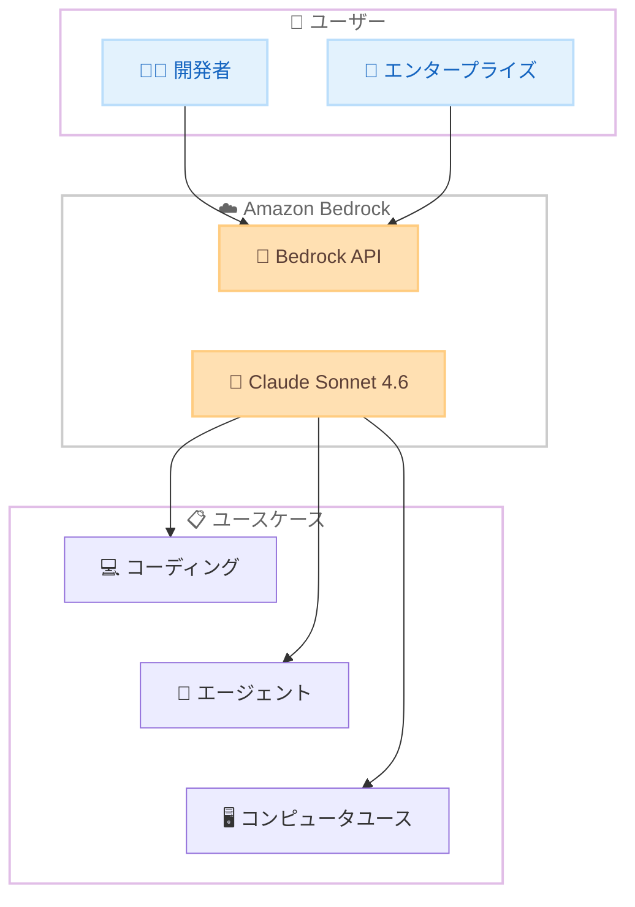

# Amazon Bedrock - Claude Sonnet 4.6 の提供開始

**リリース日**: 2026 年 2 月 17 日
**サービス**: Amazon Bedrock
**機能**: Claude Sonnet 4.6 モデルサポート

📊 [このアップデートのインフォグラフィックを見る](https://takech9203.github.io/aws-news-summary/20260217-claude-sonnet-4-6-available-in-amazon-bedrock.html)

## 概要

Amazon Bedrock で Anthropic の Claude Sonnet 4.6 が利用可能になった。Sonnet 4.6 はコーディング、エージェント、プロフェッショナルワークにおいてフロンティアレベルのパフォーマンスを提供する。Anthropic によると、Sonnet 4.6 はコンピュータユース機能において最も優れたモデルであり、ブラウザベースの自動化をほぼ人間レベルの信頼性で展開できる。

Claude Sonnet 4.6 は Opus 4.6 レベルの知能に低コストでアプローチし、高速かつ高品質なタスク完了を実現する。Sonnet 4.5 からの直接的なアップグレードとして位置づけられ、一貫した会話品質と効率的なマルチステップオーケストレーションを必要とするユースケースに最適化されている。

**アップデート前の課題**

- Sonnet 4.5 では大規模なコーディングやナレッジワークのユースケースで性能とコストのバランスに課題があった
- エージェンティックワークフローにおけるリードエージェントとサブエージェントの両方の役割を効率的にこなすモデルが求められていた
- コンテキスト圧縮機能が限定的で、長時間のセッション維持に課題があった

**アップデート後の改善**

- Opus 4.6 に近い知能レベルを低コストで提供し、大量のコーディングやナレッジワークに最適
- マルチモデルパイプラインにおいてリードエージェント・サブエージェントの両方の役割をシームレスにこなせる
- コンテキスト圧縮機能により、長時間セッションでの効率的なワークフロー管理が可能
- Sonnet 4.5 からの移行は軽微なプロンプト調整のみで完了

## アーキテクチャ図



Claude Sonnet 4.6 は Amazon Bedrock API を通じてアクセスし、コーディング、エージェント、コンピュータユースなど多様なユースケースに活用できる。

## サービスアップデートの詳細

### 主要機能

1. **フロンティアレベルのパフォーマンス**
   - コーディング、エージェント、プロフェッショナルワークにおいて最高レベルの性能を提供
   - Opus 4.6 に近い知能レベルを低コストで実現
   - 大量のタスク処理に最適化された高速レスポンス

2. **コンピュータユース機能の強化**
   - Anthropic のベストコンピュータユースモデルとして位置づけ
   - ブラウザベースの自動化をほぼ人間レベルの信頼性で実行
   - ビジネスツール間の操作を自動化

3. **エージェンティックワークフローの最適化**
   - マルチモデルパイプラインでリードエージェントとサブエージェントの両方の役割に対応
   - 精密なワークフロー管理とコンテキスト圧縮機能
   - 長時間セッションのコンテキスト維持

4. **エンタープライズ向け機能**
   - スプレッドシートや財務モデル作成の高速化
   - コンプライアンスレビュープロセスの詳細な処理
   - データ要約タスクにおける反復速度と精度の向上

## 技術仕様

### モデル比較

| 項目 | Claude Sonnet 4.6 | Claude Sonnet 4.5 | Claude Opus 4.6 |
|------|-------------------|-------------------|-----------------|
| 知能レベル | Opus 4.6 に近い | 標準 | 最高 |
| コスト | 低～中 | 低 | 高 |
| コンピュータユース | 最も優れている | 対応 | 対応 |
| 移行難易度 | 軽微な調整のみ | - | - |

## 設定方法

### 前提条件

1. AWS アカウントを保有していること
2. Amazon Bedrock へのアクセス権限があること
3. Claude Sonnet 4.6 のモデルアクセスが有効化されていること

### 手順

#### ステップ 1: モデルアクセスの有効化

Amazon Bedrock コンソールで Claude Sonnet 4.6 のモデルアクセスをリクエストする。

#### ステップ 2: API 呼び出し

```bash
aws bedrock-runtime invoke-model \
  --model-id anthropic.claude-sonnet-4-6-20260217-v1:0 \
  --content-type application/json \
  --accept application/json \
  --body '{"anthropic_version":"bedrock-2023-05-31","max_tokens":1024,"messages":[{"role":"user","content":"Hello"}]}' \
  output.json
```

Bedrock Runtime API を使用して Claude Sonnet 4.6 モデルを呼び出す。モデル ID は利用可能リージョンのドキュメントを参照して最新のものを使用すること。

## メリット

### ビジネス面

- **コスト効率**: Opus 4.6 に近い性能をより低コストで利用でき、大量処理のユースケースに適している
- **生産性向上**: コーディング支援やナレッジワークの自動化により、開発チームとビジネスチームの生産性が向上
- **スムーズな移行**: Sonnet 4.5 からの移行が軽微なプロンプト調整のみで完了し、既存投資を保護

### 技術面

- **マルチモデルパイプライン対応**: リードエージェントとサブエージェントの両方の役割に最適化
- **コンテキスト圧縮**: 長時間セッションでも効率的なコンテキスト管理が可能
- **コンピュータユース**: ブラウザベースの自動化をエンタープライズレベルの信頼性で実行

## デメリット・制約事項

### 制限事項

- 利用可能リージョンはドキュメントを参照する必要がある
- モデルアクセスのリクエストが必要
- Sonnet 4.5 からの完全な互換性は保証されないため、プロンプト調整が必要な場合がある

### 考慮すべき点

- Opus 4.6 と比較すると、最も複雑なタスクでは性能差がある可能性がある
- 料金体系は Sonnet 4.5 と異なる可能性があるため、コスト見積もりの更新が必要

## ユースケース

### ユースケース 1: 大規模コーディング支援

**シナリオ**: 開発チームが大量のコードレビュー、バグ修正、リファクタリングを効率化したい

**効果**: Sonnet 4.6 の高速かつ高品質なコーディング能力により、Opus 4.6 に近い品質を低コストで大量処理できる

### ユースケース 2: エージェンティックワークフロー

**シナリオ**: マルチステップの業務プロセスを AI エージェントで自動化したい

**効果**: リードエージェントとサブエージェントの両方の役割を 1 つのモデルでカバーでき、パイプラインの構築が簡素化される

### ユースケース 3: コンプライアンスレビューの自動化

**シナリオ**: 金融機関が大量の規制文書のレビューを効率化したい

**効果**: 詳細な注意力と反復速度の向上により、コンプライアンスレビュープロセスを大幅に高速化できる

## 料金

Amazon Bedrock の Claude Sonnet 4.6 料金はオンデマンド方式で、入力トークンと出力トークンの使用量に基づく。詳細な料金は [Amazon Bedrock 料金ページ](https://aws.amazon.com/bedrock/pricing/) を参照。

## 利用可能リージョン

利用可能リージョンの完全なリストは [Amazon Bedrock ドキュメント](https://docs.aws.amazon.com/bedrock/latest/userguide/models-supported.html) を参照。

## 関連サービス・機能

- **Amazon Bedrock Agents**: Claude Sonnet 4.6 をエージェントのバックエンドモデルとして活用
- **Amazon Bedrock AgentCore Browser**: コンピュータユース機能と組み合わせてブラウザ操作を自動化
- **Amazon Bedrock Guardrails**: Sonnet 4.6 の出力に対する安全性制御を適用

## 参考リンク

- 📊 [インフォグラフィック](https://takech9203.github.io/aws-news-summary/20260217-claude-sonnet-4-6-available-in-amazon-bedrock.html)
- [公式発表 (What's New)](https://aws.amazon.com/about-aws/whats-new/2026/02/claude-sonnet-4.6-available-in-amazon-bedrock/)
- [About Amazon Blog](https://www.aboutamazon.com/news/aws/anthropic-claude-4-opus-sonnet-amazon-bedrock)
- [Amazon Bedrock ドキュメント](https://docs.aws.amazon.com/bedrock/latest/userguide/models-supported.html)
- [Amazon Bedrock 料金ページ](https://aws.amazon.com/bedrock/pricing/)

## まとめ

Claude Sonnet 4.6 は Opus 4.6 に近い知能レベルを低コストで提供し、コーディング、エージェント、コンピュータユースのユースケースに最適なモデルである。Sonnet 4.5 からの移行は軽微な調整のみで完了するため、既存の Bedrock ユーザーは早期にアップグレードを検討すべきである。
