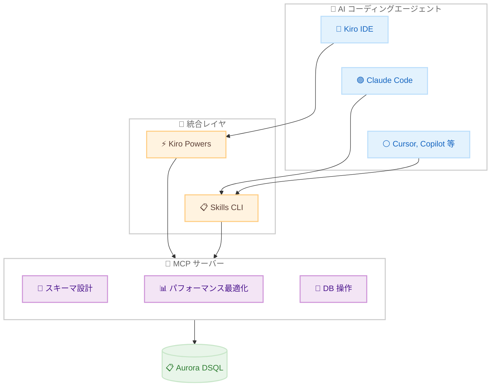

# Aurora DSQL - Kiro powers および AI エージェントスキル統合

**リリース日**: 2026 年 2 月 18 日
**サービス**: Amazon Aurora DSQL
**機能**: Kiro powers および AI エージェントスキルとの統合

📊 [このアップデートのインフォグラフィックを見る](https://takech9203.github.io/aws-news-summary/20260218-amazon-aurora-dsql-integrates-with-kiro-powers-and-agent-skills.html)

## 概要

Amazon Aurora DSQL が Kiro powers および AI エージェントスキルと統合された。この統合により、Aurora DSQL の MCP (Model Context Protocol) サーバーと開発ベストプラクティスがバンドルされ、AI エージェントが Aurora DSQL のスキーマ設計、パフォーマンス最適化、データベース操作をすぐに支援できるようになった。

Kiro powers は、キュレーションされた MCP サーバー、ステアリングファイル、エージェントフックのレジストリで、ソフトウェア開発とデプロイのユースケースを加速する。Aurora DSQL 向けの Kiro power により、AI エージェントが事前コンテキストなしでも専門知識にアクセスでき、試行錯誤の開発サイクルを削減する。

また、Aurora DSQL スキルは Skills CLI を通じて Kiro CLI、Claude Code、Gemini、Codex、Cursor、Copilot、Cline、Windsurf、Roo、OpenCode など多数の AI コーディングエージェントに対応する。

**アップデート前の課題**

- Aurora DSQL の開発にはデータベース設計の専門知識を開発者が個別に持つ必要があった
- AI エージェントに Aurora DSQL の Postgres 互換パターンや分散データベース設計のコンテキストを毎回提供する必要があった
- MCP サーバーのセットアップを開発者が手動で行う必要があった

**アップデート後の改善**

- Kiro IDE でワンクリックインストールが可能になった
- AI エージェントがデータベースタスク時に関連するスキルガイダンスを動的にロードする
- 複数の AI コーディングエージェントで共通のスキルを利用可能になった

## アーキテクチャ図



AI コーディングエージェントが Kiro powers または Skills CLI を通じて Aurora DSQL の MCP サーバーに接続し、専門的な開発支援を受ける。

## サービスアップデートの詳細

### 主要機能

1. **Kiro Power for Aurora DSQL**
   - Kiro IDE でのワンクリックインストール
   - MCP サーバー、ステアリングファイル、エージェントフックの統合パッケージ
   - コンテキストキーワードによる動的アクティベーション

2. **Aurora DSQL Skill**
   - Skills CLI によるマルチエージェント対応
   - 単一コマンドでインストール可能
   - 対応エージェント: Kiro CLI、Claude Code、Gemini、Codex、Cursor、Copilot、Cline、Windsurf、Roo、OpenCode 他

3. **動的スキルガイダンス**
   - Aurora DSQL の Postgres 互換 SQL パターン
   - 分散データベース設計のベストプラクティス
   - IAM 認証のガイダンス
   - 新機能追加時にスキルも自動更新

## 技術仕様

### 対応エージェント

| エージェント | インストール方法 |
|-------------|----------------|
| Kiro IDE | Kiro Powers レジストリからワンクリック |
| Claude Code | Skills CLI |
| Gemini | Skills CLI |
| Cursor | Skills CLI |
| Copilot | Skills CLI |
| その他 | Skills CLI |

### インストールコマンド

```bash
npx skills add awslabs/mcp --skill dsql
```

Skills CLI を使用して Aurora DSQL スキルをインストールするコマンド。エージェント選択やスコープ設定が対話的に行われる。

## 設定方法

### 前提条件

1. Kiro IDE または対応 AI コーディングエージェントがインストール済みであること
2. Aurora DSQL クラスタが作成済みであること
3. Node.js がインストール済みであること (Skills CLI 使用時)

### 手順

#### ステップ 1: Kiro Power のインストール (Kiro IDE)

Kiro IDE で Aurora DSQL Power をインストールする。[Kiro Powers レジストリ](https://kiro.dev/launch/powers/amazon-aurora-dsql/)からワンクリックでインストール可能。

#### ステップ 2: Skills CLI でのインストール (その他のエージェント)

```bash
npx skills add awslabs/mcp --skill dsql
```

Skills CLI を実行し、対話的にエージェントとスコープを選択してスキルをインストールする。

## メリット

### ビジネス面

- **開発速度の向上**: AI エージェントが Aurora DSQL のベストプラクティスを即座に提供
- **学習コストの削減**: 分散データベース設計の専門知識がなくてもAI 支援で開発可能
- **エージェント選択の自由**: 10 以上の AI コーディングエージェントをサポート

### 技術面

- **コンテキスト効率**: 毎回同じコンテキストを提供する必要がなくなる
- **継続的な更新**: 新機能追加時にスキルも自動的に更新される
- **MCP 標準準拠**: Model Context Protocol に基づく標準的な統合

## デメリット・制約事項

### 制限事項

- AI エージェントの出力は常に検証が必要
- 一部のエージェントでは MCP サポートが必要

### 考慮すべき点

- スキルが提供するガイダンスは推奨事項であり、本番環境への適用前に検証が必要
- エージェントの出力品質はモデルと設定に依存

## ユースケース

### ユースケース 1: 新規アプリケーション開発

**シナリオ**: Aurora DSQL を使用した新しいサーバーレスアプリケーションの開発を AI エージェントの支援で行う

**効果**: スキーマ設計から IAM 認証設定まで、AI エージェントがベストプラクティスに基づいた提案を提供

### ユースケース 2: PostgreSQL からの移行

**シナリオ**: 既存の PostgreSQL アプリケーションを Aurora DSQL に移行する際の SQL パターン変換

**効果**: AI エージェントが Postgres 互換パターンと分散データベース固有の考慮事項を自動的にガイド

### ユースケース 3: パフォーマンスチューニング

**シナリオ**: Aurora DSQL のクエリパフォーマンスを最適化したい

**効果**: AI エージェントが分散データベースに最適なインデックス設計やクエリパターンを提案

## 料金

Aurora DSQL の Kiro power および Skills は無料で利用可能。Aurora DSQL の利用料金は通常の料金体系に従う。AWS Free Tier で Aurora DSQL を無料で開始できる。

## 利用可能リージョン

Aurora DSQL が利用可能なすべてのリージョンで使用可能。

## 関連サービス・機能

- **Amazon Aurora DSQL**: サーバーレス分散 SQL データベース
- **Kiro**: AWS が提供する AI 搭載 IDE
- **Model Context Protocol (MCP)**: AI エージェントとツールの標準統合プロトコル

## 参考リンク

- 📊 [インフォグラフィック](https://takech9203.github.io/aws-news-summary/20260218-amazon-aurora-dsql-integrates-with-kiro-powers-and-agent-skills.html)
- [公式発表 (What's New)](https://aws.amazon.com/about-aws/whats-new/2026/02/amazon-aurora-dsql-integrates-with-kiro-powers-and-agent-skills/)
- [Aurora DSQL ステアリングドキュメント](https://docs.aws.amazon.com/aurora-dsql/latest/userguide/SECTION_aurora-dsql-steering.html)
- [GitHub - Aurora DSQL MCP サーバー](https://github.com/awslabs/mcp/tree/main/src/aurora-dsql-mcp-server)
- [Kiro Power for Aurora DSQL](https://kiro.dev/launch/powers/amazon-aurora-dsql/)
- [Skills CLI](https://skills.sh/docs/cli)

## まとめ

Aurora DSQL と Kiro powers / AI エージェントスキルの統合により、AI 支援による Aurora DSQL 開発が大幅に効率化された。10 以上の AI コーディングエージェントに対応し、MCP ベースの標準的な統合を提供する。Aurora DSQL を使用する開発者は、このスキルをインストールして AI エージェントの支援を最大限に活用することを推奨する。
