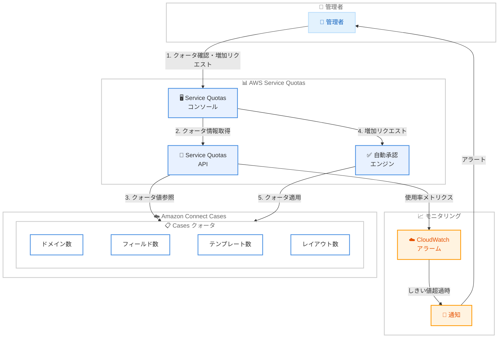

# Amazon Connect Cases - AWS Service Quotas サポート

**リリース日**: 2026 年 2 月 18 日
**サービス**: Amazon Connect Cases
**機能**: AWS Service Quotas との統合

📊 [このアップデートのインフォグラフィックを見る](https://takech9203.github.io/aws-news-summary/20260218-amazon-connect-cases-aws-service-quotas.html)

## 概要

Amazon Connect Cases が AWS Service Quotas をサポートしました。この統合により、管理者は Service Quotas コンソールを通じて Cases の適用済みクォータの一元的な表示、使用率のモニタリング、およびクォータ増加リクエストを行えるようになります。対象となるリクエストは手動介入なしに自動的に承認されるため、予期しないサービス制約に遭遇することなく、ケースワークロードのスケーリングが可能です。

Amazon Connect Cases は、複数のやり取りや複数の担当者を必要とする顧客の問題を追跡・管理するための機能です。従来、Cases のクォータ管理はドキュメントの確認や AWS サポートへの問い合わせが必要でしたが、今回のアップデートにより Service Quotas コンソールから直接管理できるようになりました。

この機能は、Amazon Connect Cases が利用可能なすべてのリージョンで提供されており、米国東部 (バージニア北部)、米国西部 (オレゴン)、カナダ (中部)、欧州 (フランクフルト)、欧州 (ロンドン)、アジアパシフィック (ソウル)、アジアパシフィック (シンガポール)、アジアパシフィック (シドニー)、アジアパシフィック (東京)、アフリカ (ケープタウン) で利用可能です。

**アップデート前の課題**

- Cases のクォータ値を確認するにはドキュメントを参照するか、AWS サポートに問い合わせる必要があった
- 現在のクォータ使用率をリアルタイムでモニタリングする手段がなく、上限に達してから初めて問題に気づくケースがあった
- クォータ増加リクエストには AWS サポートケースの作成が必要で、承認までに時間がかかっていた
- 複数の Cases クォータを一元的に管理する方法がなく、個別に確認する必要があった

**アップデート後の改善**

- Service Quotas コンソールで Cases の全クォータを一覧表示し、適用済みの値と使用率を一元的に確認可能
- クォータ使用率のモニタリングにより、上限到達前に事前対応が可能
- Service Quotas コンソールから直接クォータ増加をリクエストでき、対象リクエストは自動承認
- Amazon CloudWatch アラームと連携し、クォータ使用率がしきい値に達した際に通知を受け取ることが可能

## アーキテクチャ図



管理者は Service Quotas コンソールから Cases のクォータを一元管理できます。クォータ増加リクエストは自動承認エンジンにより処理され、CloudWatch アラームと連携することで使用率のモニタリングも可能です。

## サービスアップデートの詳細

### 主要機能

1. **クォータの一元表示**
   - Service Quotas コンソールで Amazon Connect Cases のすべてのクォータを一覧表示
   - 各クォータのデフォルト値、適用済みの値、調整可否を確認可能
   - アカウントレベルのクォータとして管理

2. **使用率のモニタリング**
   - 現在のクォータ使用率をリアルタイムで確認
   - CloudWatch メトリクスとの連携により、使用率ベースのアラーム設定が可能
   - クォータの 80% に達した時点でアラートを設定するベストプラクティスを適用可能

3. **クォータ増加リクエストの簡素化**
   - Service Quotas コンソールから直接増加リクエストを送信
   - 対象リクエストは手動介入なしに自動承認
   - AWS サポートケースを作成する必要がなくなった

4. **プログラマティックアクセス**
   - Service Quotas API を使用して、クォータ情報の取得や増加リクエストをプログラムで実行可能
   - AWS CLI からのクォータ管理にも対応
   - 自動化スクリプトやインフラストラクチャ管理ツールとの統合が可能

## 技術仕様

### Amazon Connect Cases のクォータ一覧

ドキュメントによると、Amazon Connect Cases の Service Quotas は以下のとおりです。すべてのクォータはアカウントレベルで適用されます。

| クォータ名 | デフォルト値 | 調整可否 |
|-----------|-------------|---------|
| Cases domains per AWS account | 5 | 可 |
| Fields in a Cases domain | 500 | 可 |
| Field options per single-select field in the Cases domain | 500 | 可 |
| Layouts in a Cases domain | 100 | 可 |
| Templates in a Cases domain | 100 | 可 |
| Related items that can be attached to a case | 200 | 可 |
| Files that can be attached to a case | 50 | 可 |
| Case fields per case layout | 100 | 不可 |
| SLAs that can be attached to a case | 10 | 可 |
| Fields in a Custom type related item | 5 | 可 |

### Cases API スロットリングクォータ

| API | デフォルトレートリミット | デフォルトバーストリミット | 調整可否 |
|-----|----------------------|------------------------|---------|
| CreateCase, SearchCases, ListTemplates, ListLayouts, CreateRelatedItems, SearchRelatedItems, ListCaseRules, ListTagsForResource, TagResource, UntagResource, GetCaseAuditEvents, GetCaseEventConfiguration, PutCaseEventConfiguration | 2 | 10 | 可 |
| GetCase | 4 | 10 | 可 |
| UpdateCase, ListCasesForContact | 2 | 2 | 可 |
| CreateField, ListFields, UpdateField, BatchPutFieldOptions, CreateDomain, GetDomain, ListDomains, CreateTemplate, UpdateTemplate, CreateLayout, UpdateLayout, CreateCaseRule, UpdateCaseRule, DeleteCaseRules | 2 | 5 | 可 |
| BatchGetField, BatchGetCaseRule | 8 | 25 | 可 |
| ListFieldOptions | 6 | 16 | 可 |
| GetTemplate, GetLayout | 6 | 20 | 可 |

## 設定方法

### 前提条件

1. Amazon Connect インスタンスが作成済みであること
2. Amazon Connect Cases が有効化されていること
3. Service Quotas コンソールへのアクセス権限を持っていること
4. クォータ増加リクエストを行う場合、`servicequotas:RequestServiceQuotaIncrease` の IAM 権限が必要

### 手順

#### ステップ 1: Service Quotas コンソールで Cases クォータを確認

1. AWS マネジメントコンソールにログインします
2. Service Quotas コンソール (https://console.aws.amazon.com/servicequotas/) を開きます
3. 左側のナビゲーションから「AWS のサービス」を選択します
4. 検索バーに「Amazon Connect Cases」と入力してサービスを選択します
5. Cases に関連するクォータの一覧が表示されます

AWS CLI を使用する場合:

```bash
aws service-quotas list-service-quotas \
  --service-code connect-cases
```

このコマンドは、Amazon Connect Cases の全クォータとその適用済みの値を一覧表示します。

#### ステップ 2: 現在のクォータ使用率を確認

Service Quotas コンソールで各クォータの使用率を確認します。使用率が高いクォータがある場合は、クォータ増加を検討します。

```bash
aws service-quotas get-service-quota \
  --service-code connect-cases \
  --quota-code L-XXXXXXXX
```

特定のクォータの詳細情報と現在の適用値を取得します。

#### ステップ 3: クォータ増加をリクエスト

1. Service Quotas コンソールで増加したいクォータを選択します
2. 「クォータの増加をリクエスト」を選択します
3. 希望するクォータ値を入力します
4. 「リクエスト」を選択します

AWS CLI を使用する場合:

```bash
aws service-quotas request-service-quota-increase \
  --service-code connect-cases \
  --quota-code L-XXXXXXXX \
  --desired-value 1000
```

対象となるリクエストは自動的に承認されます。

#### ステップ 4: CloudWatch アラームの設定

クォータ使用率が 80% に達した際に通知を受け取るため、CloudWatch アラームを設定します。

```bash
aws cloudwatch put-metric-alarm \
  --alarm-name "CasesQuotaUtilization" \
  --alarm-description "Cases quota utilization exceeds 80%" \
  --metric-name ServiceQuotaUtilization \
  --namespace AWS/Usage \
  --statistic Maximum \
  --period 300 \
  --threshold 80 \
  --comparison-operator GreaterThanOrEqualToThreshold \
  --evaluation-periods 1 \
  --alarm-actions "arn:aws:sns:us-east-1:123456789012:quota-alerts"
```

クォータ使用率が 80% を超えた場合に SNS トピックへ通知を送信します。

## メリット

### ビジネス面

- **運用の可視性向上**: Cases のクォータ使用状況を一元的に可視化できるため、キャパシティプランニングが容易になる
- **ダウンタイムの防止**: クォータ上限に達する前に事前対応できるため、予期しないサービス中断を回避できる
- **スケーリングの迅速化**: 自動承認により、ケースワークロードの増加に迅速に対応可能
- **管理工数の削減**: AWS サポートケースの作成が不要になり、クォータ管理にかかる時間が短縮

### 技術面

- **一元管理**: Service Quotas コンソールで Cases を含む複数の AWS サービスのクォータを統合管理
- **プログラマティックアクセス**: Service Quotas API/CLI を使用した自動化が可能
- **CloudWatch 連携**: クォータ使用率のモニタリングとアラーム設定による事前検知
- **自動承認**: 対象リクエストの自動承認により、リードタイムを大幅に短縮

## デメリット・制約事項

### 制限事項

- 一部のクォータ (Case fields per case layout など) は調整不可
- 自動承認の対象外となるリクエストは、従来どおり AWS によるレビューが必要
- クォータはリージョン単位で管理されるため、複数リージョンを使用している場合はリージョンごとに確認が必要

### 考慮すべき点

- 大幅なクォータ増加リクエストの場合、レビューと承認に数日から数週間かかる場合がある
- クォータ増加は即座に反映されない場合があるため、余裕を持った計画が推奨される
- Service Quotas コンソールの使用には適切な IAM 権限の設定が必要

## ユースケース

### ユースケース 1: 大規模コンタクトセンターのキャパシティプランニング

**シナリオ**: 大規模なコンタクトセンターを運営する企業が、急成長に伴いケース数が増加しており、Cases のクォータ上限に近づいている。事前にクォータ使用率を監視し、必要に応じて増加リクエストを行いたい。

**実装例**:
```bash
# 現在のクォータ使用率を確認
aws service-quotas list-service-quotas \
  --service-code connect-cases

# CloudWatch アラームでクォータ使用率を監視
aws cloudwatch put-metric-alarm \
  --alarm-name "CasesFieldsQuotaAlert" \
  --metric-name ServiceQuotaUtilization \
  --namespace AWS/Usage \
  --threshold 80 \
  --comparison-operator GreaterThanOrEqualToThreshold \
  --evaluation-periods 1 \
  --alarm-actions "arn:aws:sns:us-east-1:123456789012:ops-team"
```

**効果**: クォータ上限に達する前にアラートを受け取り、事前にクォータ増加をリクエストすることで、サービス中断を防止できる。

### ユースケース 2: 新規コンタクトセンターの迅速な立ち上げ

**シナリオ**: 新しいコンタクトセンターを短期間で立ち上げる際に、デフォルトのクォータ値では不十分なケースがある。Service Quotas の自動承認機能を活用して、迅速にクォータを拡大したい。

**実装例**:
```bash
# Cases ドメイン数の増加をリクエスト
aws service-quotas request-service-quota-increase \
  --service-code connect-cases \
  --quota-code L-XXXXXXXX \
  --desired-value 10

# テンプレート数の増加をリクエスト
aws service-quotas request-service-quota-increase \
  --service-code connect-cases \
  --quota-code L-YYYYYYYY \
  --desired-value 200
```

**効果**: AWS サポートケースの作成を待たずに、Service Quotas コンソールから直接増加リクエストを送信でき、対象リクエストは自動承認されるため、立ち上げスケジュールへの影響を最小化できる。

### ユースケース 3: マルチリージョン環境でのクォータ統合管理

**シナリオ**: 複数のリージョンで Amazon Connect Cases を運用しており、各リージョンのクォータ使用状況を統合的に管理したい。

**実装例**:
```bash
# 各リージョンのクォータを確認するスクリプト
for region in us-east-1 us-west-2 eu-central-1 ap-northeast-1; do
  echo "=== $region ==="
  aws service-quotas list-service-quotas \
    --service-code connect-cases \
    --region $region \
    --query 'Quotas[].{Name:QuotaName,Value:Value,Usage:UsageMetric}' \
    --output table
done
```

**効果**: 全リージョンのクォータ使用状況をスクリプトで一括確認でき、リージョンごとのキャパシティ状況を効率的に把握できる。

## 料金

AWS Service Quotas の利用に追加料金は発生しません。Amazon Connect Cases の料金は、通常どおりアクティブなケース数に基づいて課金されます。詳細は [Amazon Connect 料金ページ](https://aws.amazon.com/connect/pricing/) を参照してください。

## 利用可能リージョン

Amazon Connect Cases と Service Quotas の統合は、以下のリージョンで利用可能です。

- 米国東部 (バージニア北部) - us-east-1
- 米国西部 (オレゴン) - us-west-2
- カナダ (中部) - ca-central-1
- 欧州 (フランクフルト) - eu-central-1
- 欧州 (ロンドン) - eu-west-2
- アジアパシフィック (ソウル) - ap-northeast-2
- アジアパシフィック (シンガポール) - ap-southeast-1
- アジアパシフィック (シドニー) - ap-southeast-2
- アジアパシフィック (東京) - ap-northeast-1
- アフリカ (ケープタウン) - af-south-1

## 関連サービス・機能

- **AWS Service Quotas**: AWS サービスのクォータを一元的に表示・管理するサービス。クォータ増加リクエストや使用率モニタリングを提供
- **Amazon CloudWatch**: クォータ使用率のメトリクスモニタリングとアラーム設定に使用
- **Amazon Connect Cases**: コンタクトセンターのケース管理機能。今回のアップデートで Service Quotas と統合
- **Amazon Connect**: クラウドベースのコンタクトセンターサービス。Cases を含む複数の機能を提供

## 参考リンク

- 📊 [インフォグラフィック](https://takech9203.github.io/aws-news-summary/20260218-amazon-connect-cases-aws-service-quotas.html)
- [公式発表 (What's New)](https://aws.amazon.com/about-aws/whats-new/2026/02/amazon-connect-cases-aws-service-quotas/)
- [Amazon Connect Cases ウェブページ](https://aws.amazon.com/connect/cases/)
- [ドキュメント: Amazon Connect Cases サービスクォータ](https://docs.aws.amazon.com/connect/latest/adminguide/amazon-connect-service-limits.html#cases-quotas)
- [ドキュメント: AWS Service Quotas ユーザーガイド](https://docs.aws.amazon.com/servicequotas/latest/userguide/intro.html)
- [Amazon Connect 料金ページ](https://aws.amazon.com/connect/pricing/)

## まとめ

Amazon Connect Cases の AWS Service Quotas サポートにより、管理者は Cases のクォータを Service Quotas コンソールから一元的に管理できるようになりました。適用済みクォータの確認、使用率のモニタリング、およびクォータ増加リクエストの送信がすべて Service Quotas コンソールから完結し、対象リクエストは自動承認されるため、運用効率が大幅に向上します。

特に、大規模なコンタクトセンターを運営する組織や、急成長中のビジネスにとって、クォータ使用率のプロアクティブなモニタリングと迅速なスケーリングは、サービスの安定運用に不可欠です。CloudWatch アラームとの連携により、クォータ使用率が 80% に達した時点で通知を受け取るベストプラクティスを適用し、予期しないサービス制約を未然に防ぐことを推奨します。
