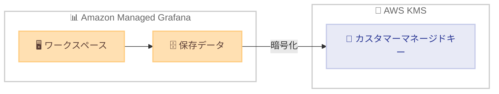

# Amazon Managed Grafana - AWS KMS カスタマーマネージドキーサポート

**リリース日**: 2026 年 2 月 18 日
**サービス**: Amazon Managed Grafana
**機能**: AWS KMS カスタマーマネージドキー (CMK) による暗号化

📊 [このアップデートのインフォグラフィックを見る](https://takech9203.github.io/aws-news-summary/20260218-amazon-managed-grafana-customer-managed-keys.html)

## 概要

Amazon Managed Grafana が AWS Key Management Service (KMS) のカスタマーマネージドキー (CMK) をサポートした。これにより、Amazon Managed Grafana ワークスペースに保存されるデータを独自の暗号化キーで暗号化できるようになった。

Amazon Managed Grafana はデフォルトで AWS 所有キーによる保存時の暗号化を提供している。今回のリリースにより、ワークスペース作成時にカスタマーマネージドキーを使用するオプションが追加された。組織のコンプライアンスおよび規制要件を満たすための自己管理型のセキュリティレイヤを追加できる。

**アップデート前の課題**

- ワークスペースの暗号化に AWS 所有キーのみ使用可能だった
- 独自の暗号化キーによるデータ保護の制御ができなかった
- 特定のコンプライアンス要件で CMK が必須の場合に対応できなかった

**アップデート後の改善**

- ワークスペース作成時にカスタマーマネージドキーを指定可能になった
- キーローテーションやアクセス制御を自己管理できるようになった
- コンプライアンスおよび規制要件への対応が容易になった

## アーキテクチャ図

Amazon Managed Grafana ワークスペースのデータが AWS KMS のカスタマーマネージドキーで暗号化される。

## サービスアップデートの詳細

### 主要機能

1. **CMK による暗号化**
   - ワークスペース作成時にカスタマーマネージドキーを指定
   - AWS KMS との統合による暗号化キーの管理
   - 既存の AWS 所有キー暗号化も引き続き利用可能

2. **キー管理の自己制御**
   - キーローテーションポリシーの設定
   - キーアクセスポリシーの管理
   - 監査ログによるキー使用の追跡

## 技術仕様

### 暗号化オプション比較

| 項目 | AWS 所有キー | カスタマーマネージドキー |
|------|-------------|----------------------|
| キー管理 | AWS が管理 | お客様が管理 |
| キーローテーション | AWS が自動実行 | お客様が制御 |
| アクセスポリシー | 設定不可 | お客様が設定 |
| コスト | 無料 | KMS キー料金が発生 |
| コンプライアンス | 基本的な暗号化要件 | 厳格なコンプライアンス要件対応 |

### API 変更履歴

| 日付 | サービス | 変更内容 |
|------|----------|----------|
| 2026/02/17 | [Amazon Managed Grafana](https://awsapichanges.com/archive/changes/9d9af7-grafana.html) | 6 updated api methods - CMK サポートのための API 更新 |

## 設定方法

### 前提条件

1. AWS KMS でカスタマーマネージドキーが作成済みであること
2. Amazon Managed Grafana ワークスペースの作成権限があること
3. KMS キーポリシーで Grafana サービスへのアクセスが許可されていること

### 手順

#### ステップ 1: KMS キーの準備

AWS KMS コンソールでカスタマーマネージドキーを作成し、Amazon Managed Grafana サービスへのアクセスを許可するキーポリシーを設定する。

#### ステップ 2: ワークスペースの作成

Amazon Managed Grafana コンソールで新しいワークスペースを作成する際に、暗号化設定でカスタマーマネージドキーを選択し、作成した KMS キーの ARN を指定する。

## メリット

### ビジネス面

- **コンプライアンス対応**: HIPAA、PCI DSS 等の規制要件でCMK が必須な場合に対応
- **データ主権の強化**: 暗号化キーの完全な制御による機密データの保護
- **監査対応**: CloudTrail を通じたキー使用の完全な監査証跡

### 技術面

- **キーローテーション制御**: お客様のセキュリティポリシーに合わせたキーローテーション
- **アクセス制御の細粒度化**: KMS キーポリシーによる精密なアクセス管理
- **キー無効化によるデータ保護**: 緊急時にキーを無効化してデータアクセスを即座に遮断可能

## デメリット・制約事項

### 制限事項

- AWS GovCloud (US) リージョンでは利用不可
- CMK はワークスペース作成時にのみ指定可能 (既存ワークスペースへの後付けは不可)

### 考慮すべき点

- KMS キーの料金が追加で発生する
- キーを誤って削除するとデータにアクセスできなくなる
- キーポリシーの設定ミスによるサービス中断のリスク

## ユースケース

### ユースケース 1: 金融サービスのモニタリング

**シナリオ**: PCI DSS 準拠が必要な金融サービス企業が Grafana でシステムモニタリングを行う

**効果**: CMK を使用することで暗号化キーの管理要件を満たし、コンプライアンスを確保

### ユースケース 2: ヘルスケアデータの可視化

**シナリオ**: HIPAA 対応が必要なヘルスケア企業が患者データ関連のメトリクスを可視化

**効果**: 独自の暗号化キーによるデータ保護で規制要件に対応

## 料金

Amazon Managed Grafana の通常料金に加えて、AWS KMS カスタマーマネージドキーの料金が発生する。

| 項目 | 料金 |
|------|------|
| KMS キー | $1/月 |
| API リクエスト | $0.03/10,000 リクエスト |

## 利用可能リージョン

Amazon Managed Grafana が一般提供されているすべてのリージョンで利用可能。ただし、AWS GovCloud (US) リージョンは除く。

## 関連サービス・機能

- **AWS KMS**: カスタマーマネージドキーの作成・管理サービス
- **Amazon CloudWatch**: Grafana と連携するモニタリングサービス
- **AWS CloudTrail**: KMS キー使用の監査ログ

## 参考リンク

- 📊 [インフォグラフィック](https://takech9203.github.io/aws-news-summary/20260218-amazon-managed-grafana-customer-managed-keys.html)
- [公式発表 (What's New)](https://aws.amazon.com/about-aws/whats-new/2026/02/amazon-managed-grafana-customer-managed-keys/)
- [Amazon Managed Grafana ユーザーガイド](https://docs.aws.amazon.com/grafana/latest/userguide/what-is-Amazon-Managed-Service-Grafana.html)
- [製品ページ](https://aws.amazon.com/grafana/)
- [料金ページ](https://aws.amazon.com/grafana/pricing/)

## まとめ

Amazon Managed Grafana の CMK サポートにより、規制要件の厳しい環境でも独自の暗号化キーによるデータ保護が可能になった。コンプライアンス要件で CMK が必須の組織にとって重要なアップデートである。新規ワークスペース作成時に CMK の使用を検討することを推奨する。
