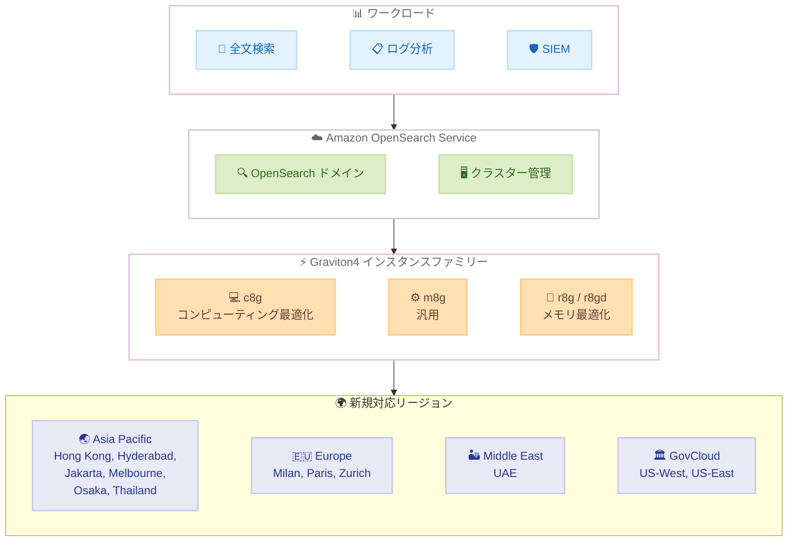

# Amazon OpenSearch Service - Graviton4 ベースインスタンスのサポートリージョン拡大

**リリース日**: 2026 年 2 月 18 日
**サービス**: Amazon OpenSearch Service
**機能**: Graviton4 ベース EC2 インスタンス (c8g、m8g、r8g、r8gd) のリージョン拡大

📊 [このアップデートのインフォグラフィックを見る](https://takech9203.github.io/aws-news-summary/20260218-amazon-opensearch-service-expands-support-graviton4-based-instances.html)

## 概要

Amazon OpenSearch Service は、最新世代の Graviton4 ベース Amazon EC2 インスタンスファミリーのサポートを拡大した。対象となるインスタンスタイプは、コンピューティング最適化 (c8g)、汎用 (m8g)、メモリ最適化 (r8g、r8gd) の 4 種類である。AWS Graviton4 プロセッサは Graviton3 プロセッサと比較して最大 30% 優れたパフォーマンスを提供する。

今回のアップデートにより、Asia Pacific (Hong Kong、Hyderabad、Jakarta、Melbourne、Osaka、Thailand)、Europe (Milan、Paris、Zurich)、Middle East (UAE)、AWS GovCloud (US-West、US-East) の 12 リージョンが新たに追加された。Graviton4 インスタンスはすべての OpenSearch バージョンおよび Elasticsearch 7.9、7.10 でサポートされる。

**アップデート前の課題**

- Graviton4 ベースインスタンスは 23 リージョンでのみ利用可能であり、アジアパシフィックの一部リージョンやヨーロッパ、中東のリージョンでは利用できなかった
- 対象外リージョンでは Graviton3 ベースの C7g、M7g、R7g インスタンスを使用する必要があり、最新のパフォーマンス向上を活用できなかった
- GovCloud (US-East) では Graviton4 ベースの OpenSearch Service インスタンスが利用できなかった

**アップデート後の改善**

- 12 の追加リージョンで Graviton4 ベースインスタンスが利用可能になり、グローバルなカバレッジが拡大
- Graviton3 比で最大 30% のパフォーマンス向上を、より多くのリージョンで活用可能に
- GovCloud (US-East) を含む政府系ワークロードでも Graviton4 の恩恵を受けられるようになった

## アーキテクチャ図



この図は、Amazon OpenSearch Service の Graviton4 インスタンスファミリーが新たに 12 リージョンに拡大され、全文検索、ログ分析、SIEM などのワークロードで活用できることを示している。

## サービスアップデートの詳細

### 主要機能

1. **Graviton4 プロセッサによるパフォーマンス向上**
   - Graviton3 プロセッサと比較して最大 30% 優れたパフォーマンス
   - コンピューティング集約型、汎用、メモリ集約型の各ワークロードで最高の価格パフォーマンスを提供
   - GP3 ストレージボリュームをサポート

2. **4 つのインスタンスファミリー**
   - **c8g**: コンピューティング最適化。インデックス作成やクエリ処理が多いワークロードに最適
   - **m8g**: 汎用。バランスの取れたコンピューティングとメモリが必要なワークロードに最適
   - **r8g**: メモリ最適化。大規模なデータセットをメモリ上に保持するワークロードに最適
   - **r8gd**: メモリ最適化 + ローカル NVMe ストレージ。EBS を使用せず、ローカルストレージが必要なワークロードに最適

3. **幅広いバージョンサポート**
   - すべての OpenSearch バージョンで利用可能
   - Elasticsearch (オープンソース) 7.9 および 7.10 でも利用可能
   - 既存ドメインのインスタンスタイプ変更による簡単な移行が可能

4. **グローバルなリージョン展開**
   - 今回の拡大で 35 以上のリージョンでグローバルに利用可能
   - GovCloud リージョンを含む政府系ワークロードにも対応

## 技術仕様

### Graviton4 インスタンスタイプ一覧

| インスタンスファミリー | 利用可能なサイズ | ストレージ | 特徴 |
|---------------------|----------------|----------|------|
| c8g | large ~ 16xlarge | GP3 EBS | コンピューティング最適化 |
| m8g | medium ~ 16xlarge | GP3 EBS | 汎用 |
| r8g | medium ~ 16xlarge | GP3 EBS | メモリ最適化 |
| r8gd | medium ~ 16xlarge | ローカル NVMe | メモリ最適化 + ローカルストレージ |

### Graviton4 vs Graviton3 比較

| 項目 | Graviton4 (c8g/m8g/r8g) | Graviton3 (C7g/M7g/R7g) |
|------|--------------------------|--------------------------|
| パフォーマンス | 最大 30% 向上 | 基準 |
| 価格パフォーマンス | 最高 | 良好 |
| ストレージサポート | GP3 | GP3 |
| バージョン要件 | ES 7.9 以降 / 全 OpenSearch | ES 7.9 以降 / 全 OpenSearch |

### バージョン要件

| エンジン | 対応バージョン |
|---------|--------------|
| OpenSearch | すべてのバージョン |
| Elasticsearch | 7.9、7.10 |

## 設定方法

### 前提条件

1. AWS アカウントを保有していること
2. Amazon OpenSearch Service ドメインが作成済み、または新規作成する権限があること
3. 対象リージョンへのアクセス権限があること

### 手順

#### ステップ 1: 新規ドメインで Graviton4 インスタンスを使用する

```bash
aws opensearch create-domain \
  --domain-name my-graviton4-domain \
  --engine-version OpenSearch_2.17 \
  --cluster-config \
    InstanceType=r8g.2xlarge.search,InstanceCount=3,DedicatedMasterEnabled=true,DedicatedMasterType=m8g.large.search,DedicatedMasterCount=3,ZoneAwarenessEnabled=true,ZoneAwarenessConfig='{AvailabilityZoneCount=3}' \
  --ebs-options EBSEnabled=true,VolumeType=gp3,VolumeSize=100 \
  --region ap-southeast-4
```

メルボルンリージョン (ap-southeast-4) で r8g.2xlarge.search インスタンスを使用した新規 OpenSearch ドメインを作成する。

#### ステップ 2: 既存ドメインのインスタンスタイプを変更する

```bash
aws opensearch update-domain-config \
  --domain-name my-existing-domain \
  --cluster-config \
    InstanceType=r8g.2xlarge.search \
  --region ap-northeast-3
```

大阪リージョン (ap-northeast-3) の既存ドメインのインスタンスタイプを Graviton4 ベースの r8g.2xlarge.search に変更する。ブルー/グリーンデプロイメントにより、ダウンタイムなしで変更が適用される。

#### ステップ 3: ドメインの状態を確認する

```bash
aws opensearch describe-domain \
  --domain-name my-graviton4-domain \
  --query 'DomainStatus.{Status:Processing,InstanceType:ClusterConfig.InstanceType,InstanceCount:ClusterConfig.InstanceCount}' \
  --output table
```

ドメインの処理状態とインスタンス構成を確認する。

## メリット

### ビジネス面

- **コスト最適化**: Graviton4 の優れた価格パフォーマンスにより、同等のパフォーマンスを低コストで実現、または同等のコストでパフォーマンスを向上
- **グローバル展開の容易化**: 12 リージョンの追加により、データレジデンシー要件やレイテンシー要件に応じて最適なリージョンを選択可能
- **GovCloud 対応**: 政府系ワークロードでも最新のプロセッサパフォーマンスを活用可能

### 技術面

- **最大 30% のパフォーマンス向上**: クエリレスポンスの高速化とインデックス作成スループットの向上
- **幅広いバージョンサポート**: すべての OpenSearch バージョンで利用可能であり、既存環境からの移行が容易
- **ダウンタイムなしの移行**: ブルー/グリーンデプロイメントにより、運用中のドメインでもインスタンスタイプの変更が可能

## デメリット・制約事項

### 制限事項

- Graviton4 インスタンスは GP3 ストレージボリュームのみサポート (r8gd はローカル NVMe ストレージを使用し、EBS は非対応)
- すべてのリージョンで全インスタンスタイプが利用可能とは限らない (リージョンによって利用可能なインスタンスタイプが異なる)
- Elasticsearch 7.8 以前のバージョンでは利用できない

### 考慮すべき点

- Graviton3 から Graviton4 への移行時には、パフォーマンステストを実施して期待される改善を確認することを推奨
- r8gd インスタンスはローカル NVMe ストレージを使用するため、EBS ベースのバックアップ戦略とは異なるデータ保護計画が必要
- インスタンスタイプ変更時のブルー/グリーンデプロイメントには一定の時間がかかるため、計画的な実施を推奨

## ユースケース

### ユースケース 1: アジアパシフィック地域でのログ分析基盤

**シナリオ**: メルボルンやジャカルタにインフラストラクチャを持つ企業が、現地のデータレジデンシー要件に準拠しながら大規模なログ分析を実行したい。

**実装例**:
```bash
aws opensearch create-domain \
  --domain-name log-analytics \
  --engine-version OpenSearch_2.17 \
  --cluster-config \
    InstanceType=m8g.4xlarge.search,InstanceCount=6,DedicatedMasterEnabled=true,DedicatedMasterType=m8g.large.search,DedicatedMasterCount=3 \
  --ebs-options EBSEnabled=true,VolumeType=gp3,VolumeSize=500 \
  --region ap-southeast-4
```

**効果**: メルボルンリージョンで Graviton4 の m8g インスタンスを使用することで、Graviton3 と比較して最大 30% のパフォーマンス向上を実現し、データレジデンシー要件を満たしながらコスト効率の高いログ分析基盤を構築できる。

### ユースケース 2: ヨーロッパでの全文検索サービス

**シナリオ**: E コマース企業がヨーロッパの顧客向けに高速な商品検索機能を提供したい。

**効果**: Paris、Milan、Zurich リージョンで c8g インスタンスを使用することで、コンピューティング最適化された検索パフォーマンスを低レイテンシーで提供できる。Graviton4 の高いコンピューティング性能により、複雑なクエリの処理速度が向上する。

### ユースケース 3: GovCloud での SIEM ワークロード

**シナリオ**: 政府機関がセキュリティログの収集と分析のために SIEM 基盤を GovCloud 上に構築したい。

**効果**: GovCloud (US-East) で r8g インスタンスを使用することで、大量のセキュリティイベントデータをメモリ上に保持しながら高速な脅威検出クエリを実行できる。Graviton4 のパフォーマンス向上により、リアルタイム分析の応答性が改善される。

## 料金

Amazon OpenSearch Service の Graviton4 インスタンスの料金は、インスタンスタイプ、サイズ、リージョンによって異なる。リザーブドインスタンスによる割引も利用可能。詳細な料金については、[Amazon OpenSearch Service 料金ページ](https://aws.amazon.com/opensearch-service/pricing/) を参照。

## 利用可能リージョン

### 今回新たにサポートが追加・拡大されたリージョン

- Asia Pacific (Hong Kong) - ap-east-1
- Asia Pacific (Hyderabad) - ap-south-2
- Asia Pacific (Jakarta) - ap-southeast-3
- Asia Pacific (Melbourne) - ap-southeast-4
- Asia Pacific (Osaka) - ap-northeast-3
- Asia Pacific (Thailand) - ap-southeast-7
- Europe (Milan) - eu-south-1
- Europe (Paris) - eu-west-3
- Europe (Zurich) - eu-central-2
- Middle East (UAE) - me-central-1
- AWS GovCloud (US-West) - us-gov-west-1
- AWS GovCloud (US-East) - us-gov-east-1

*注: 一部のリージョンでは以前から一部の Graviton4 インスタンスタイプが利用可能であったが、今回のアップデートで追加のインスタンスタイプがサポートされた。

### 既存の対応リージョン

- US East (N. Virginia) - us-east-1
- US East (Ohio) - us-east-2
- US West (N. California) - us-west-1
- US West (Oregon) - us-west-2
- Asia Pacific (Mumbai) - ap-south-1
- Asia Pacific (Malaysia) - ap-southeast-5
- Asia Pacific (Seoul) - ap-northeast-2
- Asia Pacific (Singapore) - ap-southeast-1
- Asia Pacific (Sydney) - ap-southeast-2
- Asia Pacific (Tokyo) - ap-northeast-1
- Canada (Central) - ca-central-1
- Europe (Frankfurt) - eu-central-1
- Europe (Ireland) - eu-west-1
- Europe (London) - eu-west-2
- Europe (Spain) - eu-south-2
- Europe (Stockholm) - eu-north-1
- South America (Sao Paulo) - sa-east-1

*注: リージョンによって利用可能なインスタンスタイプが異なる場合がある。最新の利用可能状況は [料金ページ](https://aws.amazon.com/opensearch-service/pricing/) を参照。

## 関連サービス・機能

- **Amazon OpenSearch Serverless**: サーバーレスオプションでの OpenSearch 利用
- **AWS Graviton**: AWS 独自設計の Arm ベースプロセッサ
- **Amazon OpenSearch Ingestion**: OpenSearch Service へのデータ取り込みパイプライン
- **Amazon CloudWatch**: OpenSearch Service ドメインのモニタリング

## 参考リンク

- 📊 [インフォグラフィック](https://takech9203.github.io/aws-news-summary/20260218-amazon-opensearch-service-expands-support-graviton4-based-instances.html)
- [公式発表 (What's New)](https://aws.amazon.com/about-aws/whats-new/2026/02/amazon-opensearch-service-expands-support-graviton4-based-instances/)
- [Amazon OpenSearch Service 料金ページ](https://aws.amazon.com/opensearch-service/pricing/)
- [Amazon OpenSearch Service 製品ページ](https://aws.amazon.com/opensearch-service/)
- [AWS Blog - Graviton4 r8g インスタンス](https://aws.amazon.com/blogs/aws/aws-graviton4-based-amazon-ec2-r8g-instances-best-price-performance-in-amazon-ec2/)
- [AWS Blog - Graviton4 c8g/m8g インスタンス](https://aws.amazon.com/blogs/aws/run-your-compute-intensive-and-general-purpose-workloads-sustainably-with-the-new-amazon-ec2-c8g-m8g-instances/)

## まとめ

Amazon OpenSearch Service は Graviton4 ベースインスタンス (c8g、m8g、r8g、r8gd) のサポートを 12 の追加リージョンに拡大した。Graviton4 プロセッサは Graviton3 と比較して最大 30% のパフォーマンス向上を提供し、コンピューティング集約型、汎用、メモリ集約型の各ワークロードに最高の価格パフォーマンスを実現する。すべての OpenSearch バージョンと Elasticsearch 7.9、7.10 でサポートされ、ブルー/グリーンデプロイメントによるダウンタイムなしの移行が可能である。OpenSearch Service を利用中の組織は、パフォーマンスとコスト効率の向上のために Graviton4 インスタンスへの移行を検討すべきである。
