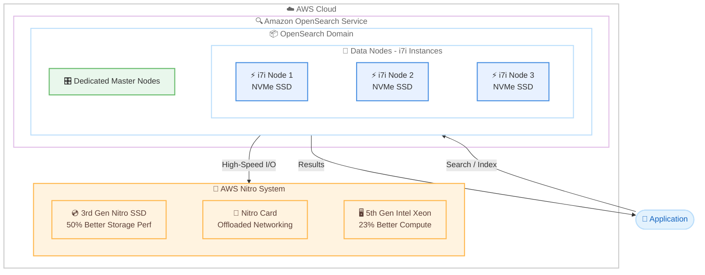

# Amazon OpenSearch Service - ストレージ最適化 i7i インスタンスのサポート開始

**リリース日**: 2026 年 2 月 18 日
**サービス**: Amazon OpenSearch Service
**機能**: ストレージ最適化 i7i インスタンスのサポート

📊 [このアップデートのインフォグラフィックを見る](https://takech9203.github.io/aws-news-summary/20260218-amazon-opensearch-service-supports-i7i-instances.html)

## 概要

Amazon OpenSearch Service は、最新世代の x86 ベース高性能ストレージ最適化 i7i インスタンスのサポートを開始しました。i7i インスタンスは第 5 世代 Intel Xeon Scalable プロセッサ (Emerald Rapids) を搭載し、前世代の I4i インスタンスと比較して最大 23% のコンピューティング性能向上と 10% 以上の価格性能改善を実現します。

i7i インスタンスは第 3 世代 AWS Nitro SSD を搭載しており、I4i インスタンスと比較して最大 50% 優れたリアルタイムストレージ性能、最大 50% 低いストレージ I/O レイテンシー、最大 60% 低い I/O レイテンシーのばらつきを提供します。AWS Nitro System 上に構築されており、CPU 仮想化、ストレージ、ネットワーキング機能を専用ハードウェアとソフトウェアにオフロードすることで、ワークロードのパフォーマンスとセキュリティを向上させます。

**アップデート前の課題**

- OpenSearch Service のストレージ最適化インスタンスとして I4i が最新世代であり、ストレージ I/O レイテンシーやコンピューティング性能に改善の余地があった
- I/O 集約型のワークロード (リアルタイム分析、NoSQL データベース、検索エンジンなど) において、ストレージ I/O のレイテンシーとばらつきがパフォーマンスのボトルネックとなる場合があった
- 大規模なデータセットに対するインデキシングや検索操作で、より高いコンピューティング性能と価格性能比が求められていた

**アップデート後の改善**

- i7i インスタンスにより、最大 23% のコンピューティング性能向上が実現し、インデキシングスループットや検索クエリの処理速度が改善された
- 第 3 世代 AWS Nitro SSD により、ストレージ I/O レイテンシーが最大 50% 低減し、レイテンシーのばらつきも最大 60% 改善された
- 10% 以上の価格性能改善により、同等のワークロードをより低コストで実行できるようになった

## アーキテクチャ図



この図は、Amazon OpenSearch Service ドメインが i7i インスタンスをデータノードとして使用し、AWS Nitro System (第 3 世代 Nitro SSD、Nitro Card、第 5 世代 Intel Xeon プロセッサ) と連携してアプリケーションからの検索・インデキシングリクエストを処理するアーキテクチャを示しています。

## サービスアップデートの詳細

### 主要機能

1. **第 5 世代 Intel Xeon Scalable プロセッサ**
   - オールコアターボ周波数 3.2 GHz (最大コアターボ周波数 4.0 GHz) で動作
   - I4i インスタンスと比較して最大 23% のコンピューティング性能向上
   - Intel Total Memory Encryption (TME) による常時メモリ暗号化をサポート
   - Advanced Matrix Extensions (AMX) などの 4 つのビルトインアクセラレータを搭載

2. **第 3 世代 AWS Nitro SSD**
   - PCIe Gen5 ベースの NVMe ストレージを提供
   - リアルタイムストレージ性能が I4i と比較して最大 50% 向上
   - ストレージ I/O レイテンシーが最大 50% 低減
   - I/O レイテンシーのばらつきが最大 60% 低減
   - 常時 AES-256 暗号化をサポート

3. **AWS Nitro System**
   - CPU 仮想化、ストレージ、ネットワーキング機能を専用ハードウェアにオフロード
   - ホストハードウェアのコンピューティングとメモリリソースをほぼすべてインスタンスに提供
   - パフォーマンスとセキュリティの両方を強化

4. **価格性能の改善**
   - I4i インスタンスと比較して 10% 以上の価格性能改善
   - 同等のワークロードをより低コストで実行可能

## 技術仕様

### i7i インスタンスサイズ一覧

以下は EC2 i7i インスタンスの仕様です。OpenSearch Service で使用する場合、インスタンスタイプは `i7i.<size>.search` の形式になります。

| インスタンスサイズ | vCPU | メモリ (GiB) | インスタンスストレージ (GB) | ネットワーク帯域幅 (Gbps) | EBS 帯域幅 (Gbps) |
|-------------------|------|-------------|--------------------------|--------------------------|-------------------|
| i7i.large | 2 | 16 | 1 x 468 = 468 | 最大 10 | 最大 10 |
| i7i.xlarge | 4 | 32 | 1 x 937.5 = 937.5 | 最大 10 | 最大 10 |
| i7i.2xlarge | 8 | 64 | 1 x 1,875 = 1,875 | 最大 12 | 最大 10 |
| i7i.4xlarge | 16 | 128 | 1 x 3,750 = 3,750 | 最大 25 | 最大 10 |
| i7i.8xlarge | 32 | 256 | 2 x 3,750 = 7,500 | 25 | 10 |
| i7i.12xlarge | 48 | 384 | 3 x 3,750 = 11,250 | 28.125 | 15 |
| i7i.16xlarge | 64 | 512 | 4 x 3,750 = 15,000 | 37.5 | 20 |
| i7i.24xlarge | 96 | 768 | 6 x 3,750 = 22,500 | 56.25 | 30 |
| i7i.48xlarge | 192 | 1,536 | 12 x 3,750 = 45,000 | 100 | 60 |

### I4i との性能比較

| 項目 | I4i | i7i | 改善率 |
|------|-----|-----|--------|
| プロセッサ | 第 3 世代 Intel Xeon | 第 5 世代 Intel Xeon | - |
| Nitro SSD | 第 2 世代 | 第 3 世代 | - |
| コンピューティング性能 | ベースライン | 最大 23% 向上 | +23% |
| 価格性能 | ベースライン | 10% 以上改善 | +10% 以上 |
| リアルタイムストレージ性能 | ベースライン | 最大 50% 向上 | +50% |
| ストレージ I/O レイテンシー | ベースライン | 最大 50% 低減 | -50% |
| I/O レイテンシーのばらつき | ベースライン | 最大 60% 低減 | -60% |

## 設定方法

### 前提条件

1. AWS アカウントが有効化されている
2. Amazon OpenSearch Service への適切な IAM 権限が設定されている
3. i7i インスタンスがサポートされているリージョンを使用する

### 手順

#### ステップ 1: 新規ドメインで i7i インスタンスを使用して作成

```bash
aws opensearch create-domain \
  --domain-name my-opensearch-domain \
  --engine-version OpenSearch_2.17 \
  --cluster-config \
    InstanceType=i7i.2xlarge.search,InstanceCount=3,DedicatedMasterEnabled=true,DedicatedMasterType=c7g.large.search,DedicatedMasterCount=3,ZoneAwarenessEnabled=true,ZoneAwarenessConfig='{AvailabilityZoneCount=3}' \
  --node-to-node-encryption-options Enabled=true \
  --encrypt-at-rest-options Enabled=true \
  --domain-endpoint-options EnforceHTTPS=true \
  --advanced-security-options Enabled=true,InternalUserDatabaseEnabled=true,MasterUserOptions='{MasterUserName=admin,MasterUserPassword=MyStr0ngP@ss!}'
```

このコマンドは、i7i.2xlarge.search インスタンスを 3 つのデータノードとして使用し、3 つのアベイラビリティゾーンにまたがる OpenSearch Service ドメインを作成します。i7i インスタンスは NVMe ローカルストレージを使用するため、EBS ボリュームの設定は不要です。

#### ステップ 2: 既存ドメインのインスタンスタイプを i7i に変更

```bash
aws opensearch update-domain-config \
  --domain-name my-existing-domain \
  --cluster-config \
    InstanceType=i7i.4xlarge.search,InstanceCount=3
```

このコマンドは、既存の OpenSearch Service ドメインのデータノードインスタンスタイプを i7i.4xlarge.search に変更します。Blue/Green デプロイメントにより、ダウンタイムなしでインスタンスタイプの変更が実行されます。

#### ステップ 3: ドメインの状態を確認

```bash
aws opensearch describe-domain \
  --domain-name my-opensearch-domain \
  --query "DomainStatus.{Name:DomainName,Status:Processing,InstanceType:ClusterConfig.InstanceType,InstanceCount:ClusterConfig.InstanceCount}" \
  --output table
```

このコマンドは、ドメインの現在の状態、インスタンスタイプ、インスタンス数を確認します。Processing が true の場合、設定変更が進行中です。

## メリット

### ビジネス面

- **コスト最適化**: I4i と比較して 10% 以上の価格性能改善により、同等のパフォーマンスをより低コストで実現可能
- **SLA の達成**: ストレージ I/O レイテンシーの低減とばらつきの改善により、厳格なサービスレベル要件を持つアプリケーションの安定運用を支援
- **幅広いリージョン対応**: 30 以上の AWS リージョンで利用可能なため、データレジデンシー要件への対応が容易

### 技術面

- **高速なインデキシング**: 23% 向上したコンピューティング性能により、大量のデータ取り込みとインデキシングスループットが改善
- **低レイテンシー検索**: 50% 低減されたストレージ I/O レイテンシーにより、検索クエリの応答時間が短縮
- **安定したパフォーマンス**: I/O レイテンシーのばらつきが 60% 低減され、ワークロードのパフォーマンスがより予測可能に
- **大容量 NVMe ストレージ**: 最大 45TB の NVMe ストレージにより、大規模データセットをローカルストレージで処理可能

## デメリット・制約事項

### 制限事項

- i7i インスタンスは NVMe ローカルストレージを使用するため、EBS ボリュームストレージはサポートされない
- ノード障害時にはローカルストレージのデータが失われるため、OpenSearch のレプリカシャードによるデータ冗長性の確保が重要
- i7i インスタンスは I4i と同様にストレージ最適化インスタンスであるため、ストレージ I/O を多用しないワークロードでは、汎用 (m7i) やメモリ最適化 (r7i) インスタンスの方がコスト効率が良い場合がある

### 考慮すべき点

- I4i から i7i への移行では Blue/Green デプロイメントが実行されるため、移行中のリソース消費を考慮する必要がある
- i7i インスタンスの NVMe ストレージ容量はインスタンスサイズに応じて固定されるため、ストレージ要件に基づいて適切なインスタンスサイズを選択することが重要
- リザーブドインスタンスを使用している場合、I4i のリザーブドインスタンスは i7i には適用されないため、新たなリザーブドインスタンスの購入を検討する

## ユースケース

### ユースケース 1: 大規模ログ分析基盤

**シナリオ**: セキュリティ運用チームが数十 TB のログデータをリアルタイムで取り込み、検索・分析するセキュリティ情報イベント管理 (SIEM) 基盤を運用している。

**実装例**:
```bash
# 大規模ログ分析用の OpenSearch ドメインを i7i で構築
aws opensearch create-domain \
  --domain-name siem-analytics \
  --engine-version OpenSearch_2.17 \
  --cluster-config \
    InstanceType=i7i.8xlarge.search,InstanceCount=6,DedicatedMasterEnabled=true,DedicatedMasterType=c7g.xlarge.search,DedicatedMasterCount=3,ZoneAwarenessEnabled=true,ZoneAwarenessConfig='{AvailabilityZoneCount=3}' \
  --node-to-node-encryption-options Enabled=true \
  --encrypt-at-rest-options Enabled=true
```

**効果**: i7i.8xlarge インスタンス (各 7,500 GB NVMe ストレージ) を 6 ノードで構成し、合計約 45 TB のストレージ容量を確保。50% 向上したリアルタイムストレージ性能により、大量のログの取り込みと検索を高速に処理できます。

### ユースケース 2: E コマースサイトの商品検索エンジン

**シナリオ**: E コマースプラットフォームが数百万件の商品カタログに対する全文検索とファセット検索を低レイテンシーで提供したい。

**実装例**:
```bash
# 商品検索用の OpenSearch ドメインを i7i で構築
aws opensearch create-domain \
  --domain-name product-search \
  --engine-version OpenSearch_2.17 \
  --cluster-config \
    InstanceType=i7i.4xlarge.search,InstanceCount=3,DedicatedMasterEnabled=true,DedicatedMasterType=c7g.large.search,DedicatedMasterCount=3,ZoneAwarenessEnabled=true,ZoneAwarenessConfig='{AvailabilityZoneCount=3}' \
  --node-to-node-encryption-options Enabled=true \
  --encrypt-at-rest-options Enabled=true
```

**効果**: 50% 低減されたストレージ I/O レイテンシーと 60% 低減されたレイテンシーのばらつきにより、商品検索のレスポンスタイムが安定し、ユーザーエクスペリエンスが向上します。

### ユースケース 3: IoT データのリアルタイム分析

**シナリオ**: 製造業の企業が数千台の IoT デバイスから送信されるセンサーデータをリアルタイムで取り込み、異常検知と分析を実行したい。

**実装例**:
```bash
# IoT データ分析用の OpenSearch ドメインを i7i で構築
aws opensearch create-domain \
  --domain-name iot-analytics \
  --engine-version OpenSearch_2.17 \
  --cluster-config \
    InstanceType=i7i.2xlarge.search,InstanceCount=3,DedicatedMasterEnabled=true,DedicatedMasterType=c7g.large.search,DedicatedMasterCount=3,ZoneAwarenessEnabled=true,ZoneAwarenessConfig='{AvailabilityZoneCount=3}' \
  --node-to-node-encryption-options Enabled=true \
  --encrypt-at-rest-options Enabled=true
```

**効果**: 23% 向上したコンピューティング性能により、高頻度のデータ取り込みとリアルタイムのインデキシング処理が効率化されます。低レイテンシーのストレージ I/O により、異常検知クエリの応答速度が向上します。

## 料金

Amazon OpenSearch Service の i7i インスタンス料金は、インスタンスタイプとリージョンによって異なります。i7i インスタンスは NVMe ローカルストレージを使用するため、別途 EBS ボリューム料金は発生しません。

### 料金体系

- **オンデマンドインスタンス**: 使用したインスタンス時間に基づいて課金
- **リザーブドインスタンス**: 1 年または 3 年の期間で予約し、オンデマンドと比較して最大 52% のコスト削減が可能
- **データ転送**: AWS リージョン間のデータ転送には追加料金が発生

### リザーブドインスタンスの割引率

| 支払いオプション | 1 年契約 | 3 年契約 |
|-----------------|---------|---------|
| 前払いなし (NURI) | 31% 割引 | 48% 割引 |
| 一部前払い (PURI) | 33% 割引 | 50% 割引 |
| 全額前払い (AURI) | 35% 割引 | 52% 割引 |

リージョンおよびインスタンスタイプごとの詳細な料金については、[Amazon OpenSearch Service 料金ページ](https://aws.amazon.com/opensearch-service/pricing/)をご確認ください。

## 利用可能リージョン

i7i インスタンスは以下の AWS リージョンで利用可能です。

**北米**:
- 米国東部 (バージニア北部) - us-east-1
- 米国東部 (オハイオ) - us-east-2
- 米国西部 (北カリフォルニア) - us-west-1
- 米国西部 (オレゴン) - us-west-2
- カナダ (中部) - ca-central-1
- カナダ西部 (カルガリー) - ca-west-1

**ヨーロッパ**:
- ヨーロッパ (フランクフルト) - eu-central-1
- ヨーロッパ (アイルランド) - eu-west-1
- ヨーロッパ (ロンドン) - eu-west-2
- ヨーロッパ (ミラノ) - eu-south-1
- ヨーロッパ (スペイン) - eu-south-2
- ヨーロッパ (ストックホルム) - eu-north-1
- ヨーロッパ (チューリッヒ) - eu-central-2

**アフリカ**:
- アフリカ (ケープタウン) - af-south-1

**アジアパシフィック**:
- アジアパシフィック (香港) - ap-east-1
- アジアパシフィック (ハイデラバード) - ap-south-2
- アジアパシフィック (ジャカルタ) - ap-southeast-3
- アジアパシフィック (マレーシア) - ap-southeast-5
- アジアパシフィック (メルボルン) - ap-southeast-4
- アジアパシフィック (ムンバイ) - ap-south-1
- アジアパシフィック (大阪) - ap-northeast-3
- アジアパシフィック (ソウル) - ap-northeast-2
- アジアパシフィック (シンガポール) - ap-southeast-1
- アジアパシフィック (シドニー) - ap-southeast-2
- アジアパシフィック (東京) - ap-northeast-1

**中東**:
- 中東 (UAE) - me-central-1

**南米**:
- 南米 (サンパウロ) - sa-east-1

**AWS GovCloud**:
- AWS GovCloud (US-West) - us-gov-west-1

## 関連サービス・機能

- **Amazon EC2 I7i インスタンス**: OpenSearch Service の i7i インスタンスの基盤となる EC2 インスタンスタイプで、ストレージ集約型ワークロードに最適化
- **AWS Nitro System**: i7i インスタンスの基盤技術で、CPU 仮想化、ストレージ、ネットワーキングを専用ハードウェアにオフロードしてパフォーマンスとセキュリティを向上
- **Amazon OpenSearch Serverless**: サーバーレスでの OpenSearch 利用が必要な場合の代替オプション
- **Amazon OpenSearch Ingestion**: OpenSearch Service へのデータ取り込みパイプラインを構築するためのフルマネージドサービス

## 参考リンク

- 📊 [インフォグラフィック](https://takech9203.github.io/aws-news-summary/20260218-amazon-opensearch-service-supports-i7i-instances.html)
- [公式発表 (What's New)](https://aws.amazon.com/about-aws/whats-new/2026/02/amazon-opensearch-service-supports-i7i-instances/)
- [Amazon OpenSearch Service 料金ページ](https://aws.amazon.com/opensearch-service/pricing/)
- [Amazon OpenSearch Service 製品ページ](https://aws.amazon.com/opensearch-service/)
- [サポートされるインスタンスタイプ](https://docs.aws.amazon.com/opensearch-service/latest/developerguide/supported-instance-types.html)
- [Amazon EC2 I7i インスタンス](https://aws.amazon.com/ec2/instance-types/i7i/)

## まとめ

Amazon OpenSearch Service でのストレージ最適化 i7i インスタンスのサポート開始により、第 5 世代 Intel Xeon Scalable プロセッサと第 3 世代 AWS Nitro SSD を活用した高性能なストレージ最適化ワークロードを実行できるようになりました。I4i インスタンスと比較して最大 23% のコンピューティング性能向上、最大 50% のストレージ I/O レイテンシー低減、10% 以上の価格性能改善を実現し、リアルタイム分析、検索エンジン、ログ分析などのストレージ I/O 集約型ワークロードに最適です。30 以上の AWS リージョンで利用可能なため、現在 I4i インスタンスを使用している場合は、i7i インスタンスへの移行を検討してください。
