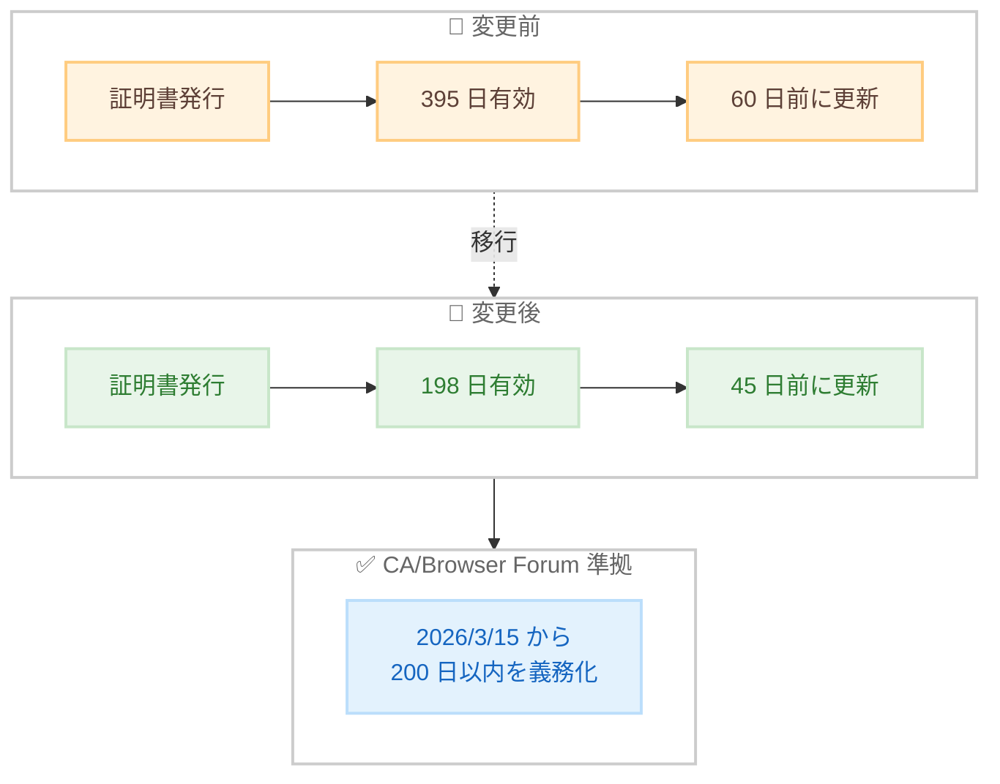

# AWS Certificate Manager - デフォルト証明書有効期間を 198 日に短縮

**リリース日**: 2026 年 2 月 18 日
**サービス**: AWS Certificate Manager (ACM)
**機能**: 証明書有効期間の短縮と料金改定

📊 [このアップデートのインフォグラフィックを見る](https://takech9203.github.io/aws-news-summary/20260218-aws-certificate-manager-updates-default.html)

## 概要

AWS Certificate Manager (ACM) が発行する公開証明書のデフォルト有効期間が、従来の 395 日から 198 日に短縮された。この変更は、2026 年 3 月 15 日から施行される Certification Authority Browser (CA/Browser) Forum の新しい要件に準拠するためのものである。

この変更はお客様側のアクションを必要としない。すべての新規および更新される公開証明書はデフォルトで 198 日の有効期間となる。既存の 395 日有効期間の証明書は、更新または有効期限が切れるまで引き続き有効である。ACM の自動更新機能は継続し、証明書は有効期限の 45 日前に更新される。

有効期間の短縮に伴い、エクスポート可能な公開証明書の料金が値下げされた。FQDN あたり $15 から $7 に、ワイルドカード名あたり $149 から $79 に引き下げられた。

**アップデート前の課題**

- 公開証明書の有効期間は 395 日で、新しい CA/Browser Forum 要件に非準拠となる予定だった
- エクスポート可能な証明書の料金が 395 日有効期間ベースで設定されていた

**アップデート後の改善**

- 198 日の有効期間で CA/Browser Forum の新要件に自動的に準拠
- エクスポート可能な証明書の料金が大幅に値下げされた
- 自動更新が有効期限の 45 日前に実行されるため、運用への影響なし

## アーキテクチャ図

証明書の有効期間が 395 日から 198 日に短縮され、CA/Browser Forum の新要件に準拠する。

## サービスアップデートの詳細

### 主要機能

1. **有効期間の短縮**
   - 新規・更新証明書のデフォルト有効期間が 198 日に変更
   - CA/Browser Forum の 200 日以内要件に準拠
   - 2026 年 3 月 15 日の施行日に先行して対応

2. **自動更新タイミングの変更**
   - 新しい 198 日証明書は有効期限の 45 日前に更新
   - 既存の 395 日証明書は有効期限の 60 日前に更新し、198 日有効期間で更新される
   - 自動更新機能は継続

3. **料金値下げ**
   - エクスポート可能な公開証明書 (FQDN): $15 → $7
   - エクスポート可能な公開証明書 (ワイルドカード): $149 → $79

## 技術仕様

### 変更前後の比較

| 項目 | 変更前 | 変更後 |
|------|--------|--------|
| 有効期間 | 395 日 | 198 日 |
| 自動更新タイミング | 60 日前 | 45 日前 |
| FQDN 料金 | $15 | $7 |
| ワイルドカード料金 | $149 | $79 |

### CA/Browser Forum 要件

| 項目 | 詳細 |
|------|------|
| 施行日 | 2026 年 3 月 15 日 |
| 要件 | 公開証明書は 200 日以内 |
| ACM 対応 | 198 日で準拠済み |

## 設定方法

### 前提条件

お客様側のアクションは不要。自動的に適用される。

### 手順

#### 既存証明書の場合

既存の 395 日有効期間の証明書は引き続き有効。更新時に 198 日有効期間で自動更新される。

#### 新規証明書の場合

新規発行される公開証明書は自動的に 198 日の有効期間で発行される。

## メリット

### ビジネス面

- **自動的なコンプライアンス準拠**: CA/Browser Forum の新要件に追加作業なく準拠
- **料金値下げ**: エクスポート可能な証明書の料金が 50% 以上削減
- **運用への影響なし**: 自動更新により手動介入は不要

### 技術面

- **セキュリティの向上**: 短い有効期間により証明書の鍵の露出リスクが低減
- **自動管理**: ACM の自動更新が引き続き証明書のライフサイクルを管理
- **下位互換性**: 既存の証明書は影響を受けない

## デメリット・制約事項

### 制限事項

- 新規証明書の暗号化設定は無効化できない
- 198 日より長い有効期間を指定することはできない

### 考慮すべき点

- メール検証を使用している場合、更新通知が 45 日前に送信される点に注意
- 更新頻度が増加するため、自動更新が正常に動作していることの確認を推奨
- サードパーティ連携で証明書の有効期間に依存する設定がある場合は確認が必要

## ユースケース

### ユースケース 1: ウェブアプリケーションの TLS 証明書

**シナリオ**: ALB や CloudFront で ACM 証明書を使用しているウェブアプリケーション

**効果**: 追加作業なく自動的に CA/Browser Forum 準拠が維持される

### ユースケース 2: エクスポート可能な証明書の利用

**シナリオ**: ACM からエクスポートした証明書をオンプレミス環境で使用

**効果**: 料金が $15 から $7 に値下げされ、コスト削減が実現

### ユースケース 3: マルチドメイン環境

**シナリオ**: 多数のドメインで ACM 証明書を管理している大規模環境

**効果**: すべての証明書が自動的に新しい有効期間で更新され、コンプライアンスが維持される

## 料金

### エクスポート可能な公開証明書の料金改定

| 証明書タイプ | 変更前 | 変更後 |
|-------------|--------|--------|
| FQDN あたり | $15 | $7 |
| ワイルドカード名あたり | $149 | $79 |

ACM で発行する非エクスポート証明書は引き続き無料。

## 利用可能リージョン

AWS Certificate Manager が利用可能なすべてのリージョンで適用。

## 関連サービス・機能

- **Elastic Load Balancing**: ACM 証明書を使用した HTTPS リスナー
- **Amazon CloudFront**: ACM 証明書を使用したカスタムドメイン HTTPS
- **AWS Certificate Manager Private CA**: プライベート証明書の発行

## 参考リンク

- 📊 [インフォグラフィック](https://takech9203.github.io/aws-news-summary/20260218-aws-certificate-manager-updates-default.html)
- [公式発表 (What's New)](https://aws.amazon.com/about-aws/whats-new/2026/02/aws-certificate-manager-updates-default/)
- [ACM ドキュメント](https://docs.aws.amazon.com/acm/latest/userguide/acm-certificate-characteristics.html)

## まとめ

ACM の公開証明書有効期間が 198 日に短縮され、CA/Browser Forum の新要件に自動準拠する。お客様側の作業は不要で、エクスポート可能な証明書の料金も大幅に値下げされた。自動更新が正常に動作していることを確認し、メール検証を使用している場合は更新通知への対応体制を確認することを推奨する。
