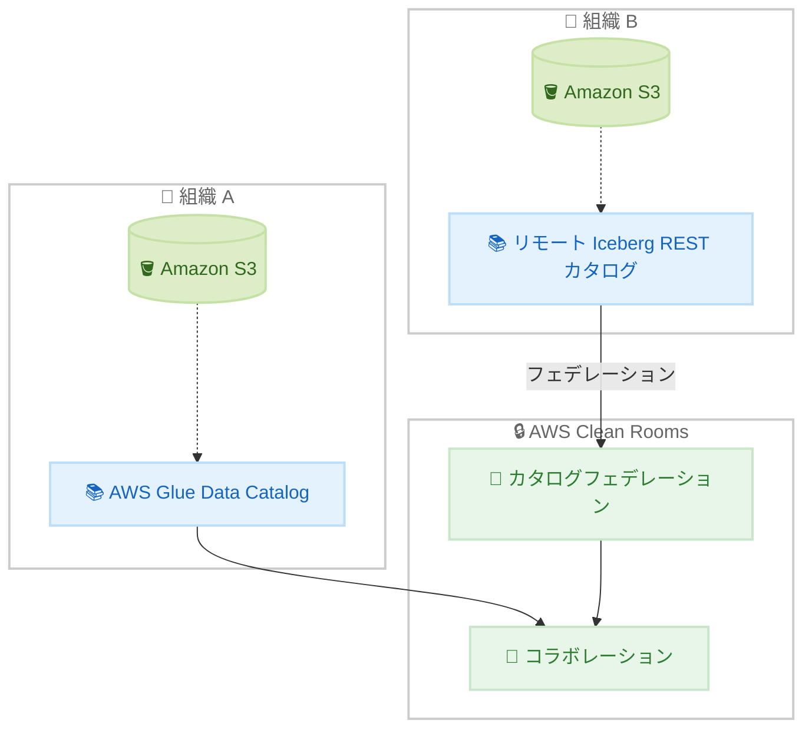

# AWS Clean Rooms - リモート Apache Iceberg REST カタログサポート

**リリース日**: 2026 年 2 月 18 日
**サービス**: AWS Clean Rooms
**機能**: リモート Iceberg REST カタログのカタログフェデレーション

📊 [このアップデートのインフォグラフィックを見る](https://takech9203.github.io/aws-news-summary/20260218-aws-clean-rooms-remote-iceberg-catalogs.html)

## 概要

AWS Clean Rooms がリモート Iceberg カタログのカタログフェデレーションをサポートした。この機能により、Amazon S3 に保存され、リモートカタログで管理されている Iceberg テーブルへの直接的かつ安全なアクセスが可能になり、テーブルメタデータのレプリケーションが不要になる。

組織は AWS Glue カタログフェデレーションを使用して、既存の Iceberg REST カタログへの直接アクセスを Clean Rooms コラボレーションに提供できる。例えば、AWS Glue Data Catalog でデータを管理するメディアパブリッシャーと、リモート Iceberg カタログでデータを管理する広告主が、ETL データパイプラインの構築やデータ共有なしに、広告効果の分析を共同で行うことが可能になる。

**アップデート前の課題**

- リモート Iceberg カタログのテーブルを Clean Rooms で使用するには、メタデータのレプリケーションが必要だった
- ETL パイプラインを構築してデータを移動する必要があった
- 異なるカタログ間のデータコラボレーションが複雑だった

**アップデート後の改善**

- リモート Iceberg カタログへの直接アクセスが可能になった
- メタデータのレプリケーションが不要になりセットアップが簡素化された
- AWS Glue カタログフェデレーションによる安全なアクセスが実現した

## アーキテクチャ図

AWS Glue カタログフェデレーションを通じて、リモート Iceberg カタログと AWS Glue Data Catalog のデータを Clean Rooms で共同分析する。

## サービスアップデートの詳細

### 主要機能

1. **カタログフェデレーション**
   - リモート Iceberg REST カタログへの直接アクセス
   - AWS Glue カタログフェデレーションとの統合
   - テーブルメタデータのレプリケーション不要

2. **Athena ソースの構成済みテーブル**
   - フェデレーションカタログ対応の Athena ソース構成済みテーブル
   - 安全なデータアクセスの維持

3. **データプライバシーの保持**
   - 基盤となるデータを相互に公開せずに共同分析
   - ETL パイプラインやデータ共有が不要

## 技術仕様

### API 変更履歴

| 日付 | サービス | 変更内容 |
|------|----------|----------|
| 2026/02/18 | [AWS Clean Rooms Service](https://awsapichanges.com/archive/changes/7cdfaf-cleanrooms.html) | 3 updated api methods - フェデレーションカタログのサポート追加 |

## 設定方法

### 前提条件

1. AWS Clean Rooms のコラボレーションが設定済みであること
2. AWS Glue カタログフェデレーションが構成済みであること
3. リモート Iceberg REST カタログへのアクセス権限があること

### 手順

#### ステップ 1: カタログフェデレーションの設定

AWS Glue でリモート Iceberg REST カタログへのフェデレーション接続を設定する。

#### ステップ 2: Clean Rooms での構成済みテーブルの作成

Clean Rooms コンソールで、フェデレーションカタログを使用した Athena ソースの構成済みテーブルを作成する。

## メリット

### ビジネス面

- **セットアップの簡素化**: メタデータレプリケーションが不要でコラボレーション開始が迅速
- **データプライバシーの保護**: 基盤データを相互に公開せずに分析可能
- **コスト削減**: ETL パイプラインの構築・運用コストが不要

### 技術面

- **リアルタイムアクセス**: リモートカタログのデータに直接アクセスしてレイテンシを削減
- **メタデータの一貫性**: レプリケーションによるメタデータの乖離リスクがなくなる
- **Iceberg 標準準拠**: Apache Iceberg REST カタログ仕様に基づく標準的な統合

## デメリット・制約事項

### 制限事項

- 対応フォーマットは Apache Iceberg テーブルに限定
- AWS Glue カタログフェデレーションの設定が必要

### 考慮すべき点

- リモートカタログへのネットワーク接続の信頼性が必要
- 大量データの分析時はクエリパフォーマンスの検証を推奨

## ユースケース

### ユースケース 1: 広告効果測定

**シナリオ**: メディアパブリッシャーと広告主が、それぞれ異なるカタログで管理するデータを使用して広告効果を共同分析

**効果**: データを共有せずにインサイトを得られ、プライバシーを保護しながら広告投資対効果を評価

### ユースケース 2: サプライチェーン分析

**シナリオ**: サプライチェーンの複数パートナーが、各社のリモート Iceberg カタログのデータを使用して供給最適化を分析

**効果**: ETL なしで即座にコラボレーション分析を開始可能

## 料金

AWS Clean Rooms の通常料金に従う。カタログフェデレーション自体の追加料金はないが、クエリ実行時の Clean Rooms 処理料金が発生する。

## 利用可能リージョン

AWS Clean Rooms が利用可能なリージョンで使用可能。リージョンの詳細は [AWS リージョンテーブル](https://docs.aws.amazon.com/general/latest/gr/clean-rooms.html#clean-rooms_region)を参照。

## 関連サービス・機能

- **AWS Glue Data Catalog**: カタログフェデレーションの基盤
- **Amazon Athena**: Clean Rooms のクエリ実行エンジン
- **Apache Iceberg**: オープンテーブルフォーマット

## 参考リンク

- 📊 [インフォグラフィック](https://takech9203.github.io/aws-news-summary/20260218-aws-clean-rooms-remote-iceberg-catalogs.html)
- [公式発表 (What's New)](https://aws.amazon.com/about-aws/whats-new/2026/02/aws-clean-rooms-remote-iceberg-catalogs/)
- [リモート Iceberg カタログドキュメント](https://docs.aws.amazon.com/clean-rooms/latest/userguide/create-config-table-athena.html)
- [AWS Clean Rooms](https://aws.amazon.com/clean-rooms/)

## まとめ

AWS Clean Rooms のリモート Iceberg REST カタログサポートにより、異なるカタログ間のデータコラボレーションが大幅に簡素化された。メタデータのレプリケーションや ETL パイプラインが不要になり、データプライバシーを保護しながら迅速にコラボレーション分析を開始できる。Iceberg テーブルを使用してクロス組織分析を行う企業にとって重要なアップデートである。
