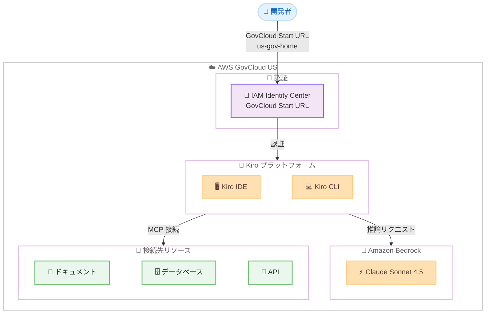

# Kiro - AWS GovCloud (US) リージョンで利用可能に

**リリース日**: 2026 年 2 月 18 日
**サービス**: Kiro
**機能**: AWS GovCloud (US-East) および AWS GovCloud (US-West) リージョンでの提供開始

📊 [このアップデートのインフォグラフィックを見る](https://takech9203.github.io/aws-news-summary/20260218-kiro-introducing-govcloud.html)

## 概要

Kiro が AWS GovCloud (US-East) および AWS GovCloud (US-West) リージョンで利用可能になりました。これにより、政府機関や政府系コントラクターがコンプライアンス境界内で Kiro を使用し、エージェント型 AI 開発を行えるようになります。

Kiro は、スペック駆動開発でプロトタイプから本番環境への移行を支援するエージェント型 AI であり、IDE と CLI を提供しています。ネイティブ MCP サポートにより、ドキュメント、データベース、API、エンタープライズリソースへの接続が可能です。今回の GovCloud 対応により、コンプライアンス要件の高いワークロードにもエージェント型 AI 開発機能を提供します。

**アップデート前の課題**

- 政府機関や政府系コントラクターが Kiro を使用する際、コンプライアンス境界内での利用ができなかった
- GovCloud 環境で AI 支援開発ツールの選択肢が限られていた
- 制限されたネットワーク環境や統制された環境での AI コーディングツール導入が困難だった

**アップデート後の改善**

- AWS GovCloud (US) リージョン内で Kiro IDE および CLI を利用可能
- AWS IAM Identity Center による GovCloud 認証で、コンプライアンス要件を満たしながら開発可能
- 商用リージョンと同じインストーラーを使用し、IAM Identity Center 認証で自動的に適切なリージョンにルーティング

## アーキテクチャ図



この図は、開発者が IAM Identity Center の GovCloud Start URL を使用して認証し、GovCloud リージョン内で Kiro IDE/CLI を利用する全体的なアーキテクチャを示しています。

## サービスアップデートの詳細

### 主要機能

1. **GovCloud リージョンでのエージェント型 AI 開発**
   - AWS GovCloud (US-East) と AWS GovCloud (US-West) の両リージョンで Kiro が利用可能
   - スペック駆動開発により、プロンプトから詳細な仕様、実装コード、ドキュメント、テストを生成
   - ネイティブ MCP サポートでドキュメント、データベース、API、エンタープライズリソースに接続

2. **IAM Identity Center による認証**
   - GovCloud Start URL (us-gov-home を含む URL) を使用した認証
   - IAM Identity Center 認証により自動的に GovCloud リージョンにトラフィックをルーティング
   - GitHub、Google、AWS Builder ID による個人ログインは GovCloud リージョンでは利用不可

3. **統一されたインストーラー**
   - 商用リージョンと GovCloud リージョンで同じインストーラーを使用
   - IAM Identity Center 認証が適切なリージョンへの自動ルーティングを処理
   - 別途 GovCloud 専用のインストーラーは不要

### GovCloud リージョンでの制限事項

GovCloud リージョンでは、商用リージョンと比較して以下の制限があります。

| 機能 | GovCloud での対応状況 |
|------|----------------------|
| Kiro IDE (スタンドアロン) | 利用可能 |
| Kiro CLI | 利用可能 |
| IAM Identity Center 認証 | 利用可能 |
| MCP サポート | 利用可能 |
| スペック駆動開発 | 利用可能 |
| IDE プラグイン (VS Code 等) | 利用不可 |
| インライン提案 | 利用不可 |
| 自律エージェント | 利用不可 |
| ソーシャルログイン / Builder ID | 利用不可 |
| サービス改善用データ収集 | 無効 |
| ユーザーアクティビティメトリクス / S3 レポート | 利用不可 |
| Auto (自動モデル選択) | 無効 |

## 技術仕様

### 認証とリージョンルーティング

| 項目 | 詳細 |
|------|------|
| 認証方法 | AWS IAM Identity Center |
| Start URL | GovCloud Start URL (us-gov-home を含む) |
| インストーラー | 商用/GovCloud 共通 |
| ルーティング | IAM Identity Center 認証で自動的にリージョン判定 |
| デフォルトモデル | Claude Sonnet 4.5 |
| 暗号化 | TLS 1.2 以上 |

### クロスリージョン推論

| 項目 | 詳細 |
|------|------|
| GovCloud (US-West) | Amazon Bedrock をローカルで処理 |
| GovCloud (US-East) | Amazon Bedrock GovCloud (US-West) で推論処理 |
| データ保存 | Kiro プロファイル作成リージョンに保存 |
| 通信暗号化 | TLS 1.2 以上 |

## 設定方法

### 前提条件

1. AWS GovCloud (US) アカウントが有効化されていること
2. AWS IAM Identity Center が GovCloud リージョンで設定されていること
3. GovCloud Start URL (us-gov-home を含む) が利用可能であること

### 手順

#### ステップ 1: Kiro のインストール

Kiro の公式サイトからインストーラーをダウンロードしてインストールします。商用リージョンと GovCloud リージョンで同じインストーラーを使用します。

```bash
# Kiro のインストール (公式サイトからダウンロード)
# https://kiro.dev からインストーラーを取得
```

GovCloud 専用のインストーラーは不要です。

#### ステップ 2: IAM Identity Center で認証

Kiro IDE または CLI を起動し、IAM Identity Center を使用してサインインします。

1. Kiro IDE を起動、またはターミナルで Kiro CLI を開始
2. サインイン方法として IAM Identity Center を選択
3. GovCloud Start URL (us-gov-home を含む URL) を入力
4. IAM Identity Center の認証情報でサインイン

IAM Identity Center 認証により、トラフィックが自動的に GovCloud リージョンにルーティングされます。

#### ステップ 3: 開発作業の開始

認証完了後、Kiro IDE または CLI でスペック駆動開発を開始します。

1. プロジェクトを開く、または新規作成
2. Kiro のエージェント機能を使用してコード生成、ドキュメント作成、テスト生成を実行
3. MCP 接続でデータベースや API などのリソースに接続

GovCloud リージョン内でのすべてのデータ処理とモデル推論が行われます。

## メリット

### ビジネス面

- **コンプライアンス対応**: FedRAMP、ITAR などの政府規制要件を満たしながら AI 支援開発が可能
- **開発効率の向上**: 政府系ソフトウェア開発においてもエージェント型 AI による生産性向上を実現
- **導入障壁の低減**: 商用リージョンと同じインストーラーで GovCloud 環境でも即座に利用開始可能
- **セキュリティ要件の充足**: IAM Identity Center 認証により、組織のセキュリティポリシーに準拠

### 技術面

- **統一されたツールチェーン**: 商用リージョンと GovCloud リージョンで同じ Kiro IDE/CLI を使用
- **自動ルーティング**: IAM Identity Center 認証による透過的なリージョンルーティング
- **MCP 連携**: GovCloud 環境内のリソースにネイティブ MCP で接続可能
- **データ主権**: コンテンツが GovCloud リージョン内に保持される

## デメリット・制約事項

### 制限事項

- IDE プラグイン (VS Code プラグインなど) は GovCloud リージョンでは利用不可。スタンドアロン IDE または CLI を使用する必要がある
- インライン提案 (リアルタイムコード補完) は利用不可
- 自律エージェント機能は利用不可
- GitHub、Google、AWS Builder ID によるソーシャルログインは利用不可。IAM Identity Center での認証が必須
- サービス改善用のデータ収集 (プロンプト、レスポンス、生成コード) は無効
- ユーザーアクティビティメトリクスと S3 レポートは利用不可
- Auto (自動モデル選択) は無効。デフォルトモデルは Claude Sonnet 4.5

### 考慮すべき点

- GovCloud (US-East) の場合、推論リクエストは GovCloud (US-West) の Amazon Bedrock で処理される。コンテンツは Kiro プロファイル作成リージョンに保存される
- GovCloud リージョンの料金は商用リージョンと異なる場合がある
- GovCloud アカウントおよび IAM Identity Center の事前設定が必要
- 商用リージョンで利用可能な一部機能が制限されるため、機能要件の事前確認を推奨

## ユースケース

### ユースケース 1: 政府機関向けアプリケーション開発

**シナリオ**: 政府機関が FedRAMP 準拠の環境で新しいアプリケーションを開発する必要がある

**効果**: Kiro のスペック駆動開発により、自然言語のプロンプトから仕様書、実装コード、テストを生成できる。すべてのデータ処理が GovCloud リージョン内で完結するため、コンプライアンス要件を満たしながら開発効率を大幅に向上させることが可能

### ユースケース 2: 政府系コントラクターのソフトウェア開発

**シナリオ**: 政府系コントラクターが制限されたネットワーク環境でコードを開発・デリバリーする必要がある

**効果**: Kiro IDE と CLI を GovCloud リージョンで使用し、MCP 接続でデータベースや API に安全にアクセスしながら、エージェント型 AI の支援を受けたソフトウェア開発が可能。IAM Identity Center 認証により組織のセキュリティポリシーを維持できる

### ユースケース 3: ミッションクリティカルな開発ワークフロー

**シナリオ**: 防衛・安全保障分野で、ドキュメント生成やユニットテスト作成を自動化してコード品質を向上させたい

**効果**: Kiro のエージェントがドキュメントやユニットテストをバックグラウンドで自動生成し、コードレビューやテストカバレッジの向上に貢献する。ネイティブ MCP サポートにより、組織内部のドキュメントやリソースに接続した開発が可能

## 料金

GovCloud リージョンでの Kiro の料金については、具体的な情報は公開されていません。詳細は AWS アカウントチームに問い合わせるか、[Kiro 料金ページ](https://kiro.dev/pricing/) を参照してください。

## 利用可能リージョン

この機能は、以下の AWS GovCloud (US) リージョンで利用可能です。

- AWS GovCloud (US-East): us-gov-east-1
- AWS GovCloud (US-West): us-gov-west-1

## 関連サービス・機能

- **AWS IAM Identity Center**: Kiro GovCloud 認証の基盤となるサービス
- **Amazon Bedrock**: Kiro のモデル推論を提供する AI サービス (GovCloud リージョン)
- **Kiro IDE**: AI を活用したスペック駆動開発環境
- **Kiro CLI**: コマンドラインからの Kiro 利用を可能にするツール
- **MCP (Model Context Protocol)**: ドキュメント、データベース、API への接続プロトコル

## 参考リンク

- 📊 [インフォグラフィック](https://takech9203.github.io/aws-news-summary/20260218-kiro-introducing-govcloud.html)
- [公式発表 (What's New)](https://aws.amazon.com/about-aws/whats-new/2026/02/kiro-launch-aws-govcloud-us/)
- [公式ブログ](https://kiro.dev/blog/introducing-govcloud/)
- [GovCloud ドキュメント](https://docs.aws.amazon.com/govcloud-us/latest/UserGuide/govcloud-kiro.html)
- [Kiro 製品ページ](https://kiro.dev)
- [Kiro ドキュメント](https://kiro.dev/docs/)

## まとめ

Kiro が AWS GovCloud (US-East) および AWS GovCloud (US-West) リージョンで利用可能になりました。政府機関や政府系コントラクターは、コンプライアンス境界内でエージェント型 AI 開発機能を活用し、スペック駆動開発でプロトタイプから本番環境への移行を加速できます。商用リージョンと同じインストーラーを使用し、IAM Identity Center 認証で自動的に GovCloud リージョンにルーティングされるため、導入も容易です。GovCloud 環境でのソフトウェア開発を効率化したい組織は、Kiro の導入を検討してください。
