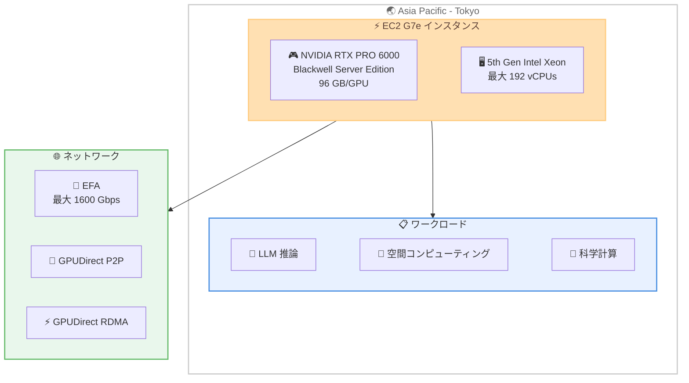

# Amazon EC2 G7e - 東京リージョンで利用可能に

**リリース日**: 2026 年 2 月 19 日
**サービス**: Amazon Elastic Compute Cloud (Amazon EC2)
**機能**: G7e インスタンス 東京リージョン対応

📊 [このアップデートのインフォグラフィックを見る](https://takech9203.github.io/aws-news-summary/20260219-amazon-ec2-g7e-instances-tokyo-region.html)

## 概要

Amazon EC2 G7e インスタンスが Asia Pacific (Tokyo) リージョンで利用可能になった。G7e インスタンスは NVIDIA RTX PRO 6000 Blackwell Server Edition GPU を搭載し、前世代の G6e インスタンスと比較して最大 2.3 倍の推論パフォーマンスを提供する。

G7e インスタンスは、大規模言語モデル (LLM)、エージェント型 AI モデル、マルチモーダル生成 AI モデル、フィジカル AI モデルのデプロイに適している。また、空間コンピューティングワークロードやグラフィックスと AI 処理の両方を必要とするワークロードにおいて最高のパフォーマンスを提供する。東京リージョンでの提供開始により、日本のユーザーは低レイテンシーで GPU ベースの AI 推論やグラフィックスワークロードを実行できるようになった。

**アップデート前の課題**

- G7e インスタンスは US East (N. Virginia, Ohio) および US West (Oregon) リージョンでのみ利用可能で、日本のユーザーは海外リージョンを使用する必要があった
- 東京リージョンで利用可能な GPU インスタンスは G6e 世代が最新であり、Blackwell 世代の GPU パフォーマンスを活用できなかった
- AI 推論ワークロードを日本国内で低レイテンシーかつデータレジデンシー要件を満たして実行することが困難だった

**アップデート後の改善**

- 東京リージョンで G7e インスタンスが利用可能になり、日本国内で Blackwell GPU のパフォーマンスを活用できるようになった
- G6e と比較して最大 2.3 倍の推論パフォーマンスを東京リージョンで実現可能になった
- データレジデンシー要件を満たしながら、最新の GPU アクセラレーテッドワークロードを実行できるようになった

## アーキテクチャ図



G7e インスタンスは NVIDIA RTX PRO 6000 Blackwell GPU と高性能ネットワーキングを組み合わせ、AI 推論、空間コンピューティング、科学計算など多様なワークロードに対応する。

## サービスアップデートの詳細

### 主要機能

1. **NVIDIA RTX PRO 6000 Blackwell Server Edition GPU**
   - GPU あたり 96 GB の GDDR7 メモリ、1597 GB/s のメモリ帯域幅
   - 第 5 世代 NVIDIA Tensor Core で FP4 精度をサポート
   - 第 4 世代レイトレーシングコアでニューラルグラフィクスベースの技術に対応
   - 最大 8 GPU (合計 768 GB GPU メモリ) を搭載可能

2. **高性能ネットワーキング**
   - EFA で最大 1600 Gbps のネットワーク帯域幅 (G6e の 4 倍)
   - NVIDIA GPUDirect Peer to Peer (P2P) によるマルチ GPU ワークロードの低レイテンシー化
   - NVIDIA GPUDirect RDMA (EFA 対応) で EC2 UltraClusters における小規模マルチノードワークロードのレイテンシーを削減

3. **AI 推論パフォーマンスの大幅向上**
   - G6e と比較して最大 2.3 倍の推論パフォーマンス
   - 1.85 倍の GPU メモリ帯域幅でリアルタイムエージェント型 AI およびマルチモーダル AI 推論に対応
   - CPU-GPU 間帯域幅が 4 倍に向上し、レコメンダーや RAG ワークロードの推論性能が改善

## 技術仕様

### インスタンスサイズ

| インスタンスサイズ | GPU 数 | GPU メモリ | vCPUs | システムメモリ | インスタンスストレージ | EBS 帯域幅 | ネットワーク帯域幅 |
|---|---|---|---|---|---|---|---|
| g7e.2xlarge | 1 | 96 GB | 8 | 64 GiB | 1.9 TB x 1 | 最大 5 Gbps | 50 Gbps |
| g7e.4xlarge | 1 | 96 GB | 16 | 128 GiB | 1.9 TB x 1 | 8 Gbps | 50 Gbps |
| g7e.8xlarge | 1 | 96 GB | 32 | 256 GiB | 1.9 TB x 1 | 16 Gbps | 100 Gbps |
| g7e.12xlarge | 2 | 192 GB | 48 | 512 GiB | 3.8 TB x 1 | 25 Gbps | 400 Gbps |
| g7e.24xlarge | 4 | 384 GB | 96 | 1024 GiB | 3.8 TB x 2 | 50 Gbps | 800 Gbps |
| g7e.48xlarge | 8 | 768 GB | 192 | 2048 GiB | 3.8 TB x 4 | 100 Gbps | 1600 Gbps |

### G6e との比較

| 項目 | G6e | G7e | 改善率 |
|------|-----|-----|--------|
| GPU | NVIDIA L40S | NVIDIA RTX PRO 6000 Blackwell | - |
| GPU メモリ/GPU | 48 GB | 96 GB | 2 倍 |
| GPU メモリ帯域幅 | - | 1597 GB/s | 1.85 倍 |
| 推論パフォーマンス | ベースライン | 最大 2.3 倍 | 2.3 倍 |
| GPU 間通信帯域幅 | ベースライン | 最大 4 倍 | 4 倍 |
| EFA ネットワーク帯域幅 | 400 Gbps | 1600 Gbps | 4 倍 |

## 設定方法

### 前提条件

1. AWS アカウント
2. 東京リージョン (ap-northeast-1) での G7e インスタンスのサービスクォータ (必要に応じてクォータ引き上げをリクエスト)
3. NVIDIA ドライバーがインストールされた AMI (AWS Deep Learning AMI 推奨)

### 手順

#### ステップ 1: AWS CLI でインスタンスを起動

```bash
aws ec2 run-instances \
  --region ap-northeast-1 \
  --instance-type g7e.2xlarge \
  --image-id ami-xxxxxxxx \
  --key-name my-key-pair \
  --security-group-ids sg-xxxxxxxx \
  --subnet-id subnet-xxxxxxxx
```

東京リージョン (ap-northeast-1) で G7e インスタンスを起動するコマンド。AMI ID は NVIDIA ドライバーがプリインストールされた Deep Learning AMI を指定する。

#### ステップ 2: GPU の動作確認

```bash
nvidia-smi
```

インスタンスに SSH 接続後、nvidia-smi コマンドで NVIDIA RTX PRO 6000 GPU が正しく認識されていることを確認する。

## メリット

### ビジネス面

- **低レイテンシー AI 推論**: 東京リージョンで推論を実行することで、日本のエンドユーザーに対してレスポンス時間を大幅に短縮できる
- **データレジデンシー対応**: 日本国内にデータを保持しながら高性能 GPU ワークロードを実行でき、コンプライアンス要件を満たせる
- **コスト効率**: G6e と比較して 2.3 倍の推論パフォーマンスにより、スループットあたりのコストを削減できる

### 技術面

- **Blackwell アーキテクチャ**: 最新の NVIDIA Blackwell GPU により、FP4 精度サポートやニューラルグラフィクスなど最先端の機能を利用可能
- **高帯域幅ネットワーキング**: EFA で最大 1600 Gbps のネットワーク帯域幅を提供し、マルチノードワークロードに対応
- **大容量 GPU メモリ**: GPU あたり 96 GB のメモリにより、最大 70B パラメータの FP8 モデルを単一 GPU 上で実行可能

## デメリット・制約事項

### 制限事項

- 東京リージョンでは初めての提供であるため、初期段階ではキャパシティに制約がある可能性がある
- ベアメタルインスタンスサイズは提供されていない (最大 g7e.48xlarge まで)
- Savings Plans または On-Demand の購入が必要 (Reserved Instances は未対応)

### 考慮すべき点

- G6e からの移行時には、NVIDIA ドライバーバージョンの互換性確認が必要
- 大規模なマルチノードトレーニングには P5/P6 インスタンスの方が適している場合がある (G7e は主に推論と中規模トレーニング向け)

## ユースケース

### ユースケース 1: LLM リアルタイム推論

**シナリオ**: 日本向けチャットボットサービスで、大規模言語モデルの推論を低レイテンシーで提供する必要がある。

**実装例**:
```bash
# g7e.8xlarge (1 GPU, 96 GB) で 70B パラメータモデルを FP8 でデプロイ
aws ec2 run-instances \
  --region ap-northeast-1 \
  --instance-type g7e.8xlarge \
  --image-id ami-xxxxxxxx
```

**効果**: 96 GB の GPU メモリにより 70B パラメータモデルを単一 GPU に収容でき、G6e と比較して 2.3 倍高速な推論レスポンスを日本国内から提供可能。

### ユースケース 2: 空間コンピューティングとデジタルツイン

**シナリオ**: 製造業のデジタルツインシミュレーションで、リアルタイムなレイトレーシングと AI 処理を組み合わせる。

**実装例**:
```bash
# g7e.24xlarge (4 GPU) でマルチ GPU レンダリング
aws ec2 run-instances \
  --region ap-northeast-1 \
  --instance-type g7e.24xlarge \
  --image-id ami-xxxxxxxx \
  --placement GroupName=my-cluster-group
```

**効果**: 第 4 世代レイトレーシングコアとニューラルグラフィクス対応により、高品質なリアルタイムビジュアライゼーションを東京リージョンから提供。GPUDirect P2P で GPU 間通信を高速化。

### ユースケース 3: マルチモーダル AI 推論サービス

**シナリオ**: 画像・テキスト・音声を統合的に処理するマルチモーダル AI サービスを日本市場向けに展開する。

**実装例**:
```bash
# g7e.12xlarge (2 GPU, 192 GB) でマルチモーダルモデルをデプロイ
aws ec2 run-instances \
  --region ap-northeast-1 \
  --instance-type g7e.12xlarge \
  --image-id ami-xxxxxxxx
```

**効果**: 2 GPU 構成で 192 GB の GPU メモリを活用し、大規模マルチモーダルモデルを効率的にホスティング。GPUDirect P2P により GPU 間のデータ転送を最適化。

## 料金

G7e インスタンスは、オンデマンド、スポットインスタンス、Savings Plans で購入可能。東京リージョンの具体的な料金は [EC2 料金ページ](https://aws.amazon.com/ec2/pricing/on-demand/) を参照。

### 購入オプション

| 購入方法 | 説明 |
|----------|------|
| オンデマンド | 長期コミットメントなしで利用可能 |
| スポットインスタンス | 最大 90% の割引、中断許容ワークロード向け |
| Savings Plans | 1 年または 3 年のコミットメントで割引 |

## 利用可能リージョン

| リージョン | 提供状況 |
|------------|----------|
| US East (N. Virginia) | 利用可能 |
| US East (Ohio) | 利用可能 |
| US West (Oregon) | 利用可能 |
| Asia Pacific (Tokyo) | **新規** - 2026 年 2 月 19 日より利用可能 |

## 関連サービス・機能

- **Amazon SageMaker AI**: G7e インスタンスをマネージド ML プラットフォームから利用し、モデルトレーニングと推論のデプロイを簡素化
- **AWS Deep Learning AMI**: NVIDIA ドライバーとフレームワークがプリインストールされた AMI で迅速にセットアップ可能
- **Amazon EKS / Amazon ECS**: コンテナオーケストレーションで G7e インスタンスを GPU ワークロード用ノードとして活用
- **EC2 UltraClusters**: EFA と GPUDirect RDMA を活用したマルチノード GPU クラスタリング

## 参考リンク

- 📊 [インフォグラフィック](https://takech9203.github.io/aws-news-summary/20260219-amazon-ec2-g7e-instances-tokyo-region.html)
- [公式発表 (What's New)](https://aws.amazon.com/about-aws/whats-new/2026/02/amazon-ec2-g7e-instances-tokyo-region/)
- [AWS Blog - Announcing Amazon EC2 G7e instances](https://aws.amazon.com/blogs/aws/announcing-amazon-ec2-g7e-instances-accelerated-by-nvidia-rtx-pro-6000-blackwell-server-edition-gpus/)
- [G7e インスタンス製品ページ](https://aws.amazon.com/ec2/instance-types/g7e/)
- [EC2 料金ページ](https://aws.amazon.com/ec2/pricing/on-demand/)

## まとめ

Amazon EC2 G7e インスタンスの東京リージョン対応により、日本のユーザーは NVIDIA RTX PRO 6000 Blackwell GPU の最大 2.3 倍の推論パフォーマンス向上を低レイテンシーで活用できるようになった。AI 推論、空間コンピューティング、マルチモーダル AI など GPU 集約型ワークロードを日本国内で実行する必要がある場合、サービスクォータの確認と G7e への移行検討を推奨する。
