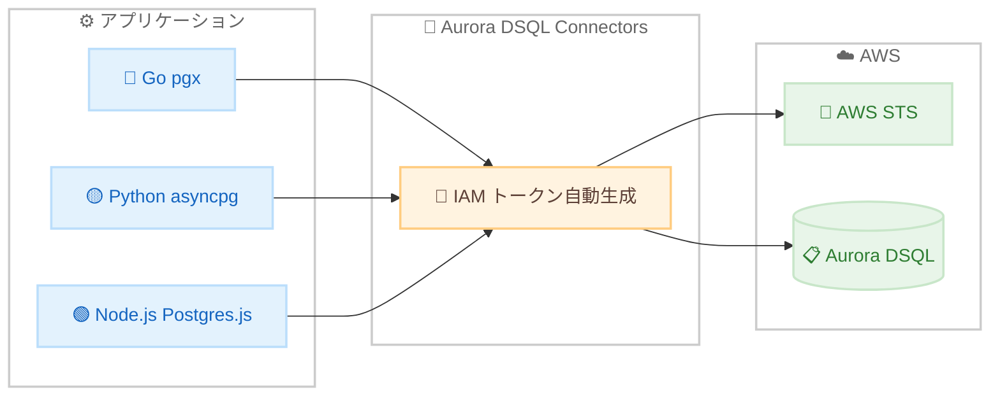

# Aurora DSQL - Go、Python、Node.js コネクタリリース

**リリース日**: 2026 年 2 月 19 日
**サービス**: Amazon Aurora DSQL
**機能**: Aurora DSQL Connectors for Go, Python, Node.js

📊 [このアップデートのインフォグラフィックを見る](https://takech9203.github.io/aws-news-summary/20260219-aurora-dsql-launches-go-python-nodejs-connectors.html)

## 概要

Aurora DSQL 向けの新しいコネクタが Go (pgx)、Python (asyncpg)、Node.js (WebSocket for Postgres.js) の 3 言語でリリースされた。これらのコネクタは、標準的な PostgreSQL ドライバを使用して Aurora DSQL クラスタに接続する際の IAM 認証を大幅に簡素化する。

コネクタは透過的な認証レイヤとして機能し、IAM トークンの生成を自動的に処理する。開発者がトークン生成コードを記述したり、手動で IAM トークンを供給したりする必要がなくなる。接続ごとにトークンが自動生成されるため、常に有効なトークンが使用され、既存の PostgreSQL ドライバ機能との完全な互換性が維持される。

Postgres.js コネクタは WebSocket プロトコルもサポートしており、TCP 接続が利用できない環境でも DSQL クラスタへの接続が可能になる。

**アップデート前の課題**

- IAM トークンの生成コードを各アプリケーションに実装する必要があった
- トークンの有効期限管理を開発者が手動で行う必要があった
- WebSocket 環境では DSQL への接続手段が限られていた

**アップデート後の改善**

- コネクタが IAM トークン生成を自動化し、認証コードの実装が不要になった
- 接続ごとに有効なトークンが自動生成され、セキュリティリスクが低減した
- WebSocket プロトコル対応により、ブラウザや Edge 環境からの接続が可能になった

## アーキテクチャ図



コネクタがアプリケーションと Aurora DSQL の間で IAM トークン生成を透過的に処理する。

## サービスアップデートの詳細

### 主要機能

1. **Go コネクタ pgx**
   - pgx ドライバ向けの認証プラグイン
   - IAM トークンの自動生成と接続管理
   - カスタム IAM クレデンシャルプロバイダのサポート

2. **Python コネクタ asyncpg**
   - asyncpg ドライバ向けの非同期認証レイヤ
   - 非同期 I/O ベースの接続管理
   - 既存の asyncpg 機能との完全互換

3. **Node.js コネクタ WebSocket for Postgres.js**
   - Postgres.js ドライバ向けの WebSocket 対応コネクタ
   - TCP 接続が利用できない環境でも接続可能
   - ブラウザベースや Edge 環境での利用を想定

## 技術仕様

### コネクタ対応状況

| 言語 | ドライバ | プロトコル | リポジトリ |
|------|----------|-----------|-----------|
| Go | pgx | TCP | [aurora-dsql-connectors/go/pgx](https://github.com/awslabs/aurora-dsql-connectors/tree/main/go/pgx) |
| Python | asyncpg | TCP | [aurora-dsql-connectors/python/connector](https://github.com/awslabs/aurora-dsql-connectors/tree/main/python/connector) |
| Node.js | Postgres.js | WebSocket | [aurora-dsql-connectors/node/postgres-js](https://github.com/awslabs/aurora-dsql-connectors/tree/main/node/postgres-js) |

### 共通仕様

| 項目 | 詳細 |
|------|------|
| 認証方式 | IAM トークン自動生成 |
| クレデンシャル | カスタム IAM クレデンシャルプロバイダ対応 |
| PostgreSQL 互換性 | 既存ドライバ機能と完全互換 |

## 設定方法

### 前提条件

1. Aurora DSQL クラスタが作成済みであること
2. 適切な IAM ポリシーが設定されていること
3. 対応言語のランタイム環境が用意されていること

### 手順

#### ステップ 1: コネクタのインストール

```bash
# Go
go get github.com/awslabs/aurora-dsql-connectors/go/pgx

# Python
pip install aurora-dsql-connector

# Node.js
npm install @awslabs/aurora-dsql-connector
```

各言語のパッケージマネージャでコネクタをインストールする。

#### ステップ 2: 接続の設定

コネクタを使用して Aurora DSQL クラスタに接続する。従来の手動トークン生成コードは不要になり、コネクタが自動的に IAM 認証を処理する。

## メリット

### ビジネス面

- **開発生産性の向上**: 認証コードの実装が不要になり、ビジネスロジックに集中できる
- **セキュリティリスクの低減**: パスワードベースの認証から IAM トークンベースの認証へ移行が容易になる
- **マルチプラットフォーム対応**: WebSocket サポートによりブラウザや Edge 環境からも接続可能

### 技術面

- **透過的な認証**: 既存の PostgreSQL ドライバコードを最小限の変更で IAM 認証に移行できる
- **トークン管理の自動化**: トークンの有効期限切れを心配する必要がなくなる
- **カスタムクレデンシャル対応**: 柔軟な AWS クレデンシャル管理が可能

## デメリット・制約事項

### 制限事項

- 対応ドライバが各言語 1 つに限定されている
- WebSocket プロトコルは Node.js コネクタのみ対応
- 従来の JDBC コネクタとは別リリース

### 考慮すべき点

- 既存の手動トークン生成コードからの移行計画が必要
- カスタムクレデンシャルプロバイダを使用する場合は追加設定が必要

## ユースケース

### ユースケース 1: サーバーレスアプリケーション

**シナリオ**: AWS Lambda から Aurora DSQL に接続するサーバーレスアプリケーション

**効果**: Lambda 関数内で IAM トークン生成コードを記述する必要がなくなり、コードがシンプルになる

### ユースケース 2: ブラウザベースアプリケーション

**シナリオ**: WebSocket を使用してブラウザから直接 Aurora DSQL にクエリを実行する

**効果**: TCP 接続が制限される環境でも DSQL へのアクセスが可能になる

### ユースケース 3: マイクロサービス間のデータ共有

**シナリオ**: Go、Python、Node.js で構成されるマイクロサービス群が共通の Aurora DSQL クラスタにアクセスする

**効果**: 各言語で統一された認証パターンが使用でき、運用の一貫性が保たれる

## 料金

Aurora DSQL コネクタ自体は無料で利用可能。Aurora DSQL の利用料金は通常の Aurora DSQL 料金体系に従う。AWS Free Tier で Aurora DSQL を無料で開始できる。

## 利用可能リージョン

Aurora DSQL が利用可能なすべての AWS リージョンで使用可能。

## 関連サービス・機能

- **Amazon Aurora DSQL**: サーバーレス分散 SQL データベース
- **AWS IAM**: コネクタが使用する認証基盤
- **AWS STS**: IAM トークンの生成に使用

## 参考リンク

- 📊 [インフォグラフィック](https://takech9203.github.io/aws-news-summary/20260219-aurora-dsql-launches-go-python-nodejs-connectors.html)
- [公式発表 (What's New)](https://aws.amazon.com/about-aws/whats-new/2026/02/aurora-dsql-launches-go-python-nodejs-connectors/)
- [ドキュメント](https://docs.aws.amazon.com/aurora-dsql/latest/userguide/SECTION_connectors.html)
- [GitHub - Go pgx](https://github.com/awslabs/aurora-dsql-connectors/tree/main/go/pgx)
- [GitHub - Python asyncpg](https://github.com/awslabs/aurora-dsql-connectors/tree/main/python/connector)
- [GitHub - Node.js Postgres.js](https://github.com/awslabs/aurora-dsql-connectors/tree/main/node/postgres-js)

## まとめ

Aurora DSQL 向けの Go、Python、Node.js コネクタにより、IAM 認証が大幅に簡素化される。特に WebSocket 対応の Node.js コネクタは、TCP 接続が制限される環境での新しい接続手段を提供する。Aurora DSQL を使用している開発者は、これらのコネクタを導入して認証コードを簡素化し、セキュリティの向上を検討することを推奨する。
