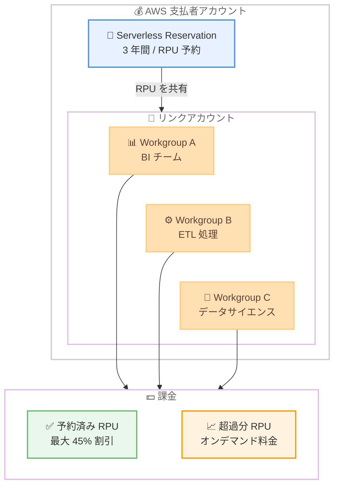

# Amazon Redshift Serverless - 3 年間の Serverless Reservations

**リリース日**: 2026 年 2 月 23 日
**サービス**: Amazon Redshift Serverless
**機能**: 3-year Serverless Reservations

📊 [このアップデートのインフォグラフィックを見る](https://takech9203.github.io/aws-news-summary/20260223-amazon-redshift-serverless-three-year-reservations.html)

## 概要

Amazon Redshift Serverless に 3 年間の Serverless Reservations が追加されました。これは、Redshift Processing Units (RPU) を 3 年間のコミットメントで予約することで、オンデマンド料金と比較して最大 45% のコスト削減を実現する新しい割引料金オプションです。前払い不要 (No Upfront) の支払いオプションが提供されます。

2025 年 4 月に 1 年間の Serverless Reservations が導入され、No Upfront で最大 20%、All Upfront で最大 24% の割引が提供されていました。今回の 3 年間オプションの追加により、長期的な分析ワークロードを運用する組織はさらに大幅なコスト削減が可能になります。Serverless Reservations は AWS 支払者アカウントレベルで管理され、複数の AWS アカウント間で共有できるため、組織全体のコスト最適化に活用できます。

**アップデート前の課題**

- Serverless Reservations は 1 年間の期間のみ対応しており、最大割引率は 24% に限定されていた
- 長期的に安定した分析ワークロードを運用する組織にとって、より大きなコスト削減の選択肢がなかった
- Provisioned クラスターの Reserved Instances (最大 3 年) と比較して、Serverless の割引オプションが限定的だった

**アップデート後の改善**

- 3 年間のコミットメントで最大 45% のコスト削減が可能に
- 前払い不要のオプションで初期投資なしに大幅な割引を享受できる
- Provisioned の Reserved Instances に匹敵する長期割引が Serverless でも利用可能に

## アーキテクチャ図



支払者アカウントレベルで Serverless Reservation を購入すると、リンクアカウント内の複数のワークグループで予約済み RPU を共有できます。予約容量を超える使用分はオンデマンド料金で課金されます。

## サービスアップデートの詳細

### 主要機能

1. **3 年間の Serverless Reservations**
   - RPU 数を指定して 3 年間のコミットメントで予約
   - オンデマンド料金と比較して最大 45% のコスト削減
   - 前払い不要 (No Upfront) の支払いオプション

2. **支払者アカウントレベルでの管理**
   - AWS Organizations の支払者アカウントレベルで予約を管理
   - 複数の AWS アカウントおよびワークグループ間で予約を共有
   - 予約済み RPU は自動的にワークロードに適用される

3. **秒単位の課金と柔軟性の維持**
   - 時間単位で請求、秒単位で計測
   - 24 時間 365 日の一貫した課金モデル
   - 予約容量を超える使用分はオンデマンド料金で対応
   - Serverless の自動スケーリング機能はそのまま維持

## 技術仕様

### Serverless Reservations の料金体系比較

| 予約期間 | 支払いオプション | 最大割引率 |
|----------|------------------|------------|
| 1 年間 | No Upfront | 最大 20% |
| 1 年間 | All Upfront | 最大 24% |
| 3 年間 | No Upfront | 最大 45% |

### 予約の仕組み

| 項目 | 詳細 |
|------|------|
| 予約単位 | Redshift Processing Units (RPU) |
| 最小予約 RPU | 1 RPU |
| 課金方式 | 時間単位で請求、秒単位で計測 |
| 予約の管理レベル | AWS 支払者アカウント |
| 予約の変更・削除 | 不可。追加の予約を購入してレイヤリング可能 |
| 超過使用分 | オンデマンド料金で課金 |
| RPU 消費の優先順位 | 予約済み RPU が優先的に使用される |

### 購入方法

Amazon Redshift コンソールまたは API から購入できます。

```bash
# AWS CLI で Serverless Reservation を作成
aws redshift-serverless create-reservation \
  --capacity 64 \
  --offering-type no-upfront \
  --term 3-year
```

## 設定方法

### 前提条件

1. Amazon Redshift Serverless のワークグループが作成済みであること
2. 予約を購入するための適切な IAM 権限があること
3. RPU 使用量の分析に基づいて適切な予約レベルを決定していること

### 手順

#### ステップ 1: RPU 使用量の分析

```bash
# AWS Cost Explorer で Redshift Serverless の使用量を確認
# コンソールから以下の設定で確認:
# - Service: Redshift
# - Usage type: Redshift:ServerlessUsage
# - Granularity: Hourly
```

Redshift Serverless ダッシュボードで直近 7 日間の RPU 使用量を確認するか、AWS Cost Explorer で長期的な使用パターンを分析して、予約すべき RPU レベルを決定します。

#### ステップ 2: Serverless Reservation の購入

```bash
# Amazon Redshift コンソールで購入:
# 1. Redshift コンソール → Serverless → Serverless reservations
# 2. "Purchase serverless reservations" を選択
# 3. RPU レベルを入力
# 4. 期間 (3-year) と支払いタイプ (No Upfront) を選択
# 5. "Purchase serverless reservations" → "Confirm" で確定
```

コンソールのウォークスルーに従い、予約する RPU レベルと支払いタイプを選択します。購入後、予約はすぐに有効になります。

#### ステップ 3: 予約状況の確認

```bash
# AWS CLI で予約の一覧を確認
aws redshift-serverless list-reservations
```

購入した予約は Redshift コンソールの Serverless reservations ダッシュボードに表示されます。ステータスが `payment-pending` から `active` に変わることを確認してください。

## メリット

### ビジネス面

- **大幅なコスト削減**: 3 年間のコミットメントで最大 45% の割引。長期的な分析ワークロードに最適
- **コストの予測可能性向上**: 一貫した課金モデルにより、分析インフラのコストを正確に予測可能
- **初期投資不要**: No Upfront オプションにより、前払いなしで割引を享受可能

### 技術面

- **Serverless の柔軟性を維持**: 自動スケーリング、自動シャットダウンなどの Serverless 機能はそのまま利用可能
- **マルチアカウント対応**: Organizations の支払者アカウントで一元管理し、リンクアカウント間で予約を共有可能
- **シームレスな適用**: 既存のワークグループに自動的に予約が適用され、設定変更は不要

## デメリット・制約事項

### 制限事項

- 予約の変更や削除は不可。追加の予約を購入してレイヤリングすることで容量を追加することは可能
- Amazon Redshift Serverless の無料クレジットは Serverless Reservations には適用されない (オンデマンド RPU のみに適用)
- 3 年間のコミットメントが必要なため、ワークロードの変動が大きい場合はリスクがある

### 考慮すべき点

- 過去の使用パターンを十分に分析してから予約レベルを決定すべき。保守的に開始し、必要に応じて追加予約で容量を増やすアプローチが推奨される
- Provisioned Reserved Instances と Serverless Reservations の使い分けを検討する必要がある。ワークロードの特性に応じて適切な選択肢を判断する

## ユースケース

### ユースケース 1: BI チームの定常的な分析ワークロード

**シナリオ**: 企業の BI チームが Redshift Serverless を使用して日次・週次のダッシュボード更新とアドホッククエリを実行。月間の RPU 使用量が安定している。

**実装例**:
```bash
# 安定的に 64 RPU を使用する場合
aws redshift-serverless create-reservation \
  --capacity 64 \
  --offering-type no-upfront \
  --term 3-year
```

**効果**: 安定した使用パターンに対して最大 45% のコスト削減を実現。年間数十万円規模のコスト最適化が可能。

### ユースケース 2: マルチアカウント環境での共有利用

**シナリオ**: 複数の事業部門がそれぞれ異なる AWS アカウントで Redshift Serverless ワークグループを運用。支払者アカウントレベルで一括予約し、コストを最適化する。

**実装例**:
```bash
# 支払者アカウントで複数アカウント分の RPU を一括予約
# アカウント A: 平均 32 RPU、アカウント B: 平均 32 RPU
aws redshift-serverless create-reservation \
  --capacity 64 \
  --offering-type no-upfront \
  --term 3-year
```

**効果**: 各アカウントの使用パターンの差異を吸収し、全体として予約容量の利用率を最大化。個別に予約するよりも効率的なコスト配分が可能。

### ユースケース 3: ETL / ELT パイプラインの長期運用

**シナリオ**: データレイクからの定期的な ETL/ELT 処理に Redshift Serverless を使用。処理は毎日決まった時間帯に実行され、ベースラインの RPU 使用量が予測可能。

**実装例**:
```bash
# ベースライン RPU のみ予約し、ピーク時はオンデマンドで対応
aws redshift-serverless create-reservation \
  --capacity 48 \
  --offering-type no-upfront \
  --term 3-year

# Max RPU 設定でコストを制御
aws redshift-serverless update-workgroup \
  --workgroup-name etl-workgroup \
  --max-capacity 128
```

**効果**: ベースラインの RPU を割引価格で確保しつつ、ピーク時の追加容量はオンデマンドで柔軟に対応。コスト予測可能性と柔軟性を両立。

## 料金

Serverless Reservations は RPU の予約容量に基づいて課金されます。3 年間の予約では最大 45% の割引が適用されます。

### 料金例

| 予約プラン | RPU 数 | 概算月額料金 | 割引率 |
|-----------|--------|-------------|--------|
| オンデマンド | 64 RPU | 約 $69,120 (24/7 稼働時) | - |
| 1 年間 No Upfront | 64 RPU | 約 $55,296 | 20% |
| 1 年間 All Upfront | 64 RPU | 約 $52,531 | 24% |
| 3 年間 No Upfront | 64 RPU | 約 $38,016 | 45% |

※ 料金はリージョンやオンデマンド料金の変動により異なります。最新の料金は [Redshift 料金ページ](https://aws.amazon.com/redshift/pricing/) を参照してください。

## 利用可能リージョン

Amazon Redshift Serverless が利用可能なすべてのリージョンで Serverless Reservations を購入できます。

## 関連サービス・機能

- **Amazon Redshift Provisioned Reserved Instances**: Provisioned クラスター向けの予約インスタンス。ノードタイプを固定する場合はこちらが適切
- **AWS Cost Explorer**: RPU 使用量の長期分析と予約推奨の確認に活用
- **AWS Organizations**: 支払者アカウントレベルで予約を管理し、リンクアカウント間で共有するために必要

## 参考リンク

- 📊 [インフォグラフィック](https://takech9203.github.io/aws-news-summary/20260223-amazon-redshift-serverless-three-year-reservations.html)
- [公式発表 (What's New)](https://aws.amazon.com/about-aws/whats-new/2026/02/amazon-redshift-serverless-three-year-reservations/)
- [AWS Blog - Save up to 24% on Amazon Redshift Serverless compute costs with Reservations](https://aws.amazon.com/blogs/big-data/save-up-to-24-on-amazon-redshift-serverless-compute-costs-with-reservations/)
- [ドキュメント - Billing for serverless reservations](https://docs.aws.amazon.com/redshift/latest/mgmt/serverless-billing-reserved.html)
- [料金ページ](https://aws.amazon.com/redshift/pricing/)
- [Redshift Serverless 機能ページ](https://aws.amazon.com/redshift/redshift-serverless/)

## まとめ

Amazon Redshift Serverless の 3 年間 Serverless Reservations は、長期的な分析ワークロードのコストを最大 45% 削減する重要なアップデートです。既に Redshift Serverless を安定的に利用している組織は、RPU 使用パターンを分析し、3 年間の予約による大幅なコスト最適化を検討することを推奨します。
