# Amazon S3 - サーバーアクセスログにソースリージョン情報を追加

**リリース日**: 2026 年 2 月 23 日
**サービス**: Amazon S3
**機能**: Source region information in server access logs

📊 [このアップデートのインフォグラフィックを見る](https://takech9203.github.io/aws-news-summary/20260223-amazon-s3-source-region-information.html)

## 概要

Amazon S3 のサーバーアクセスログに、リクエストの送信元 AWS リージョンを示すソースリージョン情報が追加されました。この新しいフィールドにより、どのリージョンからデータへのリクエストが発生しているかを特定でき、クロスリージョンリクエストの可視化、コスト最適化、パフォーマンス改善に役立てることができます。

ソースリージョン情報は、各サーバーアクセスログエントリの末尾に自動的に追加されます。追加の設定は一切不要です。たとえば、us-west-2 のアプリケーションが us-east-1 のバケットにリクエストを送信した場合、ログエントリに「us-west-2」がソースリージョンとして記録されます。

**アップデート前の課題**

- サーバーアクセスログにリクエストの送信元リージョン情報が含まれていなかった
- クロスリージョンリクエストを特定する手段がなく、どのアプリケーションがリージョン間でデータを取得しているかを把握できなかった
- クロスリージョンデータ転送によるコスト増加の原因を特定することが困難だった
- パフォーマンス問題の原因がクロスリージョンアクセスにあるかどうかを判断する方法が限られていた

**アップデート後の改善**

- サーバーアクセスログの末尾にソースリージョンフィールドが自動的に追加
- クロスリージョンリクエストを行っているアプリケーションを即座に特定可能
- 追加の設定やコストが一切不要
- 既存のサーバーアクセスログの分析ワークフローに自然に統合可能

## アーキテクチャ図

```mermaid
flowchart TD
    subgraph AWSCloud["☁️ AWS Cloud"]
        subgraph SourceRegions["🌐 送信元リージョン"]
            direction LR
            AppA["📱 アプリケーション A<br/>us-west-2"]
            AppB["📱 アプリケーション B<br/>eu-west-1"]
            AppC["📱 アプリケーション C<br/>ap-northeast-1"]
            AppA ~~~ AppB ~~~ AppC
        end
        subgraph TargetRegion["🎯 バケットリージョン us-east-1"]
            Bucket["🪣 S3 バケット"]
            LogBucket["📋 サーバーアクセスログ<br/>+ ソースリージョン情報"]
        end
        subgraph Analysis["📊 分析・最適化"]
            direction LR
            Athena["🔍 Amazon Athena<br/>ログ分析"]
            CostOpt["💰 コスト最適化<br/>クロスリージョン削減"]
            PerfOpt["⚡ パフォーマンス最適化<br/>レイテンシ改善"]
            Athena ~~~ CostOpt ~~~ PerfOpt
        end
    end

    AppA -->|リクエスト| Bucket
    AppB -->|リクエスト| Bucket
    AppC -->|リクエスト| Bucket
    Bucket --> LogBucket
    LogBucket --> Athena
    Athena --> CostOpt
    Athena --> PerfOpt

    classDef cloud fill:none,stroke:#CCCCCC,stroke-width:2px,color:#666666
    classDef layer fill:none,stroke:#E1BEE7,stroke-width:2px,color:#666666
    classDef app fill:#E3F2FD,stroke:#BBDEFB,stroke-width:2px,color:#1565C0
    classDef storage fill:#DCEDC8,stroke:#C5E1A5,stroke-width:2px,color:#33691E
    classDef log fill:#FFE0B2,stroke:#FFCC80,stroke-width:2px,color:#5D4037
    classDef analysis fill:#E8F1FF,stroke:#4A90E2,stroke-width:2px,color:#333333
    classDef cost fill:#E9F7EC,stroke:#66BB6A,stroke-width:2px,color:#333333
    classDef perf fill:#F3E5F5,stroke:#7B61FF,stroke-width:2px,color:#333333

    class AWSCloud cloud
    class SourceRegions,TargetRegion,Analysis layer
    class AppA,AppB,AppC app
    class Bucket storage
    class LogBucket log
    class Athena analysis
    class CostOpt cost
    class PerfOpt perf
```



複数のリージョンからのリクエストが S3 バケットに到達し、サーバーアクセスログにソースリージョン情報が記録されます。このログを Amazon Athena などで分析することで、クロスリージョンリクエストを特定し、コスト最適化やパフォーマンス改善に活用できます。

## サービスアップデートの詳細

### 主要機能

1. **ソースリージョンフィールドの自動追加**
   - サーバーアクセスログの各エントリ末尾にソースリージョン情報が自動的に追加
   - 追加の設定変更やオプトインは一切不要
   - 既存のサーバーアクセスログが有効なバケットに即座に適用

2. **クロスリージョンリクエストの可視化**
   - リクエストの送信元リージョンをログから直接確認可能
   - どのアプリケーションやワークロードがクロスリージョンでデータにアクセスしているかを特定
   - データ転送コストの発生源を明確に把握

3. **ログフォーマットの拡張**
   - 既存のサーバーアクセスログフォーマットの末尾にフィールドを追加する形式
   - 既存のログ解析コードに影響を与えない後方互換性のある変更
   - S3 の拡張可能なログフォーマットの設計思想に基づく実装

## 技術仕様

### Source Region フィールド

| 項目 | 詳細 |
|------|------|
| フィールド名 | Source region |
| 位置 | サーバーアクセスログエントリの末尾 |
| 値の形式 | AWS リージョンコード (例: `us-east-1`、`ap-northeast-1`) |
| デフォルト値 | `-` (送信元リージョンを特定できない場合) |

### ソースリージョンが `-` となるケース

以下の場合、ソースリージョンフィールドにはダッシュ (`-`) が表示されます。

- AWS PrivateLink 接続経由のリクエスト
- AWS Direct Connect 接続経由のリクエスト
- Bring Your Own IP (BYOIP) アドレスからのリクエスト
- AWS 以外の IP アドレスからのリクエスト
- S3 Lifecycle やチェックサムなどのポリシーベースの操作によるログ

### ログエントリ例

以下は、us-west-2 から us-east-1 のバケットへのリクエストのログエントリ例です。末尾の `us-west-2` がソースリージョン情報です。

```
79a59df900b949e55d96a1e698fbacedfd6e09d98eacf8f8d5218e7cd47ef2be amzn-s3-demo-bucket [06/Feb/2026:00:00:38 +0000] 192.0.2.3 79a59df900b949e55d96a1e698fbacedfd6e09d98eacf8f8d5218e7cd47ef2be 3E57427F3EXAMPLE REST.GET.OBJECT photos/2026/01/example.jpg "GET /amzn-s3-demo-bucket/photos/2026/01/example.jpg HTTP/1.1" 200 - 2662992 3462992 70 10 "-" "aws-sdk-java/2.20.0" - s9lzHYrFp76ZVxRcpX9+5cjAnEH2ROuNkd2BHfIa6UkFVdtjf5mKR3/eTPFvsiP/XV/VLi31234= SigV4 ECDHE-RSA-AES128-GCM-SHA256 AuthHeader amzn-s3-demo-bucket.s3.us-east-1.amazonaws.com TLSV1.2 - - us-west-2
```

### ログレコードのフィールド一覧 (末尾部分)

| フィールド | 説明 | 例 |
|-----------|------|-----|
| TLS version | TLS バージョン | `TLSV1.2` |
| Access Point ARN | アクセスポイントの ARN | `-` |
| aclRequired | ACL が必要か | `-` |
| **Source region** | **リクエストの送信元リージョン** | **`us-west-2`** |

## 設定方法

### 追加設定は不要

ソースリージョン情報は、サーバーアクセスログが有効なすべての S3 バケットに自動的に追加されます。追加の設定やオプトインは必要ありません。

### 前提条件

サーバーアクセスログが有効になっている必要があります。まだ有効にしていない場合は、以下の手順で設定してください。

```bash
# サーバーアクセスログの有効化
aws s3api put-bucket-logging \
    --bucket my-source-bucket \
    --bucket-logging-status '{
        "LoggingEnabled": {
            "TargetBucket": "my-log-bucket",
            "TargetPrefix": "logs/"
        }
    }'
```

### ログの分析例

Amazon Athena を使用してクロスリージョンリクエストを分析する例です。

```sql
-- S3 サーバーアクセスログからクロスリージョンリクエストを抽出
SELECT
    sourceregion,
    COUNT(*) AS request_count,
    SUM(bytessent) AS total_bytes_sent
FROM s3_access_logs
WHERE sourceregion != '-'
  AND sourceregion != 'us-east-1'  -- バケットのリージョン
GROUP BY sourceregion
ORDER BY request_count DESC;
```

## メリット

### ビジネス面

- **クロスリージョンコストの可視化**: どのリージョンからのリクエストがクロスリージョンデータ転送コストを発生させているかを特定し、コスト最適化の意思決定を支援
- **追加コストなし**: この機能は無料で提供され、既存のサーバーアクセスログに自動的に含まれる
- **運用負荷ゼロ**: 設定変更やオプトインが不要で、即座に利用可能

### 技術面

- **パフォーマンス分析の強化**: クロスリージョンリクエストによるレイテンシの影響を特定し、データ配置やキャッシュ戦略の改善に活用
- **後方互換性**: ログフォーマットの末尾にフィールドが追加される形式のため、既存のログ解析ツールに影響を与えない
- **包括的なリージョン情報**: AWS リージョンコードで正確な送信元を特定可能

## デメリット・制約事項

### 制限事項

- この機能は数週間かけて全 AWS リージョンにロールアウトされるため、即座にすべてのリージョンで利用できるわけではない
- サーバーアクセスログが有効になっていないバケットでは利用できない (事前にサーバーアクセスログの有効化が必要)
- AWS PrivateLink、Direct Connect、BYOIP、AWS 外部の IP アドレスからのリクエストではソースリージョンが `-` と表示され、送信元リージョンを特定できない
- S3 Lifecycle やチェックサムなどの内部操作によるログエントリでもソースリージョンは `-` となる

### 考慮すべき点

- ソースリージョン情報はログエントリの末尾に追加されるため、固定位置でフィールドを解析している場合はパーサーの更新が必要になる可能性がある
- サーバーアクセスログはベストエフォート配信であり、すべてのリクエストが記録されることを保証するものではない。完全な監査証跡が必要な場合は AWS CloudTrail の使用を検討すること
- ログファイルのサイズがわずかに増加する可能性がある

## ユースケース

### ユースケース 1: クロスリージョンデータ転送コストの特定と削減

**シナリオ**: マルチリージョンで運用しているアプリケーションで、S3 のデータ転送コストが予想以上に高い。どのリージョンからのリクエストがコストを押し上げているかを特定したい。

**実装例**:
```sql
-- クロスリージョンリクエストのコスト影響を分析
SELECT
    sourceregion,
    COUNT(*) AS request_count,
    SUM(bytessent) AS total_bytes_transferred,
    ROUND(SUM(bytessent) / 1073741824.0, 2) AS total_gb
FROM s3_access_logs
WHERE sourceregion != '-'
  AND sourceregion != 'us-east-1'
  AND parse_datetime(requestdatetime, 'dd/MMM/yyyy:HH:mm:ss Z')
      BETWEEN DATE_ADD('day', -30, NOW()) AND NOW()
GROUP BY sourceregion
ORDER BY total_bytes_transferred DESC;
```

**効果**: クロスリージョンデータ転送の主要な送信元リージョンを特定し、S3 レプリケーションの導入やアプリケーションアーキテクチャの見直しによってデータ転送コストを削減できる。

### ユースケース 2: アプリケーションアーキテクチャの最適化

**シナリオ**: グローバルに展開しているアプリケーションで、特定のリージョンからのアクセスが集中していることが判明した。データの配置戦略を見直し、レイテンシを改善したい。

**実装例**:
```sql
-- リージョンごとのリクエストパターンとレイテンシを分析
SELECT
    sourceregion,
    operation,
    COUNT(*) AS request_count,
    AVG(totaltime) AS avg_latency_ms,
    MAX(totaltime) AS max_latency_ms
FROM s3_access_logs
WHERE sourceregion != '-'
GROUP BY sourceregion, operation
ORDER BY request_count DESC;
```

**効果**: 頻繁にアクセスされるリージョンを特定し、S3 クロスリージョンレプリケーションや CloudFront の導入を検討することで、エンドユーザーのレイテンシを改善できる。

### ユースケース 3: コンプライアンス監査とデータアクセスの監視

**シナリオ**: データガバナンスポリシーにより、特定のデータは特定のリージョンからのみアクセスされるべきという要件がある。ポリシー違反がないかを監視したい。

**実装例**:
```sql
-- 許可されていないリージョンからのアクセスを検出
SELECT
    requestdatetime,
    sourceregion,
    requester,
    key,
    operation
FROM s3_access_logs
WHERE sourceregion NOT IN ('us-east-1', 'us-west-2')
  AND sourceregion != '-'
  AND httpstatus = 200
ORDER BY requestdatetime DESC
LIMIT 100;
```

**効果**: データガバナンスポリシーに違反するクロスリージョンアクセスを検出し、コンプライアンス要件への対応状況を継続的に監視できる。

## 料金

この機能に追加料金はかかりません。ただし、サーバーアクセスログに関連する標準の S3 料金が適用されます。

| 項目 | 説明 |
|------|------|
| ソースリージョン情報 | 追加料金なし |
| サーバーアクセスログの配信 | PUT リクエスト料金は無料 |
| ログファイルのストレージ | 標準の S3 ストレージ料金が適用 |
| ログファイルの分析 | Amazon Athena などの分析サービスの料金が別途適用 |

詳細な料金については、[Amazon S3 料金ページ](https://aws.amazon.com/s3/pricing/) を参照してください。

## 利用可能リージョン

この機能は数週間かけてすべての AWS リージョンで利用可能になります。段階的なロールアウトのため、リージョンによっては利用開始のタイミングが異なる場合があります。

## 関連サービス・機能

- **Amazon Athena**: S3 サーバーアクセスログを SQL でクエリし、クロスリージョンリクエストのパターンを分析
- **Amazon CloudFront**: クロスリージョンアクセスが頻繁な場合に CDN を導入し、レイテンシーとデータ転送コストを削減
- **S3 Cross-Region Replication**: 頻繁にアクセスされるリージョンにデータを複製し、クロスリージョンリクエストを削減
- **AWS CloudTrail**: S3 の API レベルのイベントを記録する完全な監査証跡。サーバーアクセスログのベストエフォート配信を補完
- **AWS Cost Explorer**: S3 のデータ転送コストを分析し、ソースリージョン情報と組み合わせてコスト最適化を推進

## 参考リンク

- 📊 [インフォグラフィック](https://takech9203.github.io/aws-news-summary/20260223-amazon-s3-source-region-information.html)
- [公式発表 (What's New)](https://aws.amazon.com/about-aws/whats-new/2026/02/amazon-s3-source-region-information/)
- [ドキュメント - S3 Server Access Log Format](https://docs.aws.amazon.com/AmazonS3/latest/userguide/LogFormat.html)

## まとめ

Amazon S3 のサーバーアクセスログにソースリージョン情報が追加されました。この新しいフィールドは各ログエントリの末尾に自動的に追加され、追加の設定やコストは一切不要です。クロスリージョンリクエストを行っているアプリケーションを特定することで、データ転送コストの最適化、パフォーマンスの改善、コンプライアンス監査に活用できます。サーバーアクセスログが有効なバケットでは自動的にソースリージョン情報が記録されるため、クロスリージョンアクセスの可視化が必要な場合は既存のログ分析ワークフローに組み込むことを推奨します。
