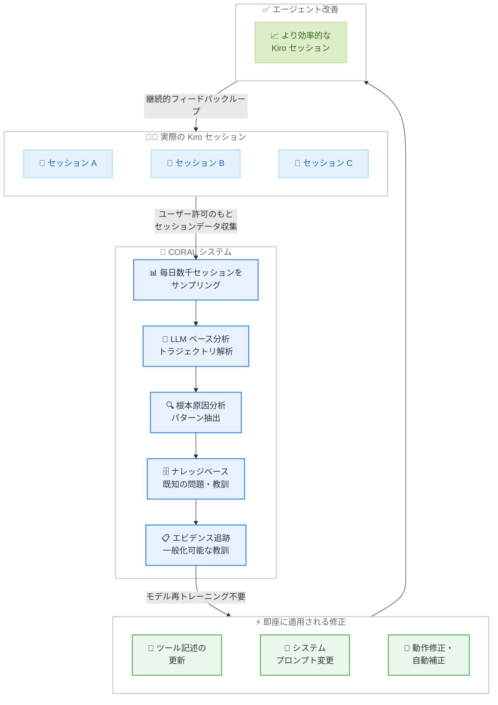

# Kiro - CORAL による AI コーディングエージェントの隠れた非効率性の発見と改善

**リリース日**: 2026 年 2 月 23 日
**サービス**: Kiro
**機能**: CORAL - Continual Optimization via Reasoning and Adaptive Learning

📊 [このアップデートのインフォグラフィックを見る](https://takech9203.github.io/aws-news-summary/20260223-kiro-hidden-inefficiencies-ai-coding.html)

## 概要

Kiro が CORAL (Continual Optimization via Reasoning and Adaptive Learning) に関する技術ブログを公開した。CORAL は、AI コーディングエージェントの隠れた非効率性を発見し修正するための内部システムである。従来のベンチマークでは「合格/不合格」のバイナリ評価しかできず、タスクが合格しても背後でエージェントが無駄なターンを繰り返している問題を検出できなかった。

CORAL はトラジェクトリベース学習というアプローチを採用している。コードがコンパイルできたかどうかだけでなく、エージェントが取ったすべてのアクション (ツール呼び出し、判断ポイント、リカバリー試行) の完全なシーケンスを分析する。チェスプレイヤーが試合後にゲームを振り返るように、各セッションで「どこでテンポを失ったか」「どのパターンがミスにつながったか」「次回は何を変えるべきか」を自動的かつ大規模に分析する。

**アップデート前の課題**

- ベンチマークは合格/不合格のバイナリ評価のみで、エージェントの非効率性を検出できなかった
- エージェントが壊れたパターンで無駄なターンを消費しても、最終的にタスクが完了すれば問題として認識されなかった
- ツール記述の微細な不整合がエージェントの動作に与える影響を体系的に把握する手段がなかった
- 改善にはモデルの再トレーニングが必要と考えられており、迅速な修正が困難だった
- grep 検索の 26.1% がサイレントに失敗し、約 23% のセッションに影響していた
- シェルコマンドの 3.46% が `cd` パターンの使用で失敗し、18% のセッションに影響していた

**アップデート後の改善**

- 毎日数千の実際の Kiro セッションをサンプリングし、LLM ベースの分析で根本原因を特定
- トラジェクトリベースの評価により、タスク完了だけでなくプロセスの効率性も計測可能に
- ツール記述の更新、システムプロンプトの変更、動作修正、自動補正など、モデル再トレーニング不要で即座に修正を適用
- grep 検索パターンの不正率を 26.1% から 0.3% に改善 (約 99% 削減)
- `cd` コマンドの自動補正により、シェルコマンド失敗率をほぼ 0% に改善

## アーキテクチャ図

CORAL は継続的なフィードバックループとして機能する。実際の Kiro セッションからデータを収集し、LLM ベースの分析で非効率性の根本原因を特定し、ナレッジベースと照合した上で、ツール記述やシステムプロンプトの修正を即座に適用する。修正されたエージェントがより効率的なセッションを生み出し、そのデータが再び CORAL に入力されるという循環的な改善プロセスである。

## サービスアップデートの詳細

### CORAL システムの概要

CORAL (Continual Optimization via Reasoning and Adaptive Learning) は、Kiro の AI コーディングエージェントを本番環境レベルで継続的に最適化するための内部システムである。

### ベンチマークの限界

従来の AI コーディングエージェント評価は、合格率、トークン数、レイテンシーなどのメトリクスに依存していた。これらのメトリクスは「何が起きたか」は示すが「なぜ起きたか」は示さず、改善方法も示さない。

- タスクが「合格」しても、エージェントが壊れた検索パターンで無駄なターンを消費している可能性がある
- モデルの弱さではなく、ツール記述の誤解が原因でタスクが失敗することがある
- 毎日数千のエージェントインタラクションを処理する場合、手動レビューはスケールしない

### トラジェクトリベース学習

CORAL の核心は、コードがコンパイルできたかどうかだけでなく、エージェントが取ったアクションの完全なシーケンス (トラジェクトリ) を分析することである。

- すべてのツール呼び出しを記録・分析
- すべての判断ポイントを評価
- すべてのリカバリー試行を追跡
- 5 つのクリーンなステップで完了するタスクと、17 の無駄なステップを経るタスクを明確に区別

### CORAL の動作プロセス

1. **セッションサンプリング**: ユーザーの許可のもと、毎日数千の実際の Kiro セッションをサンプリング
2. **LLM ベース分析**: 各トラジェクトリについて、エージェントが何をしたか、何が問題だったか (あるいは正しかったか)、なぜそうなったかを LLM が分析
3. **根本原因分析**: 表面レベルの結果 (検索結果なし) だけでなく、アクションの完全なシーケンスをトレースし、一般化可能な教訓を抽出
4. **ナレッジベース照合**: 新しい知見かどうか、十分に具体的か、既存の知見と矛盾しないかを検証。ナレッジベースはカテゴリ (ツール使用、ワークフローパターン、エラーリカバリー、動作ガイダンス) ごとに整理
5. **エビデンス追跡**: 同じパターンが多くのトラジェクトリで出現すれば信頼度が上昇し、問題を引き起こす知見は修正または削除。ナレッジベースは静的ではなく進化する
6. **修正の即時適用**: ツール記述の更新、システムプロンプトの変更、動作修正を即座に適用。モデルの再トレーニングは不要

### 発見事例 1: サイレント検索失敗

CORAL が発見した最も影響の大きい問題の 1 つが、grep 検索のサイレント失敗である。

- **問題**: エージェントが `*.py` のようなパターンでファイルを検索し、結果がゼロになる。検索はツール呼び出しとして成功 (エラーなし) するため、エージェントはファイルが存在しないと判断。しかし実際にはファイルは存在していた
- **原因**: LLM は ripgrep から学習しており、`*.py` がデフォルトで再帰検索になると期待するが、Kiro の検索 API (Code-OSS ベース) は再帰マッチングに `**/*.py` を必要とする。ツール記述にこの違いが明記されていなかった
- **コスト**: grep 検索の 26.1% 以上がサイレントに失敗。約 23% のセッションに影響。検索が結果を返さないとき、エージェントは手動でファイルを読み込み、異なるクエリで再試行し、ディレクトリツリーを探索するなど、1 回の失敗あたり平均約 5 回の追加ターンを消費
- **修正**: ツール記述に 1 行を追加し、再帰検索には `**/*.py` パターンが必要であることを明記
- **結果**: 不正パターン率が 26.1% から 0.3% に低下。本番環境で不正な grep パターンを約 99% 削減

### 発見事例 2: cd コマンドトラップ

もう 1 つの重要な発見は、`cd` コマンドの使用パターンである。

- **問題**: エージェントが `cd src && npm test` のようなシェルコマンドを生成するが、すべて失敗する。Kiro の `executeBash` ツールは各コマンドをワークスペースルートから実行し、入力バリデーションで `cd` の使用を拒否する。ツールはこの目的のために `cwd` パラメータを提供しているが、エージェントはそれを使用しない
- **原因**: `cd dir && command` はシェルスクリプトで最も一般的なパターンの 1 つであり、LLM はトレーニングデータでこのパターンを何百万回も学習している。`cwd` パラメータのアプローチは馴染みがないため、エージェントは「筋肉記憶」に頼ってしまう
- **コスト**: 全シェルコール呼び出しの 3.46% がこのパターンを使用し、18% のセッションに影響。すべての試行が失敗し、エージェントは平均 2.7 ターンをリカバリーに消費。コマンドの再試行、代替手段の探索を行い、セッション内で完全に回復できないケースもあった
- **修正**: 単にプロンプトで制限を強調するのではなく、自動補正を構築。エージェントが `cd src && npm test` を送信すると、Kiro がこれを `cwd: "src"` パラメータ付きの `npm test` に自動変換。実行後、正しいパターンを使用するよう穏やかなリマインダーを表示
- **予測効果**: `cd` 違反の失敗率が 100% からほぼ 0% に改善。影響を受けるセッション割合が 18% からほぼ 0% に改善

### 調査中のパターン

CORAL は大きな改善だけでなく、累積的に影響する小さなパターンも継続的に検出している。

#### ツールインタラクションパターン

- **フォーマッター適用後のコンテンツドリフト**: エージェントがファイルを編集した後、Prettier や Black などのフォーマッターが空白や構造を変更する。エージェントの次の編集はファイルが書き込んだ時の状態を前提とするが、実際にはフォーマッターによって変更されている。これにより「oldStr not found」の繰り返し失敗が発生する。自動フォーマットされた可能性のあるファイルの修正箇所を再読み込みさせる方法を検討中
- **散発的なマルチファイル編集**: 変更が複数ファイルにまたがる場合、直接編集に入るエージェントは他ファイルの関連コードを見逃すことが多い。まずコードベース全体で変更箇所をマッピングしてから編集するエージェントの方が、より完全で一貫性のある結果を出す。「まずマッピング、次に編集」パターンを促進する方法を検討中

#### コミュニケーションパターン

- **承認のデッドエンド**: エージェントがリクエストに対して「了解しました」「わかりました」と応答するだけで何もしないトラジェクトリを検出。ユーザーが再度プロンプトしないと実際の作業が始まらない。承認だけでなく即座に行動するよう動作ガイダンスを検討中
- **曖昧さの税金**: 曖昧なリクエストに対してエージェントが推測で作業を進め、誤ったものを構築してやり直すケースがある。事前に 1 つの質問をするだけで複数ターンの無駄を節約できる。いつ、どのように明確化を求めるかの判断ガイダンスを調査中

### 複合効果

個々の修正は小さい (ツール記述の 1 行、動作のナッジ、自動補正) が、ユーザーにとっては複合的な効果を持つ。最初の試行で正しいファイルを見つける検索、失敗せずに動作するシェルコマンド、無駄なターンの削減は、より速い結果とエージェントの効率的な動作につながる。

従来の評価は合格したタスクを見てそのまま先に進む。CORAL は完了したタスクが 17 ターンかかり壊れた検索パターンを含んでいることを検出し、次回は 5 ターンで完了する方法を探る。

## 技術仕様

### CORAL のメトリクス改善実績

#### 発見事例 1: サイレント検索失敗

| メトリクス | 改善前 | 改善後 |
|-----------|--------|--------|
| grep 検索の不正パターン率 | 26.1% | 0.3% |
| 影響を受けるセッション | 約 23% | 0.3% 未満 |
| 検索失敗時の追加ターン数 | 約 5 ターン/失敗 | ほぼ 0 |

#### 発見事例 2: cd コマンドトラップ

| メトリクス | 改善前 | 改善後 (予測) |
|-----------|--------|-------------|
| cd 違反の失敗率 | 100% | ほぼ 0% (自動補正) |
| 影響を受けるセッション | 18% | ほぼ 0% |
| 全シェルコール呼び出しに占める cd パターン | 3.46% | - |
| リカバリーに消費する平均ターン数 | 2.7 ターン | ほぼ 0 |

### CORAL システムの特徴

| 項目 | 詳細 |
|------|------|
| データ収集方式 | ユーザー許可のもと毎日数千セッションをサンプリング |
| 分析手法 | LLM ベースの根本原因分析 |
| 評価方式 | トラジェクトリベース (アクションの完全シーケンスを分析) |
| 修正方法 | ツール記述更新、システムプロンプト変更、動作修正、自動補正 |
| モデル再トレーニング | 不要 |
| 修正適用速度 | 即時 |
| ナレッジベース | カテゴリ別に整理、エビデンス追跡、動的に進化 |
| プライバシー | オプトアウト可能。エンタープライズユーザーはデフォルトでオプトアウト |

## メリット

### ビジネス面

- **継続的改善**: 本番環境のデータに基づく継続的な最適化により、Kiro ユーザーのコーディング体験が日々向上する。先月の Kiro より今月の Kiro の方が優れており、ユーザーが何もしなくても改善が続く
- **迅速な問題解決**: モデルの再トレーニングなしに修正を即座に適用できるため、問題発見から解決までのサイクルが短い
- **データ駆動の品質管理**: 推測ではなく、実際のセッションデータに基づいて改善の優先順位を決定
- **ユーザーフィードバックの活用**: ユーザーが提案へのフィードバック、問題の報告、違和感の指摘を行うと、その信号が CORAL の学習システムに入力される

### 技術面

- **トラジェクトリベース評価**: 合格/不合格のバイナリ評価を超えて、エージェントのプロセス効率を定量的に計測
- **モデル再トレーニング不要**: ツール記述やシステムプロンプトの変更で対応するため、再トレーニングのコストと時間を節約
- **一般化可能な教訓の抽出**: 個別の問題から広範囲に適用可能なパターンを特定し、体系的に改善
- **エビデンスベースの改善**: ナレッジベースとエビデンス追跡により、修正の根拠と効果を明確に管理
- **自動補正機能**: `cd` コマンドの例のように、単にエラーを返すのではなく、エージェントの意図を解釈して正しい形式に自動変換する仕組みを構築

## デメリット・制約事項

- **プライバシーの考慮**: セッションデータの分析にはユーザーの許可が必要。エンタープライズユーザーはデフォルトでオプトアウトされているため、エンタープライズ固有のパターンが分析対象から外れる可能性がある
- **一般化の限界**: 特定のプロジェクトや言語に固有の非効率性パターンは、一般化可能な教訓として抽出しにくい場合がある
- **修正の副作用**: ある非効率性の修正が別のワークフローに予期しない影響を与える可能性がある。ナレッジベースの知見が問題を引き起こす場合は修正または削除される

## ユースケース

### ユースケース 1: ファイル検索の効率化

**シナリオ**: 開発者が Kiro を使用してプロジェクト内のファイルを検索する際、エージェントが正しい検索パターンを最初から使用することで、無駄なリトライが発生しない

**効果**: CORAL による修正前は、grep 検索の 26.1% がサイレントに失敗し、1 回の失敗あたり約 5 回の追加ターンを消費していた。修正後は不正パターン率が 0.3% に低下し、検索タスクの完了が大幅に高速化

### ユースケース 2: シェルコマンドの確実な実行

**シナリオ**: 開発者が Kiro にテスト実行やビルドなどのシェルコマンドの実行を依頼する際、エージェントがワーキングディレクトリを正しく指定してコマンドを実行する

**効果**: CORAL による自動補正の導入前は、全シェルコマンドの 3.46% が `cd` パターンの使用で失敗し、18% のセッションに影響していた。自動補正により、エージェントの意図が正しく解釈され、コマンドが確実に実行される

### ユースケース 3: マルチファイル変更の一貫性

**シナリオ**: 開発者がフィーチャーリクエストで複数ファイルにわたるコード変更を依頼する際、エージェントがまず変更箇所をマッピングしてから編集に入る

**効果**: CORAL が「まずマッピング、次に編集」パターンの有効性を検出し、このパターンを促進する方向で最適化を進めている。これにより、散発的な編集による見落としや不整合が減少する方向

## 利用可能リージョン

グローバル

## 関連サービス・機能

- **Kiro IDE**: AI 搭載統合開発環境。CORAL はその品質改善を支える内部システム
- **Kiro CLI**: コマンドラインインターフェース。CORAL の改善はすべての Kiro インターフェースに適用される
- **Amazon Bedrock**: AWS が提供する基盤モデルサービス。AI エージェントの構築基盤として関連
- **AI コーディングエージェント**: GitHub Copilot、Cursor、Claude Code など、AI を活用したコーディング支援ツール全般。CORAL のアプローチは業界全体の品質改善手法として参考になる

## 参考リンク

- 📊 [インフォグラフィック](https://takech9203.github.io/aws-news-summary/20260223-kiro-hidden-inefficiencies-ai-coding.html)
- [Kiro Blog - The hidden inefficiencies in AI coding](https://kiro.dev/blog/hidden-inefficiencies-ai-coding/)
- [Kiro](https://kiro.dev/)
- [Kiro ドキュメント](https://kiro.dev/docs/)

## まとめ

Kiro の CORAL (Continual Optimization via Reasoning and Adaptive Learning) は、AI コーディングエージェントの品質改善に対する革新的なアプローチである。従来のベンチマークでは見逃されていた非効率性を、トラジェクトリベースの分析で検出し、モデルの再トレーニングなしに即座に修正を適用する。grep 検索パターンの不正率を 26.1% から 0.3% に改善した事例では、ツール記述の 1 行の変更がエージェント全体の効率に大きな影響を与えることを示している。`cd` コマンドトラップの自動補正は、18% のセッションに影響する問題をほぼ 0% に改善する見込みである。さらに、フォーマッター適用後のコンテンツドリフト、散発的なマルチファイル編集、承認のデッドエンド、曖昧さの税金など、新たなパターンも継続的に発見・対応されている。CORAL の継続的フィードバックループにより、Kiro は毎週新しいパターンを発見し、ユーザーのコーディング体験を日々改善し続けている。
