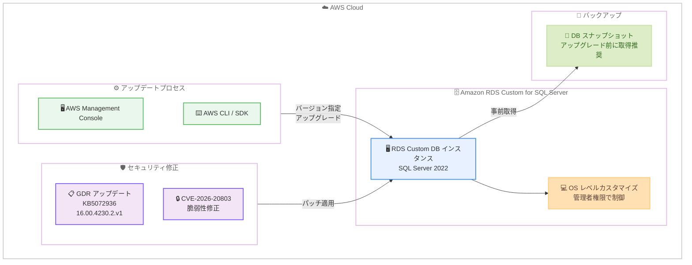

# Amazon RDS Custom - Microsoft SQL Server の最新 GDR アップデートをサポート

**リリース日**: 2026 年 2 月 24 日
**サービス**: Amazon RDS Custom for SQL Server
**機能**: SQL Server 2022 累積更新プログラムおよび GDR セキュリティアップデート (KB5072936)

📊 [このアップデートのインフォグラフィックを見る](https://takech9203.github.io/aws-news-summary/20260224-amazon-rds-custom-supports-latest-gdr-updates-for-microsoft-sql-server.html)

## 概要

Amazon RDS Custom for SQL Server が、Microsoft SQL Server の最新の一般配布リリース (GDR) アップデートのサポートを開始しました。このリリースには、SQL Server 2022 の累積更新プログラムおよび KB5072936 (16.00.4230.2.v1) が含まれており、セキュリティ脆弱性 CVE-2026-20803 に対処する GDR アップデートが提供されています。

AWS は、Amazon RDS Management Console、AWS SDK、または CLI を使用して、データベースインスタンスをアップグレードし、このアップデートを適用することを推奨しています。

**アップデート前の課題**

- セキュリティ脆弱性 CVE-2026-20803 が存在し、SQL Server インスタンスが攻撃にさらされるリスクがあった
- RDS Custom for SQL Server で最新の GDR セキュリティパッチが適用されていなかった
- 手動でセキュリティパッチを適用する場合、OS レベルのカスタマイズとの整合性を確認する必要があり、運用負荷が高かった

**アップデート後の改善**

- CVE-2026-20803 のセキュリティ脆弱性が修正され、SQL Server インスタンスのセキュリティが向上
- AWS Management Console、SDK、CLI から簡単にアップグレードでき、運用負荷を削減
- RDS Custom では、OS レベルのカスタマイズを維持しながら、セキュリティアップデートを適用可能

## アーキテクチャ図



AWS Management Console または AWS CLI/SDK を使用して RDS Custom for SQL Server インスタンスに GDR アップデート (KB5072936) を適用します。アップグレード前にスナップショットを取得し、OS レベルのカスタマイズを維持しながらセキュリティパッチを適用できます。

## サービスアップデートの詳細

### 主要機能

1. **セキュリティ脆弱性 CVE-2026-20803 の修正**
   - GDR アップデートにより CVE-2026-20803 の脆弱性に対処
   - Microsoft のセキュリティ勧告に従ったセキュリティパッチを提供
   - 既知の攻撃ベクトルから SQL Server インスタンスを保護

2. **SQL Server 2022 累積更新プログラムのサポート**
   - KB5072936 (ビルド番号 16.00.4230.2.v1) を RDS Custom for SQL Server で利用可能
   - バグ修正、パフォーマンス改善、セキュリティ修正を含む
   - Microsoft が推奨する最新の安定バージョン

3. **簡単なアップグレードプロセス**
   - AWS Management Console から数クリックでアップグレード可能
   - AWS CLI/SDK を使用した自動化されたアップグレードをサポート
   - メンテナンスウィンドウ中の自動アップグレード設定にも対応

4. **RDS Custom での柔軟性**
   - OS レベルのカスタマイズを維持しながら、DB エンジンをアップグレード
   - 管理者権限での詳細な制御を保持
   - レガシーアプリケーションとの互換性を維持

## 技術仕様

### サポートされるバージョン

| SQL Server バージョン | CU/GDR | KB 番号 | RDS バージョン |
|----------------------|--------|---------|---------------|
| SQL Server 2022 | 累積更新プログラム + GDR | KB5072936 | 16.00.4230.2.v1 |

### セキュリティ脆弱性 CVE-2026-20803

**CVE ID**: CVE-2026-20803
**影響を受ける製品**: Microsoft SQL Server
**対策**: GDR アップデート (KB5072936) を適用してパッチを適用

CVE-2026-20803 は Microsoft SQL Server に影響するセキュリティ脆弱性であり、GDR アップデートの適用により修正されます。詳細については、Microsoft のセキュリティアドバイザリと [KB5072936](https://support.microsoft.com/help/5072936) を参照してください。

### アップグレード方法

```bash
# AWS CLI を使用した RDS Custom インスタンスのアップグレード
aws rds modify-db-instance \
  --db-instance-identifier mycustominstance \
  --engine-version 16.00.4230.2.v1 \
  --apply-immediately
```

## 設定方法

### 前提条件

1. Amazon RDS Custom for SQL Server のインスタンスが稼働している
2. AWS Management Console へのアクセス権限、または AWS CLI/SDK の設定
3. アップグレード前のバックアップ (推奨)

### 手順

#### ステップ 1: バックアップの作成

```bash
# 手動スナップショットを作成
aws rds create-db-snapshot \
  --db-instance-identifier mycustominstance \
  --db-snapshot-identifier mycustominstance-pre-gdr-snapshot
```

アップグレード前に、データベースの手動スナップショットを作成します。万が一の場合に備えたロールバック手段を確保します。

#### ステップ 2: AWS Management Console からアップグレード

1. AWS Management Console を開き、Amazon RDS サービスに移動
2. ナビゲーションペインで「データベース」を選択
3. アップグレードする RDS Custom データベースインスタンスを選択
4. 「変更」ボタンをクリック
5. 「DB エンジンのバージョン」セクションで、`16.00.4230.2.v1` を選択
6. 「すぐに適用」または「次のメンテナンスウィンドウ中に適用」を選択
7. 「データベースの変更」をクリック

AWS Management Console を使用して、数クリックでアップグレードを実行します。

#### ステップ 3: アップグレードの確認

```bash
# アップグレードの進行状況を確認
aws rds describe-db-instances \
  --db-instance-identifier mycustominstance \
  --query 'DBInstances[0].[EngineVersion,DBInstanceStatus]'

# 接続してバージョンを確認
sqlcmd -S mycustominstance.xxxxxx.region.rds.amazonaws.com -U admin -P password -Q "SELECT @@VERSION"
```

アップグレードが完了したら、データベースに接続してバージョンを確認し、アプリケーションが正常に動作することをテストします。

#### ステップ 4: アプリケーションのテスト

```sql
-- アプリケーションの主要な機能をテスト
SELECT TOP 10 * FROM YourTable;

-- エラーログを確認
EXEC sp_readerrorlog;
```

アップグレード後、アプリケーションの主要な機能をテストし、エラーログを確認して、問題がないことを確認します。

## メリット

### ビジネス面

- **セキュリティリスクの軽減**: CVE-2026-20803 の脆弱性を修正し、データ侵害のリスクを削減
- **コンプライアンスの維持**: 最新のセキュリティパッチを適用することで、業界標準とコンプライアンス要件を満たす
- **ビジネス継続性**: 安定した最新バージョンにより、予期しないダウンタイムを防止

### 技術面

- **セキュリティ強化**: GDR アップデートにより、既知のセキュリティ脆弱性を修正
- **バグ修正**: 累積更新プログラムに含まれるバグ修正で、システムの安定性が向上
- **簡単な管理**: AWS Management Console または CLI から簡単にアップグレード可能
- **RDS Custom の柔軟性**: OS レベルのカスタマイズを維持しながら、DB エンジンをアップグレード

## デメリット・制約事項

### 制限事項

- アップグレード中は、データベースインスタンスが一時的に利用不可になる
- ダウングレードは直接サポートされていない (スナップショットからの復元が必要)
- RDS Custom for SQL Server のみが対象 (RDS for SQL Server は別途アナウンスを参照)

### 考慮すべき点

- アップグレード前に、テスト環境で互換性を確認することを推奨
- ビジネスに影響の少ない時間帯 (メンテナンスウィンドウ) にアップグレードを計画
- アップグレード後にクエリプランが変更される可能性があるため、パフォーマンスの監視を推奨
- RDS Custom の場合、OS レベルのカスタマイズが DB エンジンのアップグレードに影響を与えないか確認

## ユースケース

### ユースケース 1: 本番環境のセキュリティ強化

**シナリオ**: RDS Custom for SQL Server を使用する本番環境で、CVE-2026-20803 のセキュリティ脆弱性に対処する必要がある。

**実装例**:
```bash
# 1. 手動スナップショットを作成
aws rds create-db-snapshot \
  --db-instance-identifier prod-custom-sqlserver \
  --db-snapshot-identifier prod-custom-sqlserver-pre-gdr

# 2. メンテナンスウィンドウ中にアップグレード
aws rds modify-db-instance \
  --db-instance-identifier prod-custom-sqlserver \
  --engine-version 16.00.4230.2.v1 \
  --no-apply-immediately
```

**効果**: メンテナンスウィンドウ中にセキュリティパッチが適用され、ビジネスへの影響を最小限に抑えながら、CVE-2026-20803 のセキュリティリスクを軽減します。

### ユースケース 2: RDS Custom でのレガシーアプリケーション対応

**シナリオ**: RDS Custom for SQL Server を使用しており、OS レベルでカスタマイズを行っているレガシーアプリケーションがある。セキュリティアップデートを適用しつつ、カスタマイズを維持したい。

**実装例**:
```bash
# RDS Custom インスタンスをアップグレード
aws rds modify-db-instance \
  --db-instance-identifier custom-sqlserver \
  --engine-version 16.00.4230.2.v1 \
  --apply-immediately

# アップグレード後、OS レベルのカスタマイズを確認
# RDS Custom では、OS へのアクセスが可能
```

**効果**: OS レベルのカスタマイズ (特定のドライバ、レジストリ設定、サードパーティツールなど) を維持しながら、DB エンジンのセキュリティパッチを適用できます。レガシーアプリケーションの互換性を保ちつつ、セキュリティを強化します。

### ユースケース 3: 開発環境での事前検証

**シナリオ**: GDR アップデートを本番環境に適用する前に、開発環境で互換性を検証したい。

**実装例**:
```bash
# 開発環境を即座にアップグレード
aws rds modify-db-instance \
  --db-instance-identifier dev-custom-sqlserver \
  --engine-version 16.00.4230.2.v1 \
  --apply-immediately

# アプリケーションのテストスイートを実行
# 互換性の問題がないか確認
```

**効果**: 開発環境で事前にアップグレードを検証し、アプリケーションの互換性やパフォーマンスへの影響を本番適用前に確認できます。

## 料金

SQL Server のバージョンアップグレード自体に追加料金はかかりません。Amazon RDS Custom for SQL Server の標準的な料金体系が適用されます。

| 項目 | 説明 |
|------|------|
| インスタンス時間 | DB インスタンスの稼働時間に基づいて課金 |
| ストレージ | プロビジョニングされたストレージ容量に基づいて課金 |
| バックアップ | 自動バックアップと手動スナップショットのストレージに対して課金 |
| データ転送 | リージョン間のデータ転送に対して課金 |

詳細な料金については、[Amazon RDS Custom 料金ページ](https://aws.amazon.com/rds/custom/) を参照してください。

## 利用可能リージョン

Amazon RDS Custom for SQL Server が利用可能なすべての AWS リージョンで提供されています。

## 関連サービス・機能

- **Amazon RDS Automated Backups**: アップグレード前に自動バックアップを作成し、万が一の場合に復元
- **Amazon RDS Performance Insights**: アップグレード後のパフォーマンスを監視し、クエリプランの変更を確認
- **Amazon CloudWatch**: RDS インスタンスのメトリクスを監視し、アップグレード後の動作を確認
- **Amazon RDS for SQL Server**: RDS Custom ではなく、フルマネージド型の RDS for SQL Server で同様の GDR アップデートを適用可能

## 参考リンク

- 📊 [インフォグラフィック](https://takech9203.github.io/aws-news-summary/20260224-amazon-rds-custom-supports-latest-gdr-updates-for-microsoft-sql-server.html)
- [公式発表 (What's New)](https://aws.amazon.com/about-aws/whats-new/2026/02/amazon-rds-custom-supports-latest-gdr-updates-for-microsoft-sql-server/)
- [ドキュメント: Upgrading RDS Custom for SQL Server](https://docs.aws.amazon.com/AmazonRDS/latest/UserGuide/custom-upgrading-sqlserver.html)
- [Microsoft KB5072936](https://support.microsoft.com/help/5072936)
- [Amazon RDS Custom ページ](https://aws.amazon.com/rds/custom/)

## まとめ

Amazon RDS Custom for SQL Server が最新の GDR アップデートのサポートを開始し、セキュリティ脆弱性 CVE-2026-20803 に対処する KB5072936 (16.00.4230.2.v1) を提供しています。このアップデートは、SQL Server 2022 の累積更新プログラムと GDR セキュリティ修正を含んでおり、すべての RDS Custom for SQL Server ユーザーにアップグレードが推奨されます。AWS Management Console、SDK、CLI から簡単にアップグレードでき、RDS Custom の特長である OS レベルのカスタマイズを維持しながらセキュリティを強化できます。アップグレード前には、必ずバックアップを作成し、テスト環境で互換性を確認してください。
