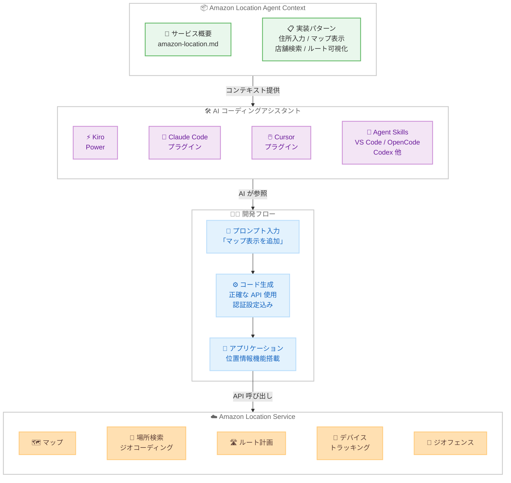

# Amazon Location Service - LLM コンテキストを Kiro Power および Claude Code プラグインとして提供開始

**リリース日**: 2026 年 2 月 25 日
**サービス**: Amazon Location Service
**機能**: AI エージェント向け LLM コンテキスト (Kiro Power / Claude Code プラグイン / Agent Skills)

📊 [このアップデートのインフォグラフィックを見る](https://takech9203.github.io/aws-news-summary/20260225-amazon-location-service-introduces-kiro-power-claude-skill-llm-context.html)

## 概要

Amazon Location Service が、キュレーション済みの AI エージェントコンテキストを Kiro Power、Claude Code プラグイン、およびオープンな Agent Skills フォーマットのエージェントスキルとして提供開始しました。開発者はこのコンテキストを Kiro、Claude Code、Cursor などの AI コーディングアシスタントで利用することで、コードの正確性向上、機能実装の高速化、反復作業の時間短縮を実現できます。

このコンテキストパッケージには、位置情報ベースの一般的なソリューション向けに事前検証された実装パターンが含まれています。具体的には、配送アプリ向けの住所入力フォーム、マップ表示、最寄り店舗検索、ルート可視化などのパターンが提供されます。LLM に適切なコンテキストを提供することで、ハルシネーション (AI の誤った情報生成) を削減し、結果の正確性を向上させることができます。また、モデルの知識カットオフによる品質低下も防止できます。

Amazon Location Service は、マップ、場所検索とジオコーディング、ルート計画、デバイストラッキング、ジオフェンシングなどの地理空間データと位置情報機能を提供するフルマネージドサービスです。

**アップデート前の課題**

- AI コーディングアシスタントで Amazon Location Service の API を使用する際、正確なコード生成が困難だった
- LLM の知識カットオフにより、最新の API 仕様やベストプラクティスが反映されなかった
- 位置情報機能の実装パターンを手動で調査し、コードに組み込む必要があった
- 認証設定や SDK 統合の手順を毎回確認する必要があった

**アップデート後の改善**

- Kiro Power としてワンクリックでインストール可能。MCP サーバーの手動設定が不要に
- Claude Code および Cursor ではプラグインとしてインストール可能。MCP 設定が自動的に含まれる
- オープンな Agent Skills フォーマットにより、VS Code (GitHub Copilot)、OpenCode、Codex など多数のエージェントで利用可能
- 事前検証された実装パターンにより、コードの正確性が向上し、開発時間が短縮

## アーキテクチャ図



この図は、Amazon Location Agent Context がキュレーション済みのコンテキストと実装パターンを各種 AI コーディングアシスタントに提供し、開発者が正確な位置情報機能コードを生成してアプリケーションを構築するまでの流れを示しています。

## サービスアップデートの詳細

### 主要機能

1. **Kiro Power としてのインストール**
   - Kiro IDE および Web インターフェースからワンクリックでインストール可能
   - 「location」「maps」「geocoding」「routing」「places」「geofencing」「tracking」などのキーワードをプロンプトに含めると自動的にアクティベート
   - MCP サーバーの手動設定が不要

2. **Claude Code / Cursor プラグイン**
   - Agent Plugins for AWS マーケットプレイスからインストール可能
   - MCP 設定が自動的に含まれる
   - Claude Code では CLI コマンド、Cursor では Marketplace からインストール

3. **オープンな Agent Skills フォーマット**
   - Agent Skills オープンスタンダードに対応した互換エージェントで利用可能
   - VS Code (GitHub Copilot)、OpenCode、Codex、Antigravity など多数のエージェントをサポート
   - `npx skills add` コマンドで簡単にインストール

4. **事前検証された実装パターン**
   - 配送アプリ向け住所入力フォーム
   - マップ表示と対話機能
   - 最寄り店舗検索
   - ルート可視化
   - 認証設定と SDK 統合のベストプラクティス

### インストール方法の比較

| AI ツール | インストール方法 | MCP 設定 | 備考 |
|----------|----------------|---------|------|
| Kiro | Power としてワンクリック | 自動 | キーワードで自動アクティベート |
| Claude Code | プラグイン CLI コマンド | 自動 | Agent Plugins for AWS から |
| Cursor | Marketplace からインストール | 自動 | Cursor Settings から設定 |
| VS Code | Agent Skills CLI | 手動設定推奨 | GitHub Copilot 対応 |
| OpenCode | Agent Skills CLI | 手動設定推奨 | skills add コマンド |
| Codex | Agent Skills CLI | 手動設定推奨 | skills add コマンド |
| その他 | コンテキストファイル直接読み込み | 手動設定必要 | GitHub から取得 |

## 技術仕様

### コンテキストパッケージの構成

| ファイル | 説明 |
|---------|------|
| `context/amazon-location.md` | サービス概要。最初に読み込むメインコンテキスト |
| `context/additional/` | タスクに応じて追加読み込みする詳細コンテキスト |

### LLM コンテキストの効果

| 項目 | コンテキストなし | コンテキストあり |
|------|----------------|----------------|
| API 使用の正確性 | モデルの知識に依存 | 最新の仕様に基づく正確なコード |
| ハルシネーション | 発生しやすい | 大幅に削減 |
| 実装パターン | 手動調査が必要 | 事前検証済みパターンを提供 |
| 認証設定 | 試行錯誤が多い | ベストプラクティスに従った設定 |
| SDK 統合 | バージョン不一致のリスク | 正しい SDK バージョンと統合手順 |

### Agent Skills フォーマット

Agent Skills はオープンスタンダードであり、AI コーディングエージェントにコンテキストとツールを提供するための統一的な仕組みです。

```bash
# Agent Skills CLI によるインストール
npx skills add aws-geospatial/amazon-location-agent-context

# 特定のエージェントに直接インストール
npx skills add aws-geospatial/amazon-location-agent-context -a vscode
npx skills add aws-geospatial/amazon-location-agent-context -a opencode
npx skills add aws-geospatial/amazon-location-agent-context -a codex
```

## 設定方法

### 前提条件

1. 対応する AI コーディングアシスタントがインストールされていること
2. Amazon Location Service の API を使用するアプリケーションを開発していること
3. AWS アカウントと適切な IAM 権限があること (実際の API 呼び出しに必要)

### 手順

#### Kiro ユーザーの場合

##### ステップ 1: Power のインストール

以下のいずれかの方法でインストールします。

- [Kiro Power インストールリンク](https://kiro.dev/launch/powers/amazon-location-service) からワンクリックでインストール
- Kiro IDE を開き、**Powers** パネルの **Available** タブで「Build geospatial applications with Amazon Location Service」を検索してインストール

##### ステップ 2: コンテキストの利用

プロンプトに「location」「maps」「geocoding」「routing」「places」「geofencing」「tracking」などのキーワードを含めると、Power が自動的にアクティベートされます。

```
「アプリケーションに Amazon Location Service のマップ表示を追加してください」
```

Spec モードを使用する場合は、Spec プロンプトに「use the Amazon Location Service power」を含めてください。

#### Claude Code ユーザーの場合

##### ステップ 1: マーケットプレイスの追加とプラグインのインストール

```bash
# マーケットプレイスを追加
/plugin marketplace add awslabs/agent-plugins

# プラグインをインストール
/plugin install amazon-location-service@agent-plugins-for-aws
```

##### ステップ 2: コンテキストの利用

プラグインがインストールされると、位置情報関連のタスクで自動的にコンテキストが参照されます。MCP 設定もプラグインに含まれています。

#### Cursor ユーザーの場合

##### ステップ 1: プラグインのインストール

1. Cursor Settings を開く
2. **Plugins** に移動
3. **AWS** を検索
4. **amazon-location-service** プラグインを選択し、**Add to Cursor** を選択
5. インストールされたプラグインのスコープを選択

##### ステップ 2: コンテキストの利用

プラグインが **Plugins** > **Installed** に表示されていることを確認し、位置情報関連のプロンプトを入力します。

#### Agent Skills 対応エージェントの場合

```bash
# インタラクティブインストール
npx skills add aws-geospatial/amazon-location-agent-context

# エージェントとスコープを選択
# ? Select an agent: Claude Code / Cursor / VS Code / OpenCode / Codex / Antigravity
# ? Select a scope: Project / Global
```

#### コンテキストファイルを直接使用する場合

1. [amazon-location-agent-context](https://github.com/aws-geospatial/amazon-location-agent-context) リポジトリから `context/amazon-location.md` を取得してサービス概要として読み込む
2. タスクに応じて `context/additional/` ディレクトリから必要なファイルを追加読み込み
3. フル機能を利用するには [AWS MCP Server](https://docs.aws.amazon.com/aws-mcp/latest/userguide/what-is-aws-mcp-server.html) を手動で設定

## メリット

### ビジネス面

- **開発速度の向上**: 事前検証された実装パターンにより、位置情報機能の実装時間を大幅に短縮
- **品質の向上**: ハルシネーションを削減し、正確な API 使用に基づくコード生成を実現
- **導入障壁の低下**: ワンクリックインストールや CLI コマンドにより、即座に利用開始可能
- **開発者体験の向上**: 認証設定や SDK 統合のベストプラクティスが含まれており、試行錯誤を削減

### 技術面

- **コンテキストウィンドウの最適化**: 最小限のコンテキストで最大の効果を得る設計により、LLM のパフォーマンスを最適化
- **マルチツール対応**: Kiro、Claude Code、Cursor、VS Code など、主要な AI コーディングアシスタントをカバー
- **オープンスタンダード準拠**: Agent Skills フォーマットに準拠しており、互換性のある任意のエージェントで利用可能
- **最新情報の反映**: モデルの知識カットオフに関係なく、最新の API 仕様とベストプラクティスを提供

## デメリット・制約事項

### 制限事項

- コンテキストは Amazon Location Service に特化しており、他の AWS サービスとの複合的な実装パターンは限定的
- AI コーディングアシスタントの生成結果はコンテキストにより改善されるが、完全な正確性を保証するものではない
- Kiro Power としてのワンクリックインストールは Kiro IDE に限定される
- 直接コンテキスト使用の場合、AWS MCP Server の手動設定が必要

### 考慮すべき点

- 生成されたコードは本番環境にデプロイする前にレビューとテストが必要
- AWS 認証情報と IAM 権限の適切な設定は開発者の責任で行う必要がある
- Agent Skills CLI を使用する場合、Node.js 環境が必要

## ユースケース

### ユースケース 1: 配送アプリへの住所入力フォームの追加

**シナリオ**: 配送アプリケーションに Amazon Location Service を使用した住所入力フォームを追加し、住所の自動補完とジオコーディング機能を実装したい。

**実装例**:
```
「Amazon Location Service を使って、住所入力時に自動補完が効く住所フォームを追加してください。
入力された住所をジオコーディングして、緯度経度を取得してください」
```

**効果**: AI エージェントが事前検証された住所入力フォームの実装パターンを参照し、正確な API 使用と認証設定を含むコードを生成します。手動で API ドキュメントを調査する時間を削減し、実装を高速化できます。

### ユースケース 2: 最寄り店舗検索機能の実装

**シナリオ**: リテールアプリケーションで、ユーザーの現在地から最寄りの店舗を検索して表示する機能を実装したい。

**実装例**:
```
「ユーザーの現在地から最寄りの店舗を 5 件検索して、マップ上にマーカーで表示してください。
Amazon Location Service の Places API を使用してください」
```

**効果**: 最寄り店舗検索の実装パターンが参照され、場所検索 API の正しい使用方法、マップへのマーカー表示、距離計算のベストプラクティスを含むコードが生成されます。

### ユースケース 3: ルート可視化機能の追加

**シナリオ**: 物流管理アプリケーションで、出発地から目的地までのルートをマップ上に可視化し、所要時間と距離を表示したい。

**実装例**:
```
「Amazon Location Service の Routes API を使って、出発地から目的地までのルートを
マップ上にラインで表示してください。所要時間と距離も計算してください」
```

**効果**: ルート可視化の実装パターンが参照され、Routes API の正しい呼び出し方法、MapLibre GL JS を使用したルート描画、リアルタイム交通データの活用方法を含むコードが生成されます。

## 料金

Amazon Location Agent Context パッケージ自体は無料で提供されており、Kiro Power、Claude Code プラグイン、Agent Skills としてのインストールと使用に追加料金はかかりません。コンテキストファイルは [GitHub リポジトリ](https://github.com/aws-geospatial/amazon-location-agent-context) でオープンソースとして公開されています。

実際の Amazon Location Service API の呼び出しには、標準の Amazon Location Service 料金が適用されます。詳細については、[Amazon Location Service 料金ページ](https://aws.amazon.com/location/pricing/) を参照してください。

## 利用可能リージョン

Amazon Location Service は以下のリージョンで利用可能です。

- 米国東部 (オハイオ)
- 米国東部 (バージニア北部)
- 米国西部 (オレゴン)
- アジアパシフィック (マレーシア)
- アジアパシフィック (ムンバイ)
- アジアパシフィック (シンガポール)
- アジアパシフィック (シドニー)
- アジアパシフィック (東京)
- カナダ (中部)
- ヨーロッパ (フランクフルト)
- ヨーロッパ (アイルランド)
- ヨーロッパ (ロンドン)
- ヨーロッパ (スペイン)
- ヨーロッパ (ストックホルム)
- 南米 (サンパウロ)
- AWS GovCloud (米国西部)

LLM コンテキストパッケージ自体はローカルで動作するため、リージョンの制約はありません。

## 関連サービス・機能

- **Amazon Location Service**: マップ、場所検索、ルート計画、デバイストラッキング、ジオフェンシングなどの地理空間機能を提供するフルマネージドサービス
- **Kiro IDE**: AI アシスタントを内蔵した AWS の開発環境。Power エコシステムによりツールの拡張が容易
- **AWS MCP Server**: MCP 互換 IDE から AWS サービスの API 探索、実行、ドキュメントアクセスを可能にするサーバー
- **Agent Plugins for AWS**: Claude Code および Cursor 向けの AWS プラグインマーケットプレイス
- **Agent Skills**: AI コーディングエージェントにコンテキストとツールを提供するためのオープンスタンダード

## 参考リンク

- 📊 [インフォグラフィック](https://takech9203.github.io/aws-news-summary/20260225-amazon-location-service-introduces-kiro-power-claude-skill-llm-context.html)
- [公式発表 (What's New)](https://aws.amazon.com/about-aws/whats-new/2026/02/amazon-location-service-introduces-kiro-power-claude-skill-llm-context/)
- [Build with AI agents - Amazon Location Service](https://docs.aws.amazon.com/location/latest/developerguide/ai-llms.html)
- [GitHub リポジトリ - amazon-location-agent-context](https://github.com/aws-geospatial/amazon-location-agent-context)
- [Kiro Power インストール](https://kiro.dev/launch/powers/amazon-location-service)
- [Agent Plugins for AWS](https://github.com/awslabs/agent-plugins)
- [Agent Skills](https://agentskills.io)

## まとめ

Amazon Location Service が AI エージェント向けのキュレーション済みコンテキストを Kiro Power、Claude Code プラグイン、およびオープンな Agent Skills フォーマットとして提供開始しました。このコンテキストパッケージには、住所入力フォーム、マップ表示、最寄り店舗検索、ルート可視化などの事前検証された実装パターンが含まれており、AI コーディングアシスタントが位置情報機能のコードをより正確に生成できるようになります。LLM のハルシネーションを削減し、モデルの知識カットオフに関係なく最新の API 仕様を参照できるため、開発者の生産性向上に貢献します。Kiro ではワンクリックインストール、Claude Code と Cursor ではプラグインとして簡単に導入できるほか、Agent Skills フォーマットにより VS Code や OpenCode など多数のエージェントでも利用可能です。Amazon Location Service を活用した位置情報機能の開発を行う場合は、このコンテキストパッケージの導入を検討してください。
