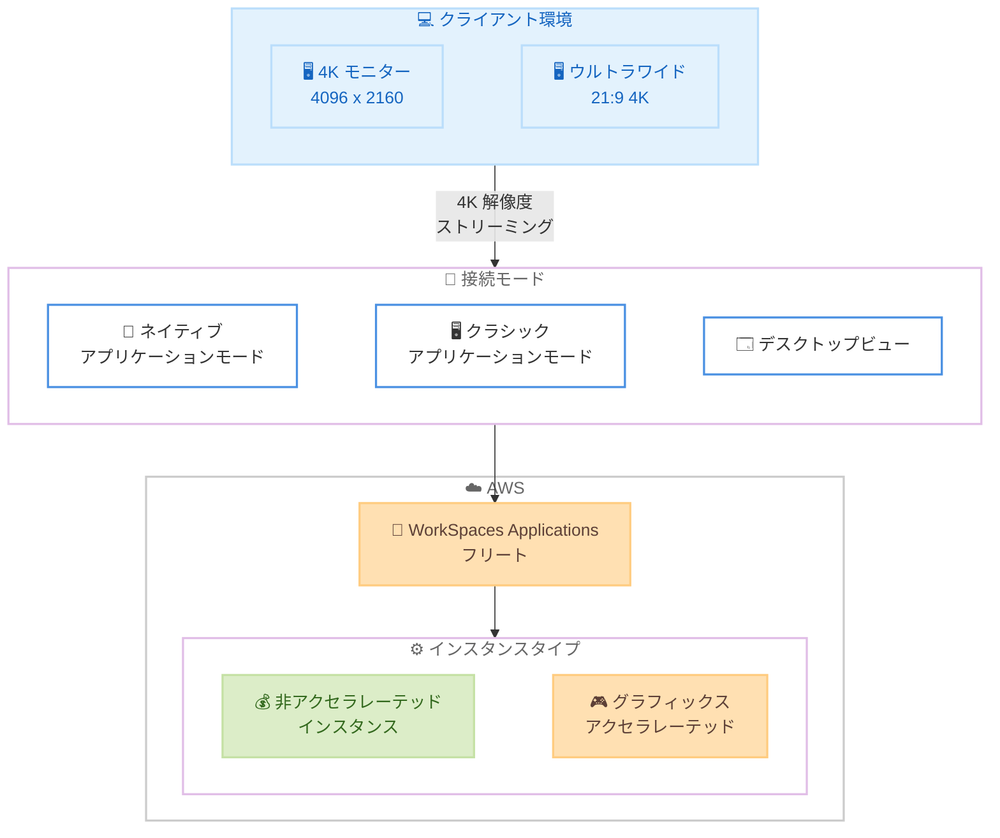

# Amazon WorkSpaces Applications - 4K 解像度サポートの拡張

**リリース日**: 2026 年 2 月 25 日
**サービス**: Amazon WorkSpaces Applications
**機能**: 非アクセラレーテッドインスタンスタイプおよび全クライアント接続モードでの 4K 解像度サポート

📊 [このアップデートのインフォグラフィックを見る](https://takech9203.github.io/aws-news-summary/20260225-amazon-workspaces-applications-4K-resolution.html)

## 概要

Amazon WorkSpaces Applications が、非アクセラレーテッドインスタンスタイプおよびすべてのクライアント接続モードで最大 4K (4096 x 2160) 解像度をサポートするようになった。これまで、高解像度モニターのサポートは WorkSpaces Applications クラシックモードのグラフィックスアクセラレーテッドインスタンスに限定されていた。今回のアップデートにより、ネイティブアプリケーションモード、クラシックアプリケーションモード、デスクトップビューのすべてで 4K 解像度が利用可能となり、ウルトラワイドモニター (21:9 アスペクト比) での 4K 解像度もサポートされる。この機能拡張は追加料金なしで提供される。

**アップデート前の課題**

- 4K 解像度を利用するにはグラフィックスアクセラレーテッドインスタンスが必要であり、コストが高かった
- クラシックモードでのみ高解像度がサポートされており、ネイティブアプリケーションモードやデスクトップビューでは利用できなかった
- 高解像度モニターやウルトラワイドモニターを所有しているユーザーがハードウェアの性能を活かしきれていなかった

**アップデート後の改善**

- 非アクセラレーテッドインスタンスタイプでも 4K (4096 x 2160) 解像度が利用可能に
- ネイティブアプリケーションモード、クラシックアプリケーションモード、デスクトップビューの全モードで 4K をサポート
- ウルトラワイドモニター (21:9) での 4K 解像度に対応し、ユーザーのハードウェア投資に見合う表示品質を実現

## アーキテクチャ図



この図は、4K モニターやウルトラワイドモニターを持つユーザーが、3 つの接続モード (ネイティブアプリケーションモード、クラシックアプリケーションモード、デスクトップビュー) のいずれかを通じて、非アクセラレーテッドインスタンスを含むすべてのインスタンスタイプで 4K 解像度のストリーミングを利用できる構成を示しています。

## サービスアップデートの詳細

### 主要機能

1. **非アクセラレーテッドインスタンスでの 4K サポート**
   - グラフィックスアクセラレーテッドインスタンスを使用せずに 4K (4096 x 2160) 解像度を実現
   - コスト効率の高いインスタンスタイプで高解像度ストリーミングが可能
   - ユーザーはワークロードに最適なインスタンスタイプを選択可能

2. **全クライアント接続モードでの対応**
   - ネイティブアプリケーションモード: 個別アプリケーションウィンドウとして表示
   - クラシックアプリケーションモード: 従来のストリーミング表示
   - デスクトップビュー: フルデスクトップ環境として表示

3. **ウルトラワイドモニターサポート**
   - 21:9 アスペクト比のウルトラワイドモニターで 4K 解像度をサポート
   - アプリケーションが最大解像度で最適な鮮明さと詳細さで表示される

## 技術仕様

### 解像度サポート

| 項目 | 詳細 |
|------|------|
| 最大解像度 | 4096 x 2160 ピクセル (モニターあたり) |
| サポートモニター数 | 最大 4 台 |
| ウルトラワイド対応 | 21:9 アスペクト比をサポート |
| ピクセル上限 | 各次元で最大 4096 ピクセル |

### 接続モード対応表

| 接続モード | 4K サポート | 備考 |
|------------|------------|------|
| ネイティブアプリケーションモード | ✅ | 今回新たに対応 |
| クラシックアプリケーションモード | ✅ | 既存のグラフィックスインスタンスに加え非アクセラレーテッドでも対応 |
| デスクトップビュー | ✅ | 今回新たに対応 |

### インスタンスタイプ対応

| インスタンスタイプ | 4K サポート | 備考 |
|-------------------|------------|------|
| 非アクセラレーテッド (standard 以上) | ✅ | 今回新たに対応 |
| グラフィックスアクセラレーテッド | ✅ | 従来から対応済み |
| small / medium | ⚠️ | レジストリ設定による有効化が必要 |

### 前提条件

| 項目 | 要件 |
|------|------|
| WorkSpaces Applications エージェント | 2026 年 2 月 4 日以降にリリースされたバージョン |
| マネージドイメージアップデート | 2026 年 2 月 18 日以降にリリースされたバージョン |
| 追加料金 | なし |

## 設定方法

### 前提条件

1. WorkSpaces Applications フリートが稼働していること
2. 以下のいずれかの条件を満たすイメージを使用していること
   - 2026 年 2 月 4 日以降にリリースされた WorkSpaces Applications エージェントを使用
   - 2026 年 2 月 18 日以降にリリースされたマネージドイメージアップデートを使用

### 手順

#### ステップ 1: イメージの確認と更新

現在使用しているイメージのエージェントバージョンを確認します。エージェントが要件を満たしていない場合は、イメージを更新します。

**最新エージェントを自動使用する場合:**

イメージ作成時に「Always use latest agent version」オプションが有効になっていれば、新しいフリートインスタンスの起動時に自動的に最新のエージェントが使用されます。

**特定バージョンのエージェントを使用している場合:**

1. WorkSpaces Applications コンソールで Image Builder を起動
2. 最新のエージェントバージョンを選択してイメージを作成
3. 作成したイメージをフリートに適用

```powershell
# Windows: 4K 解像度の有効化状態を確認
Get-ItemProperty "HKLM:\SOFTWARE\Amazon\AppStream" -Name EnableNonGraphics4K
```

#### ステップ 2: フリートの更新

新しいイメージを使用してフリートを更新します。

1. WorkSpaces Applications コンソールでフリートを選択
2. 「Edit」を選択し、更新したイメージを指定
3. フリートを保存

#### ステップ 3: 動作確認

1. 4K モニターを接続したクライアントデバイスから WorkSpaces Applications に接続
2. 各接続モード (ネイティブアプリケーションモード、クラシックアプリケーションモード、デスクトップビュー) で 4K 解像度が適用されていることを確認
3. ウルトラワイドモニターを使用している場合は、21:9 アスペクト比での表示も確認

### パフォーマンスに問題がある場合

4K 解像度では GPU およびエンコーディングリソースを多く消費するため、パフォーマンスに問題がある場合は以下の対応を検討します。

**Windows の場合:**
```powershell
# 4K 解像度を無効化して 2K (2560 x 1440) に制限
Set-ItemProperty "HKLM:\SOFTWARE\Amazon\AppStream" -Name EnableNonGraphics4K -Value 0
```

**Linux の場合:**
```bash
# /etc/euc/workspaces-applications.conf を編集
# [display] セクションで以下を設定
EnableNonGraphics4K=0
```

設定変更後、新しいイメージを作成してフリートに適用してください。

## メリット

### ビジネス面

- **コスト削減**: グラフィックスアクセラレーテッドインスタンスを使用せずに 4K 解像度を実現でき、インスタンスコストを削減
- **ハードウェア投資の活用**: ユーザーが所有する 4K モニターやウルトラワイドモニターの性能を最大限に活用
- **追加コストなし**: この機能拡張は追加料金なしで提供されるため、既存ユーザーは追加投資不要で恩恵を受けられる
- **ユーザー体験の向上**: 高解像度ディスプレイでアプリケーションが鮮明に表示され、業務効率と満足度が向上

### 技術面

- **柔軟なインスタンス選択**: ワークロードに最適なインスタンスタイプを選択しつつ、4K 解像度を維持可能
- **全接続モード対応**: ネイティブアプリケーションモード、クラシックアプリケーションモード、デスクトップビューのすべてで一貫した高解像度体験
- **ウルトラワイド対応**: 21:9 アスペクト比のモニターでも最適な表示を実現
- **簡単な有効化**: エージェントまたはイメージの更新のみで利用開始可能

## デメリット・制約事項

### 制限事項

- 4K 解像度は各次元で最大 4096 ピクセルに制限される。5120 x 2160 などの解像度では画面の両側に黒帯が表示される
- small および medium インスタンスサイズではレジストリ設定による明示的な有効化が必要
- 2026 年 2 月 4 日以降のエージェント、または 2026 年 2 月 18 日以降のマネージドイメージアップデートが必要

### 考慮すべき点

- 4K 解像度は GPU およびエンコーディングリソースを大量に消費するため、非アクセラレーテッドインスタンスではパフォーマンスが低下する可能性がある
- 表示構成 (解像度とモニター数) およびインスタンスのコンピュート能力に応じて実際のパフォーマンスが変動する
- パフォーマンスが不十分な場合は、より高性能なインスタンスへの変更またはディスプレイ解像度の引き下げを検討する必要がある
- ディスプレイスケールを 100% に設定することが推奨される

## ユースケース

### ユースケース 1: ナレッジワーカーの高解像度作業環境

**シナリオ**: オフィスで 4K モニターを使用しているナレッジワーカーが、WorkSpaces Applications で文書作成やデータ分析を行う。グラフィックスアクセラレーションは不要だが、高解像度での表示を必要としている。

**実装例**:
1. 非アクセラレーテッドインスタンスタイプでフリートを構成
2. 最新のエージェントを含むイメージを使用
3. ネイティブアプリケーションモードで各アプリケーションを 4K 解像度で表示

**効果**: グラフィックスアクセラレーテッドインスタンスを使用せずに 4K 解像度を実現し、インスタンスコストを削減しながらユーザーの作業効率を向上。

### ユースケース 2: ウルトラワイドモニターでのマルチタスク

**シナリオ**: 開発者やアナリストが 21:9 のウルトラワイドモニターを使用し、複数のアプリケーションを並べて作業を行う。

**実装例**:
1. 4K 対応のウルトラワイドモニターをクライアントデバイスに接続
2. デスクトップビューモードで WorkSpaces Applications に接続
3. ワイド画面を活用して複数アプリケーションを同時表示

**効果**: ウルトラワイドモニターの広い作業領域を 4K 解像度でフル活用し、マルチタスクの効率を大幅に改善。

### ユースケース 3: コスト最適化された高解像度デプロイメント

**シナリオ**: 大規模な組織で数百人のユーザーに 4K 対応の仮想アプリケーション環境を提供する。GPU ワークロードは不要だが、高解像度表示を求められている。

**実装例**:
1. 非アクセラレーテッドインスタンスタイプを使用してフリートを構成
2. Auto Scaling を設定してコスト効率を最適化
3. マネージドイメージアップデートを活用して自動的に最新エージェントを適用

**効果**: グラフィックスインスタンスと比較して大幅なコスト削減を達成しつつ、全ユーザーに 4K 解像度の作業環境を提供。

## 料金

この機能拡張は追加料金なしで提供される。WorkSpaces Applications の通常の利用料金が適用される。

非アクセラレーテッドインスタンスタイプで 4K 解像度を利用することで、グラフィックスアクセラレーテッドインスタンスと比較してインスタンスコストを削減できる。

詳細な料金については、[Amazon WorkSpaces Applications 料金ページ](https://aws.amazon.com/appstream2/pricing/) を参照。

## 利用可能リージョン

この機能は、Amazon WorkSpaces Applications が提供されているすべての AWS リージョンで利用可能である。

## 関連サービス・機能

- **Amazon WorkSpaces Applications**: アプリケーションストリーミングサービス。本アップデートの対象サービス
- **Amazon WorkSpaces**: 仮想デスクトップサービス。WorkSpaces Applications と連携してエンドユーザーコンピューティング環境を提供
- **Amazon EC2**: WorkSpaces Applications のストリーミングインスタンスの基盤となるコンピュートサービス
- **Amazon WorkSpaces Secure Browser**: ブラウザベースのセキュアアクセスソリューション

## 参考リンク

- 📊 [インフォグラフィック](https://takech9203.github.io/aws-news-summary/20260225-amazon-workspaces-applications-4K-resolution.html)
- [公式発表 (What's New)](https://aws.amazon.com/about-aws/whats-new/2026/02/amazon-workspaces-applications-4K-resolution/)
- [マルチモニター設定ドキュメント](https://docs.aws.amazon.com/appstream2/latest/developerguide/feature-support-multiple-monitors.html)
- [WorkSpaces Applications エージェント管理](https://docs.aws.amazon.com/appstream2/latest/developerguide/base-images-agent.html)
- [WorkSpaces Applications はじめに](https://aws.amazon.com/workspaces/applications/getting-started/)
- [Amazon WorkSpaces Applications 料金](https://aws.amazon.com/appstream2/pricing/)

## まとめ

Amazon WorkSpaces Applications の 4K 解像度サポートが、非アクセラレーテッドインスタンスタイプおよびすべてのクライアント接続モードに拡張された。これまでグラフィックスアクセラレーテッドインスタンスとクラシックモードに限定されていた 4K 解像度が、ネイティブアプリケーションモード、クラシックアプリケーションモード、デスクトップビューのすべてで利用可能となった。ウルトラワイドモニター (21:9) での 4K 解像度もサポートされる。この機能拡張は追加料金なしで提供され、2026 年 2 月 4 日以降のエージェントまたは 2026 年 2 月 18 日以降のマネージドイメージアップデートを使用することで有効化できる。4K モニターを使用しているユーザーを抱える組織は、イメージの更新によりコスト効率の高い非アクセラレーテッドインスタンスで高解像度環境を提供することを推奨する。
