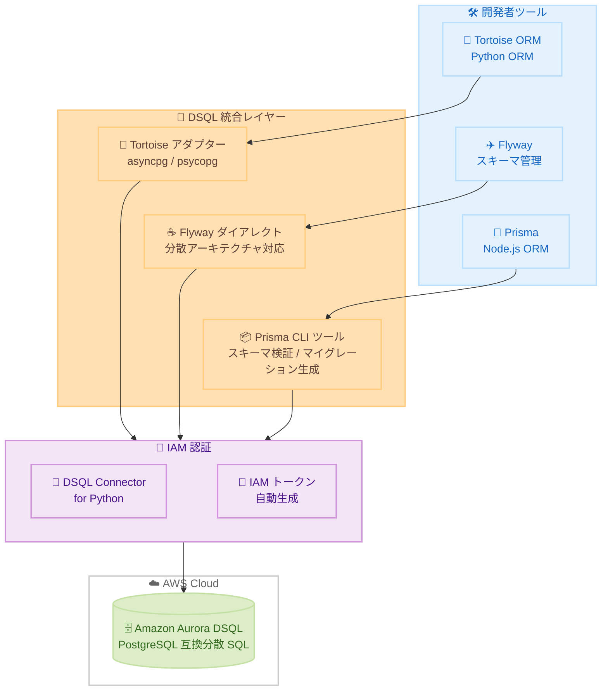

# Amazon Aurora DSQL - Tortoise、Flyway、Prisma の新規サポート

**リリース日**: 2026 年 2 月 25 日
**サービス**: Amazon Aurora DSQL
**機能**: Tortoise ORM アダプター、Flyway ダイアレクト、Prisma CLI ツール

📊 [このアップデートのインフォグラフィックを見る](https://takech9203.github.io/aws-news-summary/20260225-aurora-dsql-launches-tortoise-flyway-prisma.html)

## 概要

AWS は Amazon Aurora DSQL 向けに、人気の ORM ツールおよびデータベースマイグレーションツールとの統合を発表した。今回のリリースでは、Tortoise ORM (Python ORM) 用アダプター、Flyway (スキーマ管理ツール) 用ダイアレクト、Prisma (Node.js ORM) 用 CLI ツールの 3 つの統合が提供される。これらの統合は、IAM 認証と DSQL 固有の互換性を自動的に処理する。

Tortoise ORM アダプターは asyncpg および psycopg ドライバーをサポートし、Aurora DSQL Connector for Python と統合して IAM トークンの自動生成を行う。また、リッチマイグレーション向けの互換性パッチも含まれている。Flyway ダイアレクトは DSQL の分散アーキテクチャに適応し、IAM ベースの認証を処理する。Prisma CLI ツールは、スキーマの DSQL 互換性検証と DSQL 互換のマイグレーション生成を提供する。

**アップデート前の課題**

- Aurora DSQL で Tortoise ORM、Flyway、Prisma を使用する際に、DSQL 固有の互換性問題を手動で対処する必要があった
- IAM 認証トークンの生成と管理をアプリケーション側で独自に実装する必要があった
- DSQL の分散アーキテクチャに起因するスキーマ定義やマイグレーションの非互換性を開発者が個別に解決していた
- Python や Node.js の ORM ツールから Aurora DSQL を利用する際の導入障壁が高かった

**アップデート後の改善**

- Tortoise ORM、Flyway、Prisma から Aurora DSQL への接続が公式アダプター・ダイアレクト・CLI ツールで簡素化された
- IAM 認証トークンの自動生成により、認証処理の実装が不要になった
- DSQL 互換のスキーマ検証とマイグレーション生成により、分散アーキテクチャ固有の問題を事前に検出・回避できるようになった
- Python 開発者と Node.js 開発者が使い慣れた ORM ツールで Aurora DSQL を活用できるようになった

## アーキテクチャ図



この図は、Tortoise ORM、Flyway、Prisma の各開発者ツールが、それぞれ専用のアダプター・ダイアレクト・CLI ツールを介して DSQL 統合レイヤーに接続し、IAM 認証を自動的に処理した上で Aurora DSQL に接続するアーキテクチャを示しています。

## サービスアップデートの詳細

### 主要機能

1. **Tortoise ORM アダプター**
   - asyncpg および psycopg ドライバーをサポート
   - Aurora DSQL Connector for Python と統合し、IAM トークンを自動生成
   - リッチマイグレーション向けの互換性パッチを含む
   - Python の非同期フレームワークとの連携に最適化

2. **Flyway ダイアレクト**
   - DSQL の分散アーキテクチャに適応したスキーマ管理
   - IAM ベースの認証を自動処理
   - 既存の Flyway マイグレーションワークフローとの統合が可能
   - 分散 SQL 環境でのスキーマバージョン管理を実現

3. **Prisma CLI ツール**
   - スキーマの DSQL 互換性を検証する機能
   - DSQL 互換のマイグレーションを自動生成
   - Node.js エコシステムとのシームレスな統合
   - 型安全なデータベースアクセスを Aurora DSQL で実現

## 技術仕様

### ツール比較

| ツール | 言語 / ランタイム | ドライバー | 主要機能 | 対象ユーザー |
|--------|-------------------|------------|----------|-------------|
| Tortoise ORM アダプター | Python | asyncpg、psycopg | IAM トークン自動生成、互換性パッチ、非同期サポート | Python 開発者 |
| Flyway ダイアレクト | Java / CLI | JDBC | 分散アーキテクチャ対応、IAM 認証 | DBA、DevOps エンジニア |
| Prisma CLI ツール | Node.js / TypeScript | Prisma Client | スキーマ検証、マイグレーション生成 | Node.js / TypeScript 開発者 |

### Aurora DSQL の基盤技術

| 項目 | 詳細 |
|------|------|
| データベースエンジン | PostgreSQL 互換 |
| アーキテクチャ | 分散 SQL (Distributed SQL) |
| トランザクション | ACID 準拠 |
| 分離レベル | Repeatable Read |
| 同時実行制御 | 楽観的同時実行制御 (OCC) |
| スキーマ変更 | 非同期 DDL |
| 認証 | IAM ベース認証 |

## 設定方法

### 前提条件

1. AWS アカウントと適切な IAM 権限
2. Aurora DSQL クラスターが作成済みであること
3. 各ツールのランタイム環境が準備されていること (Python / Java / Node.js)

### 手順

#### Tortoise ORM アダプターのセットアップ

##### ステップ 1: パッケージのインストール

```bash
# Tortoise ORM アダプターと DSQL Connector をインストール
pip install tortoise-orm-dsql aurora-dsql-connector
```

##### ステップ 2: 接続設定

```python
from tortoise import Tortoise

# Aurora DSQL への接続設定
# IAM トークンは DSQL Connector により自動生成される
await Tortoise.init(
    db_url="dsql://your-cluster-endpoint:5432/postgres",
    modules={"models": ["app.models"]},
)

# スキーマの生成
await Tortoise.generate_schemas()
```

このコードは、Tortoise ORM アダプターを使用して Aurora DSQL に接続し、スキーマを自動生成します。IAM トークンの生成は DSQL Connector が自動的に処理します。

#### Flyway ダイアレクトのセットアップ

##### ステップ 1: ダイアレクトの配置

```bash
# Flyway DSQL ダイアレクトの JAR ファイルをダウンロードして配置
# Flyway のドライバーディレクトリに配置する
cp flyway-dsql-dialect.jar /path/to/flyway/drivers/
```

##### ステップ 2: Flyway 設定

```properties
# flyway.conf
flyway.url=jdbc:dsql://your-cluster-endpoint:5432/postgres
flyway.user=iam_user
# IAM 認証はダイアレクトが自動処理
```

##### ステップ 3: マイグレーションの実行

```bash
# DSQL 対応のスキーママイグレーションを実行
flyway migrate
```

このコマンドは、Flyway ダイアレクトを使用して Aurora DSQL 上でスキーママイグレーションを実行します。IAM 認証はダイアレクトにより自動的に処理されます。

#### Prisma CLI ツールのセットアップ

##### ステップ 1: パッケージのインストール

```bash
# Prisma DSQL CLI ツールをインストール
npm install prisma-dsql-tools --save-dev
```

##### ステップ 2: スキーマの DSQL 互換性検証

```bash
# Prisma スキーマが DSQL と互換性があるか検証
npx prisma-dsql validate
```

##### ステップ 3: DSQL 互換マイグレーションの生成

```bash
# DSQL 互換のマイグレーションを生成
npx prisma-dsql migrate
```

これらのコマンドは、Prisma スキーマの DSQL 互換性を検証し、DSQL に最適化されたマイグレーションファイルを生成します。

## メリット

### ビジネス面

- **開発生産性の向上**: 使い慣れた ORM ツールやマイグレーションツールを Aurora DSQL でそのまま利用でき、学習コストを削減
- **導入障壁の低減**: IAM 認証や DSQL 固有の互換性処理が自動化されるため、Aurora DSQL の採用が容易に
- **エコシステムの拡大**: Python と Node.js の主要な ORM ツールがサポートされ、幅広い開発者コミュニティが Aurora DSQL を活用可能
- **移行コストの削減**: 既存の Tortoise ORM、Flyway、Prisma を使用したアプリケーションから Aurora DSQL への移行が簡素化

### 技術面

- **IAM 認証の自動処理**: 各ツールのアダプター・ダイアレクトが IAM トークンの生成と管理を自動的に実行
- **DSQL 互換性の事前検証**: Prisma CLI ツールによりスキーマの互換性問題をデプロイ前に検出可能
- **非同期サポート**: Tortoise ORM アダプターは asyncpg ドライバーを通じて非同期データベースアクセスを実現
- **分散アーキテクチャ対応**: Flyway ダイアレクトが DSQL の分散 SQL 特性に適応したマイグレーション管理を提供

## デメリット・制約事項

### 制限事項

- 各ツールの全機能が Aurora DSQL で利用できるわけではない可能性がある (DSQL 固有の制約による)
- Aurora DSQL の楽観的同時実行制御 (OCC) に起因するトランザクション競合のハンドリングは、アプリケーション側で考慮が必要
- DSQL の非同期 DDL 特性により、マイグレーション直後にスキーマ変更が即座に反映されない場合がある

### 考慮すべき点

- Aurora DSQL の分散 SQL 特性 (OCC、非同期 DDL) を理解した上でスキーマ設計を行うことが推奨される
- 既存アプリケーションの移行時は、Prisma CLI ツールでスキーマ互換性を事前に検証すべき
- Tortoise ORM の一部のマイグレーション機能では互換性パッチが適用されるため、動作確認を十分に行うことが推奨される
- 各ツールはオープンソースとして GitHub で提供されており、バグ報告や機能リクエストはリポジトリで管理される

## ユースケース

### ユースケース 1: Python Web アプリケーションの Aurora DSQL 移行

**シナリオ**: FastAPI と Tortoise ORM を使用した既存の Python Web アプリケーションを、高可用性と分散 SQL の利点を活かすために Aurora DSQL に移行したい。

**実装例**:
```python
from tortoise import fields, models
from tortoise.contrib.fastapi import register_tortoise
from fastapi import FastAPI

app = FastAPI()

class User(models.Model):
    id = fields.UUIDField(pk=True)
    email = fields.CharField(max_length=255, unique=True)
    name = fields.CharField(max_length=255)
    created_at = fields.DatetimeField(auto_now_add=True)

    class Meta:
        table = "users"

# Aurora DSQL に接続 (IAM 認証は自動処理)
register_tortoise(
    app,
    db_url="dsql://your-cluster-endpoint:5432/postgres",
    modules={"models": ["app.models"]},
    generate_schemas=True,
)
```

**効果**: 既存の Tortoise ORM ベースのコードを最小限の変更で Aurora DSQL に移行でき、分散 SQL による高可用性とスケーラビリティを実現できる。

### ユースケース 2: Flyway によるスキーマバージョン管理

**シナリオ**: DevOps チームが Aurora DSQL のスキーマ変更を CI/CD パイプラインで自動管理し、複数環境間でスキーマの一貫性を維持したい。

**実装例**:
```sql
-- V1__create_orders_table.sql
CREATE TABLE orders (
    id UUID DEFAULT gen_random_uuid() PRIMARY KEY,
    customer_id UUID NOT NULL,
    total_amount DECIMAL(10, 2),
    status TEXT DEFAULT 'pending',
    created_at TIMESTAMP DEFAULT now()
);

CREATE INDEX idx_orders_customer ON orders(customer_id);
```

```bash
# CI/CD パイプラインでマイグレーションを実行
flyway -url="jdbc:dsql://your-cluster-endpoint:5432/postgres" migrate
```

**効果**: Flyway ダイアレクトにより、DSQL の分散アーキテクチャに適応したスキーマ管理を CI/CD パイプラインに統合でき、環境間のスキーマ一貫性を自動的に維持できる。

### ユースケース 3: Prisma による型安全な DSQL アクセス

**シナリオ**: TypeScript で構築された Next.js アプリケーションから Aurora DSQL に型安全にアクセスし、DSQL 互換のスキーマ管理を行いたい。

**実装例**:
```prisma
// schema.prisma
datasource db {
  provider = "postgresql"
  url      = env("DSQL_DATABASE_URL")
}

generator client {
  provider = "prisma-client-js"
}

model Product {
  id        String   @id @default(uuid())
  name      String
  price     Decimal
  createdAt DateTime @default(now())
  orders    Order[]
}

model Order {
  id        String   @id @default(uuid())
  productId String
  quantity  Int
  product   Product  @relation(fields: [productId], references: [id])
}
```

```bash
# DSQL 互換性を検証
npx prisma-dsql validate

# DSQL 互換マイグレーションを生成・適用
npx prisma-dsql migrate
npx prisma generate
```

**効果**: Prisma CLI ツールにより DSQL 互換のスキーマ検証とマイグレーション生成を行い、型安全な Prisma Client で Aurora DSQL にアクセスできる。

## 料金

Aurora DSQL の ORM ツール統合 (Tortoise ORM アダプター、Flyway ダイアレクト、Prisma CLI ツール) はオープンソースとして無料で利用できる。

Aurora DSQL 自体の料金は以下のとおりである。

- **AWS Free Tier**: Aurora DSQL は AWS Free Tier の対象であり、無料利用枠内で開始可能
- **本番利用**: コンピュート、ストレージ、I/O に基づく従量課金制

詳細な料金については、[Amazon Aurora DSQL 製品ページ](https://aws.amazon.com/rds/aurora/dsql/) を参照。

## 利用可能リージョン

各 ORM ツール統合はオープンソースライブラリとして提供されるため、Aurora DSQL が利用可能なすべてのリージョンで使用できる。Aurora DSQL の利用可能リージョンについては、[Amazon Aurora DSQL 製品ページ](https://aws.amazon.com/rds/aurora/dsql/) を参照。

## 関連サービス・機能

- **Amazon Aurora DSQL**: PostgreSQL 互換の分散 SQL データベースサービス。今回のツール統合の対象サービス
- **Aurora DSQL Connector for Python**: Python 向けの IAM トークン自動生成ライブラリ。Tortoise ORM アダプターが内部で使用
- **Aurora DSQL Playground**: ブラウザベースの対話的な Aurora DSQL 体験環境
- **AWS IAM**: Aurora DSQL への認証に使用される ID とアクセス管理サービス
- **Amazon Aurora**: MySQL および PostgreSQL 互換のクラウドネイティブリレーショナルデータベース

## 参考リンク

- 📊 [インフォグラフィック](https://takech9203.github.io/aws-news-summary/20260225-aurora-dsql-launches-tortoise-flyway-prisma.html)
- [公式発表 (What's New)](https://aws.amazon.com/about-aws/whats-new/2026/02/aurora-dsql-launches-tortoise-flyway-prisma/)
- [Tortoise ORM アダプター - GitHub](https://github.com/awslabs/aurora-dsql-orms/tree/main/python/tortoise-orm)
- [Flyway ダイアレクト - GitHub](https://github.com/awslabs/aurora-dsql-tools/tree/main/flyway)
- [Prisma CLI ツール - GitHub](https://github.com/awslabs/aurora-dsql-orms/tree/main/node/prisma)
- [Amazon Aurora DSQL 製品ページ](https://aws.amazon.com/rds/aurora/dsql/)
- [AWS Free Tier](https://aws.amazon.com/free/)

## まとめ

Amazon Aurora DSQL 向けに Tortoise ORM アダプター、Flyway ダイアレクト、Prisma CLI ツールの 3 つの統合がリリースされた。これらの統合により、Python 開発者は Tortoise ORM で、Node.js / TypeScript 開発者は Prisma で、DBA や DevOps エンジニアは Flyway で、それぞれ使い慣れたツールから Aurora DSQL を活用できるようになった。IAM 認証の自動処理、DSQL 互換のスキーマ検証、分散アーキテクチャ対応のマイグレーション管理など、DSQL 固有の課題を統合レイヤーが自動的に解決する。各ツールはオープンソースとして GitHub で公開されており、無料で利用可能である。Aurora DSQL の採用を検討している開発チームは、これらのツール統合を活用して既存のワークフローをそのまま維持しながら分散 SQL データベースへの移行を進めることを推奨する。
