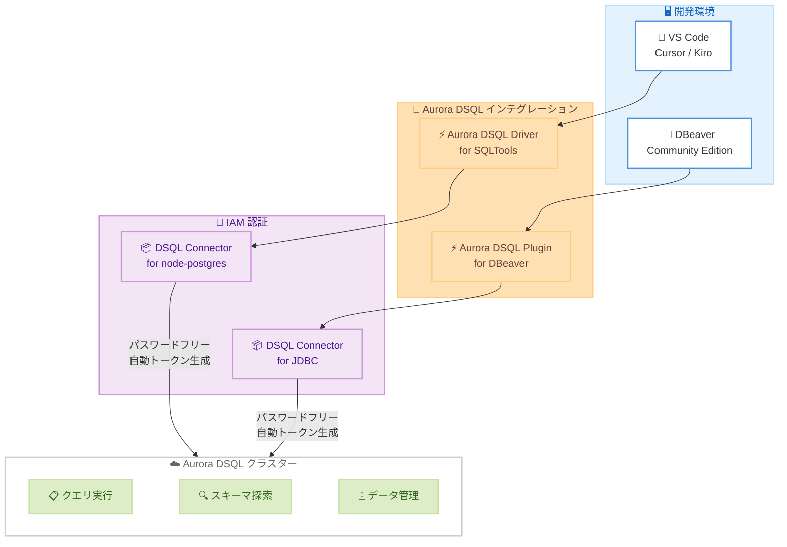

# Amazon Aurora DSQL - VS Code SQLTools と DBeaver の新しいインテグレーション

**リリース日**: 2026 年 2 月 25 日
**サービス**: Amazon Aurora DSQL
**機能**: Aurora DSQL Driver for SQLTools / Aurora DSQL Plugin for DBeaver

📊 [このアップデートのインフォグラフィックを見る](https://takech9203.github.io/aws-news-summary/20260225-aurora-dsql-visual-studio-code-sqltools-dbeaver.html)

## 概要

AWS は Aurora DSQL Driver for SQLTools および Aurora DSQL Plugin for DBeaver Community Edition のリリースを発表した。これらのインテグレーションにより、開発者は使い慣れたデータベースツールから Aurora DSQL クラスターに対してクエリの実行、スキーマの探索、データの管理を行える。両方のインテグレーションは IAM 認証を自動的に処理し、アクセストークンを透過的に管理するため、トークン生成コードの記述や IAM トークンの手動供給が不要になる。

SQLTools ドライバーは Visual Studio Code と Aurora DSQL を統合し、Open VSX Registry を通じて Cursor や Kiro などの VS Code 互換エディターでも利用できる。DBeaver プラグインは Aurora DSQL Connector for JDBC をベースに構築されている。いずれのインテグレーションも AWS IAM 認証情報を使用したパスワードフリーの認証を実現し、従来のユーザー生成パスワードに関連するセキュリティリスクを排除する。

**アップデート前の課題**

- Aurora DSQL への接続には IAM 認証トークンの手動生成やトークン管理コードの実装が必要だった
- VS Code や DBeaver などの一般的なデータベースツールから Aurora DSQL に直接接続する公式手段がなかった
- パスワードベースの認証に頼らざるを得ないケースでは、認証情報の管理にセキュリティ上のリスクが伴った

**アップデート後の改善**

- VS Code から SQLTools ドライバーを通じて Aurora DSQL に直接接続・クエリ実行が可能に
- DBeaver Community Edition からプラグイン経由で IAM 認証による安全な接続が実現
- トークン生成の自動化により、開発者はデータベース操作に集中できるようになった

## アーキテクチャ図



この図は、VS Code と DBeaver から Aurora DSQL インテグレーションを経由し、IAM 認証コネクターによるパスワードフリー認証を通じて Aurora DSQL クラスターに接続する全体のアーキテクチャを示しています。

## サービスアップデートの詳細

### 主要機能

1. **Aurora DSQL Driver for SQLTools**
   - VS Code の拡張機能として Visual Studio Marketplace からインストール可能
   - Open VSX Registry を通じて Cursor、Kiro などの VS Code 互換エディターでも利用可能
   - Aurora DSQL Connector for node-postgres を使用した自動 IAM 認証
   - スキーマ、テーブルの閲覧および SQL クエリの実行をサポート
   - SQLTools 拡張機能が未インストールの場合は自動でインストールされる

2. **Aurora DSQL Plugin for DBeaver Community Edition**
   - DBeaver Community Edition 向けの無料プラグイン
   - Aurora DSQL Connector for JDBC をベースに構築
   - IAM 認証情報によるパスワードフリー認証をサポート
   - JDBC ドライバーの自動インストールと設定
   - ホストベースまたは JDBC URL ベースの接続オプションを提供

3. **DBeaver Pro の Aurora DSQL ネイティブ統合**
   - DBeaver PRO はバージョン 25.3 以降で Aurora DSQL とのネイティブ統合を提供
   - プラグインのインストール不要で直接接続が可能

## 技術仕様

### SQLTools ドライバーの仕様

| 項目 | 詳細 |
|------|------|
| 配布先 | Visual Studio Marketplace / Open VSX Registry |
| 対応エディター | VS Code、Cursor、Kiro 等の VS Code 互換エディター |
| 認証方式 | IAM ベース認証 (時間制限付きトークン) |
| 認証コネクター | Aurora DSQL Connector for node-postgres |
| 接続パラメータ | AWS リージョン、AWS プロファイル、DSQL クラスターエンドポイント |
| 前提条件 | AWS 認証情報の設定 (AWS CLI、環境変数、IAM ロール) |

### DBeaver プラグインの仕様

| 項目 | 詳細 |
|------|------|
| 対応エディション | DBeaver Community Edition (無料) |
| 認証方式 | IAM 認証 (パスワードフリー) |
| 認証コネクター | Aurora DSQL Connector for JDBC |
| 接続方式 | ホストベース / JDBC URL ベース |
| リポジトリ URL | `https://awslabs.github.io/aurora-dsql-dbeaver-plugin/update-site/` |
| JDBC URL 形式 | `jdbc:aws-dsql:postgresql://{endpoint}/{database}?user=admin&profile=default&region=us-east-1` |

### Aurora DSQL の基盤技術

| 項目 | 詳細 |
|------|------|
| データベースエンジン | PostgreSQL 互換 |
| アーキテクチャ | 分散 SQL (Distributed SQL) |
| プロトコル | PostgreSQL v3 ワイヤープロトコル |
| トランザクション | ACID 準拠 |
| 分離レベル | Repeatable Read |
| 同時実行制御 | 楽観的同時実行制御 (OCC) |
| 可用性 | シングルリージョン 99.99% / マルチリージョン 99.999% |

## 設定方法

### SQLTools ドライバー (VS Code)

#### 前提条件

1. VS Code、Cursor、Kiro 等の VS Code 互換エディターがインストール済みであること
2. AWS 認証情報が設定済みであること (AWS CLI、環境変数、または IAM ロール)
3. Aurora DSQL クラスターが作成済みであること

#### ステップ 1: ドライバーのインストール

VS Code の拡張機能ビューを開き、「Aurora DSQL Driver for SQLTools」を検索してインストールします。

```
1. VS Code で拡張機能ビュー (Ctrl+Shift+X) を開く
2. "Aurora DSQL Driver for SQLTools" を検索
3. [Install] をクリック
```

SQLTools 拡張機能が未インストールの場合は自動でインストールされます。

#### ステップ 2: 接続の作成

```
1. 左サイドバーの SQLTools アイコンをクリック
2. CONNECTIONS にカーソルを合わせ、[Add New Connection] アイコンをクリック
3. SQLTools Settings タブで "Aurora DSQL Driver" を選択
4. 接続パラメータを入力:
   - DSQL Cluster: クラスターエンドポイントまたはクラスター ID
   - AWS Region: クラスターのリージョン (エンドポイントから自動解析可能)
   - AWS Profile: トークン生成に使用するプロファイル (未指定時は default)
5. [Test Connection] で接続を確認
6. [Save Connection] で保存
```

### DBeaver プラグイン (Community Edition)

#### 前提条件

1. DBeaver Community Edition がインストール済みであること
2. AWS 認証情報が設定済みであること
3. Aurora DSQL クラスターが作成済みであること

#### ステップ 1: プラグインのインストール

```
1. DBeaver を開き、[Help] → [Install New Software] を選択
2. [Add] をクリックして新しいリポジトリを追加:
   - Name: Aurora DSQL Plugin
   - Location: https://awslabs.github.io/aurora-dsql-dbeaver-plugin/update-site/
3. "Aurora DSQL Connector for JDBC" にチェックを入れる
4. [Next] をクリックし、ライセンスに同意してインストールを完了
5. プロンプトに従い DBeaver を再起動
```

#### ステップ 2: 接続の作成

```
1. [New Database Connection] をクリック
2. "Aurora DSQL" を選択
3. 接続方式を選択:
   - Host: エンドポイント、ユーザー名、AWS プロファイル、AWS リージョンを入力
   - URL: JDBC URL を入力
     例: jdbc:aws-dsql:postgresql://{endpoint}/{database}?user=admin&profile=default&region=us-east-1
4. [Test Connection] で接続を確認
5. [Finish] で完了
```

## メリット

### ビジネス面

- **開発生産性の向上**: 使い慣れた VS Code や DBeaver から直接 Aurora DSQL を操作でき、開発者はツール切り替えのオーバーヘッドを排除できる
- **導入障壁の低減**: 既存のデータベースツールエコシステムに Aurora DSQL を統合することで、新しいツールの学習コストが不要
- **セキュリティ体制の強化**: パスワードフリー認証により、認証情報の漏洩リスクを排除しつつ、IAM ポリシーによる細かいアクセス制御が可能
- **エコシステムの拡大**: Cursor や Kiro などの VS Code 互換エディターでも利用可能で、多様な開発環境をサポート

### 技術面

- **自動 IAM 認証**: トークンの生成・更新が自動化され、開発者は認証コードの実装から解放される
- **パスワードフリー認証**: AWS IAM 認証情報のみで接続でき、データベースパスワードの管理が不要
- **標準的なデータベース操作**: スキーマの閲覧、テーブルの探索、SQL クエリの実行など、一般的なデータベース操作をすべてサポート
- **柔軟な接続オプション**: DBeaver ではホストベースと JDBC URL ベースの両方の接続方式を選択可能

## デメリット・制約事項

### 制限事項

- DBeaver Community Edition で提供される PostgreSQL 用の管理機能 (Session Manager、Lock Manager) は Aurora DSQL の固有アーキテクチャにより正確な情報を提供しない
- SQLTools ドライバーは VS Code ベースのエディターのみに対応し、JetBrains 系 IDE には非対応
- Windows 環境では Maven Central へのアクセス時に Trust Store の問題が発生する場合がある

### 考慮すべき点

- AWS 認証情報の事前設定が必須であり、AWS CLI、環境変数、または IAM ロールのいずれかで設定する必要がある
- 確立されたセッションの認証は最大 1 時間で期限切れとなり、新しいセッションには新しい認証トークンが必要
- DBeaver Pro をすでに使用している場合は、バージョン 25.3 以降でネイティブ統合が利用可能なため、Community 版のプラグインは不要
- 複数の DBeaver バージョンがインストールされている環境では、接続設定は共有されるがドライバーはアプリケーションごとに個別にインストールが必要

## ユースケース

### ユースケース 1: VS Code での日常的なデータベース開発

**シナリオ**: 開発チームが VS Code を主要な IDE として使用しており、Aurora DSQL を使ったアプリケーション開発中にスキーマの確認やクエリの検証を IDE 内で完結させたい。

**実装例**:
```
1. VS Code で Aurora DSQL Driver for SQLTools をインストール
2. 開発用クラスターへの接続を作成
3. SQLTools パネルからスキーマとテーブルを閲覧
4. SQL エディターでクエリを記述・実行
```

```sql
-- スキーマ確認
SELECT table_name, column_name, data_type
FROM information_schema.columns
WHERE table_schema = 'public'
ORDER BY table_name, ordinal_position;

-- アプリケーションクエリの検証
SELECT u.name, COUNT(o.id) as order_count
FROM users u
LEFT JOIN orders o ON u.id = o.user_id
GROUP BY u.name
ORDER BY order_count DESC;
```

**効果**: IDE を離れることなくデータベース操作を完了でき、コード編集とデータベース確認のコンテキストスイッチが不要になる。開発サイクルが短縮される。

### ユースケース 2: DBeaver でのデータベース管理と分析

**シナリオ**: データベース管理者が DBeaver Community Edition を使用して複数の Aurora DSQL クラスターのスキーマ管理やデータ分析を行いたい。

**実装例**:
```
1. DBeaver Community Edition に Aurora DSQL Plugin をインストール
2. 複数のクラスターへの接続を AWS プロファイルごとに作成
3. DBeaver の ER ダイアグラム機能でスキーマを視覚化
4. SQL エディターでデータ分析クエリを実行
```

```sql
-- テーブル間のリレーション確認
SELECT
    tc.table_name,
    kcu.column_name,
    ccu.table_name AS foreign_table_name,
    ccu.column_name AS foreign_column_name
FROM information_schema.table_constraints AS tc
JOIN information_schema.key_column_usage AS kcu
    ON tc.constraint_name = kcu.constraint_name
JOIN information_schema.constraint_column_usage AS ccu
    ON ccu.constraint_name = tc.constraint_name
WHERE tc.constraint_type = 'FOREIGN KEY';
```

**効果**: DBeaver のリッチなデータ表示・編集機能と Aurora DSQL の IAM 認証を組み合わせ、セキュアかつ効率的なデータベース管理を実現できる。

### ユースケース 3: Cursor/Kiro での AI アシスト開発

**シナリオ**: AI コーディングアシスタントを活用する開発チームが Cursor や Kiro を使用しており、Aurora DSQL のスキーマ情報を参照しながら AI にコード生成を依頼したい。

**実装例**:
```
1. Cursor または Kiro で Open VSX Registry から Aurora DSQL Driver for SQLTools をインストール
2. Aurora DSQL クラスターに接続
3. SQLTools でスキーマ情報を確認しながら AI アシスタントにクエリ生成を依頼
```

**効果**: AI コーディングアシスタントと Aurora DSQL のスキーマ情報を同一エディター内で活用でき、正確なスキーマに基づいたコード生成が可能になる。

## 料金

Aurora DSQL Driver for SQLTools および Aurora DSQL Plugin for DBeaver は無料で利用できる。

Aurora DSQL 本体の料金は以下の通りである。

- **AWS Free Tier**: Aurora DSQL は AWS Free Tier の対象であり、毎月最初の 100,000 DPU と 1 GB-month のストレージが無料
- **本番利用**: Distributed Processing Unit (DPU) ベースの従量課金制。コンピュート、ストレージ、I/O に基づく料金

詳細な料金については、[Amazon Aurora DSQL 料金ページ](https://aws.amazon.com/rds/aurora/dsql/pricing/) を参照。

## 利用可能リージョン

Aurora DSQL Driver for SQLTools および DBeaver プラグインは、Aurora DSQL が利用可能なすべてのリージョンのクラスターに接続できる。Aurora DSQL は以下のリージョンで利用可能である。

- US East (N. Virginia) - us-east-1
- US East (Ohio) - us-east-2
- US West (Oregon) - us-west-2
- Asia Pacific (Melbourne) - ap-southeast-4
- Asia Pacific (Osaka) - ap-northeast-3
- Asia Pacific (Seoul) - ap-northeast-2
- Asia Pacific (Sydney) - ap-southeast-2
- Asia Pacific (Tokyo) - ap-northeast-1
- Canada (Central) - ca-central-1
- Canada (West) - ca-west-1
- Europe (Frankfurt) - eu-central-1
- Europe (Ireland) - eu-west-1
- Europe (London) - eu-west-2
- Europe (Paris) - eu-west-3

## 関連サービス・機能

- **Amazon Aurora DSQL**: PostgreSQL 互換のサーバーレス分散 SQL データベースサービス。今回のインテグレーションの接続先
- **Aurora DSQL Query Editor**: AWS マネジメントコンソールに統合されたクエリエディター。ブラウザから直接 SQL を実行可能
- **Aurora DSQL Playground**: ブラウザベースの対話的環境。AWS アカウント不要で Aurora DSQL を体験可能
- **Aurora DSQL Connector for node-postgres**: Node.js 向けの IAM 認証コネクター。SQLTools ドライバーの基盤
- **Aurora DSQL Connector for JDBC**: Java 向けの IAM 認証コネクター。DBeaver プラグインの基盤
- **SQLTools**: VS Code 向けのデータベース管理拡張機能。複数のデータベースドライバーをサポート

## 参考リンク

- 📊 [インフォグラフィック](https://takech9203.github.io/aws-news-summary/20260225-aurora-dsql-visual-studio-code-sqltools-dbeaver.html)
- [公式発表 (What's New)](https://aws.amazon.com/about-aws/whats-new/2026/02/aurora-dsql-visual-studio-code-sqltools-dbeaver/)
- [VS Code SQLTools ドライバーのドキュメント](https://docs.aws.amazon.com/aurora-dsql/latest/userguide/accessing-vscode.html)
- [DBeaver プラグインのドキュメント](https://docs.aws.amazon.com/aurora-dsql/latest/userguide/accessing-dbeaver.html)
- [Amazon Aurora DSQL 製品ページ](https://aws.amazon.com/rds/aurora/dsql/)
- [AWS Free Tier](https://aws.amazon.com/free/)

## まとめ

Aurora DSQL Driver for SQLTools と Aurora DSQL Plugin for DBeaver Community Edition のリリースにより、開発者は使い慣れた VS Code や DBeaver から Aurora DSQL クラスターに直接接続できるようになった。SQLTools ドライバーは Visual Studio Marketplace と Open VSX Registry で提供され、Cursor や Kiro などの VS Code 互換エディターでも利用可能である。DBeaver プラグインは Aurora DSQL Connector for JDBC をベースに構築され、DBeaver Community Edition から無料で使用できる。両方のインテグレーションは IAM 認証の自動処理とアクセストークンの透過的管理を提供し、パスワードフリーの安全な認証を実現する。Aurora DSQL は AWS Free Tier の対象であり、これらの無料ツールと組み合わせることで、コストを抑えながら分散 SQL データベースの開発を開始できる。
