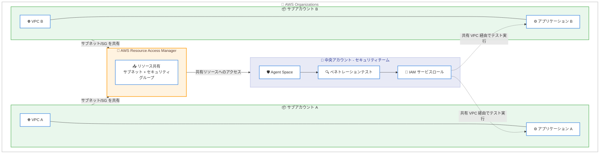

# AWS Security Agent - 共有 VPC に対するクロスアカウントペネトレーションテスト

**リリース日**: 2026 年 2 月 25 日
**サービス**: AWS Security Agent
**機能**: 共有 VPC に対するクロスアカウントペネトレーションテストのサポート

📊 [このアップデートのインフォグラフィックを見る](https://takech9203.github.io/aws-news-summary/20260225-aws-security-agent-adds-penetration-tests-shared.html)

## 概要

AWS Security Agent が、同一 AWS Organizations 内の他の AWS アカウントから共有された VPC リソースに対するペネトレーションテストの実行をサポートした。AWS Resource Access Manager (RAM) を使用して、サブアカウントから中央アカウントへ VPC リソースをセキュアに共有し、中央アカウントの Agent Space からペネトレーションテストを実施できる。

これにより、マルチアカウント環境においてセキュリティチームが一元的にペネトレーションテストを管理・実行できるようになり、組織全体のセキュリティ態勢の強化が可能になる。

**アップデート前の課題**

- ペネトレーションテストは同一アカウント内の VPC リソースに対してのみ実行可能だった
- マルチアカウント環境では、各アカウントに個別に Agent Space を構築する必要があった
- セキュリティチームが組織全体のアプリケーションを一元的にテストする手段がなかった
- サブアカウントにデプロイされたプライベートアプリケーションのセキュリティ検証が困難だった

**アップデート後の改善**

- 中央アカウントの Agent Space から、サブアカウントの共有 VPC リソースに対してペネトレーションテストを実行可能に
- AWS RAM を使用したセキュアなリソース共有により、同一 Organizations 内のアカウント間連携を実現
- セキュリティチームが組織全体のアプリケーションセキュリティを一元管理できるようになった

## アーキテクチャ図



この図は、マルチアカウント環境における共有 VPC ペネトレーションテストのアーキテクチャを示している。サブアカウント A/B が AWS RAM を通じて VPC リソースを中央アカウントに共有し、セキュリティチームが Agent Space から一元的にペネトレーションテストを実行する流れを表している。

## サービスアップデートの詳細

### 主要機能

1. **クロスアカウント VPC ペネトレーションテスト**
   - 同一 AWS Organizations 内の他のアカウントから共有された VPC リソースに対してペネトレーションテストを実行可能
   - 中央アカウントの Agent Space から組織全体のアプリケーションをテスト
   - パブリックインターネットに公開されていないプライベートアプリケーションにもアクセス可能

2. **AWS Resource Access Manager 統合**
   - AWS RAM を使用してサブネットとセキュリティグループをセキュアに共有
   - 同一 Organizations 内のアカウント間でリソース共有を自動化するオプション
   - きめ細かなアクセス制御により、必要なリソースのみを共有

3. **一元的なセキュリティ管理**
   - セキュリティチームが中央アカウントから組織全体のペネトレーションテストを管理
   - 各サブアカウントに Agent Space を個別に構築する必要がない
   - テスト結果とレポートを一か所で集約・管理

### AWS Security Agent の基盤機能

AWS Security Agent は、開発ライフサイクル全体でアプリケーションのセキュリティを確保するフロンティアエージェントである。主要な機能は以下の通り。

- **設計セキュリティレビュー**: 設計ドキュメントに対してリアルタイムのセキュリティフィードバックを提供
- **コードセキュリティレビュー**: プルリクエストを組織のセキュリティ要件と一般的な脆弱性に対して分析
- **ペネトレーションテスト**: 特殊な AI エージェントを使用したオンデマンドのペネトレーションテスト

## 技術仕様

### クロスアカウント共有の要件

| 項目 | 詳細 |
|------|------|
| 前提条件 | 両アカウントが同一 AWS Organizations に所属 |
| 共有方法 | AWS Resource Access Manager (RAM) |
| 共有対象リソース | サブネット、セキュリティグループ |
| Agent Space の場所 | ペネトレーションテストを実行する中央アカウント |
| IAM 要件 | サービスロールが共有 VPC リソースへのアクセス権限を持つこと |
| VPC 上限 | Agent Space あたり最大 5 つの VPC |

### サポート対象環境

| 項目 | 詳細 |
|------|------|
| 利用可能リージョン | US East (N. Virginia) |
| マルチクラウド | AWS、オンプレミス、ハイブリッド、マルチクラウド、SaaS 環境をサポート |
| VPC タイプ | 同一アカウント内 VPC および共有 VPC |

## 設定方法

### 前提条件

1. 中央アカウントとサブアカウントが同一 AWS Organizations に所属していること
2. 中央アカウントに Agent Space が作成済みであること
3. サブアカウントで共有対象の VPC、サブネット、セキュリティグループが作成済みであること
4. AWS RAM の使用権限があること

### 手順

#### ステップ 1: AWS Organizations でリソース共有を有効化

Organizations 内での自動リソース共有を有効化します。

```bash
aws ram enable-sharing-with-aws-organization
```

このコマンドにより、Organizations 内のアカウント間で AWS RAM によるリソース共有が可能になります。

#### ステップ 2: サブアカウントから VPC リソースを共有

サブアカウント (VPC リソースのオーナー) の認証情報を使用して、サブネットとセキュリティグループを中央アカウントに共有します。

```bash
aws ram create-resource-share \
    --name SharePentestResources \
    --resource-arns arn:aws:ec2:us-east-1:111111111111:subnet/subnet-xxxxxxxxxxxxxxxxx \
                    arn:aws:ec2:us-east-1:111111111111:security-group/sg-xxxxxxxxxxxxxxxxx \
    --principals 222222222222
```

`111111111111` はサブアカウントの ID、`222222222222` は中央アカウント (ペネトレーションテスト実行アカウント) の ID に置き換えてください。

#### ステップ 3: Agent Space で VPC 設定を追加

1. Agent Space の概要ページに移動
2. [Actions] を選択し、[Edit penetration test configuration] を選択
3. [VPC] セクションで、共有された VPC、サブネット、セキュリティグループを指定して保存

#### ステップ 4: IAM サービスロールの確認

1. Agent Space の概要ページで [Penetration test] を選択し、[Service role name] を確認
2. IAM ロールが共有 VPC リソースへのアクセス権限を持っていることを確認

#### ステップ 5: ペネトレーションテストで VPC 設定を選択

1. AWS Security Agent Web アプリでペネトレーションテストの概要ページに移動
2. 対象のペネトレーションテストを選択し、[Modify pentest details] を選択
3. [Next] で [VPC Resources] セクションに進む
4. 共有された VPC、サブネット、セキュリティグループを選択
5. [Next] で最後のセクションに進み、[Save] でペネトレーションテストを保存

#### ステップ 6: ペネトレーションテストの実行

設定完了後、共有 VPC 内のプライベートアプリケーションに対してペネトレーションテストを実行できます。AWS Security Agent は共有された VPC 設定を使用してアプリケーションにアクセスし、脆弱性の検出・検証を実施します。

## メリット

### ビジネス面

- **一元的なセキュリティ管理**: セキュリティチームが中央アカウントから組織全体のペネトレーションテストを管理でき、運用コストを削減
- **セキュリティカバレッジの拡大**: マルチアカウント環境のすべてのアプリケーションを網羅的にテスト可能になり、セキュリティの死角を排除
- **コンプライアンスの強化**: 組織全体で一貫したセキュリティテスト基準を適用し、規制要件への対応を効率化
- **運用効率の向上**: 各アカウントに個別の Agent Space を構築・管理する必要がなくなり、管理負荷を大幅に軽減

### 技術面

- **AWS RAM による安全な共有**: Organizations レベルの信頼関係に基づくセキュアなリソース共有メカニズム
- **既存の VPC アーキテクチャの活用**: アプリケーションのネットワーク構成を変更することなくテストを実施可能
- **AI を活用した高度なテスト**: マルチステップの攻撃シナリオにより、自動スキャンツールでは検出できない脆弱性を発見
- **自動修正の提案**: 検出された脆弱性に対して、再現可能な攻撃パスと修正コードを含むプルリクエストを自動作成

## デメリット・制約事項

### 制限事項

- US East (N. Virginia) リージョンでのみ利用可能
- 両アカウントが同一 AWS Organizations に所属している必要がある
- Agent Space あたり最大 5 つの VPC に制限される
- サブアカウント側で AWS RAM によるリソース共有の設定が必要

### 考慮すべき点

- サブアカウントの VPC リソースを共有する際、最小権限の原則に基づいて必要なサブネットとセキュリティグループのみを共有すべき
- IAM サービスロールのアクセス権限を適切に設定し、不必要なリソースへのアクセスを防ぐ必要がある
- ペネトレーションテストの実行がサブアカウントのアプリケーションパフォーマンスに影響を与える可能性があるため、テスト時間帯の調整を検討すべき
- 組織のセキュリティポリシーに基づき、クロスアカウントのリソース共有が許可されていることを確認する必要がある

## ユースケース

### ユースケース 1: マルチアカウント環境の一元セキュリティテスト

**シナリオ**: 企業がワークロード分離のためにマルチアカウント戦略を採用しており、セキュリティチームが中央セキュリティアカウントから全アカウントのアプリケーションをテストしたい。

**実装例**:
```bash
# サブアカウント A から VPC リソースを共有
aws ram create-resource-share \
    --name ShareAppAResources \
    --resource-arns arn:aws:ec2:us-east-1:111111111111:subnet/subnet-aaa \
                    arn:aws:ec2:us-east-1:111111111111:security-group/sg-aaa \
    --principals 999999999999

# サブアカウント B から VPC リソースを共有
aws ram create-resource-share \
    --name ShareAppBResources \
    --resource-arns arn:aws:ec2:us-east-1:222222222222:subnet/subnet-bbb \
                    arn:aws:ec2:us-east-1:222222222222:security-group/sg-bbb \
    --principals 999999999999
```

**効果**: セキュリティチームが中央アカウント (999999999999) の Agent Space から、サブアカウント A と B のプライベートアプリケーションに対してペネトレーションテストを一元的に実行でき、組織全体のセキュリティ態勢を効率的に評価できる。

### ユースケース 2: 本番環境のセキュリティ検証

**シナリオ**: 本番アカウントにデプロイされたプライベート API がパブリックインターネットに公開されておらず、ペネトレーションテストを実施するにはプライベートネットワーク経由でのアクセスが必要。

**実装例**:
1. 本番アカウントから API が稼働するサブネットとセキュリティグループを RAM で共有
2. 中央アカウントの Agent Space に共有 VPC 設定を追加
3. ペネトレーションテストでターゲット URL、認証情報、ソースコードを指定して実行

**効果**: パブリックインターネットに公開していない本番環境の内部 API に対しても、共有 VPC 経由でペネトレーションテストを実行でき、内部向けアプリケーションのセキュリティ脆弱性を検出・修正できる。

### ユースケース 3: 開発・ステージング環境の定期テスト

**シナリオ**: 複数の開発チームがそれぞれ独自のアカウントで開発を行っており、セキュリティチームがデプロイ前のアプリケーションを定期的にテストしたい。

**実装例**:
1. 各開発アカウントからステージング環境の VPC リソースを RAM で共有
2. セキュリティチームが中央アカウントから各環境のペネトレーションテストをスケジュール
3. 検出された脆弱性に対する修正プルリクエストが自動生成される

**効果**: 本番デプロイ前にセキュリティ脆弱性を検出でき、リリース後のセキュリティインシデントのリスクを低減。複数チームのアプリケーションを一貫した基準でテストでき、組織全体のセキュリティ水準を向上させる。

## 料金

AWS Security Agent の料金は使用量に基づいて課金される。詳細な料金情報は [AWS Security Agent pricing page](https://aws.amazon.com/security-agent/pricing/) を参照 (利用可能な場合)。

AWS Resource Access Manager (RAM) によるリソース共有自体には追加料金は発生しない。

## 利用可能リージョン

AWS Security Agent は US East (N. Virginia) リージョンで利用可能である。

## 関連サービス・機能

- **AWS Resource Access Manager (RAM)**: AWS アカウント間でリソースをセキュアに共有するサービス。本機能の核となるリソース共有メカニズムを提供
- **AWS Organizations**: マルチアカウント環境の一元管理サービス。クロスアカウント VPC 共有の前提条件
- **Amazon VPC**: 仮想プライベートクラウド。ペネトレーションテストのネットワークアクセスに使用
- **Amazon Inspector**: アプリケーションのセキュリティ脆弱性を自動評価するサービス
- **AWS IAM**: サービスロールの管理と共有リソースへのアクセス制御

## 参考リンク

- 📊 [インフォグラフィック](https://takech9203.github.io/aws-news-summary/20260225-aws-security-agent-adds-penetration-tests-shared.html)
- [公式発表 (What's New)](https://aws.amazon.com/about-aws/whats-new/2026/02/aws-security-agent-adds-penetration-tests-shared/)
- [AWS Security Agent ユーザーガイド - What is AWS Security Agent?](https://docs.aws.amazon.com/securityagent/latest/userguide/what-is.html)
- [AWS Security Agent ユーザーガイド - Connect agent to private VPC resources](https://docs.aws.amazon.com/securityagent/latest/userguide/connect-agent-vpc.html)
- [AWS Resource Access Manager](https://aws.amazon.com/ram/)

## まとめ

AWS Security Agent が同一 AWS Organizations 内の他アカウントから共有された VPC リソースに対するペネトレーションテストをサポートした。AWS RAM を使用してサブアカウントの VPC リソース (サブネット、セキュリティグループ) を中央アカウントに共有し、Agent Space からクロスアカウントのペネトレーションテストを実行できる。これにより、マルチアカウント環境を採用する組織のセキュリティチームは、個別アカウントへの Agent Space 構築なしに、中央アカウントから組織全体のアプリケーションセキュリティを一元的にテスト・管理できるようになった。マルチアカウント戦略を採用している組織は、本機能を活用してセキュリティテストの効率化とカバレッジの拡大を検討することを推奨する。
