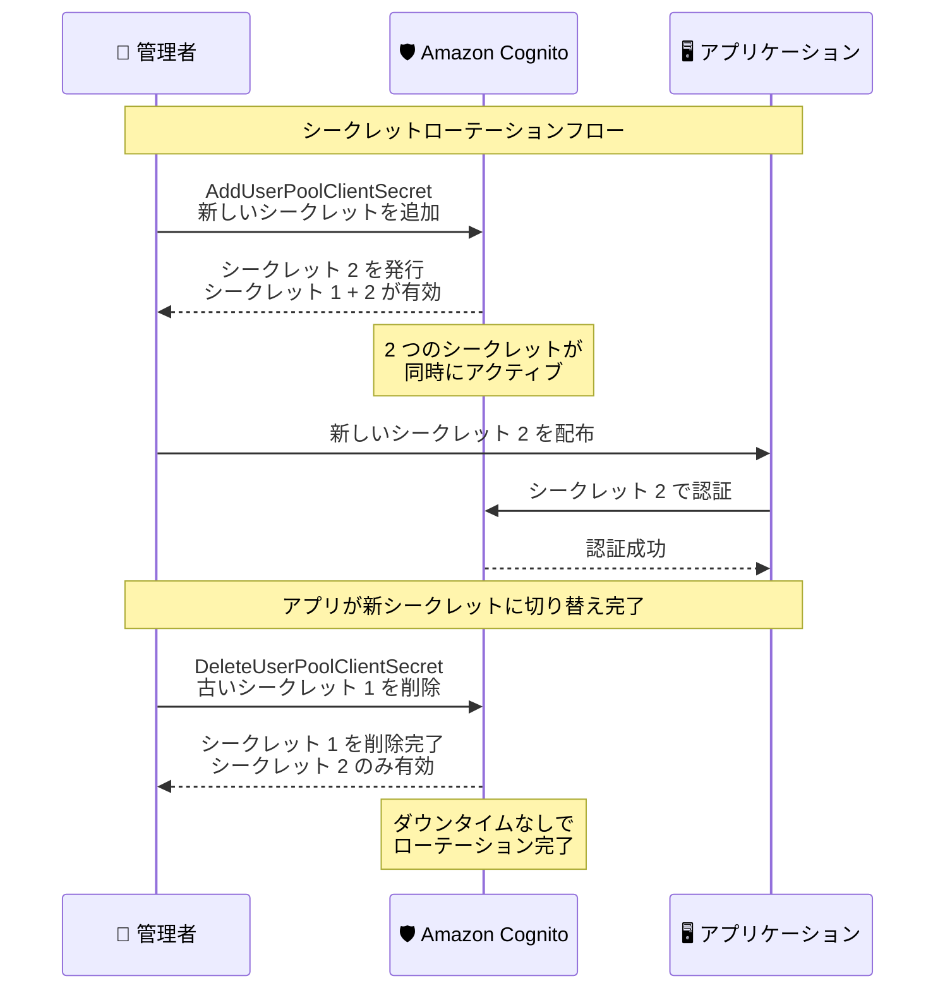

# Amazon Cognito - クライアントシークレットのローテーションとカスタムシークレットサポート

**リリース日**: 2026 年 2 月 26 日
**サービス**: Amazon Cognito
**機能**: クライアントシークレットライフサイクル管理

📊 [このアップデートのインフォグラフィックを見る](https://takech9203.github.io/aws-news-summary/20260226-amazon-cognito-client-secret-lifecycle.html)

## 概要

Amazon Cognito がユーザープールのアプリクライアントにおけるクライアントシークレットライフサイクル管理を強化した。クライアントシークレットのローテーションとカスタムクライアントシークレットのサポートが追加され、認証情報管理の柔軟性とセキュリティが向上した。

従来、Cognito のアプリクライアントシークレットはすべて自動生成されていたが、今回のアップデートにより、独自のカスタムクライアントシークレットを新規または既存のアプリクライアントに設定できるようになった。また、クライアントシークレットをオンデマンドでローテーションでき、アプリクライアントごとに最大 2 つのアクティブなクライアントシークレットを維持できる。

**アップデート前の課題**

- アプリクライアントシークレットはすべて Cognito による自動生成のみで、独自の値を指定できなかった
- シークレットの変更にはアプリクライアント自体の再作成が必要だった
- 定期的な認証情報ローテーションの要件に対応することが困難だった
- 他の認証システムから Cognito への移行時に、既存のクライアントシークレットを引き継ぐことができなかった

**アップデート後の改善**

- カスタムクライアントシークレットを独自に指定して設定可能に
- アプリクライアントごとに最大 2 つのシークレットを同時に保持でき、ダウンタイムなしでローテーション可能
- `AddUserPoolClientSecret` API でオンデマンドのシークレット追加が可能に
- `DeleteUserPoolClientSecret` API で古いシークレットの削除が可能に
- 他の認証システムからの移行時に既存のシークレット値を引き継ぎ可能に

## アーキテクチャ図



この図は、管理者がクライアントシークレットをダウンタイムなしでローテーションする一連のフローを示しています。新しいシークレットを追加し、アプリケーションの切り替え後に古いシークレットを削除することで、サービス中断なくローテーションを完了できます。

## サービスアップデートの詳細

### 主要機能

1. **カスタムクライアントシークレット**
   - アプリクライアント作成時に独自のシークレット値を指定可能
   - 既存のアプリクライアントにもカスタムシークレットを追加可能
   - Cognito による自動生成と独自指定の両方をサポート

2. **シークレットローテーション**
   - `AddUserPoolClientSecret` API で新しいシークレットをオンデマンドで追加
   - アプリクライアントごとに最大 2 つのアクティブなシークレットを維持可能
   - 両方のシークレットが同時に有効なため、ダウンタイムなしのローテーションが可能

3. **シークレットの削除**
   - `DeleteUserPoolClientSecret` API で古いシークレットを削除
   - アプリクライアントに関連付けられた唯一のシークレットは削除不可 (安全策)
   - ローテーション完了後に古いシークレットを安全に無効化

4. **管理インターフェース**
   - AWS Management Console
   - AWS CLI
   - AWS SDK
   - AWS CloudFormation
   で設定・管理可能

## 技術仕様

### API オペレーション

| API オペレーション | 説明 |
|-------------------|------|
| `CreateUserPoolClient` | アプリクライアント作成時にカスタムシークレットまたは自動生成シークレットを設定 |
| `AddUserPoolClientSecret` | 既存のアプリクライアントに新しいシークレットを追加 (最大 2 つ) |
| `DeleteUserPoolClientSecret` | アプリクライアントからシークレットを削除 (唯一のシークレットは削除不可) |

### シークレット管理の仕様

| 項目 | 詳細 |
|------|------|
| 最大シークレット数 | アプリクライアントあたり 2 つ |
| シークレット値の指定 | 自動生成またはカスタム値 |
| シークレットの変更 | 作成後の変更は不可。新しいシークレットの追加と古いシークレットの削除で対応 |
| 最小シークレット数 | Confidential client では最低 1 つ必要 |
| 対象クライアントタイプ | Confidential client (シークレット付きアプリクライアント) |

### アプリクライアントタイプ

| タイプ | 説明 | シークレット |
|--------|------|-------------|
| Public client | ブラウザやモバイルデバイスで動作。信頼できるサーバーサイドリソースなし | なし |
| Confidential client | サーバーサイドリソースを持ち、シークレットで保護。`client_credentials` グラントに必須 | 必須 |

## 設定方法

### 前提条件

1. Amazon Cognito ユーザープール
2. シークレット付きアプリクライアント (Confidential client)
3. 適切な IAM 権限 (`cognito-idp:AddUserPoolClientSecret`、`cognito-idp:DeleteUserPoolClientSecret`)

### 手順

#### ステップ 1: 新しいシークレットを追加

`AddUserPoolClientSecret` API を使用して、既存のアプリクライアントに新しいシークレットを追加します。

```bash
# 自動生成のシークレットを追加
aws cognito-idp add-user-pool-client-secret \
  --user-pool-id us-east-1_xxxxxxxxx \
  --client-id xxxxxxxxxxxxxxxxxxxxxxxxxx

# カスタムシークレットを指定して追加
aws cognito-idp add-user-pool-client-secret \
  --user-pool-id us-east-1_xxxxxxxxx \
  --client-id xxxxxxxxxxxxxxxxxxxxxxxxxx \
  --client-secret "your-custom-secret-value"
```

この時点でアプリクライアントには 2 つのアクティブなシークレットが存在し、どちらのシークレットでも認証が可能です。

#### ステップ 2: アプリケーションを新しいシークレットに切り替え

アプリケーションの設定を更新し、新しいシークレットを使用するように変更します。

```python
import boto3

# 新しいシークレットを使用してトークンを取得
client = boto3.client('cognito-idp')

response = client.initiate_auth(
    AuthFlow='USER_PASSWORD_AUTH',
    AuthParameters={
        'USERNAME': 'user@example.com',
        'PASSWORD': 'password',
        'SECRET_HASH': compute_secret_hash(
            'user@example.com',
            'app-client-id',
            'new-client-secret'  # 新しいシークレットを使用
        )
    },
    ClientId='app-client-id'
)
```

すべてのアプリケーションインスタンスが新しいシークレットに切り替わったことを確認します。

#### ステップ 3: 古いシークレットを削除

アプリケーションの切り替えが完了したら、古いシークレットを削除します。

```bash
aws cognito-idp delete-user-pool-client-secret \
  --user-pool-id us-east-1_xxxxxxxxx \
  --client-id xxxxxxxxxxxxxxxxxxxxxxxxxx \
  --client-secret-id "old-secret-id"
```

ローテーションが完了し、アプリクライアントには新しいシークレットのみが有効になります。

#### ステップ 4: カスタムシークレットでアプリクライアントを作成 (新規作成の場合)

他の認証システムから移行する場合、既存のシークレット値を指定してアプリクライアントを作成できます。

```bash
aws cognito-idp create-user-pool-client \
  --user-pool-id us-east-1_xxxxxxxxx \
  --client-name "my-app-client" \
  --generate-secret \
  --client-secret "existing-secret-from-other-system"
```

## メリット

### セキュリティ面

- **定期的なシークレットローテーション**: コンプライアンス要件や社内セキュリティポリシーに準拠した定期ローテーションが実現可能
- **ダウンタイムなしのローテーション**: 2 つのシークレットの同時保持により、サービス中断なくシークレットを更新可能
- **最小権限の原則**: シークレットの追加・削除を個別の API オペレーションで制御でき、IAM ポリシーで権限を細かく設定可能

### ビジネス面

- **移行の容易化**: 他の認証システムのクライアントシークレットをそのまま Cognito に引き継ぎ可能で、移行時のアプリケーション変更を最小化
- **運用負担の軽減**: シークレットローテーションのためにアプリクライアントを再作成する必要がなくなり、運用手順が簡素化
- **コンプライアンス対応**: PCI DSS、SOC 2 などのセキュリティ基準で求められる定期的な認証情報ローテーションに対応

### 技術面

- **API によるオートメーション**: `AddUserPoolClientSecret` と `DeleteUserPoolClientSecret` API により、シークレットローテーションの完全自動化が可能
- **CloudFormation サポート**: Infrastructure as Code でシークレット管理をコード化可能
- **複数インターフェース対応**: コンソール、CLI、SDK、CloudFormation のすべてで操作可能

## 制限事項

- アプリクライアントあたりのシークレット数は最大 2 つ
- シークレットの値は作成後に変更不可 (新規追加と旧シークレット削除で対応)
- アプリクライアントに関連付けられた唯一のシークレットは削除できない
- Public client (シークレットなしのアプリクライアント) には適用されない

## ユースケース

### ユースケース 1: 定期的なシークレットローテーション

**シナリオ**: セキュリティポリシーに基づき、90 日ごとにクライアントシークレットをローテーションする必要がある金融機関のアプリケーション。

**実装**: AWS Lambda と Amazon EventBridge のスケジュールルールを使用して、定期的に `AddUserPoolClientSecret` API を呼び出し、新しいシークレットを追加。アプリケーションの切り替え後に `DeleteUserPoolClientSecret` API で古いシークレットを削除する自動化パイプラインを構築。

**効果**: 手動操作なしに定期的なシークレットローテーションを実現し、PCI DSS などのコンプライアンス要件を満たしつつ、サービスのダウンタイムをゼロに維持。

### ユースケース 2: 他の認証システムからの移行

**シナリオ**: 自社構築の OAuth 2.0 サーバーから Amazon Cognito に移行する SaaS プロバイダー。既存のクライアントシークレットを使用するサードパーティインテグレーションが多数存在。

**実装**: `CreateUserPoolClient` API でカスタムシークレットを指定し、既存のクライアントシークレットをそのまま Cognito に設定。サードパーティインテグレーションのシークレット変更を不要にする。

**効果**: サードパーティインテグレーション側の変更を最小限に抑えて Cognito への移行を完了。移行完了後、段階的にシークレットをローテーションしてセキュリティを強化。

### ユースケース 3: インシデント対応時のシークレット緊急ローテーション

**シナリオ**: クライアントシークレットの漏洩が疑われるセキュリティインシデントが発生し、即座にシークレットを無効化する必要がある。

**実装**: `AddUserPoolClientSecret` API で新しいシークレットを即座に追加し、アプリケーションを新しいシークレットに切り替えた後、`DeleteUserPoolClientSecret` API で漏洩した可能性のあるシークレットを削除。

**効果**: サービスを停止することなく、漏洩した可能性のあるシークレットを迅速に無効化し、セキュリティリスクを最小化。

## 利用可能リージョン

Amazon Cognito ユーザープールが利用可能なすべての AWS リージョン

## 関連サービス・機能

- **Amazon Cognito User Pools**: ユーザーディレクトリとアプリクライアント管理
- **AWS Secrets Manager**: シークレットの安全な保存とローテーション管理
- **Amazon EventBridge**: スケジュールベースのローテーション自動化
- **AWS Lambda**: ローテーション処理の自動化ロジック実装
- **AWS CloudFormation**: Infrastructure as Code でのアプリクライアント管理

## 参考リンク

- 📊 [インフォグラフィック](https://takech9203.github.io/aws-news-summary/20260226-amazon-cognito-client-secret-lifecycle.html)
- [公式発表 (What's New)](https://aws.amazon.com/about-aws/whats-new/2026/02/amazon-cognito-client-secret-lifecycle/)
- [Amazon Cognito アプリクライアント設定](https://docs.aws.amazon.com/cognito/latest/developerguide/user-pool-settings-client-apps.html)
- [Amazon Cognito](https://aws.amazon.com/cognito/)

## まとめ

Amazon Cognito がクライアントシークレットライフサイクル管理を強化し、カスタムシークレットの指定とオンデマンドのシークレットローテーションが可能になった。アプリクライアントごとに最大 2 つのアクティブなシークレットを維持できるため、ダウンタイムなしのローテーションが実現する。`AddUserPoolClientSecret` と `DeleteUserPoolClientSecret` の新しい API オペレーションにより、シークレットローテーションの自動化も容易になった。定期的な認証情報ローテーション要件への対応、他の認証システムからの移行、セキュリティインシデント対応など、幅広いユースケースでセキュリティ体制を強化できる重要なアップデートである。この機能は Cognito ユーザープールが利用可能なすべての AWS リージョンで利用可能であり、コンソール、CLI、SDK、CloudFormation から操作できる。
