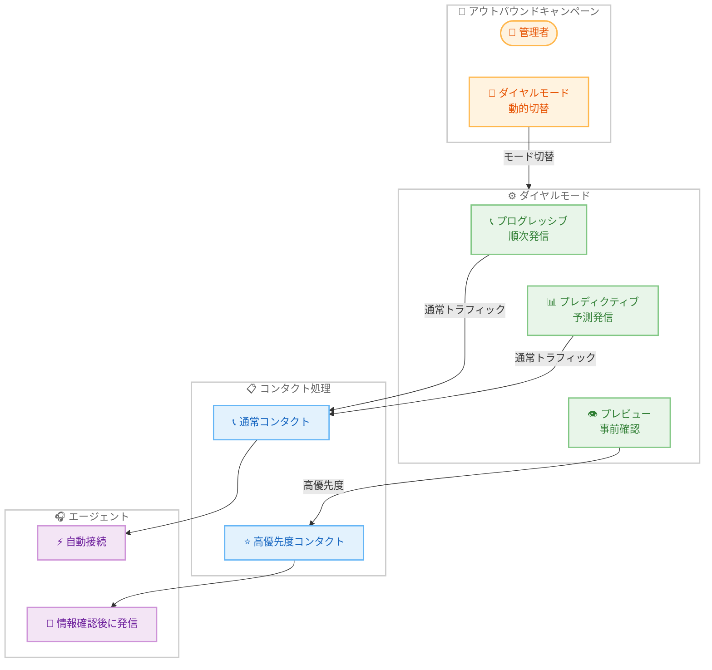

# Amazon Connect - アウトバウンドキャンペーンのダイヤルモード動的切替

**リリース日**: 2026 年 2 月 26 日
**サービス**: Amazon Connect
**機能**: アウトバウンドキャンペーンのダイヤルモード動的切替 (Dynamic Dialing Mode Switching)

📊 [このアップデートのインフォグラフィックを見る](https://takech9203.github.io/aws-news-summary/20260226-connect-dynamic-dialing-modes.html)

## 概要

Amazon Connect のアウトバウンドキャンペーンにおいて、ダイヤルモードの動的切替機能が一般提供 (GA) となった。この機能により、コンタクトセンターの管理者は、アクティブなキャンペーン実行中にプレビューモードと非プレビューモード (プログレッシブ、プレディクティブ) の間でダイヤルモードを切り替えることが可能になった。

従来、キャンペーンは開始時に設定したダイヤルモードに固定され、モードを変更するにはキャンペーンを停止して再作成する必要があった。動的切替により、キャンペーンを中断することなくリアルタイムで戦略を変更でき、エージェントの生産性とキャンペーン効率が向上する。たとえば、通常はプログレッシブモードで効率的にダイヤルし、優先度の高いコンタクトに対応する際にはプレビューモードに切り替えてエージェントが事前に顧客情報を確認できるようにし、対応完了後に再びプログレッシブモードに戻すといった運用が可能になる。

この機能は追加料金なしで利用でき、Amazon Connect アウトバウンドキャンペーンがサポートされているすべての AWS リージョンで提供されている。

**アップデート前の課題**

- キャンペーン開始後にダイヤルモードを変更できず、初期設定に固定されていた
- モードを変更するにはキャンペーンを停止して再作成する必要があり、運用が非効率だった
- 優先度の異なるコンタクトが混在するキャンペーンで、柔軟なダイヤル戦略を適用できなかった
- 日中のエージェント稼働状況の変動に応じたリアルタイムの戦略変更ができなかった

**アップデート後の改善**

- アクティブなキャンペーン実行中にダイヤルモードをリアルタイムで切替可能
- プレビューモードと非プレビューモード間の切替がシームレスに実行可能
- キャンペーンを中断することなく、コンタクトの優先度に応じた柔軟な運用が実現
- エージェントの稼働状況に応じた動的な戦略調整が可能に

## アーキテクチャ図

この図は、管理者がアクティブなキャンペーン実行中にダイヤルモードを動的に切り替え、コンタクトの優先度に応じてエージェントの対応方法を変更する流れを示している。プログレッシブやプレディクティブモードでは通常コンタクトを効率的に処理し、プレビューモードでは高優先度コンタクトに対してエージェントが事前に顧客情報を確認してから発信する。

## サービスアップデートの詳細

### 主要機能

1. **リアルタイムモード切替**
   - アクティブなキャンペーンを停止せずにダイヤルモードを変更
   - プレビューモードと非プレビューモード間でシームレスに切替
   - 切替時にキャンペーンの中断やデータ損失が発生しない

2. **対応可能なダイヤルモード**
   - **プレディクティブモード**: エージェントの稼働状況を予測し、複数の番号を同時にダイヤル。エージェントの生産性を最大化
   - **プログレッシブモード**: エージェントが前の通話を完了した後に次の番号をダイヤル。応答速度を重視
   - **プレビューモード**: エージェントが発信前に顧客情報を確認可能。高優先度のコンタクトや規制遵守が必要な場合に有効

3. **優先度ベースの運用**
   - 通常のコンタクトにはプログレッシブまたはプレディクティブモードを使用
   - 高優先度のコンタクトに到達した際にプレビューモードに切替
   - 対応完了後に元のモードに復帰

4. **追加コストなし**
   - ダイヤルモードの動的切替機能に追加料金は発生しない
   - 既存の Amazon Connect アウトバウンドキャンペーンの料金体系が適用

### ダイヤルモードの比較

| モード | 説明 | ユースケース | エージェント関与 |
|--------|------|-------------|----------------|
| **プレディクティブ** | エージェントの稼働を予測し複数番号を同時発信 | 大量発信、生産性重視 | 自動接続 |
| **プログレッシブ** | 前の通話完了後に次の番号を発信 | 応答速度重視、中規模発信 | 自動接続 |
| **プレビュー** | エージェントが顧客情報を確認後に発信 | 高優先度、規制遵守 | 事前確認後に手動発信 |

## 技術仕様

### ダイヤルモード切替の仕様

| 項目 | 詳細 |
|------|------|
| 切替方向 | プレビュー ↔ 非プレビュー (プログレッシブ、プレディクティブ) |
| 切替タイミング | キャンペーン実行中にリアルタイムで切替可能 |
| キャンペーン状態 | アクティブ状態のまま切替 (停止不要) |
| 進行中の通話への影響 | 進行中の通話には影響なし (新規発信から適用) |
| 追加料金 | なし |

### プレビューモードの制約事項

| 項目 | 詳細 |
|------|------|
| Check call progress ブロック | プレビューモードでは非サポート |
| エージェントウィスパーフロー | 非サポート (アウトバウンドウィスパーフローを使用) |
| 最大リング時間の設定 | 非サポート |
| 通話分類 | プレビューモード使用時は無効化が必要 |

## 設定方法

### 前提条件

1. Amazon Connect インスタンスが作成されていること
2. アウトバウンドキャンペーンが有効化されていること
3. アウトバウンド発信が有効なキューとルーティングプロファイルが設定されていること
4. キャンペーン用のコンタクトフローが作成されていること

### 手順

#### ステップ 1: アウトバウンドキャンペーンの作成

Amazon Connect 管理コンソールからアウトバウンドキャンペーンを作成します。

1. Amazon Connect 管理ウェブサイトにアクセス
2. ナビゲーションメニューから「Outbound campaigns」を選択
3. 「Create Campaign」をクリック
4. キャンペーン名、顧客セグメント、チャネル (Agent assisted voice) を設定

#### ステップ 2: 初期ダイヤルモードの選択

キャンペーン作成時に初期のダイヤルモードを選択します。

1. チャネル設定で「Agent assisted voice」を選択
2. コンタクトフロー、エージェントキュー、発信元電話番号を設定
3. ダイヤルモード (Predictive、Progressive、Preview) を選択
4. ダイヤル容量配分とエージェント配分を設定

#### ステップ 3: キャンペーン実行中のモード切替

キャンペーンがアクティブな状態で、ダイヤルモードを動的に切り替えます。

1. アクティブなキャンペーンの管理画面にアクセス
2. ダイヤルモードの設定セクションを開く
3. 新しいダイヤルモードを選択
4. 変更を適用

切替は即座に反映され、新規発信から新しいモードが適用されます。進行中の通話には影響しません。

#### ステップ 4: モードの復帰

高優先度のコンタクトへの対応が完了したら、元のダイヤルモードに戻します。

1. 同じ手順でダイヤルモード設定にアクセス
2. 元のモード (Progressive や Predictive) を選択
3. 変更を適用

## メリット

### ビジネス面

- **キャンペーン効率の向上**: キャンペーンを中断せずにダイヤル戦略を変更でき、運用効率が大幅に向上
- **顧客体験の改善**: 高優先度のコンタクトにはプレビューモードでパーソナライズされた対応を提供し、顧客満足度を向上
- **運用の柔軟性**: 日中のエージェント稼働状況やコンタクトの優先度に応じて、リアルタイムに戦略を調整
- **コスト効率**: 追加料金なしで利用でき、キャンペーンの再作成にかかる時間と労力を削減

### 技術面

- **シームレスな切替**: キャンペーンを停止・再作成する必要がなく、ダウンタイムゼロでモード変更が可能
- **既存ワークフローとの互換性**: 既存のコンタクトフローやキュー設定に影響を与えずにモード切替が可能
- **リアルタイム適用**: 切替は即座に反映され、新規発信から新しいモードが適用
- **規制遵守の強化**: プレビューモードへの切替により、TCPA や OFCOM などの規制要件に柔軟に対応

## デメリット・制約事項

### 制限事項

- プレビューモードでは Check call progress フローブロックがサポートされない
- プレビューモードではエージェントウィスパーフローが使用できない
- プレビューモードでは最大リング時間の設定ができない
- プレビューモード使用時は通話分類を無効にする必要がある

### 考慮すべき点

- ダイヤルモード切替時に進行中の通話には影響しないが、新規発信からモードが変更される点を考慮する必要がある
- プレビューモードとプログレッシブ/プレディクティブモードではコンタクトフローの設計要件が異なるため、両モードに対応するフロー設計が必要
- 頻繁なモード切替はエージェントの混乱を招く可能性があるため、切替のタイミングと頻度を計画的に管理することが推奨
- キャンペーン管理者はダイヤルモードの特性と制約を理解した上で切替を実施する必要がある

## ユースケース

### ユースケース 1: 高優先度コンタクトへの対応

**シナリオ**: 大規模なアウトバウンドキャンペーンをプログレッシブモードで実行中に、VIP 顧客や重要な案件のコンタクトリストが到達した。エージェントに事前に顧客情報を確認させた上で発信したい。

**実装例**:
1. プログレッシブモードでキャンペーンを実行
2. VIP コンタクトに到達した際にプレビューモードに切替
3. エージェントが顧客情報 (過去の取引履歴、アカウント状況など) を確認
4. 準備が整ったらエージェントが手動で発信
5. VIP コンタクトへの対応完了後、プログレッシブモードに復帰

**効果**: VIP 顧客にはパーソナライズされた高品質な対応を提供しつつ、通常のコンタクトには効率的なプログレッシブモードで対応できる。

### ユースケース 2: エージェント稼働状況に応じた動的調整

**シナリオ**: コンタクトセンターのエージェント稼働状況が日中で変動する。ピーク時にはプレディクティブモードで効率を最大化し、閑散時にはプレビューモードでエージェントに余裕を持たせたい。

**実装例**:
1. ピーク時 (午前中): プレディクティブモードで大量発信
2. 閑散時 (午後): プレビューモードに切替え、エージェントが丁寧に対応
3. 夕方ピーク: 再びプログレッシブモードに切替え

**効果**: エージェントの稼働状況に応じてダイヤル戦略を最適化し、一日を通じてキャンペーンの効率と品質のバランスを保てる。

### ユースケース 3: 規制遵守を必要とするキャンペーン

**シナリオ**: 金融サービスのアウトバウンドキャンペーンで、通常の顧客にはプログレッシブモードで効率的にアプローチしつつ、規制上の確認が必要なコンタクトにはプレビューモードで対応したい。

**実装例**:
1. 通常のコンタクトにはプログレッシブモードで発信
2. 規制確認が必要なコンタクト (債務回収、投資勧誘など) に到達した際にプレビューモードに切替
3. エージェントが顧客の同意状況や規制要件を事前に確認
4. 確認完了後に発信し、規制に準拠した対応を実施
5. 対応完了後、プログレッシブモードに復帰

**効果**: TCPA や OFCOM などの通信規制に準拠しつつ、キャンペーン全体の効率を維持できる。

## 料金

ダイヤルモードの動的切替機能に追加料金はかかりません。Amazon Connect アウトバウンドキャンペーンの標準的な料金体系が適用されます。

- **音声通話**: 通話時間に基づく従量課金
- **電話番号**: 電話番号の取得と維持に対する課金
- **アウトバウンドキャンペーン**: キャンペーン実行に対する標準料金

詳細な料金については、[Amazon Connect 料金ページ](https://aws.amazon.com/connect/pricing/)を参照してください。

## 利用可能リージョン

ダイヤルモードの動的切替機能は、Amazon Connect アウトバウンドキャンペーンがサポートされている以下の AWS リージョンで利用可能です。

- 米国東部 (バージニア北部)
- 米国西部 (オレゴン)
- カナダ (中部)
- 欧州 (フランクフルト)
- 欧州 (ロンドン)
- アジアパシフィック (ソウル)
- アジアパシフィック (シンガポール)
- アジアパシフィック (シドニー)
- アジアパシフィック (東京)
- アフリカ (ケープタウン)

## 関連サービス・機能

- **Amazon Connect アウトバウンドキャンペーン**: プロアクティブな顧客アウトリーチを実現するキャンペーン管理機能
- **Amazon Connect Customer Profiles**: 顧客プロファイル情報をエージェントに提供し、プレビューモードでの事前確認を強化
- **Amazon Connect Forecasting**: エージェントの稼働予測により、ダイヤルモード切替のタイミング判断を支援
- **Amazon CloudWatch**: キャンペーンのパフォーマンスメトリクスを監視し、モード切替の効果を分析

## 参考リンク

- 📊 [インフォグラフィック](https://takech9203.github.io/aws-news-summary/20260226-connect-dynamic-dialing-modes.html)
- [公式発表 (What's New)](https://aws.amazon.com/about-aws/whats-new/2026/02/connect-dynamic-dialing-modes/)
- [Amazon Connect アウトバウンドキャンペーン](https://aws.amazon.com/connect/outbound/)
- [ドキュメント: Amazon Connect 管理者ガイド](https://docs.aws.amazon.com/connect/latest/adminguide/what-is-amazon-connect.html)
- [アウトバウンドキャンペーンのベストプラクティス](https://docs.aws.amazon.com/connect/latest/adminguide/outbound-campaign-best-practices.html)
- [料金ページ](https://aws.amazon.com/connect/pricing/)

## まとめ

Amazon Connect アウトバウンドキャンペーンのダイヤルモード動的切替機能により、コンタクトセンターの管理者はキャンペーン実行中にプレビューモードと非プレビューモードをリアルタイムで切り替えられるようになった。従来はモード変更のためにキャンペーンの停止と再作成が必要だったが、この機能によりキャンペーンを中断することなくダイヤル戦略を変更できる。高優先度コンタクトへのパーソナライズされた対応、エージェント稼働状況に応じた動的な戦略調整、規制遵守が求められる場面での柔軟な運用が可能になる。追加料金なしで利用でき、アウトバウンドキャンペーンを活用しているすべての Amazon Connect ユーザーに導入を推奨する。
