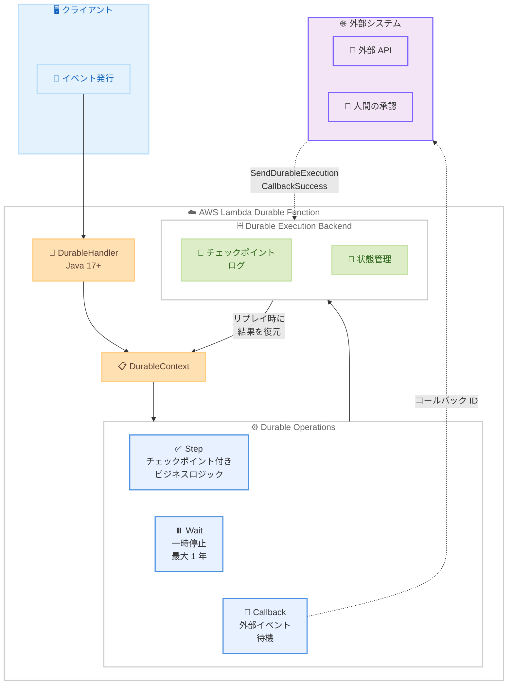

# AWS Lambda Durable Execution SDK for Java - Developer Preview

**リリース日**: 2026 年 2 月 26 日
**サービス**: AWS Lambda
**機能**: Durable Execution SDK for Java (Developer Preview)

📊 [このアップデートのインフォグラフィックを見る](https://takech9203.github.io/aws-news-summary/20260226-lambda-durable-execution-java-preview.html)

## 概要

AWS Lambda Durable Execution SDK for Java が Developer Preview として利用可能になりました。この SDK により、Java 開発者は注文処理パイプライン、AI アシスタントワークフロー、人間による承認プロセスなど、耐障害性を備えたマルチステップアプリケーションを、カスタムの進捗管理や外部オーケストレーションサービスの統合なしに構築できるようになります。

Lambda Durable Functions は、Lambda のイベント駆動型プログラミングモデルを拡張し、進捗を自動的にチェックポイントし、外部イベントの待機中に最大 1 年間実行を一時停止できる機能を提供します。新しい Java SDK は Java 17+ と互換性があり、JavaScript、TypeScript、Python に続く 4 番目の言語サポートとなります。

**アップデート前の課題**

- Java 開発者は Lambda Durable Functions を利用できず、JavaScript、TypeScript、Python のみがサポートされていた
- マルチステップの耐障害性ワークフローを構築するには、Amazon DynamoDB や Amazon S3 などの外部ストレージを使用したカスタムの状態管理が必要だった
- 長時間の待機が必要な処理 (人間の承認など) では、AWS Step Functions などの外部オーケストレーションサービスの統合が必要だった
- 障害発生時のリトライや進捗管理のロジックをビジネスロジックとは別に実装する必要があり、開発の複雑さが増していた

**アップデート後の改善**

- Java 17+ を使用して Lambda Durable Functions を構築可能に
- `DurableContext` オブジェクトを通じて、チェックポイント管理、リプレイ調整、状態分離を自動化
- Steps、Waits、Callbacks、子コンテキストなどの Durable Operations を Java で利用可能
- オンデマンド関数は一時停止中に課金されないため、長時間待機のコストを最適化

## アーキテクチャ図



クライアントからイベントが発行されると、DurableHandler がイベントを受信し、DurableContext を通じて Durable Operations を実行します。各オペレーションは自動的にチェックポイントされ、障害発生時やリプレイ時には Backend から状態が復元されます。Callback を使用すると、外部システムからの応答を待機しながら、コンピューティング料金を抑えることができます。

## サービスアップデートの詳細

### 主要機能

1. **DurableHandler による Java ネイティブ統合**
   - `DurableHandler<TInput, TOutput>` クラスを継承するだけで Durable Function を作成可能
   - 標準的な Lambda ハンドラーパターンを踏襲し、`handleRequest` メソッドをオーバーライド
   - `DurableContext` が Lambda コンテキストに代わり、すべての Durable Operations を提供

2. **Steps - 自動チェックポイント付きビジネスロジック**
   - 外部サービスの呼び出しや計算処理をチェックポイントで保護
   - 設定可能なリトライ戦略と実行セマンティクス (at-most-once / at-least-once)
   - リプレイ時にはチェックポイントされた結果を返却し、再実行を回避

3. **Waits - コンピューティングリソースを消費しない一時停止**
   - 指定した期間、実行を一時停止
   - オンデマンド関数では一時停止中のコンピューティング料金が発生しない
   - 最大 1 年間の待機が可能

4. **Callbacks - 外部システムとの連携**
   - `createCallback` でコールバック ID を生成し、外部システムに送信
   - 外部システムが `SendDurableExecutionCallbackSuccess` または `SendDurableExecutionCallbackFailure` API で応答
   - タイムアウト設定により、無期限の待機を防止

5. **子コンテキスト - ワークフローの構造化**
   - `runInChildContext` で独立した実行コンテキストを作成
   - 子コンテキスト内の操作は単一のユニットとしてリトライ・リカバリ
   - 複数の子コンテキストによる並行処理で CPU コアを効率的に活用

6. **Function Invocation - 関数間の連携**
   - `context.invoke` で他の Lambda 関数を呼び出し、結果を待機
   - 関数のコンポジションとワークフローの分割が可能

### Java SDK で利用可能な機能と開発中の機能

| 機能 | Java SDK ステータス |
|------|-------------------|
| Steps | 利用可能 |
| Waits | 利用可能 |
| Callbacks (createCallback) | 利用可能 |
| Child Contexts | 利用可能 |
| Function Invocation | 利用可能 |
| waitForCallback | 開発中 |
| Parallel Execution | 開発中 |
| Map | 開発中 |
| waitForCondition | 開発中 |

## 技術仕様

### SDK 情報

| 項目 | 詳細 |
|------|------|
| SDK 名 | AWS Lambda Durable Execution SDK for Java |
| ステータス | Developer Preview |
| 対応 Java バージョン | Java 17+ |
| GitHub リポジトリ | [aws/aws-durable-execution-sdk-java](https://github.com/aws/aws-durable-execution-sdk-java/) |
| パッケージ | `software.amazon.lambda.durable` |

### DurableConfig 設定

| パラメータ | 説明 | 値 |
|-----------|------|-----|
| ExecutionTimeout | Durable Execution 全体のタイムアウト | 最大 1 年 (非同期呼び出し時) |
| RetentionPeriodInDays | 実行完了後のデータ保持期間 | 1 - 90 日 (デフォルト 14 日) |

### チェックポイントの仕組み

1. **既存チェックポイントの確認**: 以前の呼び出しで完了済みか確認。完了済みの場合、保存された結果を返却
2. **オペレーションの実行**: チェックポイントが存在しない場合、オペレーションコードを実行
3. **チェックポイントの作成**: 結果をシリアライズし、オペレーション種別、名前、入力、結果、タイムスタンプを記録
4. **チェックポイントの永続化**: Lambda チェックポイント API を呼び出し、永続化を保証
5. **結果の返却**: オペレーション結果をコードに返却し、次のオペレーションへ進行

### リプレイの動作

1. **チェックポイントログの読み込み**: 実行のチェックポイントログを Lambda から取得
2. **最初からの実行**: ハンドラー関数を最初から呼び出し (一時停止箇所からではない)
3. **完了済み Durable Operations のスキップ**: チェックポイントログと照合し、完了済みの場合は保存結果を返却
4. **中断箇所からの再開**: チェックポイントのないオペレーションに到達すると、通常の実行を再開

### API 変更履歴

| 日付 | サービス | 変更内容 |
|------|----------|----------|
| 2026/02/26 | AWS Lambda | Durable Execution SDK for Java の Developer Preview リリース |

## 設定方法

### 前提条件

1. Java 17 以上がインストールされていること
2. AWS CLI または AWS SAM CLI がインストールされていること
3. 適切な IAM 権限 (`AWSLambdaBasicDurableExecutionRole` マネージドポリシー)
4. Lambda 関数のデプロイ権限

### 手順

#### ステップ 1: SDK の依存関係を追加

```xml
<!-- pom.xml -->
<dependency>
    <groupId>software.amazon.lambda</groupId>
    <artifactId>durable-execution-sdk-java</artifactId>
    <version>0.1.0</version>
</dependency>
```

Maven プロジェクトに Durable Execution SDK for Java の依存関係を追加します。

#### ステップ 2: DurableHandler を継承した関数の作成

```java
import software.amazon.lambda.durable.DurableContext;
import software.amazon.lambda.durable.DurableHandler;

public class OrderProcessor extends DurableHandler<OrderEvent, OrderResult> {

    @Override
    public OrderResult handleRequest(OrderEvent event, DurableContext context) {
        // Step 1: 注文の検証
        var validation = context.step("validate-order", ValidationResult.class,
            () -> validateOrder(event));

        // Step 2: 支払い処理
        var payment = context.step("process-payment", PaymentResult.class,
            () -> processPayment(event.getPaymentInfo()));

        // Step 3: 在庫の確保
        var inventory = context.step("reserve-inventory", InventoryResult.class,
            () -> reserveInventory(event.getItems()));

        // Step 4: 配送手配
        var shipping = context.step("arrange-shipping", ShippingResult.class,
            () -> arrangeShipping(event.getShippingAddress()));

        return new OrderResult(validation, payment, inventory, shipping);
    }
}
```

`DurableHandler` を継承し、`handleRequest` メソッドで Durable Operations を使用したビジネスロジックを実装します。各 `context.step` は自動的にチェックポイントされ、障害時にリトライが行われます。

#### ステップ 3: Callback を使用した人間の承認フロー

```java
import software.amazon.lambda.durable.DurableContext;
import software.amazon.lambda.durable.DurableHandler;
import software.amazon.lambda.durable.CallbackConfig;
import java.time.Duration;

public class ApprovalWorkflow extends DurableHandler<ApprovalRequest, ApprovalResult> {

    @Override
    public ApprovalResult handleRequest(ApprovalRequest event, DurableContext context) {
        // Step 1: 申請内容の分析
        var analysis = context.step("analyze-request", AnalysisResult.class,
            () -> analyzeRequest(event));

        // Step 2: 承認者への通知とコールバック待機
        var config = CallbackConfig.builder(Duration.ofHours(24)).timeout();
        var callback = context.createCallback("approval", String.class, config);

        context.step("send-notification", String.class, () -> {
            notificationService.sendApprovalRequest(
                callback.callbackId(), event, analysis);
            return "notification-sent";
        });

        // 承認結果を待機 (最大 24 時間、課金なし)
        String approvalDecision = callback.get();

        // Step 3: 承認結果に基づく処理
        var result = context.step("process-decision", ApprovalResult.class,
            () -> processDecision(approvalDecision, event));

        return result;
    }
}
```

`createCallback` でコールバック ID を生成し、外部システムに送信します。外部システムが Lambda API を通じて応答するまで、オンデマンド関数のコンピューティング料金は発生しません。

#### ステップ 4: Wait を使用した時間ベースの一時停止

```java
import java.time.Duration;

// Durable Function 内での Wait の使用
context.step("send-reminder", String.class,
    () -> sendReminderEmail(userEmail));

// 1 時間待機 (オンデマンド関数では課金なし)
context.wait(Duration.ofHours(1));

// 待機後の処理を続行
context.step("check-status", StatusResult.class,
    () -> checkUserStatus(userId));
```

`context.wait` を使用すると、指定した期間だけ実行を一時停止します。オンデマンド関数では、一時停止中のコンピューティング料金は発生しません。

#### ステップ 5: AWS SAM テンプレートの設定

```yaml
AWSTemplateFormatVersion: '2010-09-09'
Transform: AWS::Serverless-2016-10-31

Resources:
  OrderProcessorFunction:
    Type: AWS::Serverless::Function
    Properties:
      FunctionName: OrderProcessorFunction
      CodeUri: ./target
      Handler: com.example.OrderProcessor::handleRequest
      Runtime: java21
      Architectures:
        - x86_64
      MemorySize: 512
      Timeout: 60
      DurableConfig:
        ExecutionTimeout: 90000   # Durable Execution 全体のタイムアウト (秒)
        RetentionPeriodInDays: 14 # 完了後のデータ保持期間
```

AWS SAM テンプレートで `DurableConfig` を設定することで、Lambda 関数を Durable Function として有効化します。`ExecutionTimeout` は Durable Execution 全体のタイムアウトを定義し、個々の呼び出しの `Timeout` とは別に設定します。

#### ステップ 6: デプロイとテスト

```bash
# ビルドとデプロイ
sam build
sam deploy --guided

# ローカルテスト
sam local invoke OrderProcessorFunction \
  --event events/order-event.json

# コールバックの完了 (ローカルテスト時)
sam local callback succeed <callback-id> \
  --result '{"decision": "approved"}'
```

AWS SAM を使用してビルド、デプロイ、ローカルテストを実行します。

## メリット

### ビジネス面

- **開発速度の向上**: カスタムの状態管理やエラーハンドリングのコードが不要になり、ビジネスロジックに集中できる
- **Java エコシステムの活用**: 既存の Java ライブラリ、フレームワーク、ツールをそのまま活用してワークフローを構築可能
- **コスト最適化**: Wait 中のコンピューティング料金が発生しないため、長時間の承認待ちなどのコストを大幅に削減
- **運用の簡素化**: 外部オーケストレーションサービスの管理が不要になり、運用負荷を軽減

### 技術面

- **自動チェックポイント**: 各 Step の結果が自動的に永続化され、障害発生時に最後のチェックポイントから再開
- **決定論的リプレイ**: チェックポイントログに基づく決定論的なリプレイにより、実行の一貫性を保証
- **状態の分離**: 各 Durable Execution は独立したチェックポイントログを持ち、保存時の暗号化により安全性を確保
- **子コンテキストによる並行処理**: 複数の子コンテキストを使用して CPU コアを効率的に活用した並行処理が可能

## デメリット・制約事項

### 制限事項

- Developer Preview のため、本番環境での使用は推奨されない
- Java SDK では `waitForCallback`、`parallel`、`map`、`waitForCondition` が現在開発中
- チェックポイントの最大サイズは 256 KB であり、大きなペイロードの取り扱いには注意が必要
- Durable 設定は関数作成時に有効化する必要があり、既存の関数に後から追加することは不可
- 決定論的なコードが必要であり、同じ入力とチェックポイントログに対して同じ Durable Operations の呼び出し順序を保証する必要がある

### 考慮すべき点

- リプレイ時のコンピューティング料金が発生するため、リプレイの頻度とコストを考慮する必要がある
- `$LATEST` バージョンの使用はプロトタイピングのみに留め、本番環境では明示的なバージョンまたはエイリアスを使用すること
- Durable Operations のメータリングにより、オペレーション数、データ書き込み量、データ保持量に基づく追加コストが発生する
- Java SDK は Preview であり、API の変更が発生する可能性がある

## ユースケース

### ユースケース 1: 注文処理パイプライン

**シナリオ**: 在庫確認、支払い処理、配送手配、通知送信を含むマルチステップの注文処理

**実装例**:
```java
public class OrderPipeline extends DurableHandler<OrderEvent, OrderResult> {
    @Override
    public OrderResult handleRequest(OrderEvent event, DurableContext context) {
        // 各ステップが自動的にチェックポイントされる
        var inventory = context.step("check-inventory", InventoryResult.class,
            () -> inventoryService.check(event.getItems()));

        var payment = context.step("process-payment", PaymentResult.class,
            () -> paymentService.charge(event.getPayment()));

        var shipping = context.step("arrange-shipping", ShippingResult.class,
            () -> shippingService.create(event.getAddress(), inventory));

        context.step("send-notification", Void.class,
            () -> { notificationService.notify(event.getEmail(), shipping); return null; });

        return new OrderResult(inventory, payment, shipping);
    }
}
```

**効果**: 支払い処理後に配送手配で障害が発生しても、支払い処理をリトライせずに配送手配から再開できます。

### ユースケース 2: AI アシスタントワークフロー

**シナリオ**: LLM による分析と人間によるレビューを組み合わせた AI アシスタントワークフロー

**実装例**:
```java
public class AIReviewWorkflow extends DurableHandler<Document, ReviewResult> {
    @Override
    public ReviewResult handleRequest(Document doc, DurableContext context) {
        // Step 1: LLM による文書分析
        var analysis = context.step("llm-analysis", AnalysisResult.class,
            () -> llmService.analyze(doc));

        // Step 2: リスクスコアが高い場合、人間のレビューを要求
        if (analysis.getRiskScore() > 0.8) {
            var config = CallbackConfig.builder(Duration.ofDays(7)).timeout();
            var callback = context.createCallback("human-review", String.class, config);

            context.step("request-review", String.class, () -> {
                reviewService.requestHumanReview(callback.callbackId(), analysis);
                return "review-requested";
            });

            // 最大 7 日間待機 (課金なし)
            String reviewDecision = callback.get();

            return context.step("finalize", ReviewResult.class,
                () -> finalizeReview(analysis, reviewDecision));
        }

        return context.step("auto-approve", ReviewResult.class,
            () -> autoApprove(analysis));
    }
}
```

**効果**: LLM 分析と人間のレビューをシームレスに統合し、待機中のコストを抑えながら、最大 7 日間の承認待ちに対応できます。

### ユースケース 3: 保険金請求処理

**シナリオ**: 不正検出、人間の審査、支払い処理を含む保険金請求のエンドツーエンド処理

**実装例**:
```java
public class ClaimProcessor extends DurableHandler<ClaimEvent, ClaimResult> {
    @Override
    public ClaimResult handleRequest(ClaimEvent event, DurableContext context) {
        // Step 1: 不正検出 AI による分析
        var fraudCheck = context.step("fraud-detection", FraudResult.class,
            () -> fraudDetectionService.analyze(event));

        // Step 2: 高額請求は人間の審査が必要
        if (event.getAmount() > 10000 || fraudCheck.isSuspicious()) {
            var config = CallbackConfig.builder(Duration.ofDays(14)).timeout();
            var callback = context.createCallback("adjuster-review", String.class, config);

            context.step("notify-adjuster", String.class, () -> {
                adjusterService.assignClaim(callback.callbackId(), event, fraudCheck);
                return "assigned";
            });

            String decision = callback.get();
            if ("rejected".equals(decision)) {
                return new ClaimResult(event.getClaimId(), "REJECTED");
            }
        }

        // Step 3: 支払い処理
        var payment = context.step("process-payment", PaymentResult.class,
            () -> paymentService.processClaim(event));

        return new ClaimResult(event.getClaimId(), "APPROVED", payment);
    }
}
```

**効果**: 不正検出から人間の審査、支払い処理まで一貫したワークフローを単一の関数で実現し、各ステップの障害からの自動リカバリを保証します。

## 料金

Lambda Durable Functions の料金は、既存の Lambda コンピューティング料金に加え、Durable Operations に関連する 3 つの要素で構成されます。

### 料金体系

| 料金項目 | 単価 |
|---------|------|
| Durable Operations | $8.00 / 100 万オペレーション |
| Data Written | $0.25 / GB |
| Data Retained | $0.15 / GB-month |

- **Durable Operations**: 実行の開始、Step の完了、Wait の作成などの各オペレーションに課金
- **Data Written**: チェックポイントに書き込まれるデータ量 (入力ペイロード、Step の結果、コールバックデータ) に課金
- **Data Retained**: 実行中および完了後の保持期間中のデータストレージに課金 (日割り計算)

### 料金例

100 万件の保険金請求処理 (各実行: 8 KB の入力、3 つの 32 KB ステップ、7 日間の待機、14 日間の保持):

| 項目 | 計算 | 料金 |
|------|------|------|
| コンピューティング | 3,200 万 GB-s x $0.0000133334 | $421.34 |
| リクエスト | 200 万リクエスト | $0.20 |
| Durable Operations | 400 万オペレーション x $8.00/M | $32.00 |
| Data Written | 104 GB x $0.25/GB | $26.00 |
| Data Retained | 72.8 GB-month x $0.15/GB-month | $10.92 |
| **合計** | | **$490.46** |

注: Wait 中のオンデマンド関数のコンピューティング料金は発生しません。リプレイのためのコンピューティング料金は適用されます。

最新の料金は [Lambda 料金ページ](https://aws.amazon.com/lambda/pricing/) を参照してください。

## 利用可能リージョン

Lambda Durable Functions が利用可能なリージョンで提供されます。最新のリージョン対応状況は [AWS Capabilities by Region ページ](https://builder.aws.com/build/capabilities) を参照してください。

## 関連サービス・機能

- **AWS Step Functions**: 複雑なワークフローのオーケストレーション。Durable Functions はコード内で完結するアプローチで、Step Functions はビジュアルワークフローベースのアプローチを提供
- **Amazon DynamoDB**: Durable Functions を使用しない場合の外部状態管理ストア
- **Amazon EventBridge**: イベント駆動型アーキテクチャとの統合
- **AWS SAM**: Durable Functions のローカル開発、テスト、デプロイに対応
- **AWS CDK / AWS CloudFormation**: Infrastructure as Code による Durable Functions のプロビジョニング

## 参考リンク

- 📊 [インフォグラフィック](https://takech9203.github.io/aws-news-summary/20260226-lambda-durable-execution-java-preview.html)
- [公式発表 (What's New)](https://aws.amazon.com/about-aws/whats-new/2026/02/lambda-durable-execution-java-preview/)
- [ブログ - Building fault-tolerant applications with AWS Lambda durable functions](https://aws.amazon.com/blogs/compute/building-fault-tolerant-long-running-application-with-aws-lambda-durable-functions/)
- [ドキュメント - Durable Execution SDK](https://docs.aws.amazon.com/lambda/latest/dg/durable-execution-sdk.html)
- [GitHub - AWS Durable Execution SDK for Java](https://github.com/aws/aws-durable-execution-sdk-java/)
- [製品ページ - Lambda Durable Functions](https://aws.amazon.com/lambda/lambda-durable-functions/)
- [料金ページ](https://aws.amazon.com/lambda/pricing/)

## まとめ

AWS Lambda Durable Execution SDK for Java の Developer Preview リリースにより、Java 開発者は Lambda のイベント駆動型プログラミングモデル内で、耐障害性を備えたマルチステップアプリケーションを構築できるようになりました。Steps による自動チェックポイント、Waits による最大 1 年間のコスト効率の良い一時停止、Callbacks による外部システムとの連携など、強力なプリミティブが提供されます。カスタムの状態管理や外部オーケストレーションサービスの統合が不要になり、開発者はビジネスロジックに集中できます。Java 17+ を使用している組織は、注文処理パイプライン、AI ワークフロー、承認プロセスなどのユースケースで、この SDK の評価を開始することをお勧めします。ただし、現在は Developer Preview であるため、本番環境への導入は GA リリースを待つことが推奨されます。
