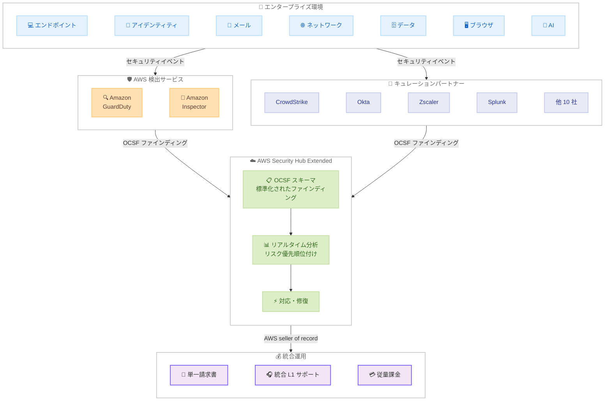

# AWS Security Hub - Extended プランでフルスタックエンタープライズセキュリティを実現

**リリース日**: 2026 年 2 月 26 日
**サービス**: AWS Security Hub
**機能**: Security Hub Extended plan

📊 [このアップデートのインフォグラフィックを見る](https://takech9203.github.io/aws-news-summary/20260226-sec-hub-extended.html)

## 概要

AWS は AWS Security Hub Extended プランの一般提供を発表しました。Security Hub Extended プランは、エンタープライズ全体で統合されたセキュリティオペレーションを単一ベンダーエクスペリエンスで拡張する新しいプランです。複数のベンダー関係の管理や長期の調達サイクルがもたらす複雑さに対処し、AWS の検出サービスとキュレーションされたパートナーセキュリティソリューションを統合します。

re:Invent 2025 で発表された Security Hub の刷新では、Amazon GuardDuty や Amazon Inspector を含む AWS セキュリティサービスを単一のエクスペリエンスに統合しました。今回の Extended プランでは、この統合をさらに拡大し、エンドポイント、アイデンティティ、メール、ネットワーク、データ、ブラウザ、クラウド、AI、セキュリティオペレーションにわたるパートナーソリューションを追加します。

**アップデート前の課題**

- 複数のセキュリティベンダーとの個別の調達サイクルや契約交渉が必要で、時間とリソースを消費していた
- 各ベンダーのセキュリティファインディングが異なるフォーマットで提供され、統合的な可視化が困難だった
- セキュリティスタック全体をカバーするには、個別のベンダー契約、請求、サポート窓口の管理が必要だった
- AWS のセキュリティサービスとサードパーティソリューション間の手動統合作業が運用負荷を増大させていた

**アップデート後の改善**

- AWS が販売代理店 (seller of record) となり、事前交渉済みの従量課金で単一請求書に統合
- キュレーションされた 14 社のパートナーソリューションを Security Hub コンソールから直接サブスクライブ可能
- すべてのパートナーソリューションが OCSF スキーマでファインディングを出力し、Security Hub に自動集約
- AWS Enterprise Support のお客様は統合された L1 サポートを利用可能

## アーキテクチャ図

この図は、エンタープライズ環境のさまざまなセキュリティドメインから、AWS 検出サービスとキュレーションされたパートナーソリューションが OCSF スキーマでファインディングを Security Hub Extended に送信し、リアルタイム分析とリスク優先順位付けを行う流れを示しています。AWS が販売代理店となることで、単一請求書、統合 L1 サポート、従量課金による統合運用が実現されます。

## サービスアップデートの詳細

### 主要機能

1. **調達の効率化**
   - AWS が販売代理店 (seller of record) として機能し、すべてのパートナーソリューションの利用料金を単一の請求書に統合
   - 事前交渉済みの従量課金で、個別のベンダー契約交渉が不要
   - AWS Enterprise Support のお客様は統合された L1 サポートを利用可能
   - AWS Private Pricing の対象となる場合がある

2. **包括的な保護**
   - AWS の検出サービス (Amazon GuardDuty、Amazon Inspector) とキュレーションされたパートナーソリューションを統合
   - エンドポイント、アイデンティティ、メール、ネットワーク、データ、ブラウザ、クラウド、AI、セキュリティオペレーションの 9 つのドメインをカバー
   - 14 社のパートナーソリューションを選択的に導入可能

3. **運用効率の向上**
   - すべてのファインディングが OCSF (Open Cybersecurity Schema Framework) スキーマで標準化
   - Security Hub に自動集約され、セキュリティ環境全体の集中可視化を提供
   - 手動統合作業の負担を軽減

### パートナーソリューション

| パートナー | 主なセキュリティドメイン |
|-----------|----------------------|
| 7AI | セキュリティオペレーション |
| Britive | アイデンティティ |
| CrowdStrike | エンドポイント |
| Cyera | データ |
| Island | ブラウザ |
| Noma | AI |
| Okta | アイデンティティ |
| Oligo | アプリケーション |
| Opti | セキュリティオペレーション |
| Proofpoint | メール |
| SailPoint | アイデンティティ |
| Splunk (Cisco) | セキュリティオペレーション |
| Upwind | クラウド |
| Zscaler | ネットワーク |

## 技術仕様

### OCSF スキーマ統合

| 項目 | 詳細 |
|------|------|
| スキーマ | Open Cybersecurity Schema Framework (OCSF) |
| ファインディング形式 | すべてのパートナーソリューションが OCSF 標準形式で出力 |
| 集約方式 | Security Hub に自動集約 |
| 可視化 | Security Hub コンソールで集中管理 |
| 分析 | リアルタイム分析とリスク優先順位付け |

### API の変更

2026 年 2 月 26 日付で SecurityHub API に以下の更新が適用されました。

| メソッド | 変更内容 |
|---------|---------|
| `DescribeProductsV2` | EXTENDED PLAN 統合タイプのサポートを追加 |
| `GetFindingStatisticsV2` | `metadata.product.vendor` の名前による GroupBy サポートを追加 |

### Security Hub プラン比較

| 項目 | 標準プラン | Extended プラン |
|------|----------|---------------|
| AWS 検出サービス | GuardDuty、Inspector | GuardDuty、Inspector |
| パートナーソリューション | なし | 14 社のキュレーションソリューション |
| ファインディング形式 | OCSF | OCSF |
| 請求 | AWS 標準請求 | パートナー利用含む統合請求 |
| サポート | 標準サポート | 統合 L1 サポート (Enterprise Support) |
| 調達 | 個別ベンダー契約 | AWS が販売代理店 |

## 設定方法

### 前提条件

1. AWS アカウントと AWS Security Hub が有効であること
2. Security Hub の最新バージョン (v2) が有効化されていること
3. 適切な IAM 権限

### 手順

#### ステップ 1: Security Hub コンソールにアクセス

[Security Hub コンソール](https://console.aws.amazon.com/securityhub/v2/home) にアクセスします。

#### ステップ 2: Extended プランを選択

Security Hub コンソールの **Management** メニューから **Extended plan** を選択します。キュレーションされたパートナーソリューションの一覧が表示されます。

#### ステップ 3: パートナーソリューションのサブスクライブ

必要なパートナーソリューションを選択してサブスクライブします。サブスクライブすると、各パートナーの自動オンボーディングエクスペリエンスに遷移します。

#### ステップ 4: オンボーディングの完了

各パートナーのオンボーディングプロセスを完了します。オンボーディング完了後、消費ベースの課金が自動的に開始され、Security Hub の請求書の一部として毎月請求されます。

#### ステップ 5: ファインディングの確認

パートナーソリューションからのファインディングが OCSF スキーマで自動的に Security Hub に集約されます。Security Hub コンソールですべてのファインディングを統合的に確認できます。

## メリット

### ビジネス面

- **調達の簡素化**: 複数のベンダー契約交渉と調達サイクルを単一の AWS 調達プロセスに統合し、時間とリソースを大幅に削減
- **コスト最適化**: 従量課金または定額制で初期投資不要、長期コミットメントなし。ビジネスニーズの変化に応じてセキュリティカテゴリの追加・削除が柔軟に可能
- **統合請求**: すべてのパートナーソリューションの利用料金が AWS の請求書に統合され、経理処理が簡素化
- **統合サポート**: Enterprise Support のお客様は AWS からの統合 L1 サポートを受けることができ、サポート窓口の管理を簡素化

### 技術面

- **標準化されたファインディング**: すべてのソリューションが OCSF スキーマでファインディングを出力するため、データの正規化作業が不要
- **集中可視化**: AWS とパートナーの両方のセキュリティファインディングを単一のコンソールで管理
- **境界を超えたリスク検出**: エンドポイント、アイデンティティ、ネットワークなど複数のドメインにまたがるリスクを迅速に特定・対応
- **手動統合の排除**: パートナーソリューションとの統合が自動化され、エンジニアリングリソースを他の業務に集中可能

## デメリット・制約事項

### 制限事項

- パートナーソリューション自体の利用には別途料金が発生し、従量課金ベースで Security Hub の請求に含まれる
- パートナーソリューションの利用可能範囲は各パートナーの提供範囲に依存する
- AWS 商用リージョンでのみ利用可能であり、GovCloud リージョンでの提供状況は別途確認が必要

### 考慮すべき点

- パートナーソリューションのオンボーディングプロセスはパートナーごとに異なるため、それぞれのセットアップ手順に従う必要がある
- Extended プランのパートナーソリューションを最大限に活用するには、Security Hub の最新バージョン (v2) の有効化が推奨される
- 各パートナーソリューションの詳細な技術要件や前提条件は、個別に確認する必要がある
- 既存のサードパーティ統合がある場合、Extended プランへの移行計画を事前に策定することを推奨

## ユースケース

### ユースケース 1: エンタープライズセキュリティスタックの統合

**シナリオ**: 大規模企業がエンドポイント保護、アイデンティティ管理、ネットワークセキュリティなど複数のセキュリティベンダーを利用しており、調達・運用の複雑さを解消したい。

**実装例**:
1. Security Hub Extended プランを有効化
2. CrowdStrike (エンドポイント)、Okta (アイデンティティ)、Zscaler (ネットワーク) をサブスクライブ
3. すべてのファインディングが OCSF スキーマで Security Hub に自動集約

**効果**: 3 つの個別ベンダー契約を単一の AWS 調達プロセスに統合。請求書の統合、L1 サポートの一元化により、調達・運用コストを削減しながらセキュリティカバレッジを維持します。

### ユースケース 2: データ保護とコンプライアンス強化

**シナリオ**: 規制の厳しい業界の企業が、データセキュリティ、メールセキュリティ、AI セキュリティを包括的にカバーし、コンプライアンス要件を満たしたい。

**実装例**:
1. Cyera (データセキュリティ)、Proofpoint (メールセキュリティ)、Noma (AI セキュリティ) をサブスクライブ
2. Security Hub でドメイン横断のファインディングを統合分析
3. リスク優先順位付けに基づいて対応を実施

**効果**: データ、メール、AI の 3 つのドメインにまたがるセキュリティリスクを OCSF スキーマで標準化し、統合的に可視化。コンプライアンス監査に必要な証跡を Security Hub から一元的に取得できます。

### ユースケース 3: セキュリティオペレーションの効率化

**シナリオ**: SOC (Security Operations Center) チームがアラート疲れに悩んでおり、複数のセキュリティツールからのファインディングを効率的にトリアージしたい。

**実装例**:
1. Splunk (セキュリティオペレーション)、CrowdStrike (エンドポイント)、Upwind (クラウド) をサブスクライブ
2. Security Hub のリアルタイム分析でファインディングを自動的に優先順位付け
3. 高優先度のリスクから順に対応を実施

**効果**: 複数のセキュリティドメインのファインディングが標準化されたフォーマットで集約され、SOC チームは単一のコンソールで効率的にトリアージが可能。手動でのデータ正規化や統合作業が不要になり、対応速度が向上します。

## 料金

Security Hub Extended プランの料金体系は以下のとおりです。

| 項目 | 詳細 |
|------|------|
| Security Hub 基本料金 | Security Hub の標準料金が適用 |
| パートナーソリューション | 従量課金 (pay-as-you-go) または定額制 (flat-rate) |
| 初期費用 | 不要 |
| 長期コミットメント | 不要 |
| 請求方式 | AWS の月次請求書に統合 |
| Private Pricing | 対象となる場合がある |

パートナーソリューションの具体的な料金は、各ソリューションの利用量に基づいて計算されます。詳細は [AWS Security Hub 料金ページ](https://aws.amazon.com/security-hub/pricing/) を参照してください。

## 利用可能リージョン

Security Hub Extended プランは、Security Hub が利用可能なすべての AWS 商用リージョンで一般提供されています。利用可能なリージョンの一覧は [AWS リージョン表](https://aws.amazon.com/about-aws/global-infrastructure/regional-product-services/) を参照してください。

## 関連サービス・機能

- **AWS Security Hub**: AWS セキュリティサービスを統合し、セキュリティファインディングの集約・分析・対応を提供するサービス
- **Amazon GuardDuty**: 脅威検出サービス。Security Hub と統合されたファインディングを提供
- **Amazon Inspector**: 脆弱性管理サービス。Security Hub と統合されたファインディングを提供
- **OCSF (Open Cybersecurity Schema Framework)**: セキュリティファインディングの標準化スキーマ。Security Hub Extended のすべてのパートナーソリューションが採用

## 参考リンク

- 📊 [インフォグラフィック](https://takech9203.github.io/aws-news-summary/20260226-sec-hub-extended.html)
- [公式発表 (What's New)](https://aws.amazon.com/about-aws/whats-new/2026/02/sec-hub-extended/)
- [ブログ - AWS Security Hub Extended offers full-stack enterprise security with curated partner solutions](https://aws.amazon.com/blogs/aws/aws-security-hub-extended-offers-full-stack-enterprise-security-with-curated-partner-solutions/)
- [AWS Security Hub コンソール](https://console.aws.amazon.com/securityhub/v2/home)
- [AWS Security Hub 製品ページ](https://aws.amazon.com/security-hub/)
- [AWS Security Hub 料金ページ](https://aws.amazon.com/security-hub/pricing/)
- [関連 API 変更 - SecurityHub](https://awsapichanges.com/archive/changes/f76046-securityhub.html)
- [OCSF (Open Cybersecurity Schema Framework)](https://github.com/ocsf)
- [Security Hub ユーザーガイド](https://docs.aws.amazon.com/securityhub/latest/userguide/what-are-securityhub-services.html)

## まとめ

AWS Security Hub Extended プランの一般提供により、エンタープライズは AWS の検出サービスとキュレーションされたパートナーセキュリティソリューションを単一のエクスペリエンスで統合できるようになりました。7AI、Britive、CrowdStrike、Cyera、Island、Noma、Okta、Oligo、Opti、Proofpoint、SailPoint、Splunk (Cisco)、Upwind、Zscaler の 14 社のパートナーソリューションが、エンドポイント、アイデンティティ、メール、ネットワーク、データ、ブラウザ、クラウド、AI、セキュリティオペレーションの 9 つのドメインをカバーします。AWS が販売代理店となり、従量課金の単一請求書、統合 L1 サポート、OCSF スキーマによる標準化されたファインディングの自動集約を提供します。複数のセキュリティベンダーの管理を簡素化し、フルスタックのエンタープライズセキュリティを実現したい場合は、Security Hub コンソールから Extended プランを確認することをお勧めします。
