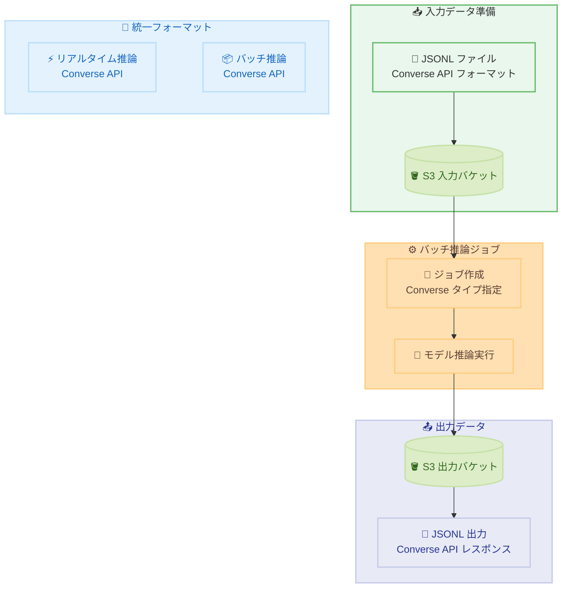

# Amazon Bedrock - バッチ推論での Converse API フォーマットサポート

**リリース日**: 2026年2月27日
**サービス**: Amazon Bedrock
**機能**: バッチ推論での Converse API モデル呼び出しタイプ

📊 [このアップデートのインフォグラフィックを見る](https://takech9203.github.io/aws-news-summary/20260227-amazon-bedrock-batch-inference-supports-converse-api-format.html)

## 概要

Amazon Bedrock のバッチ推論が、Converse API をモデル呼び出しタイプとしてサポートするようになりました。これにより、バッチワークロードでモデルに依存しない統一的な入力フォーマットを使用できます。

従来、バッチ推論では InvokeModel API を使用したモデル固有のリクエストフォーマットが必要でした。今回のアップデートにより、バッチ推論ジョブの作成時に Converse をモデル呼び出しタイプとして選択し、標準の Converse API リクエストフォーマットで入力データを構成できるようになりました。Converse バッチジョブの出力も Converse API のレスポンスフォーマットに従います。

この機能により、リアルタイム推論とバッチ推論の両方で同じ統一リクエストフォーマットを使用でき、プロンプト管理が簡素化され、モデル間の切り替えに必要な労力が削減されます。

**アップデート前の課題**

- バッチ推論では InvokeModel API のモデル固有フォーマットが必要だった
- モデルごとに異なるリクエストフォーマットを管理する必要があった
- リアルタイム推論とバッチ推論でフォーマットが異なり、プロンプトの再利用が困難だった
- モデルを切り替える際にバッチ入力データの再フォーマットが必要だった

**アップデート後の改善**

- Converse API の統一フォーマットでバッチ推論が可能
- リアルタイム推論と同じフォーマットをバッチ推論に再利用可能
- モデル間の切り替えがフォーマット変更なしで実行可能
- コンソールと API の両方から Converse モデル呼び出しタイプを設定可能

## アーキテクチャ図



Converse API フォーマットを使用することで、リアルタイム推論とバッチ推論で入出力フォーマットを統一できます。

## サービスアップデートの詳細

### 主要機能

1. **Converse モデル呼び出しタイプ**
   - バッチ推論ジョブ作成時に Converse をモデル呼び出しタイプとして選択可能
   - 入力データは Converse API のリクエストボディフォーマットに従う
   - 出力データは Converse API のレスポンスフォーマットに従う

2. **統一リクエストフォーマット**
   - リアルタイム推論 (Converse API) と同じフォーマットをバッチで使用可能
   - モデルに依存しない標準化されたフォーマット
   - プロンプトの再利用とモデル切り替えが容易

3. **コンソールと API 対応**
   - Amazon Bedrock コンソールから Converse タイプを選択可能
   - API 経由でもプログラマティックに設定可能

## 技術仕様

### API 変更履歴

| 日付 | サービス | 変更内容 |
|------|----------|----------|
| 2026-02-27 | Amazon Bedrock | 5 つのメソッドが更新 - バッチ推論での Converse API サポート追加 |

### 入力データフォーマット

バッチ推論の入力 JSONL ファイルでは、各行に以下の形式の JSON オブジェクトを記述します。

```json
{
  "recordId": "record-001",
  "modelInput": {
    "messages": [
      {
        "role": "user",
        "content": [
          {
            "text": "Amazon Bedrock について説明してください"
          }
        ]
      }
    ],
    "inferenceConfig": {
      "maxTokens": 512,
      "temperature": 0.7
    }
  }
}
```

### モデル呼び出しタイプの比較

| 項目 | InvokeModel (従来) | Converse (新規) |
|------|-------------------|-----------------|
| フォーマット | モデル固有 | モデル非依存の統一フォーマット |
| リアルタイムとの互換性 | InvokeModel API と同一 | Converse API と同一 |
| モデル切り替え | フォーマット変更が必要 | フォーマット変更不要 |
| マルチモーダル対応 | モデル依存 | 標準化されたコンテンツブロック |

## 設定方法

### 前提条件

1. Amazon Bedrock へのアクセス権限
2. S3 バケット (入力データと出力データ用)
3. バッチ推論用の IAM ロール
4. JSONL 形式の入力データファイル

### 手順

#### ステップ 1: 入力データの準備

```json
{"recordId": "1", "modelInput": {"messages": [{"role": "user", "content": [{"text": "AWS Lambda について説明してください"}]}]}}
{"recordId": "2", "modelInput": {"messages": [{"role": "user", "content": [{"text": "Amazon S3 のベストプラクティスは?"}]}]}}
{"recordId": "3", "modelInput": {"messages": [{"role": "user", "content": [{"text": "DynamoDB のパーティションキー設計のコツは?"}]}]}}
```

Converse API フォーマットで JSONL ファイルを作成し、S3 バケットにアップロードします。

#### ステップ 2: バッチ推論ジョブの作成

```python
import boto3

bedrock = boto3.client('bedrock')

response = bedrock.create_model_invocation_job(
    jobName='my-converse-batch-job',
    modelId='anthropic.claude-3-haiku-20240307-v1:0',
    roleArn='arn:aws:iam::123456789012:role/BedrockBatchRole',
    inputDataConfig={
        's3InputDataConfig': {
            's3Uri': 's3://my-bucket/input/'
        }
    },
    outputDataConfig={
        's3OutputDataConfig': {
            's3Uri': 's3://my-bucket/output/'
        }
    },
    modelInvocationType='Converse'
)
```

`modelInvocationType` に `Converse` を指定してバッチ推論ジョブを作成します。

#### ステップ 3: ジョブの確認と結果取得

```python
# ジョブのステータスを確認
status = bedrock.get_model_invocation_job(
    jobIdentifier=response['jobArn']
)
print(f"Status: {status['status']}")

# 完了後、S3 から出力を取得
```

## メリット

### ビジネス面

- **運用効率化**: プロンプト管理の統一によりチームの生産性が向上
- **コスト最適化**: モデル切り替えに伴うフォーマット変更作業が不要
- **迅速なイテレーション**: リアルタイムでテストしたプロンプトをそのままバッチに転用可能

### 技術面

- **フォーマット統一**: リアルタイムとバッチで同じ Converse API フォーマットを使用
- **モデル非依存**: モデルを切り替えても入力データの変更が不要
- **プロンプト再利用**: リアルタイム推論用のプロンプトをバッチにそのまま適用可能
- **標準化された出力**: Converse API レスポンスフォーマットで一貫した出力

## デメリット・制約事項

### 制限事項

- バッチ推論はプロビジョンドモデルではサポートされない
- 入力ファイルの最小・最大レコード数の制限がある
- 出力 JSONL ファイルのレコード順序は入力の順序と一致しない場合がある

### 考慮すべき点

- 既存の InvokeModel フォーマットのバッチジョブは引き続き使用可能
- S3 URI を使用するプロンプトの場合、すべてのリソースが同じ S3 バケットとフォルダ内にある必要がある
- バッチ推論のクォータ (最小レコード数、最大レコード数、ファイルサイズ) を確認する必要がある

## ユースケース

### ユースケース 1: 大規模コンテンツ生成

**シナリオ**: マーケティングチームが数千件の製品説明を一括生成

**実装**: Converse API フォーマットで JSONL を作成し、バッチ推論ジョブを実行。リアルタイムでプロンプトをテストした後、同じフォーマットでバッチ処理に移行。

### ユースケース 2: マルチモデル評価

**シナリオ**: 同じプロンプトセットで複数のモデルの出力品質を比較

**実装**: Converse フォーマットの統一入力データを使用し、モデル ID のみを変更してバッチジョブを実行。フォーマット変更なしでモデル間の比較が可能。

## 料金

バッチ推論の料金は、使用するモデルと処理するトークン数に基づきます。Converse API フォーマットの使用に追加料金は発生しません。

詳細は [Amazon Bedrock 料金ページ](https://aws.amazon.com/bedrock/pricing/) を参照してください。

## 利用可能リージョン

Amazon Bedrock バッチ推論をサポートするすべての AWS リージョンで利用可能です。

## 関連サービス・機能

- **Amazon Bedrock Converse API**: リアルタイム推論で使用する統一 API
- **Amazon Bedrock InvokeModel API**: モデル固有フォーマットによる推論
- **Amazon S3**: バッチ推論の入出力データストレージ
- **OpenAI Batch API**: OpenAI 互換バッチ処理

## 参考リンク

- 📊 [インフォグラフィック](https://takech9203.github.io/aws-news-summary/20260227-amazon-bedrock-batch-inference-supports-converse-api-format.html)
- [公式発表 (What's New)](https://aws.amazon.com/about-aws/whats-new/2026/02/amazon-bedrock-batch-inference-supports-converse-api-format/)
- [バッチ推論ジョブの作成](https://docs.aws.amazon.com/bedrock/latest/userguide/batch-inference-create.html)
- [バッチ推論データのフォーマットとアップロード](https://docs.aws.amazon.com/bedrock/latest/userguide/batch-inference-data.html)
- [バッチ推論の概要](https://docs.aws.amazon.com/bedrock/latest/userguide/batch-inference.html)

## まとめ

Amazon Bedrock バッチ推論での Converse API フォーマットサポートにより、リアルタイム推論とバッチ推論でモデルに依存しない統一的なリクエストフォーマットを使用できるようになりました。これによりプロンプト管理が簡素化され、モデル間の切り替えも容易になります。既存の InvokeModel フォーマットも引き続き使用可能なため、段階的な移行が可能です。
