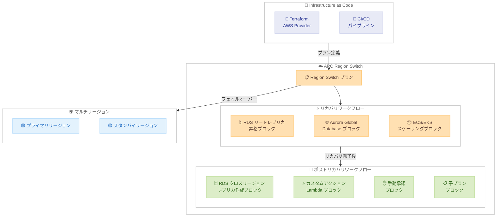

# Amazon Application Recovery Controller - Region Switch に 3 つの新機能を追加

**リリース日**: 2026 年 2 月 27 日
**サービス**: Amazon Application Recovery Controller (ARC)
**機能**: Region Switch - ポストリカバリワークフロー、RDS 実行ブロック、Terraform サポート

📊 [このアップデートのインフォグラフィックを見る](https://takech9203.github.io/aws-news-summary/20260227-arc-region-switch-post-recovery-rdsblock.html)

## 概要

Amazon Application Recovery Controller (ARC) Region Switch に 3 つの新機能が追加されました。ポストリカバリワークフロー、ネイティブ RDS 実行ブロック、および AWS Provider for Terraform サポートです。ARC Region Switch はマルチリージョンアプリケーションのフェイルオーバーをオーケストレーションし、リージョン障害発生時に限定された復旧時間内でのリカバリを実現するサービスです。今回のアップデートにより、フェイルオーバー後の復旧準備の自動化、RDS データベースリカバリの自動化、および Infrastructure as Code (IaC) による災害復旧プランの管理が可能になりました。

**アップデート前の課題**

- フェイルオーバーまたはフェイルバック後、スタンバイリージョンの復旧準備作業を手動で実施する必要があった
- スケーリング、リードレプリカの再作成、設定の検証など、ポストリカバリのタスクに手動コーディネーションが必要だった
- Amazon RDS データベースのリカバリ中にリードレプリカの昇格やレプリケーション再作成を手動で行う必要があり、遅延やエラーの原因となっていた
- 災害復旧プランをコンソールや CLI でのみ管理しており、CI/CD パイプラインとの統合が困難だった

**アップデート後の改善**

- ポストリカバリワークフローにより、フェイルオーバー後のリージョン復旧準備を自動化可能に
- ネイティブ RDS 実行ブロックにより、リードレプリカの昇格とクロスリージョンレプリカの作成を自動オーケストレーション
- AWS Provider for Terraform により、災害復旧プランを IaC として管理し CI/CD パイプラインに統合可能に
- Lambda 関数によるカスタムロジック実行、手動承認ゲート、子プランの埋め込みによる複雑なオーケストレーションが可能に

## アーキテクチャ図



この図は、ARC Region Switch の新しい 3 つの機能の関係を示しています。Region Switch プランがリカバリワークフローを実行した後、ポストリカバリワークフローが自動的にスタンバイリージョンの復旧準備を行います。Terraform AWS Provider を使用してプランを IaC として管理し、CI/CD パイプラインに統合できます。

## サービスアップデートの詳細

### 主要機能

1. **ポストリカバリワークフロー**
   - フェイルオーバーまたはフェイルバック後、もう一方のリージョンを次のリカバリイベントに備えて準備するワークフロー
   - 以下の実行ブロックをサポート:
     - カスタムアクション Lambda 実行ブロック
     - Amazon RDS クロスリージョンレプリカ作成実行ブロック
     - ARC Region Switch プラン実行ブロック (子プラン)
     - 手動承認実行ブロック
   - アクティブ/パッシブデプロイメントで利用可能
   - 手動トリガーで実行
   - 両方のリージョンが正常な状態で、以前障害が発生していたリージョンで実行

2. **RDS 実行ブロック**
   - **RDS リードレプリカ昇格実行ブロック**: フェイルオーバー中にリードレプリカをスタンドアロンインスタンスに昇格
   - **RDS クロスリージョンレプリカ作成実行ブロック**: ポストリカバリワークフローの一部としてレプリカを作成
   - 昇格後も DNS エンドポイントは変更されない
   - 昇格されたインスタンスは元のプライマリインスタンスのバックアップ設定を継承

3. **AWS Provider for Terraform サポート**
   - 災害復旧プランを Infrastructure as Code として管理可能
   - CI/CD パイプラインにアプリケーションデプロイメントと並行して統合可能
   - `aws_arcregionswitch_plan` リソースとして Terraform で管理

## 技術仕様

### 実行ブロック一覧

| 実行ブロック | 用途 | リカバリ | ポストリカバリ |
|------------|------|---------|-------------|
| ARC プラン実行ブロック | 子プランの実行 | 対応 | 対応 |
| EC2 Auto Scaling グループ | コンピュートスケーリング | 対応 | - |
| EKS リソーススケーリング | Kubernetes スケーリング | 対応 | - |
| ECS サービススケーリング | コンテナスケーリング | 対応 | - |
| ARC ルーティングコントロール | トラフィック制御 | 対応 | - |
| Aurora Global Database | Aurora フェイルオーバー | 対応 | - |
| DocumentDB Global Cluster | DocumentDB フェイルオーバー | 対応 | - |
| RDS リードレプリカ昇格 | RDS フェイルオーバー | 対応 | - |
| RDS クロスリージョンレプリカ作成 | レプリカ復旧 | - | 対応 |
| 手動承認 | 承認ゲート | 対応 | 対応 |
| カスタムアクション Lambda | カスタムロジック | 対応 | 対応 |
| Route 53 ヘルスチェック | DNS ヘルスチェック | 対応 | - |

### API 変更履歴

2026 年 2 月 27 日付で ARC Region Switch API に 9 つのメソッドの更新が適用されました。ポストリカバリワークフロー、RDS 実行ブロック、および関連する設定パラメータのサポートが追加されています。

| 変更概要 | 詳細 |
|---------|------|
| API 更新数 | 9 メソッド |
| 主な追加機能 | ポストリカバリワークフロー設定、RDS 実行ブロック設定 |
| 参考 | [API 変更履歴](https://awsapichanges.com/archive/changes/c204bb-arc-region-switch.html) |

### Terraform リソース

| リソース | 説明 |
|---------|------|
| `aws_arcregionswitch_plan` | Region Switch プランの定義と管理 |

### プラン評価

Region Switch はプランを 30 分ごとに評価し、正しい設定とレディネスを確認します。

## 設定方法

### 前提条件

1. マルチリージョンにデプロイされたアプリケーションがあること
2. ARC Region Switch のプランが作成済みであること
3. 適切な IAM 権限 (RDS 操作、Lambda 実行など) が設定されていること
4. Terraform を使用する場合、AWS Provider がインストール済みであること

### 手順

#### ステップ 1: RDS リードレプリカ昇格実行ブロックの設定

ARC コンソールで Region Switch プランのワークフローに RDS リードレプリカ昇格実行ブロックを追加します。

```bash
# RDS リードレプリカの状態を確認
aws rds describe-db-instances \
  --db-instance-identifier my-read-replica \
  --query "DBInstances[0].{Status:DBInstanceStatus,ReadReplicaSourceDBInstanceIdentifier:ReadReplicaSourceDBInstanceIdentifier}"
```

このコマンドは、指定した RDS リードレプリカの現在のステータスとソースインスタンスの情報を確認します。

#### ステップ 2: ポストリカバリワークフローの作成

ARC コンソールで Region Switch プランにポストリカバリワークフローを追加します。

1. Region Switch コンソールでプランを編集
2. ポストリカバリワークフローを有効化
3. 「Post-recovery」テンプレートを使用してステップを追加
4. 「Amazon RDS create cross-Region replica」実行ブロックを選択
5. ARN とタイムアウト値を設定

#### ステップ 3: ポストリカバリワークフローの実行

フェイルオーバー完了後、ポストリカバリワークフローを実行します。

```bash
# Region Switch のプラン実行状態を確認
aws arc-region-switch list-plan-executions \
  --plan-id my-plan-id
```

このコマンドは、指定した Region Switch プランの実行履歴を一覧表示します。ポストリカバリワークフローの実行には、直近のリカバリ実行 ID が必要です。

#### ステップ 4: Terraform による災害復旧プランの管理

```hcl
# Terraform による Region Switch プランの定義例
resource "aws_arcregionswitch_plan" "dr_plan" {
  plan_name = "my-dr-plan"

  # プランの設定はドキュメントを参照
}
```

Terraform AWS Provider を使用して、Region Switch プランを IaC として定義・管理します。

#### ステップ 5: IAM ポリシーの設定

RDS 実行ブロックに必要な IAM ポリシーを設定します。

```json
{
  "Version": "2012-10-17",
  "Statement": [
    {
      "Effect": "Allow",
      "Action": [
        "rds:DescribeDBInstances",
        "rds:PromoteReadReplica",
        "rds:CreateDBInstanceReadReplica",
        "rds:ModifyDBInstance"
      ],
      "Resource": "*"
    }
  ]
}
```

このポリシーは、ARC Region Switch が RDS リードレプリカの昇格とクロスリージョンレプリカの作成を実行するために必要な権限を付与します。

## メリット

### ビジネス面

- **復旧時間の短縮**: ポストリカバリワークフローの自動化により、次のリカバリイベントへの準備時間を大幅に短縮
- **運用負荷の軽減**: RDS データベースリカバリの手動ステップが不要になり、エンジニアリング工数を削減
- **信頼性の向上**: 自動化されたオーケストレーションにより、手動操作によるエラーのリスクを低減
- **一貫した災害復旧管理**: Terraform による IaC 管理で、災害復旧プランのバージョン管理とレビューが可能に

### 技術面

- **エンドツーエンドの自動化**: フェイルオーバーからポストリカバリまでの一連のプロセスを完全に自動化
- **ネイティブ RDS 統合**: RDS リードレプリカの昇格とレプリカ再作成を ARC が直接オーケストレーション
- **柔軟なカスタマイズ**: Lambda 関数によるカスタムロジック、手動承認ゲート、子プランの埋め込みによる複雑なシナリオ対応
- **CI/CD 統合**: Terraform サポートにより、災害復旧プランをアプリケーションデプロイメントパイプラインに統合

## デメリット・制約事項

### 制限事項

- ポストリカバリワークフローはアクティブ/パッシブデプロイメントでのみ利用可能
- ポストリカバリワークフローは手動トリガーでのみ実行可能 (自動トリガーは非対応)
- ポストリカバリの実行には、両方のリージョンが正常かつアクセス可能である必要がある
- ポストリカバリの実行には、直近のリカバリ実行 ID が必要
- Region Switch プランのネストは 1 レベルまで

### 考慮すべき点

- RDS 実行ブロックを使用する場合、適切な IAM ポリシーの事前設定が必要
- リードレプリカ昇格後、昇格されたインスタンスは元のプライマリデータベースからのレプリケーションを停止する
- Terraform Provider の初期設定と学習コストが発生する
- ポストリカバリワークフローの実行時間はリソースの規模に依存する

## ユースケース

### ユースケース 1: RDS データベースのマルチリージョン災害復旧

**シナリオ**: 企業がマルチリージョンに RDS データベースをデプロイしており、リージョン障害時にリードレプリカを自動昇格させ、復旧後にレプリケーションを再構成したい。

**実装例**:
1. RDS リードレプリカ昇格実行ブロックをリカバリワークフローに追加
2. RDS クロスリージョンレプリカ作成実行ブロックをポストリカバリワークフローに追加
3. フェイルオーバー実行後、ポストリカバリワークフローでレプリカを再作成

**効果**: RDS データベースのフェイルオーバーとポストリカバリの両方が自動化され、手動介入なしでマルチリージョンの冗長性を維持できます。

### ユースケース 2: Terraform による災害復旧プランの管理

**シナリオ**: DevOps チームがインフラストラクチャ全体を Terraform で管理しており、災害復旧プランも同じワークフローで管理したい。

**実装例**:
```hcl
resource "aws_arcregionswitch_plan" "app_dr" {
  plan_name = "my-application-dr"
  # プラン設定
}
```

**効果**: 災害復旧プランがコードとして管理され、バージョン管理、コードレビュー、CI/CD パイプラインでの自動テストが可能になります。アプリケーションの変更に合わせて災害復旧プランも同時に更新できます。

### ユースケース 3: 複雑なポストリカバリオーケストレーション

**シナリオ**: フェイルオーバー後に複数のリソースの復旧準備が必要で、カスタムロジックの実行と承認プロセスを組み込みたい。

**実装例**:
1. Lambda 関数でスケーリング設定を検証するカスタムアクションを追加
2. 手動承認ゲートでチーム確認を追加
3. RDS クロスリージョンレプリカ作成で冗長性を復元
4. 子プランで追加のリソース復旧を実行

**効果**: フェイルオーバー後の複雑な復旧準備プロセスを、カスタムロジック、承認ゲート、データベース復旧、子プランの組み合わせで柔軟にオーケストレーションできます。

## 料金

ARC Region Switch の料金体系は以下のとおりです。

| 項目 | 詳細 |
|------|------|
| Region Switch プラン | ARC の標準料金が適用 |
| ポストリカバリワークフロー | Region Switch プランの一部として提供 (追加料金なし) |
| RDS 実行ブロック | Region Switch プランの一部として提供 (追加料金なし) |
| Terraform サポート | 追加料金なし |
| RDS インスタンス料金 | リードレプリカの昇格やレプリカ作成に伴う RDS の標準料金が適用 |
| Lambda 実行料金 | カスタムアクション Lambda の実行に Lambda の標準料金が適用 |

詳細は [Amazon Application Recovery Controller 料金ページ](https://aws.amazon.com/application-recovery-controller/pricing/) を参照してください。

## 利用可能リージョン

ARC Region Switch は、すべての AWS 商用リージョンで利用可能です。リージョンごとの利用可能状況は [ARC Region Switch の利用可能リージョン](https://docs.aws.amazon.com/r53recovery/latest/dg/aws-regions-rs.html) を参照してください。

## 関連サービス・機能

- **Amazon Application Recovery Controller (ARC)**: マルチリージョンアプリケーションの可用性を管理するためのサービス
- **Amazon RDS**: クラウドで簡単にリレーショナルデータベースのセットアップ、運用、スケーリングを行えるマネージドサービス
- **Amazon Aurora Global Database**: 複数の AWS リージョンにまたがるグローバルデータベースサービス
- **AWS Lambda**: サーバーレスコンピューティングサービス。カスタムアクション実行ブロックで使用
- **Amazon CloudWatch**: ARC のアプリケーションヘルスアラームやトリガーに使用されるモニタリングサービス
- **Terraform AWS Provider**: AWS リソースを Infrastructure as Code として管理するための Terraform プロバイダー

## 参考リンク

- 📊 [インフォグラフィック](https://takech9203.github.io/aws-news-summary/20260227-arc-region-switch-post-recovery-rdsblock.html)
- [公式発表 (What's New)](https://aws.amazon.com/about-aws/whats-new/2026/02/arc-region-switch-post-recovery-rdsblock/)
- [ブログ - Introducing Amazon Application Recovery Controller Region Switch](https://aws.amazon.com/blogs/aws/introducing-amazon-application-recovery-controller-region-switch-a-multi-region-application-recovery-service/)
- [Region Switch ドキュメント](https://docs.aws.amazon.com/r53recovery/latest/dg/region-switch.html)
- [Region Switch コンポーネント](https://docs.aws.amazon.com/r53recovery/latest/dg/components-rs.html)
- [実行ブロックの追加](https://docs.aws.amazon.com/r53recovery/latest/dg/working-with-rs-execution-blocks.html)
- [ポストリカバリワークフローチュートリアル](https://docs.aws.amazon.com/r53recovery/latest/dg/tutorial-post-recovery.html)
- [Terraform Provider ドキュメント](https://registry.terraform.io/providers/hashicorp/aws/latest/docs/resources/arcregionswitch_plan)
- [関連 API 変更 - ARC Region Switch](https://awsapichanges.com/archive/changes/c204bb-arc-region-switch.html)

## まとめ

Amazon Application Recovery Controller (ARC) Region Switch に、ポストリカバリワークフロー、ネイティブ RDS 実行ブロック、AWS Provider for Terraform サポートの 3 つの新機能が追加されました。ポストリカバリワークフローにより、フェイルオーバー後のスタンバイリージョン復旧準備を自動化でき、RDS クロスリージョンレプリカの作成、Lambda によるカスタムロジック実行、手動承認ゲート、子プランの埋め込みが可能です。RDS 実行ブロックにより、フェイルオーバー中のリードレプリカ昇格とポストリカバリ中のレプリカ再作成が自動化されます。Terraform サポートにより、災害復旧プランを IaC として管理し、CI/CD パイプラインに統合できるようになりました。マルチリージョンの災害復旧を運用する場合は、これらの新機能を活用してリカバリプロセス全体の自動化を検討することをお勧めします。
