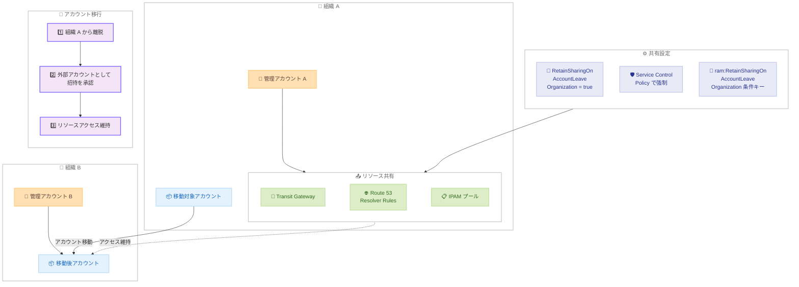

# AWS Resource Access Manager - アカウントが組織を変更する際のリソース共有維持をサポート

**リリース日**: 2026 年 2 月 27 日
**サービス**: AWS Resource Access Manager (RAM)
**機能**: RetainSharingOnAccountLeaveOrganization パラメータによるリソース共有の継続性

📊 [このアップデートのインフォグラフィックを見る](https://takech9203.github.io/aws-news-summary/20260227-aws-resource-access-manager.html)

## 概要

AWS Resource Access Manager (RAM) に、アカウントが AWS Organizations 間を移動する際にリソース共有の継続性を維持する新機能が追加されました。新しい `RetainSharingOnAccountLeaveOrganization` パラメータと対応する `ram:RetainSharingOnAccountLeaveOrganization` IAM 条件キーにより、セキュリティ管理者はアカウントが組織を離脱した際にもリソースへのアクセスを維持するようにリソース共有を設定できます。また、Service Control Policies (SCP) を使用して組織全体で一貫したポリシーを適用可能です。

**アップデート前の課題**

- アカウントが組織を離脱すると、そのアカウントは組織内のリソース共有へのアクセスを自動的に失っていた
- 合併、買収、組織再編などでアカウントを移動する際、共有リソースへのアクセスが途切れていた
- Route 53 Resolver Rules、Transit Gateway、IPAM プールなどの重要なリソースへのアクセスが中断されるリスクがあった
- 組織間のアカウント移行時にリソース共有を再設定する手動作業が必要だった

**アップデート後の改善**

- `RetainSharingOnAccountLeaveOrganization` パラメータにより、アカウント離脱時もリソースアクセスを維持可能に
- 組織アカウントを外部アカウントとして扱い、明示的な招待承認でアクセスを維持
- SCP を使用して `RetainSharingOnAccountLeaveOrganization` 設定を組織全体で強制可能
- 追加料金なしですべての AWS 商用リージョンで利用可能

## アーキテクチャ図



この図は、組織 A のリソース共有に `RetainSharingOnAccountLeaveOrganization` を設定した場合のアカウント移行フローを示しています。アカウントが組織 A から組織 B に移動する際、外部アカウントとして招待を承認することでリソースへのアクセスが維持されます。

## サービスアップデートの詳細

### 主要機能

1. **RetainSharingOnAccountLeaveOrganization パラメータ**
   - リソース共有の設定に追加されたブール型パラメータ
   - `true` に設定すると、アカウントが組織を離脱してもリソースアクセスが維持される
   - 有効化すると、RAM は組織アカウントを外部アカウントとして扱い、明示的な招待承認を要求
   - `CreateResourceShare` および `UpdateResourceShare` API で設定可能

2. **IAM 条件キー**
   - `ram:RetainSharingOnAccountLeaveOrganization` 条件キーを使用して IAM ポリシーで制御可能
   - Service Control Policies (SCP) と組み合わせて組織全体で一貫した設定を強制可能
   - リソース共有の作成や更新時にこのパラメータの値を条件として許可/拒否を制御

3. **SCP による組織全体の適用**
   - SCP を使用して、すべてのアカウントでリソース共有の `RetainSharingOnAccountLeaveOrganization` 設定を強制可能
   - 合併・買収シナリオにおける事前準備として、組織全体で統一的なポリシーを適用
   - セキュリティチームが一元管理するポリシーとして運用可能

## 技術仕様

### パラメータ詳細

| パラメータ | 詳細 |
|-----------|------|
| パラメータ名 | `RetainSharingOnAccountLeaveOrganization` |
| 型 | Boolean |
| デフォルト値 | `false` |
| 設定対象 | リソース共有 (ResourceShare) の設定 |
| IAM 条件キー | `ram:RetainSharingOnAccountLeaveOrganization` |

### API 変更履歴

2026 年 2 月 27 日付で AWS Resource Access Manager API に 3 つのメソッドの更新が適用されました。

| メソッド | 変更内容 |
|---------|---------|
| `CreateResourceShare` | `ResourceShareConfiguration` に `retainSharingOnAccountLeaveOrganization` パラメータを追加 |
| `UpdateResourceShare` | `ResourceShareConfiguration` に `retainSharingOnAccountLeaveOrganization` パラメータを追加 |
| `GetResourceShares` / レスポンス | `ResourceShareConfiguration` 構造に `retainSharingOnAccountLeaveOrganization` フィールドを追加 |

### ResourceShareConfiguration 構造

| フィールド | 型 | 必須 | 説明 |
|-----------|-----|------|------|
| `retainSharingOnAccountLeaveOrganization` | Boolean | いいえ | アカウントが組織を離脱した際にリソース共有へのアクセスを維持するかどうか |

### 動作の仕組み

| 設定 | アカウント離脱時の動作 |
|------|---------------------|
| `false` (デフォルト) | アカウントはリソース共有へのアクセスを失う |
| `true` | RAM が組織アカウントを外部アカウントとして扱い、明示的な招待承認によりアクセスを維持 |

## 設定方法

### 前提条件

1. AWS Organizations が有効で、RAM との統合が設定済みであること
2. リソース共有の作成・更新に必要な IAM 権限があること
3. SCP を使用する場合、AWS Organizations の管理アカウントまたは委任管理者権限があること

### 手順

#### ステップ 1: 既存のリソース共有の確認

```bash
aws ram get-resource-shares \
  --resource-owner SELF \
  --query "resourceShares[].{Name:name,ARN:resourceShareArn,Status:status}"
```

このコマンドは、自身が所有するリソース共有の一覧を表示します。

#### ステップ 2: 新しいリソース共有の作成 (RetainSharing 有効)

```bash
aws ram create-resource-share \
  --name "shared-transit-gateway" \
  --resource-arns "arn:aws:ec2:us-east-1:111122223333:transit-gateway/tgw-1234567890abcdef0" \
  --principals "arn:aws:organizations::111122223333:organization/o-exampleorgid" \
  --resource-share-configuration '{"retainSharingOnAccountLeaveOrganization": true}'
```

このコマンドは、Transit Gateway を組織全体で共有するリソース共有を作成し、`retainSharingOnAccountLeaveOrganization` を有効にします。

#### ステップ 3: 既存のリソース共有の更新

```bash
aws ram update-resource-share \
  --resource-share-arn "arn:aws:ram:us-east-1:111122223333:resource-share/12345678-1234-1234-1234-123456789012" \
  --resource-share-configuration '{"retainSharingOnAccountLeaveOrganization": true}'
```

このコマンドは、既存のリソース共有の設定を更新し、アカウント離脱時のリソースアクセス維持を有効にします。

#### ステップ 4: SCP による組織全体での強制

```json
{
  "Version": "2012-10-17",
  "Statement": [
    {
      "Sid": "EnforceRetainSharing",
      "Effect": "Deny",
      "Action": [
        "ram:CreateResourceShare",
        "ram:UpdateResourceShare"
      ],
      "Resource": "*",
      "Condition": {
        "BoolIfExists": {
          "ram:RetainSharingOnAccountLeaveOrganization": "false"
        }
      }
    }
  ]
}
```

この SCP は、`RetainSharingOnAccountLeaveOrganization` が `false` に設定されたリソース共有の作成と更新を拒否し、組織全体でリソースアクセス維持を強制します。

#### ステップ 5: 設定の確認

```bash
aws ram get-resource-shares \
  --resource-owner SELF \
  --resource-share-arns "arn:aws:ram:us-east-1:111122223333:resource-share/12345678-1234-1234-1234-123456789012" \
  --query "resourceShares[0].resourceShareConfiguration"
```

このコマンドは、指定したリソース共有の設定を確認し、`retainSharingOnAccountLeaveOrganization` の値を検証します。

## メリット

### ビジネス面

- **合併・買収の円滑化**: 組織再編時にリソースへのアクセスが中断されず、ビジネスの継続性を維持
- **移行リスクの低減**: アカウント移動時の共有リソースへのアクセス中断によるサービス影響を防止
- **運用効率の向上**: リソース共有の再設定やアクセス権の手動復元が不要になり、移行作業を効率化
- **ガバナンスの強化**: SCP による組織全体での一貫したポリシー適用が可能

### 技術面

- **シームレスなアカウント移行**: 組織間のアカウント移動時に Route 53 Resolver Rules、Transit Gateway、IPAM プールなどの重要なリソースへのアクセスが維持される
- **きめ細やかなアクセス制御**: IAM 条件キーにより、リソース共有の設定をポリシーレベルで制御可能
- **既存リソース共有への適用**: 新規作成だけでなく、既存のリソース共有の更新にも対応
- **外部アカウントモデルの活用**: 組織離脱後のアカウントを外部アカウントとして扱い、招待承認による明示的なアクセス許可を実現

## デメリット・制約事項

### 制限事項

- この機能は AWS 商用リージョンでのみ利用可能
- `RetainSharingOnAccountLeaveOrganization` を有効にすると、組織アカウントが外部アカウントとして扱われるため、明示的な招待承認が必要になる
- すべてのリソースタイプでの招待承認期限は異なる (一部のリソースは 7 日間、その他は 12 時間)

### 考慮すべき点

- この機能を有効にする前に、セキュリティチームと共有リソースのアクセスポリシーを確認することを推奨
- SCP で強制する場合、組織内のすべてのアカウントに影響するため、事前にテスト環境で検証することを推奨
- 組織を離脱したアカウントは外部アカウントとして招待を承認する必要があるため、移行計画にこのプロセスを含めることを推奨
- 既存のリソース共有を更新する場合、現在のアクセスパターンへの影響を事前に評価すること

## ユースケース

### ユースケース 1: 企業合併に伴うアカウント移行

**シナリオ**: 企業 A が企業 B を買収し、企業 B のアカウントを企業 A の AWS Organizations に移行する際、移行期間中も共有 Transit Gateway へのアクセスを維持したい。

**実装例**:
```bash
# 移行前に既存のリソース共有を更新
aws ram update-resource-share \
  --resource-share-arn "arn:aws:ram:us-east-1:111122223333:resource-share/tgw-share" \
  --resource-share-configuration '{"retainSharingOnAccountLeaveOrganization": true}'
```

**効果**: 企業 B のアカウントが元の組織を離脱して企業 A の組織に参加する際も、共有 Transit Gateway へのアクセスが維持され、ネットワーク接続の中断なくスムーズな移行が実現します。

### ユースケース 2: 組織再編時の DNS 解決の継続性

**シナリオ**: 事業部門の再編に伴い、一部のアカウントを別の組織に移動する際、Route 53 Resolver Rules の共有を維持して DNS 解決の継続性を確保したい。

**実装例**:
```bash
# Route 53 Resolver Rules のリソース共有を RetainSharing 有効で作成
aws ram create-resource-share \
  --name "resolver-rules-share" \
  --resource-arns "arn:aws:route53resolver:us-east-1:111122223333:resolver-rule/rslvr-rr-1234567890abcdef0" \
  --principals "arn:aws:organizations::111122223333:organization/o-exampleorgid" \
  --resource-share-configuration '{"retainSharingOnAccountLeaveOrganization": true}'
```

**効果**: アカウントが組織を離脱しても Route 53 Resolver Rules へのアクセスが維持され、DNS 解決の中断なく事業部門の再編が完了します。

### ユースケース 3: SCP による組織全体のポリシー適用

**シナリオ**: セキュリティチームが、将来の組織変更に備えて、すべてのリソース共有で `RetainSharingOnAccountLeaveOrganization` を有効にするポリシーを組織全体に適用したい。

**実装例**:
SCP で `RetainSharingOnAccountLeaveOrganization` が `false` のリソース共有作成・更新を拒否するポリシーを適用します (設定方法のステップ 4 を参照)。

**効果**: 組織内のすべてのアカウントで作成されるリソース共有に対して、アカウント離脱時のアクセス維持が自動的に適用され、将来の組織変更に備えた一貫したガバナンスが実現します。

## 料金

この機能は追加料金なしで利用可能です。

| 項目 | 詳細 |
|------|------|
| RetainSharingOnAccountLeaveOrganization 設定 | 追加料金なし |
| AWS RAM | 無料 (共有リソース自体の料金は各サービスの料金体系に従う) |
| AWS Organizations | 追加料金なし |
| SCP | 追加料金なし |

## 利用可能リージョン

この機能は、すべての AWS 商用リージョンで追加料金なしで利用可能です。

## 関連サービス・機能

- **AWS Resource Access Manager (RAM)**: AWS リソースを他の AWS アカウントと安全に共有するためのサービス
- **AWS Organizations**: 複数の AWS アカウントを一元管理するためのサービス
- **Service Control Policies (SCP)**: AWS Organizations で組織全体のアクセス制御ポリシーを適用する機能
- **Amazon Route 53 Resolver**: ハイブリッド環境での DNS 解決を提供するサービス。Resolver Rules を RAM で共有可能
- **AWS Transit Gateway**: 複数の VPC とオンプレミスネットワークを接続するネットワークハブ。RAM で共有可能
- **Amazon VPC IP Address Manager (IPAM)**: IP アドレスの計画、追跡、モニタリングを行うサービス。IPAM プールを RAM で共有可能

## 参考リンク

- 📊 [インフォグラフィック](https://takech9203.github.io/aws-news-summary/20260227-aws-resource-access-manager.html)
- [公式発表 (What's New)](https://aws.amazon.com/about-aws/whats-new/2026/02/aws-resource-access-manager/)
- [AWS RAM ドキュメント - リソース共有の作成](https://docs.aws.amazon.com/ram/latest/userguide/working-with-sharing-create.html)
- [AWS RAM API リファレンス - ResourceShareConfiguration](https://docs.aws.amazon.com/ram/latest/APIReference/API_ResourceShareConfiguration.html)
- [AWS RAM の SCP ポリシー例](https://docs.aws.amazon.com/ram/latest/userguide/security-scp.html)
- [AWS RAM 製品ページ](https://aws.amazon.com/ram/)
- [関連 API 変更 - AWS RAM](https://awsapichanges.com/archive/changes/c204bb-ram.html)

## まとめ

AWS Resource Access Manager (RAM) に `RetainSharingOnAccountLeaveOrganization` パラメータが追加され、アカウントが AWS Organizations 間を移動する際にリソース共有の継続性を維持できるようになりました。この機能は、合併、買収、組織再編などのシナリオで、Route 53 Resolver Rules、Transit Gateway、IPAM プールなどの共有リソースへのアクセスを中断なく維持します。対応する IAM 条件キー `ram:RetainSharingOnAccountLeaveOrganization` と Service Control Policies (SCP) を組み合わせることで、組織全体で一貫したポリシーを強制できます。すべての AWS 商用リージョンで追加料金なしで利用可能です。組織間のアカウント移行を計画している場合は、事前にこの設定を有効にしてリソースアクセスの継続性を確保することをお勧めします。
