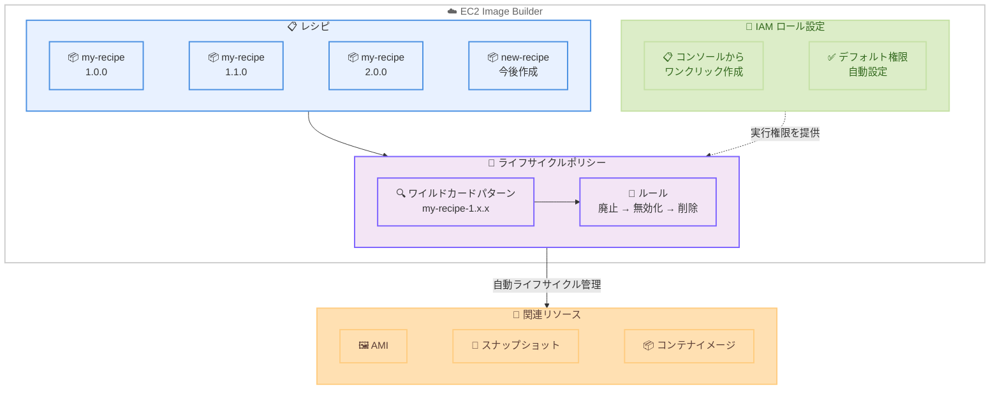

# EC2 Image Builder - ライフサイクルポリシーのワイルドカードサポートと IAM の簡素化

**リリース日**: 2026 年 2 月 27 日
**サービス**: EC2 Image Builder
**機能**: ライフサイクルポリシーのワイルドカードパターンサポートおよび IAM ロール作成の簡素化

📊 [このアップデートのインフォグラフィックを見る](https://takech9203.github.io/aws-news-summary/20260227-ec2-image-builder-lifecycle-enhancements.html)

## 概要

EC2 Image Builder のライフサイクルポリシーにワイルドカードパターンのサポートが追加され、IAM ロールの作成が簡素化されました。カスタマイズされた Amazon Machine Image (AMI) の作成、配布、管理を自動化するサービスである EC2 Image Builder において、ワイルドカードパターンを使用して複数のレシピからのイメージを単一のライフサイクルポリシーで管理できるようになりました。また、コンソールからデフォルトの権限が事前設定された IAM ロールを直接作成できるようになりました。

従来は新しいレシピが追加されるたびに個別のライフサイクルポリシーを作成するか、手動でレシピを選択する必要がありました。今回のワイルドカードパターンサポートにより、`my-recipe-1.x.x` のようなパターンを指定するだけで、将来作成されるレシピも含めて自動的にライフサイクルポリシーが適用されます。

**アップデート前の課題**

- 新しいレシピごとに個別のライフサイクルポリシーを作成する必要があり、レシピの増加に伴いスケーリングが困難だった
- ライフサイクル管理用の IAM ロール作成時に必要な権限を手動で構成する必要があり、設定ミスのリスクがあった
- 大量のレシピを管理する環境では、ライフサイクルポリシーの運用オーバーヘッドが大きかった

**アップデート後の改善**

- ワイルドカードパターンにより、複数のレシピバージョンを単一のポリシーでカバー可能
- 将来作成される新しいレシピにも自動的にライフサイクルポリシーが適用される
- コンソールから IAM ロールをデフォルト権限付きで 1 クリック作成可能に
- オンボーディングと継続的なメンテナンスの大幅な簡素化

## アーキテクチャ図



この図は、ワイルドカードパターンを使用したライフサイクルポリシーが複数のレシピバージョンを自動的にマッチし、AMI やスナップショットなどの関連リソースに対してライフサイクル管理アクションを実行する流れを示しています。IAM ロールはコンソールからデフォルト権限付きで簡単に作成できます。

## サービスアップデートの詳細

### 主要機能

1. **ワイルドカードパターンサポート**
   - セマンティックバージョンにワイルドカードパターンを使用して、複数のレシピバージョンを単一のポリシーでターゲット
   - `x.x.x`: レシピのすべてのバージョンにマッチ
   - `1.x.x`: メジャーバージョン 1 のすべてのマイナー・パッチバージョンにマッチ
   - `1.0.x`: バージョン 1.0 のすべてのパッチバージョンにマッチ
   - 将来作成される新しいレシピバージョンにも自動的に適用

2. **IAM ロール作成の簡素化**
   - コンソールから 3 つのオプションで IAM ロールを設定可能
   - **サービスデフォルトによるロール作成**: `EC2ImageBuilderLifecycleExecutionPolicy` マネージドポリシーが自動アタッチされた事前構成ロールを生成
   - **既存ロールの選択**: ドロップダウンリストから互換性のある既存ロールを選択
   - **新しいロールの作成**: 信頼ポリシーとライフサイクル実行ポリシーが事前入力された IAM コンソールを開き、ワンクリックでロール作成
   - サービスリンクロール (SLR) は自動的にフィルタリングされ、互換性のないロールの選択を防止

3. **スケーラブルなイメージ管理**
   - レシピの増加に伴うポリシー管理の手間を大幅に削減
   - 新規レシピ追加時のポリシー更新が不要
   - 組織全体のイメージライフサイクルを効率的に管理

## 技術仕様

### ワイルドカードパターンの仕様

| パターン | 説明 | マッチ例 |
|---------|------|---------|
| `x.x.x` | すべてのバージョン | 1.0.0、2.1.3、3.0.0 |
| `1.x.x` | メジャーバージョン 1 のすべて | 1.0.0、1.1.0、1.5.3 |
| `1.0.x` | バージョン 1.0 のパッチすべて | 1.0.0、1.0.1、1.0.15 |

### ライフサイクルポリシーの制限

| 項目 | 制限値 |
|------|--------|
| ポリシーあたりの最大レシピ選択数 | 50 |
| ポリシーあたりの最大ルール数 | 3 |
| ポリシー名の最大長 | 126 文字 |
| 説明の最大長 | 1024 文字 |

### ライフサイクルアクション

| アクション | 説明 | 対象リソース |
|-----------|------|-------------|
| 廃止 (Deprecate) | イメージを廃止状態にマーク | AMI、コンテナイメージ |
| 無効化 (Disable) | イメージを無効化し、新しいインスタンス起動を防止 | AMI |
| 削除 (Delete) | イメージと関連リソースを完全に削除 | AMI、スナップショット、コンテナイメージ |

### API 変更履歴

今回のアップデートに伴う直接的な API 変更はありません。既存の `CreateLifecyclePolicy` API アクションを使用してワイルドカードパターンを含むポリシーを作成できます。

## 設定方法

### 前提条件

1. EC2 Image Builder のパイプラインとレシピが作成済みであること
2. ライフサイクル管理用の IAM ロール (本アップデートでコンソールから簡単に作成可能)
3. 適切な IAM 権限を持つユーザーまたはロールでアクセスすること

### 手順

#### ステップ 1: IAM ロールの作成

EC2 Image Builder コンソールでライフサイクルポリシーを作成する際、IAM ロールの設定で以下のいずれかを選択します。

**推奨: サービスデフォルトによるロール作成**

「Create lifecycle execution role using service defaults」を選択すると、`EC2ImageBuilderLifecycleExecutionPolicy` マネージドポリシーがアタッチされたロールが自動生成されます。

#### ステップ 2: ワイルドカードパターンを使用したライフサイクルポリシーの作成

1. EC2 Image Builder コンソールで **Lifecycle policies** を選択
2. **Create lifecycle policy** を選択
3. **Policy type** で **AMI** を選択
4. ポリシー名と説明を入力
5. **Rule scope** の **Filter type** で **Recipes** を選択
6. レシピバージョンにワイルドカードパターンを指定

```bash
# AWS CLI でワイルドカードパターンを含むライフサイクルポリシーを作成
aws imagebuilder create-lifecycle-policy \
  --name "my-lifecycle-policy" \
  --description "Lifecycle policy with wildcard support" \
  --execution-role "arn:aws:iam::123456789012:role/ImageBuilderLifecycleRole" \
  --resource-type "AMI_IMAGE" \
  --resource-selection '{
    "recipes": [
      {
        "name": "my-recipe",
        "semanticVersion": "1.x.x"
      }
    ]
  }' \
  --policy-details '[
    {
      "action": {
        "type": "DELETE",
        "includeResources": {
          "amis": true,
          "snapshots": true
        }
      },
      "filter": {
        "type": "AGE",
        "value": 90,
        "unit": "DAYS"
      }
    }
  ]' \
  --status "ENABLED"
```

このコマンドは、`my-recipe` のメジャーバージョン 1 のすべてのマイナー・パッチバージョンに対して、90 日経過したイメージとスナップショットを自動削除するライフサイクルポリシーを作成します。

#### ステップ 3: ポリシーの確認

```bash
# ライフサイクルポリシーの一覧を確認
aws imagebuilder list-lifecycle-policies

# 特定のポリシーの詳細を確認
aws imagebuilder get-lifecycle-policy \
  --lifecycle-policy-arn "arn:aws:imagebuilder:ap-northeast-1:123456789012:lifecycle-policy/my-lifecycle-policy"
```

ポリシーが正しく作成され、ワイルドカードパターンが意図したレシピバージョンにマッチしていることを確認します。

## メリット

### ビジネス面

- **運用効率の大幅な向上**: レシピの増加に伴うポリシー管理の手間を排除し、大規模環境でのイメージ管理を簡素化
- **コスト削減**: 不要なイメージとスナップショットの自動削除により、ストレージコストを継続的に最適化
- **コンプライアンスリスクの低減**: 古いイメージの自動廃止・削除により、脆弱性を含むイメージからのインスタンス起動を防止
- **オンボーディングの簡素化**: IAM ロール作成の簡素化により、新規ユーザーのセットアップ時間を短縮

### 技術面

- **スケーラブルなポリシー管理**: ワイルドカードパターンにより、将来のレシピバージョンも自動的にカバー
- **設定ミスの防止**: IAM ロールのデフォルト権限自動設定により、手動構成に起因するエラーを排除
- **柔軟なバージョン指定**: `x.x.x`、`1.x.x`、`1.0.x` の 3 パターンで、メジャー・マイナー・パッチレベルの柔軟なターゲティングが可能

## デメリット・制約事項

### 制限事項

- ワイルドカードパターンはセマンティックバージョンのレベルでのみ指定可能で、レシピ名自体にはワイルドカードを使用できない
- ポリシーあたりの最大レシピ選択数は 50 に制限されている
- ポリシーあたりの最大ルール数は 3 に制限されている

### 考慮すべき点

- Auto Scaling グループやローンチテンプレートなどの下流依存関係を考慮してライフサイクルアクションを設定する必要がある
- ワイルドカードパターンが意図しないレシピバージョンにマッチしないよう、パターンの設計を慎重に行う必要がある
- 削除アクションは取り消しできないため、テスト環境で動作を確認してから本番環境に適用することを推奨
- サービスリンクロールをライフサイクルポリシーで使用していた場合は、互換性のある実行ロールに更新する必要がある

## ユースケース

### ユースケース 1: 大規模マルチレシピ環境のライフサイクル管理

**シナリオ**: エンタープライズ環境で数十のレシピを管理しており、すべてのレシピに対して一貫したライフサイクルポリシーを適用したい。

**実装例**:
```bash
# すべてのレシピバージョンに対するポリシー
aws imagebuilder create-lifecycle-policy \
  --name "enterprise-cleanup" \
  --execution-role "arn:aws:iam::123456789012:role/ImageBuilderLifecycleRole" \
  --resource-type "AMI_IMAGE" \
  --resource-selection '{
    "recipes": [
      {"name": "base-linux", "semanticVersion": "x.x.x"},
      {"name": "base-windows", "semanticVersion": "x.x.x"},
      {"name": "app-server", "semanticVersion": "x.x.x"}
    ]
  }' \
  --policy-details '[
    {
      "action": {"type": "DEPRECATE"},
      "filter": {"type": "AGE", "value": 60, "unit": "DAYS"}
    },
    {
      "action": {"type": "DELETE", "includeResources": {"amis": true, "snapshots": true}},
      "filter": {"type": "AGE", "value": 180, "unit": "DAYS"}
    }
  ]' \
  --status "ENABLED"
```

**効果**: 3 つのレシピのすべてのバージョンに対して、60 日で廃止、180 日で削除というライフサイクルを一括適用。新しいバージョンが追加されても自動的にポリシーの対象になります。

### ユースケース 2: メジャーバージョンごとの差別化管理

**シナリオ**: メジャーバージョン 1 系は短期間で削除し、メジャーバージョン 2 系は長期間保持したい。

**実装例**:
```bash
# v1 系: 30 日で削除
aws imagebuilder create-lifecycle-policy \
  --name "v1-cleanup" \
  --resource-selection '{"recipes": [{"name": "my-app", "semanticVersion": "1.x.x"}]}' \
  --policy-details '[{"action": {"type": "DELETE"}, "filter": {"type": "AGE", "value": 30, "unit": "DAYS"}}]' \
  --status "ENABLED" \
  --execution-role "arn:aws:iam::123456789012:role/ImageBuilderLifecycleRole" \
  --resource-type "AMI_IMAGE"

# v2 系: 365 日で削除
aws imagebuilder create-lifecycle-policy \
  --name "v2-cleanup" \
  --resource-selection '{"recipes": [{"name": "my-app", "semanticVersion": "2.x.x"}]}' \
  --policy-details '[{"action": {"type": "DELETE"}, "filter": {"type": "AGE", "value": 365, "unit": "DAYS"}}]' \
  --status "ENABLED" \
  --execution-role "arn:aws:iam::123456789012:role/ImageBuilderLifecycleRole" \
  --resource-type "AMI_IMAGE"
```

**効果**: メジャーバージョンごとに異なるライフサイクルルールを適用し、バージョン管理のニーズに合わせた柔軟な管理を実現します。

### ユースケース 3: 新規チームのオンボーディング簡素化

**シナリオ**: 新しいプロジェクトチームが EC2 Image Builder を使い始める際、IAM ロールのセットアップに苦労している。

**実装例**:
1. Image Builder コンソールでライフサイクルポリシー作成画面を開く
2. IAM ロール設定で「Create lifecycle execution role using service defaults」を選択
3. デフォルト権限付きのロールが自動生成される

**効果**: 手動での IAM ポリシー構成が不要になり、設定ミスのリスクを排除。チームのオンボーディング時間を大幅に短縮できます。

## 料金

EC2 Image Builder の使用自体に料金はかかりません。ただし、Image Builder で使用する以下のリソースに対して標準料金が適用されます。

| 項目 | 詳細 |
|------|------|
| EC2 Image Builder | 無料 |
| AMI ストレージ | EBS スナップショットストレージ料金 |
| コンテナイメージストレージ | Amazon ECR ストレージ料金 |
| ビルドインスタンス | EC2 インスタンス料金 (ビルド中のみ) |

ライフサイクルポリシーにより不要なイメージとスナップショットを自動削除することで、ストレージコストの削減が期待できます。

## 利用可能リージョン

ライフサイクルポリシーは、すべての商用 AWS リージョンで利用可能です。

## 関連サービス・機能

- **EC2 Image Builder**: カスタマイズされた AMI およびコンテナイメージの作成、配布、管理を自動化するサービス
- **Amazon EC2**: Image Builder で作成された AMI を使用してインスタンスを起動するコンピュートサービス
- **Amazon ECR**: コンテナイメージのレジストリサービス。Image Builder で作成されたコンテナイメージの保存先
- **AWS IAM**: ライフサイクルポリシーの実行に必要な権限を管理する ID およびアクセス管理サービス

## 参考リンク

- 📊 [インフォグラフィック](https://takech9203.github.io/aws-news-summary/20260227-ec2-image-builder-lifecycle-enhancements.html)
- [公式発表 (What's New)](https://aws.amazon.com/about-aws/whats-new/2026/02/ec2-image-builder-lifecycle-enhancements/)
- [ドキュメント - ライフサイクルポリシーの管理](https://docs.aws.amazon.com/imagebuilder/latest/userguide/manage-image-lifecycles.html)
- [ドキュメント - ライフサイクルポリシーの作成](https://docs.aws.amazon.com/imagebuilder/latest/userguide/create-lifecycle-policies.html)
- [ドキュメント - ライフサイクル管理の前提条件](https://docs.aws.amazon.com/imagebuilder/latest/userguide/image-lifecycle-prerequisites.html)
- [API リファレンス - CreateLifecyclePolicy](https://docs.aws.amazon.com/imagebuilder/latest/APIReference/API_CreateLifecyclePolicy.html)

## まとめ

EC2 Image Builder のライフサイクルポリシーにワイルドカードパターンのサポートが追加され、IAM ロールの作成が簡素化されました。ワイルドカードパターン (`x.x.x`、`1.x.x`、`1.0.x`) により、複数のレシピバージョンを単一のポリシーでカバーでき、将来作成される新しいレシピにも自動的にポリシーが適用されます。また、コンソールからデフォルト権限付きの IAM ロールをワンクリックで作成できるようになり、セットアップ時間と設定ミスのリスクが削減されました。大量のレシピを管理する環境や、新規チームのオンボーディングを効率化したい場合に特に有効なアップデートです。
