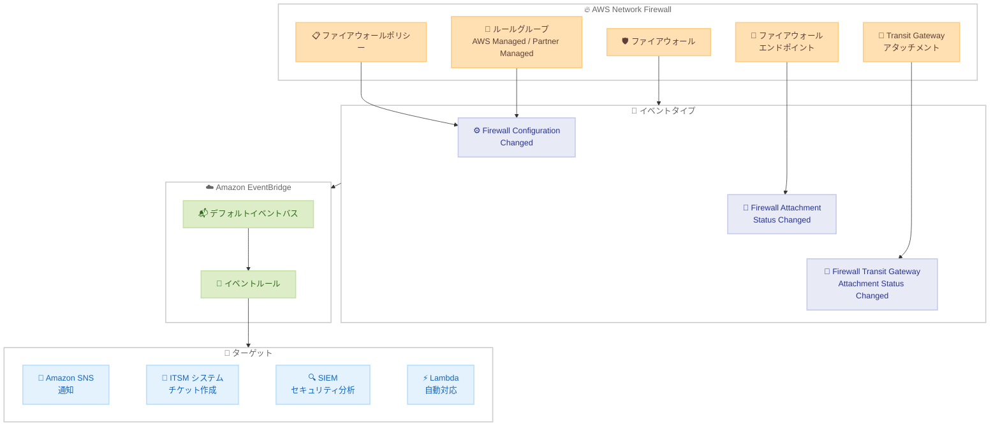

# AWS Network Firewall - Amazon EventBridge によるファイアウォール状態変更通知のサポート

**リリース日**: 2026 年 2 月 27 日
**サービス**: AWS Network Firewall
**機能**: Amazon EventBridge との統合によるリアルタイム状態変更通知

📊 [このアップデートのインフォグラフィックを見る](https://takech9203.github.io/aws-news-summary/20260227-firewall-state-change-notifications.html)

## 概要

AWS Network Firewall が Amazon EventBridge と統合され、ファイアウォールの状態変更と設定更新に関するリアルタイム通知が提供されるようになりました。この新機能により、ファイアウォール設定の更新、エンドポイントステータスの変更、Transit Gateway アタッチメントのステータス変更など、重要なファイアウォール操作を監視できます。AWS Managed Rules、Partner Managed Rules、ファイアウォール設定に影響する変更を即座に把握でき、自動化されたワークフローの構築が可能です。

**アップデート前の課題**

- ファイアウォールの設定変更やエンドポイントステータスの変更をリアルタイムで検知する仕組みがなかった
- ファイアウォールのライフサイクルイベント (エンドポイントの作成、準備完了、削除) を手動で監視する必要があった
- ファイアウォールポリシーやルールグループの更新による設定同期ステータスの変化を即座に把握できなかった
- Transit Gateway アタッチメントのステータス変更を検知して自動化された対応を行うことが困難だった

**アップデート後の改善**

- EventBridge を通じてファイアウォールの状態変更をリアルタイムに通知
- Amazon SNS、ITSM システム、サードパーティ SIEM ソリューションとの統合が可能
- 3 種類のイベントタイプ (設定変更、アタッチメントステータス変更、Transit Gateway アタッチメントステータス変更) をサポート
- CloudTrail 経由の API コールイベントも EventBridge で受信可能

## アーキテクチャ図



この図は、AWS Network Firewall のファイアウォール、ポリシー、ルールグループ、エンドポイント、Transit Gateway アタッチメントの状態変更が 3 種類のイベントとして Amazon EventBridge のデフォルトイベントバスに送信され、イベントルールを通じて SNS、ITSM、SIEM、Lambda などのターゲットに配信される流れを示しています。

## サービスアップデートの詳細

### 主要機能

1. **Firewall Configuration Changed イベント**
   - ファイアウォールポリシーまたはルールグループが更新された際に発行
   - 設定同期ステータスの変化 (例: `IN_SYNC` から `PENDING`) を通知
   - AWS Managed Rules および Partner Managed Rules の更新も検知
   - アベイラビリティゾーンごとの設定同期状態を含む

2. **Firewall Attachment Status Changed イベント**
   - ファイアウォールエンドポイントアタッチメントのステータス変更を通知
   - `CREATING` → `READY` → `DELETING` のライフサイクルイベントを追跡
   - エンドポイント ID とアベイラビリティゾーン情報を含む
   - エンドポイントがトラフィック処理可能になったタイミングを検知

3. **Firewall Transit Gateway Attachment Status Changed イベント**
   - Transit Gateway アタッチメントのステータス変更を通知
   - `CREATING` → `PENDING_ACCEPTANCE` → `READY` → `DELETING` のライフサイクルイベントを追跡
   - Transit Gateway アタッチメント ID を含む

## 技術仕様

### イベントタイプ

| イベントタイプ | detail-type | ソース |
|-------------|-----------|--------|
| 設定変更 | `Firewall Configuration Changed` | `aws.network-firewall` |
| アタッチメントステータス変更 | `Firewall Attachment Status Changed` | `aws.network-firewall` |
| TGW アタッチメントステータス変更 | `Firewall Transit Gateway Attachment Status Changed` | `aws.network-firewall` |

### イベントスキーマ

| フィールド | 説明 |
|-----------|------|
| `version` | イベントバージョン (0) |
| `id` | イベントの一意識別子 |
| `detail-type` | イベントタイプ名 |
| `source` | `aws.network-firewall` |
| `account` | AWS アカウント ID |
| `time` | イベント発生時刻 |
| `region` | AWS リージョン |
| `resources` | ファイアウォール ARN |
| `detail.data` | イベント固有のデータ |
| `detail.metadata.State Change ID` | 状態変更の一意識別子 |
| `detail.version` | スキーマバージョン (1.0.0) |

### アタッチメントステータス遷移

| 現在のステータス | 遷移先 | 説明 |
|---------------|--------|------|
| - | `CREATING` | エンドポイント作成中 |
| `CREATING` | `READY` | トラフィック処理可能 |
| `READY` | `DELETING` | エンドポイント削除中 |

### Transit Gateway アタッチメントステータス遷移

| 現在のステータス | 遷移先 | 説明 |
|---------------|--------|------|
| - | `CREATING` | アタッチメント作成中 |
| `CREATING` | `PENDING_ACCEPTANCE` | 承認待ち |
| `CREATING` / `PENDING_ACCEPTANCE` | `READY` | トラフィック処理可能 |
| `READY` | `DELETING` | アタッチメント削除中 |

### API 変更履歴

今回のアップデートに伴う直接的な Network Firewall API の変更はありません。EventBridge のイベントバスにイベントが直接送信される方式です。

## 設定方法

### 前提条件

1. AWS Network Firewall が設定済みであること
2. Amazon EventBridge が利用可能なリージョンであること
3. 適切な IAM 権限 (EventBridge ルールの作成、ターゲットへのアクセス) が設定されていること

### 手順

#### ステップ 1: EventBridge ルールの作成

```bash
aws events put-rule \
  --name "network-firewall-config-changes" \
  --event-pattern '{
    "source": ["aws.network-firewall"],
    "detail-type": ["Firewall Configuration Changed"]
  }' \
  --description "Network Firewall の設定変更を検知するルール"
```

このコマンドは、Network Firewall の設定変更イベントをキャプチャする EventBridge ルールを作成します。

#### ステップ 2: すべてのファイアウォールイベントをキャプチャするルール

```bash
aws events put-rule \
  --name "network-firewall-all-events" \
  --event-pattern '{
    "source": ["aws.network-firewall"],
    "detail-type": [
      "Firewall Configuration Changed",
      "Firewall Attachment Status Changed",
      "Firewall Transit Gateway Attachment Status Changed"
    ]
  }' \
  --description "Network Firewall のすべての状態変更イベントを検知"
```

このコマンドは、Network Firewall の 3 種類すべてのイベントタイプをキャプチャする EventBridge ルールを作成します。

#### ステップ 3: SNS トピックをターゲットとして追加

```bash
aws events put-targets \
  --rule "network-firewall-all-events" \
  --targets "Id"="sns-target","Arn"="arn:aws:sns:us-east-1:111122223333:firewall-notifications"
```

このコマンドは、EventBridge ルールのターゲットとして SNS トピックを追加し、ファイアウォールの状態変更時に通知を送信します。

#### ステップ 4: Lambda 関数をターゲットとして追加 (自動対応)

```bash
aws events put-targets \
  --rule "network-firewall-config-changes" \
  --targets "Id"="lambda-target","Arn"="arn:aws:lambda:us-east-1:111122223333:function:firewall-config-handler"
```

このコマンドは、設定変更イベントに対して自動対応を行う Lambda 関数をターゲットとして追加します。

#### ステップ 5: CloudTrail イベントのキャプチャ

```bash
aws events put-rule \
  --name "network-firewall-api-calls" \
  --event-pattern '{
    "source": ["aws.network-firewall"],
    "detail-type": ["AWS API Call via CloudTrail"],
    "detail": {
      "eventSource": ["network-firewall.amazonaws.com"]
    }
  }' \
  --description "Network Firewall の API コールを CloudTrail 経由で検知"
```

このコマンドは、CloudTrail を通じた Network Firewall の API コールイベントをキャプチャする EventBridge ルールを作成します。

## メリット

### ビジネス面

- **運用可視性の向上**: ファイアウォールの設定変更やエンドポイントステータスをリアルタイムに把握でき、セキュリティインフラの状態を即座に確認可能
- **インシデント対応の迅速化**: 自動通知により、設定変更や潜在的な問題に対して迅速に対応可能
- **コンプライアンスの強化**: ファイアウォール設定の変更履歴を自動的に記録し、監査証跡として活用可能
- **運用効率の改善**: 手動監視から自動化されたイベント駆動型の監視に移行し、運用負荷を軽減

### 技術面

- **イベント駆動型アーキテクチャ**: EventBridge を中心とした柔軟なイベントルーティングにより、多様なターゲットへの配信が可能
- **細粒度のイベント分類**: 3 種類のイベントタイプにより、設定変更とインフラ変更を区別した対応が可能
- **CloudTrail 統合**: API コールレベルのイベントも EventBridge で受信でき、誰が何を変更したかを追跡可能
- **SIEM 連携**: サードパーティのセキュリティ情報・イベント管理ソリューションとの統合により、セキュリティ分析を強化

## デメリット・制約事項

### 制限事項

- イベントは EventBridge のデフォルトイベントバスにのみ送信される
- イベントのリアルタイム性はベストエフォートであり、わずかな遅延が発生する可能性がある
- 今回のアップデートは状態変更の通知のみであり、ファイアウォールのトラフィックログとは異なる

### 考慮すべき点

- EventBridge ルールのイベントパターンを適切に設定し、必要なイベントのみをフィルタリングすることを推奨
- 大量のファイアウォール設定変更が発生する環境では、イベントの処理能力を考慮したアーキテクチャ設計が必要
- Lambda 関数をターゲットとする場合、同時実行数の制限とエラーハンドリングを考慮する
- SNS 通知のフォーマットはイベント JSON そのままであるため、必要に応じて Lambda で整形してから通知することを検討

## ユースケース

### ユースケース 1: セキュリティ運用チームへのリアルタイム通知

**シナリオ**: セキュリティ運用チームがファイアウォールポリシーの変更を即座に把握し、不正な変更を検知したい。

**実装例**:
```bash
# 設定変更イベントの EventBridge ルールを作成
aws events put-rule \
  --name "firewall-config-alert" \
  --event-pattern '{
    "source": ["aws.network-firewall"],
    "detail-type": ["Firewall Configuration Changed"]
  }'

# SNS トピックをターゲットとして追加
aws events put-targets \
  --rule "firewall-config-alert" \
  --targets "Id"="1","Arn"="arn:aws:sns:us-east-1:111122223333:security-team"
```

**効果**: ファイアウォールポリシーやルールグループの変更が即座にセキュリティチームに通知され、不正な変更の早期検知と対応が可能になります。

### ユースケース 2: ファイアウォールエンドポイントのライフサイクル監視

**シナリオ**: インフラチームがファイアウォールエンドポイントの作成完了を検知して、後続の設定タスクを自動実行したい。

**実装例**:
```bash
# アタッチメントステータス変更の EventBridge ルールを作成
aws events put-rule \
  --name "firewall-endpoint-ready" \
  --event-pattern '{
    "source": ["aws.network-firewall"],
    "detail-type": ["Firewall Attachment Status Changed"],
    "detail": {
      "data": {
        "Current Attachment Status": ["READY"]
      }
    }
  }'
```

**効果**: ファイアウォールエンドポイントが READY 状態になったことを自動検知し、ルートテーブルの更新やトラフィックルーティングの設定を Lambda 関数で自動実行できます。

### ユースケース 3: SIEM との統合によるセキュリティ分析

**シナリオ**: 企業がサードパーティの SIEM ソリューションを使用しており、ファイアウォールのすべての状態変更を SIEM に取り込んでセキュリティ分析を行いたい。

**実装例**:
1. すべてのファイアウォールイベントをキャプチャする EventBridge ルールを作成
2. Amazon Kinesis Data Firehose をターゲットとして設定
3. Kinesis Data Firehose から SIEM ソリューションにデータを配信

**効果**: ファイアウォールの設定変更、エンドポイントステータス、Transit Gateway アタッチメントステータスのすべてのイベントを SIEM に集約し、統合的なセキュリティ分析と相関分析が可能になります。

## 料金

Amazon EventBridge によるファイアウォール状態変更通知の利用に追加料金は発生しません。

| 項目 | 詳細 |
|------|------|
| Network Firewall イベント送信 | 追加料金なし |
| EventBridge ルール | EventBridge の標準料金が適用 |
| EventBridge イベント配信 | EventBridge の標準料金が適用 |
| ターゲットサービス | 各ターゲットサービス (SNS、Lambda など) の標準料金が適用 |
| Network Firewall 基本料金 | [AWS Network Firewall 料金ページ](https://aws.amazon.com/network-firewall/pricing/) を参照 |

## 利用可能リージョン

AWS Network Firewall の状態変更通知は、AWS Network Firewall と Amazon EventBridge の両方が利用可能なすべての AWS リージョンで提供されています。

## 関連サービス・機能

- **AWS Network Firewall**: Amazon VPC 内のネットワークトラフィックを保護するためのマネージドファイアウォールサービス
- **Amazon EventBridge**: サーバーレスイベントバスサービス。AWS サービスやアプリケーション間のイベントルーティングを提供
- **Amazon SNS**: プッシュベースの通知サービス。EventBridge のターゲットとして使用可能
- **AWS Lambda**: サーバーレスコンピューティングサービス。イベントに応答した自動化処理に使用
- **AWS CloudTrail**: AWS API コールの記録サービス。Network Firewall の API コールイベントを EventBridge に送信

## 参考リンク

- 📊 [インフォグラフィック](https://takech9203.github.io/aws-news-summary/20260227-firewall-state-change-notifications.html)
- [公式発表 (What's New)](https://aws.amazon.com/about-aws/whats-new/2026/02/firewall-state-change-notifications/)
- [AWS Network Firewall EventBridge イベント](https://docs.aws.amazon.com/network-firewall/latest/developerguide/eventbridge-events.html)
- [Amazon EventBridge - Network Firewall イベントリファレンス](https://docs.aws.amazon.com/eventbridge/latest/ref/events-ref-network-firewall.html)
- [AWS Network Firewall ドキュメント](https://docs.aws.amazon.com/network-firewall/)
- [AWS Network Firewall 料金ページ](https://aws.amazon.com/network-firewall/pricing/)

## まとめ

AWS Network Firewall が Amazon EventBridge と統合され、ファイアウォールの状態変更に関するリアルタイム通知が利用可能になりました。Firewall Configuration Changed、Firewall Attachment Status Changed、Firewall Transit Gateway Attachment Status Changed の 3 種類のイベントタイプにより、ファイアウォールの設定同期ステータス、エンドポイントのライフサイクル、Transit Gateway アタッチメントのステータス変更をリアルタイムに監視できます。EventBridge のイベントルールを活用して、Amazon SNS による通知、ITSM システムへのチケット作成、SIEM ソリューションとの統合、Lambda 関数による自動対応など、柔軟なワークフローの構築が可能です。ネットワークセキュリティインフラの運用可視性を向上させ、設定変更や潜在的な問題に迅速に対応したい場合は、EventBridge 統合の設定を検討することをお勧めします。
