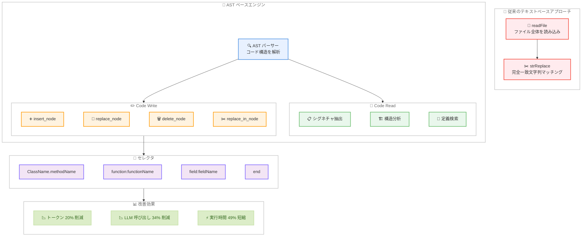

# Kiro - AST ベースのコード編集エンジンによる精密なコード操作

**リリース日**: 2026 年 2 月 27 日
**サービス**: Kiro
**機能**: AST-based Code Navigation and Editing Engine

📊 [このアップデートのインフォグラフィックを見る](https://takech9203.github.io/aws-news-summary/20260227-kiro-ast-based-code-editing.html)

## 概要

Kiro が AST (Abstract Syntax Tree) ベースの新しいコードナビゲーション・編集エンジンに関する技術ブログを公開した。このエンジンは、従来のテキストベースのファイル読み込みと文字列マッチングによるコード操作を、構造的なコード理解に基づく精密な操作に置き換える。SWE-PolyBench (Kiro で最も頻度の高いクエリタイプであるフィーチャーリクエストの例を含むベンチマーク) でトークン使用量を 20% 削減し、脆弱な正規表現やファイル全体のダンプを排除する。

**アップデート前の課題**

- エージェントがファイル全体を読み込んで特定の関数を探す必要があり、大量のトークンと時間を消費していた
- コード編集に完全一致の文字列マッチングが必要で、空白やフォーマットの微細な差異で編集が失敗していた
- 編集失敗後にファイルの再読み込みと再試行が発生し、トークン消費とレイテンシーが増大する悪循環が生じていた
- フィーチャーリクエスト (Vibe モードトラフィックの 45%、Spec モードトラフィックの 67.6%) において、複数ファイルにわたる変更で脆弱な文字列マッチングの問題が累積していた

**アップデート後の改善**

- コードを文字列ではなく構造化されたエンティティ (関数、クラス、メソッド、インポート) として理解
- セレクタベースの精密なコード要素の特定により、フォーマット変更に対する耐性を確保
- PolyBench50 ベンチマークで LLM 呼び出し数を 34.3% 削減、出力トークンを 29.95% 削減
- フィーチャーリクエストのデモンストレーションでは実行時間を 49.3% 短縮

## アーキテクチャ図

従来のテキストベースアプローチでは、ファイル全体を読み込み、完全一致の文字列マッチングで編集を行っていた。AST ベースエンジンでは、コードを構造的に解析し、セレクタを使用して特定のコード要素を精密にターゲットする。Code Read でシグネチャや構造情報のみを抽出し、Code Write の 4 つの操作タイプとセレクタを組み合わせて、セマンティックな編集を実現する。

## サービスアップデートの詳細

### テキストベースコードツールの問題点

Kiro IDE は従来、2 つのテキストベースツールに依存していた。

- **readFile**: コードを調査するためのツール。特定の関数を探すためにファイルの大部分、場合によってはファイル全体を読み込む必要があり、タスクに無関係な大量のトークンを消費する
- **strReplace**: コードを編集するためのツール。完全一致の文字列マッチングが必要で、空白、フォーマット、コメントの微細な差異でも編集が失敗したり、意図しない複数箇所がマッチする

これらの問題は複合的に作用する。エージェントが編集に失敗すると、ファイルを再度読み込んで診断し、別の編集を試み、さらに失敗するという悪循環が発生する。

### AST ベースエンジンの仕組み

AST ベースエンジンは、テキストベースの操作を AST パーシングに置き換える。コードを文字列としてではなく、構造化されたエンティティ (関数、クラス、メソッド、インポート、およびそれらの関係) として理解する。

### Code Read: ターゲットを絞った情報抽出

ファイル内容全体をダンプする代わりに、必要な情報のみを返す。

- **シグネチャ**: 実装詳細なしの関数・クラス定義
- **構造**: 高レベルのコード構成と関係
- **検索結果**: 条件に一致する特定の定義

従来のアプローチで 1,309 トークンを消費する Java クラスの調査が、AST ベースアプローチでは 545 トークンで完了する。これは 58% のトークン削減に相当する。

### Code Write: セマンティック編集

Code Write ツールはセレクタを使用してコード要素を精密にターゲットする。

**セレクタの種類**:

| セレクタ | 用途 |
|---------|------|
| `ClassName.methodName` | 特定のメソッドをターゲット |
| `function:functionName` | 特定の関数をターゲット |
| `field:fieldName` | クラスフィールドをターゲット |
| `end` | ファイル末尾に追加 |

**4 つの操作タイプ**:

| 操作 | 説明 |
|------|------|
| `insert_node` | 特定の場所に新しいコードを追加 |
| `replace_node` | 関数やクラス全体を置換 |
| `delete_node` | コード要素をクリーンに削除 |
| `replace_in_node` | コードブロック内の部分的な編集 |

TypeScript ファイルへの関数追加の例では、従来のアプローチが 361 トークンを消費するのに対し、AST ベースアプローチは 96 トークンで完了する。これは周囲のコンテキストを含める必要がないため、73% のトークン削減を実現する。

## 技術仕様

### PolyBench50 ベンチマーク結果

PolyBench50 (SWE-PolyBench のサブセット) での評価結果。

| メトリクス | 従来のアプローチ | AST ベースエンジン | 改善率 |
|-----------|----------------|------------------|--------|
| タスクあたりの LLM 呼び出し数 | 40.88 | 26.86 | 34.30% |
| 出力トークン | 270,957 | 189,806 | 29.95% |
| 入力トークン | 680,684 | 541,346 | 20.47% |

### フィーチャーリクエストデモンストレーション結果

「AWS Resource Explorer にサードパーティ統合を追加する」タスク (Slack/Teams 通知、Jira チケット、SIEM エクスポート、AWS Config 統合) での評価結果。

| メトリクス | 従来のアプローチ | AST ベースエンジン | 改善率 |
|-----------|----------------|------------------|--------|
| 実行時間 | 9 分 20 秒 | 4 分 44 秒 | 49.30% |
| LLM 呼び出し数 | 29 | 22 | 24.10% |
| 入力トークン | 1,350 | 1,192 | 11.70% |
| 出力トークン | 761 | 654 | 14% |
| ツールエラー | 2 | 0 | - |

### トークン削減の具体例

| 操作 | 従来のトークン数 | AST ベースのトークン数 | 削減率 |
|------|----------------|---------------------|--------|
| Java クラスの調査 | 1,309 | 545 | 58% |
| TypeScript 関数追加 | 361 | 96 | 73% |

### フィーチャーリクエストのトラフィック割合

| モード | フィーチャーリクエストの割合 |
|--------|--------------------------|
| Vibe モード | 45% |
| Spec モード | 67.6% |

## メリット

### ビジネス面

- **開発速度の向上**: フィーチャーリクエストの実行時間が最大 49.3% 短縮され、開発者の待機時間が大幅に削減される
- **コスト効率の改善**: トークン使用量が 20〜30% 削減されることで、AI コーディングの運用コストが低下する
- **信頼性の向上**: ツールエラーが削減され、エージェントの出力に対する開発者の信頼が向上する

### 技術面

- **フォーマット耐性**: インデントの違い (2 スペース vs 4 スペース、タブ vs スペース) によって編集が失敗しない。構造的な編集はフォーマッターの自動整形後でも正しく動作する
- **精密なターゲティング**: セレクタによりファイル内の類似コードとの誤マッチを防止し、意図したコード要素のみを正確に変更できる
- **保守性**: コードの周囲が変化しても、構造ベースの操作は引き続き正しく動作する
- **コード構造の理解**: AST パーシングによりエージェントがコードの構造を真に理解し、変更の場所と方法について適切な判断が可能になる

## デメリット・制約事項

- **言語サポートの範囲**: AST パーシングは言語ごとのパーサーに依存するため、すべてのプログラミング言語で同等のサポートが提供されるとは限らない
- **非構造的なコード変更への対応**: コメントの修正やフリーテキストの変更など、AST ノードにマッピングしにくい変更には従来のテキストベースアプローチが必要な場合がある
- **学習コスト**: セレクタ構文や操作タイプなど、新しい概念をエージェントが適切に使用するまでに最適化が必要

## ユースケース

### ユースケース 1: 大規模コードベースでのフィーチャーリクエスト

**シナリオ**: 開発者が既存の大規模プロジェクトに新機能 (複数の API エンドポイント、サービスクラス、テストファイルの追加) を依頼する

**AST ベースアプローチの効果**:
- 既存のクラスや関数のシグネチャのみを抽出して構造を把握するため、ファイル全体を読み込む必要がない
- `ClassName.methodName` セレクタで既存メソッドの隣に新メソッドを正確に挿入
- 複数ファイルにわたる変更でも、各ファイルの構造を理解した上で一貫性のある変更を適用

**効果**: 実行時間の大幅な短縮と、ツールエラーの排除により、開発者が修正作業に費やす時間を削減

### ユースケース 2: リファクタリング作業

**シナリオ**: 大きなクラスを複数の小さなクラスに分割するリファクタリングをエージェントに依頼する

**AST ベースアプローチの効果**:
- `replace_node` でクラス全体を新しい実装に置換
- `insert_node` で新しいファイルにクラスを追加
- `delete_node` で移動済みのメソッドをクリーンに削除
- フォーマッターが自動整形を行っても、次の編集が失敗しない

**効果**: 従来であればフォーマットの差異で繰り返し失敗していた編集が、一度で成功する

### ユースケース 3: コード調査と理解

**シナリオ**: 初めてのコードベースの構造を理解し、変更箇所を特定する必要がある

**AST ベースアプローチの効果**:
- Code Read のシグネチャ抽出でクラスの公開インターフェースのみを取得
- 構造分析でファイル内のコード構成と関係を俯瞰
- 必要な部分のみを深掘りすることで、無関係なコードの読み込みを回避

**効果**: 58% 少ないトークンでコードの構造を把握でき、調査フェーズの効率が大幅に向上

## 料金

Kiro の料金プランに含まれる。AST ベースエンジンはトークン使用量を削減するため、既存プランの範囲内でより多くのタスクを処理可能。

## 利用可能リージョン

グローバル

## 関連サービス・機能

- **Kiro IDE**: AI 搭載統合開発環境。AST ベースエンジンを組み込んだ基盤プラットフォーム
- **Kiro CLI**: コマンドラインインターフェース。AST ベースエンジンの恩恵を受ける
- **Kiro Specs**: 構造化された開発ワークフロー。フィーチャーリクエストの Spec モードで AST ベースエンジンの効果が特に顕著
- **SWE-PolyBench**: Kiro が使用するベンチマーク。フィーチャーリクエストの例を含み、AST ベースエンジンの評価に使用
- **CORAL**: Kiro の継続的最適化システム。AST ベースエンジンの導入もこうした分析に基づく改善の一環

## 参考リンク

- 📊 [インフォグラフィック](https://takech9203.github.io/aws-news-summary/20260227-kiro-ast-based-code-editing.html)
- [Kiro Blog - Surgical precision with AST-based code editing](https://kiro.dev/blog/surgical-precision-with-ast/)
- [Kiro](https://kiro.dev/)
- [Kiro ドキュメント](https://kiro.dev/docs/)

## まとめ

Kiro の AST ベースコード編集エンジンは、AI コーディングエージェントにおけるコード操作の精度と効率を根本的に改善するアップデートである。従来のテキストベースアプローチでは、ファイル全体の読み込みと脆弱な文字列マッチングがトークン消費の増大と編集失敗の原因となっていた。AST ベースエンジンはコードを構造化されたエンティティとして理解し、セレクタと型付き操作によって精密な編集を実現する。PolyBench50 で LLM 呼び出し数 34.3% 削減、トークン使用量 20〜30% 削減、フィーチャーリクエストで実行時間 49.3% 短縮という成果を達成した。フォーマット変更に対する耐性、精密なターゲティング、コード構造の理解という特性は、特にフィーチャーリクエスト (Kiro の最頻クエリタイプ) において大きな価値を提供する。本エンジンは既に本番環境で利用可能である。
