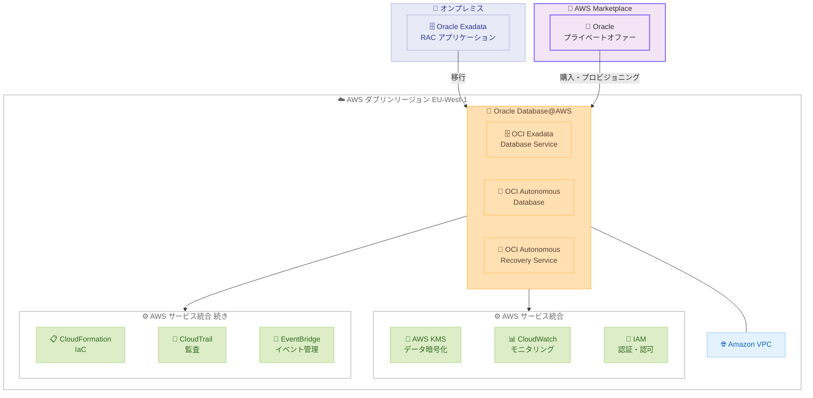

# Oracle Database@AWS - ダブリン AWS リージョンでの提供開始

**リリース日**: 2026 年 2 月 27 日
**サービス**: Oracle Database@AWS
**機能**: EU-West-1 (Dublin) リージョンでの Oracle Database@AWS の一般提供

📊 [このアップデートのインフォグラフィックを見る](https://takech9203.github.io/aws-news-summary/20260227-oracle-database-aws-available-dublin-aws-region.html)

## 概要

Oracle Database@AWS がヨーロッパ (アイルランド) リージョン (EU-West-1、ダブリン) で利用可能になりました。Oracle Database@AWS は、AWS データセンター内で Oracle Cloud Infrastructure (OCI) が管理する Oracle Exadata システムへのアクセスを提供するサービスです。お客様はオンプレミスの Oracle Exadata および Oracle Real Application Clusters (RAC) アプリケーションを、同等の環境へ容易に移行できます。

今回のダブリンリージョンへの拡張により、アイルランドにデータレジデンシー要件を持つお客様が、オンプレミスの Oracle Exadata および RAC アプリケーションを AWS に移行できるようになりました。また、AWS Key Management Service (KMS) によるデータ暗号化や Amazon CloudWatch によるモニタリングなどの AWS サービスとの統合メリットも享受できます。

**アップデート前の課題**

- ダブリンリージョンでは Oracle Database@AWS が利用できなかった
- アイルランドおよび EU 西部にデータレジデンシー要件を持つお客様は、Oracle Exadata ワークロードを AWS に移行できなかった
- 他のリージョンを使用する場合、EU のデータ保護規制への準拠が困難だった

**アップデート後の改善**

- ダブリンリージョンで Oracle Database@AWS が利用可能になり、計 8 リージョンに拡大
- アイルランドにデータレジデンシー要件を持つお客様が Oracle Exadata および RAC ワークロードを移行可能に
- AWS サービスとの統合により、暗号化、モニタリング、ガバナンスなどの機能を活用可能

## アーキテクチャ図



この図は、オンプレミスの Oracle Exadata/RAC アプリケーションを Oracle Database@AWS (ダブリンリージョン) に移行するアーキテクチャを示しています。Oracle Database@AWS は OCI が管理する Exadata システムを AWS データセンター内で提供し、AWS KMS、CloudWatch、IAM などの AWS サービスと統合されます。

## サービスアップデートの詳細

### 主要機能

1. **Oracle Exadata Database Service**
   - OCI が管理する Oracle Exadata システムを AWS データセンター内で提供
   - Oracle RAC を含む既存のオンプレミス Exadata ワークロードの同等環境への移行
   - データベースおよびアプリケーションの最小限の変更で移行可能

2. **Oracle Autonomous Database on Dedicated Infrastructure**
   - AI/ML を活用した完全に自動化されたデータベース管理
   - チューニング、パッチ適用、バックアップなどの主要な管理タスクを自動化
   - 専用の Exadata インフラストラクチャ上で動作

3. **AWS サービスとの統合**
   - **AWS KMS**: データ暗号化のためのキー管理
   - **Amazon CloudWatch**: データベースのパフォーマンスモニタリング
   - **AWS IAM**: 認証と認可の管理
   - **AWS CloudFormation**: インフラストラクチャのコード化
   - **AWS CloudTrail**: ガバナンスとコンプライアンスの監査
   - **Amazon EventBridge**: イベント駆動型管理
   - **Amazon VPC Lattice**: AWS サービスへの簡素化されたコネクティビティ

## 技術仕様

### サポートされるサービス

| サービス | 説明 |
|---------|------|
| OCI Exadata Database Service | OCI 管理の Exadata システム上での Oracle Database の運用 |
| OCI Autonomous Database on Dedicated Infrastructure | AI/ML による自動化されたデータベース管理 |
| OCI Autonomous Recovery Service | 自動バックアップとリカバリ |

### 利用可能リージョン一覧

| リージョン | リージョンコード | 提供時期 |
|-----------|----------------|---------|
| US East (N. Virginia) | us-east-1 | GA (初期) |
| US West (Oregon) | us-west-2 | GA (初期) |
| US East (Ohio) | us-east-2 | 2025 年 12 月 |
| Canada (Central) | ca-central-1 | 拡張済み |
| Europe (Frankfurt) | eu-central-1 | 2025 年 12 月 |
| **Europe (Dublin)** | **eu-west-1** | **2026 年 2 月 - 今回追加** |
| Asia Pacific (Tokyo) | ap-northeast-1 | 2025 年 12 月 |
| Asia Pacific (Sydney) | ap-southeast-2 | 拡張済み |

### API 変更履歴

今回のアップデートに伴う直接的な API 変更はありません。既存の API とコンソール操作がダブリンリージョンでも利用可能になりました。

## 設定方法

### 前提条件

1. AWS アカウント
2. AWS Marketplace を通じた Oracle からのプライベートオファー
3. EU-West-1 (Dublin) リージョンへのアクセス権限

### 手順

#### ステップ 1: AWS Marketplace からオファーを取得

[AWS Marketplace の Oracle Database@AWS ページ](https://aws.amazon.com/marketplace/pp/prodview-qks5dl3hr7nfw) にアクセスし、Oracle からのプライベートオファーをリクエストします。

#### ステップ 2: ODB ネットワークの作成

AWS マネジメントコンソールにサインインし、Oracle Database@AWS のセクションで ODB ネットワークを作成します。

1. AWS マネジメントコンソールで Oracle Database@AWS に移動
2. リージョンとして **EU-West-1 (Dublin)** を選択
3. ODB ネットワークを作成し、VPC とサブネットを設定

#### ステップ 3: ODB ピアリング接続の作成

ODB ネットワークと既存の VPC 間のピアリング接続を作成します。これにより、AWS アプリケーションから Oracle Database@AWS への低レイテンシーアクセスが可能になります。

#### ステップ 4: Exadata インフラストラクチャの作成

```bash
# AWS CLI を使用した Exadata インフラストラクチャの作成例
aws odb create-exadata-infrastructure \
  --display-name my-exadata-infra \
  --shape Exadata.X11M \
  --compute-count 2 \
  --storage-count 3 \
  --region eu-west-1
```

このコマンドは、ダブリンリージョンで Exadata インフラストラクチャを作成します。

#### ステップ 5: VM クラスターまたは Autonomous VM クラスターの作成

Exadata VM クラスター (手動管理) または Autonomous VM クラスター (自動管理) を作成します。

```bash
# Exadata VM クラスターの作成例
aws odb create-cloud-vm-cluster \
  --display-name my-vm-cluster \
  --exadata-infrastructure-id <infrastructure-id> \
  --cpu-core-count 4 \
  --region eu-west-1
```

このコマンドは、Exadata VM クラスターを作成し、Oracle Database の実行環境を構築します。

## メリット

### ビジネス面

- **EU データレジデンシー対応**: アイルランドにデータレジデンシー要件を持つ EU のお客様が、Oracle Exadata ワークロードを AWS に移行可能
- **移行の簡素化**: オンプレミスの Oracle Exadata および RAC アプリケーションを最小限の変更で同等環境に移行
- **統合された購入と管理**: AWS Marketplace を通じた購入と AWS マネジメントコンソールでの管理により、調達と運用を一元化
- **AWS コミットメントへの適用**: Oracle Database@AWS の利用は AWS のコミットメント (EDP など) に適用可能

### 技術面

- **低レイテンシー接続**: AWS データセンター内に配置されているため、AWS アプリケーションとの低レイテンシー通信が可能
- **AWS サービス統合**: KMS、CloudWatch、IAM、CloudTrail、EventBridge などの AWS サービスとのネイティブ統合
- **Oracle RAC サポート**: Oracle Real Application Clusters を AWS 上で運用でき、高可用性とスケーラビリティを維持
- **Amazon S3 バックアップ**: 11 ナインの耐久性を持つ Amazon S3 にバックアップを保存可能

## デメリット・制約事項

### 制限事項

- ダブリンリージョンでの初期提供は 1 アベイラビリティゾーン (AZ) から開始
- AWS Marketplace を通じた Oracle からのプライベートオファーが必要であり、即時利用は不可
- Oracle のライセンスと料金が別途適用される

### 考慮すべき点

- Oracle Database@AWS は OCI が管理するインフラストラクチャであるため、一部の管理操作は OCI コンソールを使用する場合がある
- ネットワーク構成において、ODB ピアリング接続の設定が必要
- Oracle のサポート契約とライセンス体系の理解が必要
- 他のリージョンへのクロスリージョンレプリケーションを計画する場合は、対象リージョンでの Oracle Database@AWS の可用性を確認する必要がある

## ユースケース

### ユースケース 1: EU のデータレジデンシー要件への対応

**シナリオ**: アイルランドに本社を置く金融機関が、GDPR および国内規制に基づきデータをアイルランド国内に保持する必要がある。現在オンプレミスで Oracle Exadata を運用しており、クラウドへの移行を検討している。

**実装例**:
1. AWS Marketplace から Oracle のプライベートオファーをリクエスト
2. ダブリンリージョンで ODB ネットワークと Exadata インフラストラクチャを構成
3. オンプレミスの Exadata データベースをダブリンリージョンの Oracle Database@AWS に移行

**効果**: データレジデンシー要件を満たしながら、AWS サービスとの統合によるモニタリング、暗号化、ガバナンスの強化を実現します。

### ユースケース 2: Oracle RAC ワークロードのクラウド移行

**シナリオ**: ヨーロッパの製造業企業が、基幹業務システムで使用している Oracle RAC データベースをオンプレミスからクラウドに移行したい。アプリケーションの変更を最小限に抑えたい。

**実装例**:
1. ダブリンリージョンで Exadata VM クラスターを作成
2. Oracle RAC を同等の環境にマイグレーション
3. AWS CloudWatch でパフォーマンスモニタリングを設定

**効果**: Oracle RAC の高可用性とスケーラビリティを維持しながら、インフラストラクチャ管理の負荷を OCI に委任。AWS サービスとの統合により運用効率を向上させます。

### ユースケース 3: AWS と Oracle の統合分析基盤

**シナリオ**: Oracle Database に蓄積されたトランザクションデータを Amazon Redshift で分析し、ビジネスインテリジェンスに活用したい。

**実装例**:
1. ダブリンリージョンに Oracle Database@AWS を構成
2. Oracle Database@AWS から Amazon Redshift への zero-ETL 統合を設定
3. Amazon Redshift でリアルタイム分析を実行

**効果**: Oracle トランザクションデータを Amazon Redshift でほぼリアルタイムに分析でき、ETL パイプラインの構築・管理なしにデータ駆動型の意思決定を加速します。

## 料金

Oracle Database@AWS の料金は Oracle のライセンスおよびインフラストラクチャ料金と、AWS サービスの利用料金で構成されます。

| 項目 | 詳細 |
|------|------|
| Oracle Database@AWS | AWS Marketplace を通じた Oracle のプライベートオファーに基づく |
| AWS KMS | KMS キーの使用に対する標準料金 |
| Amazon CloudWatch | メトリクスとログの標準料金 |
| データ転送 | AWS 標準のデータ転送料金 |

詳細な料金については、[AWS Marketplace の Oracle Database@AWS ページ](https://aws.amazon.com/marketplace/pp/prodview-qks5dl3hr7nfw) および Oracle の営業担当にお問い合わせください。

## 利用可能リージョン

Oracle Database@AWS は、今回のダブリンリージョン追加により、計 8 つの AWS リージョンで利用可能です。

- US East (N. Virginia) - us-east-1
- US West (Oregon) - us-west-2
- US East (Ohio) - us-east-2
- Canada (Central) - ca-central-1
- Europe (Frankfurt) - eu-central-1
- **Europe (Dublin) - eu-west-1** (今回追加)
- Asia Pacific (Tokyo) - ap-northeast-1
- Asia Pacific (Sydney) - ap-southeast-2

## 関連サービス・機能

- **AWS Marketplace**: Oracle Database@AWS のプライベートオファーの購入プラットフォーム
- **AWS Key Management Service (KMS)**: Oracle Database@AWS のデータ暗号化に使用
- **Amazon CloudWatch**: データベースのパフォーマンスモニタリング
- **AWS CloudFormation**: Oracle Database@AWS インフラストラクチャのコード化
- **Amazon Redshift**: Oracle Database@AWS からの zero-ETL 統合による分析
- **Amazon VPC Lattice**: AWS サービスへの簡素化されたネットワーク接続

## 参考リンク

- 📊 [インフォグラフィック](https://takech9203.github.io/aws-news-summary/20260227-oracle-database-aws-available-dublin-aws-region.html)
- [公式発表 (What's New)](https://aws.amazon.com/about-aws/whats-new/2026/02/oracle-database-aws-available-dublin-aws-region/)
- [Oracle Database@AWS 概要](https://aws.amazon.com/marketplace/featured-seller/oracle)
- [Oracle Database@AWS ドキュメント](https://docs.aws.amazon.com/odb/latest/UserGuide/getting-started.html)
- [AWS Marketplace - Oracle Database@AWS](https://aws.amazon.com/marketplace/pp/prodview-qks5dl3hr7nfw)
- [ブログ - Oracle Database@AWS の紹介](https://aws.amazon.com/blogs/aws/introducing-oracle-databaseaws-for-simplified-oracle-exadata-migrations-to-the-aws-cloud/)

## まとめ

Oracle Database@AWS がダブリンリージョン (EU-West-1) で利用可能になり、サービス提供リージョンが 8 つに拡大しました。アイルランドにデータレジデンシー要件を持つ EU のお客様は、オンプレミスの Oracle Exadata および RAC アプリケーションを AWS データセンター内の同等環境に移行できるようになりました。AWS KMS、CloudWatch、IAM、CloudTrail などの AWS サービスとの統合により、セキュリティ、モニタリング、ガバナンスが強化されます。Oracle Exadata ワークロードのクラウド移行を検討している EU 西部のお客様は、[AWS Marketplace](https://aws.amazon.com/marketplace/pp/prodview-qks5dl3hr7nfw) から Oracle のプライベートオファーをリクエストして、ダブリンリージョンでの利用を開始することをお勧めします。
