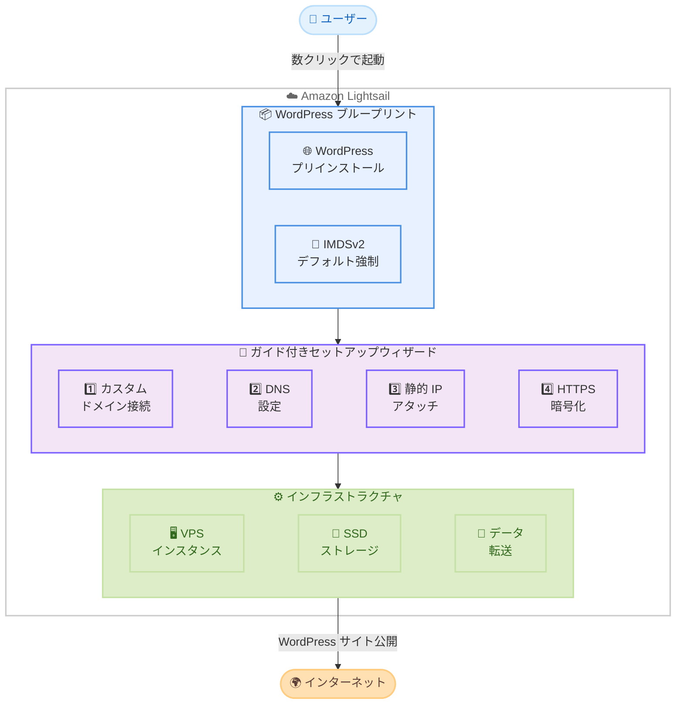

# Amazon Lightsail - 新しい WordPress ブループリントの提供開始

**リリース日**: 2026 年 2 月 27 日
**サービス**: Amazon Lightsail
**機能**: ガイド付きセットアップウィザードを備えた新しい WordPress ブループリント

📊 [このアップデートのインフォグラフィックを見る](https://takech9203.github.io/aws-news-summary/20260227-wordpress-blueprint-lightsail.html)

## 概要

Amazon Lightsail が新しい WordPress ブループリントを提供開始しました。このブループリントにより、数クリックで WordPress がプリインストールされた Lightsail 仮想プライベートサーバー (VPS) を作成し、ガイド付きセットアップウィザードに従ってサイトを数分で完全に構成・稼働させることができます。Instance Metadata Service Version 2 (IMDSv2) がデフォルトで強制されており、セキュリティのベストプラクティスが自動的に適用されます。

新しい WordPress ブループリントには、カスタムドメインの接続、DNS の設定、静的 IP アドレスのアタッチ、無料の Let's Encrypt SSL/TLS 証明書を使用した HTTPS 暗号化の有効化までをガイドするステップバイステップのセットアップワークフローが含まれており、すべて Lightsail コンソール内で完結します。

**アップデート前の課題**

- WordPress サイトの初期セットアップにはドメイン設定、DNS 構成、SSL 証明書の取得など複数の手順を個別に実施する必要があった
- 既存のブループリントでは IMDSv1 が有効で、SSRF 攻撃などのセキュリティリスクが存在していた
- SSL/TLS 証明書の設定やカスタムドメインの構成に技術的な知識が必要だった

**アップデート後の改善**

- ガイド付きセットアップウィザードにより、カスタムドメインの接続から HTTPS 暗号化の設定までを一貫して実施可能
- IMDSv2 がデフォルトで強制され、SSRF 攻撃などのセキュリティリスクが軽減された
- Let's Encrypt の無料 SSL/TLS 証明書が統合され、HTTPS 設定が簡素化された

## アーキテクチャ図



この図は、ユーザーが Lightsail の WordPress ブループリントを使用してサイトを構築する流れを示しています。ブループリントの選択後、ガイド付きセットアップウィザードがカスタムドメイン接続、DNS 設定、静的 IP のアタッチ、HTTPS 暗号化までを順番にガイドします。

## サービスアップデートの詳細

### 主要機能

1. **ガイド付きセットアップウィザード**
   - カスタムドメインの接続をステップバイステップでガイド
   - DNS レコードの設定を Lightsail コンソール内で完結
   - 静的 IP アドレスのアタッチを簡単に実施
   - Let's Encrypt の無料 SSL/TLS 証明書による HTTPS 暗号化の有効化

2. **IMDSv2 のデフォルト強制**
   - Instance Metadata Service Version 2 がデフォルトで有効
   - セッションベースの認証により、SSRF (Server-Side Request Forgery) 攻撃を防止
   - メタデータへのアクセスに 2 段階のトークン取得プロセスを要求
   - AWS のセキュリティベストプラクティスに自動的に準拠

3. **WordPress プリインストール環境**
   - WordPress が事前にインストールされた状態でインスタンスを起動
   - 必要な Web サーバー、PHP、データベースなどのソフトウェアスタックを含む
   - 数分でサイトの構成と公開が完了

## 技術仕様

### ブループリントの特徴

| 項目 | 詳細 |
|------|------|
| プリインストールソフトウェア | WordPress、Web サーバー、PHP、データベース |
| IMDSv2 | デフォルトで強制 |
| SSL/TLS | Let's Encrypt 無料証明書対応 |
| カスタムドメイン | ガイド付きウィザードで設定可能 |
| 静的 IP | ウィザードからアタッチ可能 |

### IMDSv2 の特徴

| 項目 | IMDSv1 | IMDSv2 - 新ブループリント |
|------|--------|------------------------|
| 認証方式 | なし - 直接アクセス | セッションベース - トークン必須 |
| SSRF 攻撃対策 | 脆弱 | 保護あり |
| リクエスト方式 | GET リクエストのみ | PUT でトークン取得、GET でメタデータ取得 |
| TTL | なし | トークンに TTL あり - 最大 6 時間 |

### API 変更履歴

今回のアップデートに伴う直接的な API 変更はありません。既存の Lightsail API を使用してインスタンスを作成できます。

## 設定方法

### 前提条件

1. AWS アカウント
2. Lightsail へのアクセス権限

### 手順

#### ステップ 1: Lightsail コンソールから WordPress インスタンスを作成

1. [Lightsail コンソール](https://lightsail.aws.amazon.com/) にアクセス
2. **Create instance** を選択
3. リージョンとアベイラビリティゾーンを選択
4. **WordPress** ブループリントを選択
5. インスタンスバンドル (CPU、メモリ、ストレージ) を選択
6. インスタンス名を入力し **Create instance** を選択

```bash
# AWS CLI で WordPress インスタンスを作成する場合
aws lightsail create-instances \
  --instance-names my-wordpress-site \
  --availability-zone ap-northeast-1a \
  --blueprint-id wordpress \
  --bundle-id small_3_0
```

このコマンドは、WordPress がプリインストールされた Lightsail インスタンスを作成します。IMDSv2 がデフォルトで強制されます。

#### ステップ 2: ガイド付きセットアップウィザードに従う

インスタンスの作成後、Lightsail コンソールに表示されるセットアップウィザードに従い、以下の設定を順番に実施します。

1. **カスタムドメインの接続**: 所有するドメイン名を入力
2. **DNS の設定**: Lightsail の DNS ゾーンを作成し、必要なレコードを構成
3. **静的 IP アドレスのアタッチ**: インスタンスに固定 IP アドレスを割り当て

```bash
# 静的 IP を作成してアタッチ
aws lightsail allocate-static-ip \
  --static-ip-name my-wordpress-ip

aws lightsail attach-static-ip \
  --static-ip-name my-wordpress-ip \
  --instance-name my-wordpress-site
```

このコマンドは、静的 IP アドレスを作成し、WordPress インスタンスにアタッチします。

#### ステップ 3: HTTPS 暗号化の有効化

ウィザードのガイドに従い、Let's Encrypt の無料 SSL/TLS 証明書を使用して HTTPS を有効化します。

```bash
# SSH でインスタンスに接続後、Let's Encrypt 証明書を設定
ssh -i ~/.ssh/lightsail-key.pem bitnami@[インスタンスの静的IP]

# Bitnami HTTPS 設定ツールを実行
sudo /opt/bitnami/bncert-tool
```

このコマンドで HTTPS 証明書の設定ツールが起動し、対話的に証明書を取得・設定できます。

#### ステップ 4: IMDSv2 の動作確認

```bash
# トークンを取得 (IMDSv2)
TOKEN=$(curl -X PUT "http://169.254.169.254/latest/api/token" \
  -H "X-aws-ec2-metadata-token-ttl-seconds: 21600")

# メタデータにアクセス
curl -H "X-aws-ec2-metadata-token: $TOKEN" \
  http://169.254.169.254/latest/meta-data/instance-id
```

このコマンドで IMDSv2 が正しく動作していることを確認します。IMDSv1 スタイルのリクエスト (トークンなし) は拒否されます。

## メリット

### ビジネス面

- **迅速なサイト構築**: ガイド付きセットアップウィザードにより、技術的な知識が限られたユーザーでも数分で WordPress サイトを構築・公開可能
- **セキュリティ強化**: IMDSv2 強制により SSRF 攻撃のリスクが大幅に軽減され、コンプライアンス要件を満たしやすい
- **コスト削減**: Let's Encrypt の無料 SSL/TLS 証明書が統合されており、別途 SSL 証明書を購入する必要がない
- **運用負荷の軽減**: ドメイン設定から HTTPS 暗号化まで一貫したウィザードで完結するため、運用チームの負担が軽減される

### 技術面

- **自動化されたセキュリティ**: 手動で IMDSv2 を設定する必要がなく、デフォルトでベストプラクティスが適用される
- **統合セットアップ**: DNS、静的 IP、SSL/TLS の設定が Lightsail コンソール内で一元的に管理可能
- **シンプルな管理**: インスタンス、ストレージ、ネットワーキングを Lightsail の統合管理画面から操作可能

## デメリット・制約事項

### 制限事項

- IMDSv2 を必要としないレガシーアプリケーションやプラグインでは、互換性の問題が発生する可能性がある
- Lightsail の VPS はカスタマイズの範囲が EC2 と比較して限定的である
- 高トラフィックサイトでは Lightsail のバンドルリソース制限に達する可能性がある

### 考慮すべき点

- 既存の Lightsail WordPress インスタンスを新ブループリントに移行する場合、データのバックアップと移行作業が必要
- Let's Encrypt 証明書は 90 日ごとに更新が必要 (自動更新を設定可能)
- 一部の古い WordPress プラグインやテーマは IMDSv2 に対応していない可能性がある

## ユースケース

### ユースケース 1: 中小企業の Web サイト構築

**シナリオ**: 中小企業がコーポレートサイトやブログサイトを WordPress で構築したい。技術担当者が限られているため、できるだけ簡単にセキュアなサイトを立ち上げたい。

**実装例**:
```bash
# WordPress ブループリントでインスタンスを作成
aws lightsail create-instances \
  --instance-names company-website \
  --availability-zone ap-northeast-1a \
  --blueprint-id wordpress \
  --bundle-id small_3_0
```

**効果**: ガイド付きセットアップウィザードにより、ドメイン設定から HTTPS 暗号化まで迷うことなく構成可能。IMDSv2 により、セキュリティのベストプラクティスが自動的に適用されます。

### ユースケース 2: フリーランスの WordPress 開発者

**シナリオ**: フリーランスの Web 開発者がクライアント向けの WordPress サイトを迅速にデプロイしたい。複数のクライアントサイトを効率的に管理する必要がある。

**実装例**:
1. クライアントごとに WordPress ブループリントでインスタンスを作成
2. 各インスタンスに対してセットアップウィザードでドメイン設定と HTTPS を構成
3. 静的 IP をアタッチしてクライアントにサイトを納品

**効果**: セットアップ作業時間を大幅に短縮し、より多くのクライアントプロジェクトを効率的に管理できます。

### ユースケース 3: 個人ブログの運営

**シナリオ**: 技術的な知識が限られた個人ブロガーが、セキュアで信頼性の高い WordPress ブログを低コストで運営したい。

**実装例**:
1. Lightsail コンソールから WordPress ブループリントを選択して Nano バンドルでインスタンスを作成
2. ウィザードに従ってカスタムドメインを接続し、HTTPS を有効化

**効果**: 月額 $3.50 から WordPress ブログを運営でき、Let's Encrypt の無料 SSL 証明書でセキュアなサイトを維持。ガイド付きウィザードで技術的な障壁を最小化します。

## 料金

Lightsail の既存の料金体系が適用されます。新しい WordPress ブループリントの使用に追加料金はありません。

### 料金例

| インスタンスバンドル | vCPU | RAM | ストレージ | データ転送 | 月額料金 |
|------------------|------|-----|-----------|----------|---------|
| Nano | 0.5 | 512 MB | 20 GB SSD | 1 TB | $3.50 |
| Micro | 1 | 1 GB | 40 GB SSD | 2 TB | $5 |
| Small | 1 | 2 GB | 60 GB SSD | 3 TB | $10 |
| Medium | 2 | 4 GB | 80 GB SSD | 4 TB | $20 |

*料金は米国東部 (バージニア北部) リージョンの例です。リージョンにより異なる場合があります。
*Lightsail は 3 か月間の無料トライアルを提供しています。

## 利用可能リージョン

この新しい WordPress ブループリントは、Lightsail が利用可能なすべての AWS リージョンで提供されています。

## 関連サービス・機能

- **Amazon EC2**: より高度な制御とカスタマイズが必要な場合の選択肢
- **Amazon RDS for Lightsail**: マネージドデータベースサービスとの組み合わせ
- **Lightsail CDN**: グローバルコンテンツ配信ネットワーク
- **Lightsail DNS**: ドメインの DNS レコード管理
- **AWS Elastic Beanstalk**: アプリケーションのデプロイとスケーリングを自動化

## 参考リンク

- 📊 [インフォグラフィック](https://takech9203.github.io/aws-news-summary/20260227-wordpress-blueprint-lightsail.html)
- [公式発表 (What's New)](https://aws.amazon.com/about-aws/whats-new/2026/02/wordpress-blueprint-lightsail/)
- [ドキュメント - Lightsail ブループリント](https://lightsail.aws.amazon.com/ls/docs/en_us/articles/compare-options-choose-lightsail-instance-image)
- [ドキュメント - Lightsail リージョンとアベイラビリティゾーン](https://docs.aws.amazon.com/lightsail/latest/userguide/understanding-regions-and-availability-zones-in-amazon-lightsail.html)
- [Lightsail 料金ページ](https://aws.amazon.com/lightsail/pricing/)

## まとめ

Amazon Lightsail の新しい WordPress ブループリントは、ガイド付きセットアップウィザードと IMDSv2 のデフォルト強制により、WordPress サイトの構築とセキュリティ管理を大幅に簡素化します。カスタムドメインの接続、DNS 設定、静的 IP のアタッチ、Let's Encrypt SSL/TLS 証明書による HTTPS 暗号化までをステップバイステップでガイドし、数分でサイトを稼働させることが可能です。このブループリントは Lightsail が利用可能なすべての AWS リージョンで提供されており、中小企業の Web サイト構築から個人ブログの運営まで、幅広いユースケースに対応します。WordPress サイトの新規構築を検討している場合は、この新しいブループリントの活用をお勧めします。
