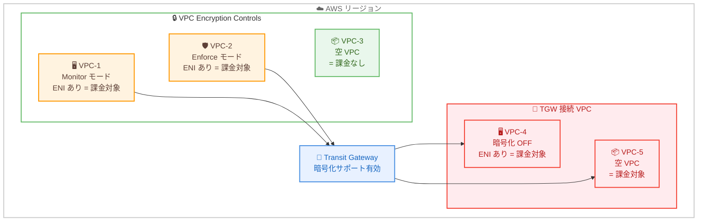

# Amazon VPC - VPC Encryption Controls の料金開始

**リリース日**: 2026 年 3 月 1 日
**サービス**: Amazon VPC
**機能**: VPC Encryption Controls の有料化

📊 [このアップデートのインフォグラフィックを見る](https://takech9203.github.io/aws-news-summary/20260301-vpc-encryption-controls-pricing.html)

## 概要

AWS は VPC Encryption Controls の料金体系を発表した。2026 年 3 月 1 日より、VPC Encryption Controls は無料プレビューから有料機能に移行する。VPC Encryption Controls は、リージョン内の VPC 間およびVPC 内のすべてのトラフィックフローの暗号化を監査・強制できるセキュリティ・コンプライアンス機能である。

VPC Encryption Controls は 2 つのモードで有効化できる。Monitor モードは VPC 内の暗号化されていないトラフィックの存在を検出し、Enforce モードはすべての転送中データが暗号化されることを保証し、VPC 内で暗号化されていないトラフィックを許可するリソースの起動を防止する。

料金はネットワークインターフェースを持つ非空 VPC ごとに固定時間料金が課される。空の VPC では課金されないが、Transit Gateway で暗号化サポートを有効にした場合は、接続されたすべての VPC に対して課金が適用される点に注意が必要である。

**アップデート前の課題**

- VPC Encryption Controls は無料プレビュー期間中であり、コスト見積もりができなかった
- 本番環境での採用判断に際し、長期的なランニングコストが不明確だった
- Transit Gateway 接続時の課金範囲が明確でなかった

**アップデート後の改善**

- リージョンごとの明確な時間料金が設定され、正確なコスト見積もりが可能になった
- 非空 VPC のみの課金ルールにより、テスト環境や未使用 VPC のコストを抑制できる
- Transit Gateway との連携時の課金範囲が明確化され、アーキテクチャ設計の判断材料が整った

## アーキテクチャ図



VPC Encryption Controls の課金モデル。Monitor/Enforce モードが有効な非空 VPC に課金される。Transit Gateway の暗号化サポートを有効にした場合、接続されたすべての VPC に課金が適用される点に注意が必要。

## サービスアップデートの詳細

### 主要機能

1. **Monitor モード**
   - VPC 内のトラフィックフローの暗号化ステータスを可視化
   - 暗号化されていないトラフィックを許可するリソースを特定
   - VPC フローログに `encryption-status` フィールドを出力
   - 暗号化ステータス: `0` = 未暗号化、`1` = Nitro 暗号化、`2` = アプリケーション暗号化、`3` = 両方

2. **Enforce モード**
   - VPC 境界内で暗号化されていないトラフィックを許可する機能やサービスの使用を防止
   - ネイティブ暗号化をサポートしない古い EC2 インスタンスの起動をブロック
   - 除外設定により、Internet Gateway、NAT Gateway、Virtual Private Gateway などのリソースを許可可能

3. **Transit Gateway 暗号化サポート**
   - Transit Gateway にハードウェアレイヤーでの暗号化を有効化
   - VPC 間のトラフィックを Transit Gateway 経由で暗号化
   - Enforce モードの VPC は暗号化サポートが無効な Transit Gateway に接続不可

## 技術仕様

### 料金体系

| 項目 | 詳細 |
|------|------|
| 課金単位 | 非空 VPC あたりの時間料金 |
| 対象 | Monitor または Enforce モードが有効な VPC |
| 空 VPC | Encryption Controls が有効でも課金なし |
| TGW 暗号化有効時 | 接続されたすべての VPC に課金が適用 |
| 複数 TGW | 1 つの VPC が複数の TGW に接続されている場合、1 時間あたり 1 回のみ課金 |

### 主要リージョンの料金

| リージョン | 非空 VPC あたりの時間料金 |
|-----------|------------------------|
| US East (N. Virginia) | $0.15 |
| US West (Oregon) | $0.15 |
| Europe (Frankfurt) | $0.17 |
| Europe (Ireland) | $0.16 |
| Asia Pacific (Tokyo) | $0.21 |
| Asia Pacific (Osaka) | $0.21 |
| Asia Pacific (Singapore) | $0.20 |
| Asia Pacific (Sydney) | $0.20 |
| South America (Sao Paulo) | $0.31 |

### 対応サービス

VPC Encryption Controls は以下のサービスと互換性がある。

| カテゴリ | サービス |
|----------|----------|
| 自動準拠 | Network Load Balancer、Application Load Balancer、Fargate、EKS |
| 自動マイグレーション | 一部のリソースは自動的に暗号化対応に移行 |
| 手動マイグレーション必要 | Redshift Provisioned/Serverless、古い EC2 インスタンス |
| 除外設定可能 | Internet Gateway、NAT Gateway、VPC Peering、Lambda、VPC Lattice、EFS |

## 設定方法

### 前提条件

1. VPC が作成済みであること
2. 適切な IAM 権限があること
3. Enforce モードを使用する場合、すべてのリソースが暗号化に対応していること

### 手順

#### ステップ 1: Monitor モードの有効化

```bash
# 既存の VPC で Monitor モードを有効化
aws ec2 modify-vpc-encryption-controls \
  --vpc-id vpc-12345678901234567 \
  --encryption-controls-mode monitor
```

既存の VPC では、まず Monitor モードでの有効化が必要。Enforce モードを直接有効化することはできない。

#### ステップ 2: VPC フローログの設定

```bash
# encryption-status フィールドを含むフローログを作成
aws ec2 create-flow-logs \
  --resource-type VPC \
  --resource-ids vpc-12345678901234567 \
  --traffic-type ALL \
  --log-group-name my-flow-logs \
  --deliver-logs-permission-arn arn:aws:iam::123456789012:role/publishFlowLogs \
  --log-format '${encryption-status} ${srcaddr} ${dstaddr} ${srcport} ${dstport} ${protocol} ${traffic-path} ${flow-direction} ${reject-reason}'
```

VPC フローログに `encryption-status` フィールドを追加して、トラフィックの暗号化状態を確認する。

#### ステップ 3: 非準拠リソースの確認

```bash
# 暗号化を強制できないリソースを確認
aws ec2 get-vpc-resources-blocking-encryption-enforcement \
  --vpc-id vpc-12345678901234567
```

Enforce モードに移行する前に、暗号化をブロックしているリソースを特定する。

#### ステップ 4: Enforce モードへの移行

```bash
# Monitor モードから Enforce モードに変更
aws ec2 modify-vpc-encryption-controls \
  --vpc-id vpc-12345678901234567 \
  --encryption-controls-mode enforce
```

非準拠リソースの対処後、Enforce モードに移行してすべてのトラフィックの暗号化を強制する。

## メリット

### ビジネス面

- **コンプライアンス準拠**: HIPAA、FedRAMP、PCI DSS などの暗号化要件への対応を支援
- **セキュリティ姿勢の強化**: VPC 内のすべてのトラフィックの暗号化を一元的に監視・強制
- **監査の効率化**: VPC フローログの暗号化ステータスにより、トラフィックの暗号化状況を自動的に監査

### 技術面

- **Nitro ベースの暗号化**: AWS Nitro System のハードウェアレベルの暗号化により、アプリケーション変更なしで暗号化を適用
- **段階的な導入**: Monitor → Enforce の段階的移行により、既存環境への影響を最小化
- **除外設定**: Internet Gateway や NAT Gateway など、特定のリソースを暗号化要件から除外可能

## デメリット・制約事項

### 制限事項

- 既存の VPC では Enforce モードを直接有効化できない (Monitor モードからの移行が必要)
- 一部のサービス (Redshift など) は暗号化対応のための手動マイグレーションが必要
- Transit Gateway の暗号化サポートを有効にすると、接続されたすべての VPC に課金が発生

### 考慮すべき点

- 東京リージョンでは非空 VPC あたり $0.21/時間 (月額約 $151/VPC) のコストが発生
- 多数の VPC を運用している環境では、コストが大幅に増加する可能性がある
- Transit Gateway 接続時は、暗号化 OFF の VPC も含めてすべてに課金される

## ユースケース

### ユースケース 1: 金融機関のコンプライアンス対応

**シナリオ**: PCI DSS に準拠する必要がある金融機関が、すべての VPC 内トラフィックの暗号化を監視・強制したい。

**実装例**:
```bash
# カード情報を扱う VPC で Enforce モードを有効化
aws ec2 modify-vpc-encryption-controls \
  --vpc-id vpc-pci-production \
  --encryption-controls-mode enforce
```

**効果**: カード情報を扱う環境で、暗号化されていないトラフィックの発生を根本的に防止し、PCI DSS 準拠を技術的に保証する。

### ユースケース 2: マルチ VPC 環境の暗号化統制

**シナリオ**: 複数の VPC を Transit Gateway で接続している大規模環境で、すべてのVPC 間トラフィックの暗号化を確保したい。

**実装例**:
```bash
# Transit Gateway で暗号化サポートを有効化
aws ec2 modify-transit-gateway \
  --transit-gateway-id tgw-12345678901234567 \
  --options EncryptionSupport=enable
```

**効果**: Transit Gateway を経由するすべての VPC 間トラフィックがハードウェアレベルで暗号化され、大規模環境での暗号化統制を実現する。

### ユースケース 3: 段階的な暗号化導入

**シナリオ**: 既存の大規模環境で、まず暗号化状況を可視化してから段階的に暗号化を強制したい。

**実装例**:
```bash
# まず Monitor モードで暗号化状況を可視化
aws ec2 modify-vpc-encryption-controls \
  --vpc-id vpc-12345678901234567 \
  --encryption-controls-mode monitor

# フローログで暗号化ステータスを確認
aws logs filter-log-events \
  --log-group-name my-flow-logs \
  --filter-pattern "encryption-status=0"
```

**効果**: 暗号化されていないトラフィックを特定してから段階的に対処することで、サービス中断のリスクを最小化しながら暗号化を導入できる。

## 料金

2026 年 3 月 1 日より、VPC Encryption Controls は無料プレビューから有料機能に移行した。

### 料金例

| シナリオ | 月額料金 (概算、東京リージョン) |
|----------|-------------------------------|
| 非空 VPC 3 台 (Monitor/Enforce) | $0.21 × 3 × 730 時間 ≈ $460/月 |
| 非空 VPC 5 台 + TGW 暗号化有効 | $0.21 × 5 × 730 時間 ≈ $767/月 |
| 非空 VPC 10 台 (Monitor) | $0.21 × 10 × 730 時間 ≈ $1,533/月 |

**注意**: Transit Gateway の暗号化サポートを有効にした場合、暗号化モードが OFF の VPC や空の VPC も含め、接続されたすべての VPC に対して課金が適用される。

## 利用可能リージョン

グローバルに利用可能。主要リージョンの料金は VPC pricing ページを参照。

## 関連サービス・機能

- **AWS Nitro System**: VPC Encryption Controls のハードウェアレベル暗号化の基盤
- **Transit Gateway**: VPC 間トラフィックの暗号化サポートとの連携
- **VPC フローログ**: `encryption-status` フィールドによる暗号化ステータスの監視
- **AWS CloudTrail**: VPC Encryption Controls の設定変更の追跡

## 参考リンク

- 📊 [インフォグラフィック](https://takech9203.github.io/aws-news-summary/20260301-vpc-encryption-controls-pricing.html)
- [公式発表 (What's New)](https://aws.amazon.com/about-aws/whats-new/2026/03/vpc-encryption-controls-pricing/)
- [AWS Blog - Introducing VPC encryption controls](https://aws.amazon.com/blogs/aws/introducing-vpc-encryption-controls-enforce-encryption-in-transit-within-and-across-vpcs-in-a-region/)
- [ドキュメント](https://docs.aws.amazon.com/vpc/latest/userguide/vpc-encryption-controls.html)
- [料金ページ](https://aws.amazon.com/vpc/pricing/)

## まとめ

VPC Encryption Controls が無料プレビューから有料機能に移行した。東京リージョンでは非空 VPC あたり $0.21/時間の課金が発生するため、現在プレビューを利用している環境ではコストへの影響を確認することを推奨する。特に Transit Gateway の暗号化サポートを有効にしている場合、接続されたすべての VPC に課金が適用される点に注意し、コスト最適化の観点からアーキテクチャの見直しを検討されたい。
