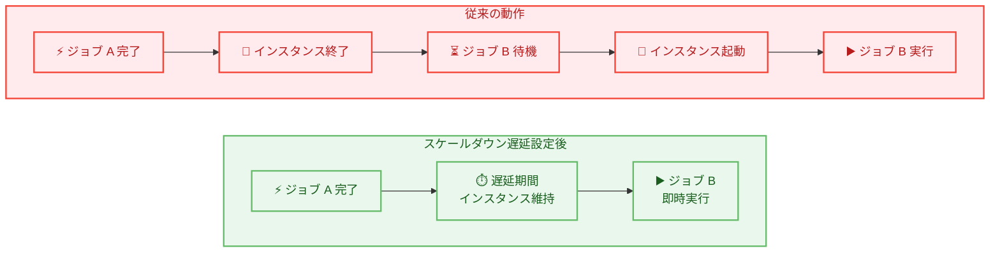

# AWS Batch - スケールダウン遅延の設定機能

**リリース日**: 2026 年 3 月 2 日
**サービス**: AWS Batch
**機能**: Configurable Scale Down Delay

📊 [このアップデートのインフォグラフィックを見る](https://takech9203.github.io/aws-news-summary/20260302-aws-batch-configurable-scale-down-delay.html)

## 概要

AWS Batch がマネージドコンピューティング環境においてスケールダウン遅延の設定機能をサポートした。新しい `minScaleDownDelayMinutes` パラメータにより、ジョブ完了後にインスタンスを維持する時間を 20 分から 1 週間 (10,080 分) の範囲で指定できるようになった。これにより、断続的または定期的なワークロードにおけるジョブ処理の遅延を大幅に削減できる。

従来、AWS Batch のマネージドコンピューティング環境ではジョブ完了後のインスタンス終了タイミングをユーザーが制御できなかった。そのため、短い間隔で繰り返し実行されるジョブでは、インスタンスの終了と再起動が頻繁に発生し、後続ジョブの処理開始が遅れるという課題があった。今回のアップデートにより、インスタンスの終了タイミングをきめ細かく制御でき、ワークロードの特性に応じた最適なスケーリング動作を実現できるようになった。

この機能は AWS Batch API (CreateComputeEnvironment、UpdateComputeEnvironment) および AWS Batch マネジメントコンソールから設定可能で、AWS Batch が利用可能なすべての AWS リージョンで即座に利用できる。

**アップデート前の課題**

- ジョブ完了後のインスタンス終了タイミングをユーザーが制御できず、AWS Batch のデフォルトのスケーリングロジックに依存していた
- 断続的なワークロードではインスタンスの不要な終了と再起動が繰り返され、後続ジョブの処理開始に遅延が発生していた
- 定期的なバッチジョブ (例: 1 時間ごとの ETL 処理) では、毎回インスタンスの起動待ちが必要となり、ジョブの実行効率が低下していた

**アップデート後の改善**

- `minScaleDownDelayMinutes` パラメータにより、ジョブ完了後のインスタンス維持時間を 20 分から 1 週間の範囲でカスタマイズできるようになった
- インスタンスが維持されることで、後続ジョブの処理開始遅延が解消され、断続的なワークロードの処理効率が向上した
- コンピューティング環境の作成時だけでなく、既存環境の更新時にも設定を変更でき、運用中のワークロードに柔軟に適用できるようになった

## アーキテクチャ図



従来はジョブ完了後にインスタンスが終了され、次のジョブでは再起動を待つ必要があった。スケールダウン遅延を設定することで、インスタンスが一定時間維持され、後続ジョブを即座に実行できるようになる。

## サービスアップデートの詳細

### 主要機能

1. **minScaleDownDelayMinutes パラメータ**
   - コンピューティング環境のスケーリングポリシー内に新たに追加されたパラメータ
   - ジョブ完了後にインスタンスを維持する最小時間を分単位で指定する
   - 設定範囲は 20 分 (最小値) から 10,080 分 (最大値、1 週間) まで
   - 遅延はインスタンスレベルで適用され、各インスタンスが最後にジョブを完了した時刻を基準とする

2. **既存環境への適用**
   - 新規コンピューティング環境の作成時 (CreateComputeEnvironment) に設定可能
   - 既存のコンピューティング環境の更新時 (UpdateComputeEnvironment) にも設定を変更可能
   - 運用中のワークロードに対して柔軟にチューニングできる

3. **コンソールからの設定**
   - AWS Batch マネジメントコンソールからも設定可能
   - GUI を使用して視覚的にスケールダウン遅延を構成できる

## 技術仕様

### minScaleDownDelayMinutes パラメータ

| 項目 | 詳細 |
|------|------|
| パラメータ名 | `minScaleDownDelayMinutes` |
| 配置場所 | `computeResources.scalingPolicy.minScaleDownDelayMinutes` |
| データ型 | integer |
| 最小値 | 20 (分) |
| 最大値 | 10,080 (分 / 1 週間) |
| 適用単位 | インスタンスレベル |
| 基準時刻 | 各インスタンスが最後にジョブを完了した時刻 |
| 対象環境 | マネージドコンピューティング環境 |

### API 変更履歴

| 日付 | サービス | 変更内容 |
|------|----------|----------|
| 2026/02/27 | [batch](https://awsapichanges.com/archive/changes/c204bb-batch.html) | 3 updated api methods - スケールダウン遅延の設定機能を追加 |

**変更された API メソッド:**

- **CreateComputeEnvironment**: `computeResources.scalingPolicy.minScaleDownDelayMinutes` パラメータを追加。コンピューティング環境作成時にスケールダウン遅延を設定可能
- **UpdateComputeEnvironment**: `computeResources.scalingPolicy.minScaleDownDelayMinutes` パラメータを追加。既存環境のスケールダウン遅延を更新可能
- **DescribeComputeEnvironments**: レスポンスに `computeResources.scalingPolicy.minScaleDownDelayMinutes` を含むようになり、現在の設定値を確認可能

### パラメータ構造

```json
{
  "computeResources": {
    "scalingPolicy": {
      "minScaleDownDelayMinutes": 60
    }
  }
}
```

## 設定方法

### 前提条件

1. AWS CLI v2 がインストールされていること
2. AWS Batch のマネージドコンピューティング環境が利用可能であること
3. 適切な IAM 権限 (batch:CreateComputeEnvironment または batch:UpdateComputeEnvironment) を持つこと

### 手順

#### ステップ 1: 新規コンピューティング環境の作成時にスケールダウン遅延を設定

```bash
aws batch create-compute-environment \
  --compute-environment-name my-compute-env \
  --type MANAGED \
  --state ENABLED \
  --compute-resources '{
    "type": "EC2",
    "minvCpus": 0,
    "maxvCpus": 256,
    "instanceTypes": ["optimal"],
    "subnets": ["subnet-xxxxx"],
    "securityGroupIds": ["sg-xxxxx"],
    "instanceRole": "arn:aws:iam::123456789012:instance-profile/ecsInstanceRole",
    "scalingPolicy": {
      "minScaleDownDelayMinutes": 60
    }
  }'
```

新規コンピューティング環境を作成し、ジョブ完了後 60 分間インスタンスを維持する設定を行う。

#### ステップ 2: 既存コンピューティング環境のスケールダウン遅延を更新

```bash
aws batch update-compute-environment \
  --compute-environment my-compute-env \
  --compute-resources '{
    "scalingPolicy": {
      "minScaleDownDelayMinutes": 120
    }
  }'
```

既存のコンピューティング環境のスケールダウン遅延を 120 分に更新する。

#### ステップ 3: 現在の設定値を確認

```bash
aws batch describe-compute-environments \
  --compute-environments my-compute-env \
  --query 'computeEnvironments[0].computeResources.scalingPolicy'
```

コンピューティング環境の現在のスケーリングポリシー設定を確認する。

#### ステップ 4: AWS マネジメントコンソールからの設定

1. AWS Batch コンソールを開く
2. ナビゲーションペインから「コンピューティング環境」を選択
3. 対象のコンピューティング環境を選択するか、新規作成を開始
4. スケーリングポリシーセクションで `minScaleDownDelayMinutes` の値を設定
5. 変更を保存

## メリット

### ビジネス面

- **ジョブ処理時間の短縮**: インスタンスの再起動待ちが不要になり、断続的なワークロードの全体的な処理時間を短縮できる
- **コスト最適化の柔軟性**: ワークロードの特性に応じてインスタンスの維持時間を調整でき、起動コストと維持コストのバランスを最適化できる
- **SLA 遵守の容易化**: ジョブの処理開始遅延が削減されることで、バッチ処理のタイムラインをより確実に管理できるようになる

### 技術面

- **コールドスタートの回避**: インスタンスが維持されるため、AMI のダウンロードやインスタンスの初期化にかかるコールドスタート時間を回避できる
- **インスタンスレベルの制御**: 遅延はインスタンス単位で適用されるため、個々のインスタンスの利用状況に基づいたきめ細かなスケーリングが可能
- **シンプルな設定**: 単一のパラメータを設定するだけで、スケーリング動作を制御でき、複雑な自動スケーリングルールの構築が不要

## デメリット・制約事項

### 制限事項

- 最小値は 20 分であり、20 分未満のスケールダウン遅延は設定できない
- 最大値は 10,080 分 (1 週間) であり、それ以上の維持期間は設定できない
- マネージドコンピューティング環境のみが対象であり、アンマネージドコンピューティング環境には適用できない

### 考慮すべき点

- スケールダウン遅延中のインスタンスにはコンピューティングリソースの料金が発生するため、遅延時間の設定には慎重なコスト分析が必要
- 遅延時間を長く設定しすぎると、アイドル状態のインスタンスが増加し、不要なコストが発生する可能性がある
- ワークロードのパターン (ジョブの実行間隔やバースト頻度) を分析した上で最適な遅延時間を決定することが推奨される

## ユースケース

### ユースケース 1: 定期的な ETL バッチ処理

**シナリオ**: 毎時 0 分にデータレイクから集計データを取得し、変換してデータウェアハウスにロードする ETL ジョブを実行している。ジョブの実行時間は約 10 分で、残りの 50 分はインスタンスがアイドル状態になる。

**実装例**:
```bash
aws batch update-compute-environment \
  --compute-environment etl-compute-env \
  --compute-resources '{
    "scalingPolicy": {
      "minScaleDownDelayMinutes": 60
    }
  }'
```

**効果**: スケールダウン遅延を 60 分に設定することで、毎時のジョブ実行時にインスタンスが既に起動しており、ジョブの処理開始遅延がなくなる。インスタンスの起動に通常 2-5 分かかるコールドスタートが排除される。

### ユースケース 2: イベント駆動型の画像処理パイプライン

**シナリオ**: ユーザーが画像をアップロードすると S3 イベントをトリガーとして AWS Batch でサムネイル生成やリサイズ処理を実行している。アップロードは日中のピーク時に集中するが、数分間隔で断続的に発生する。

**実装例**:
```bash
aws batch update-compute-environment \
  --compute-environment image-processing-env \
  --compute-resources '{
    "scalingPolicy": {
      "minScaleDownDelayMinutes": 30
    }
  }'
```

**効果**: 30 分のスケールダウン遅延により、断続的なアップロードイベントに対してインスタンスが即座に応答できる。ピーク時のユーザー体験が向上し、画像処理のレイテンシが大幅に削減される。

### ユースケース 3: CI/CD ビルドパイプライン

**シナリオ**: 開発チームが AWS Batch を使用してコンテナイメージのビルドやテストを実行している。開発者のコミットは業務時間中に集中するが、個々のビルドジョブ間には 10-30 分の間隔がある。

**実装例**:
```bash
aws batch update-compute-environment \
  --compute-environment ci-build-env \
  --compute-resources '{
    "scalingPolicy": {
      "minScaleDownDelayMinutes": 45
    }
  }'
```

**効果**: 45 分のスケールダウン遅延により、開発者が頻繁にコミットする業務時間中はインスタンスが維持され、ビルドの待ち時間が短縮される。開発者の生産性が向上し、フィードバックループが高速化される。

## 料金

スケールダウン遅延の設定機能自体には追加料金は発生しない。ただし、スケールダウン遅延中にインスタンスが維持されている間は、通常の Amazon EC2 インスタンス料金が適用される。

### コスト考慮事項

| 項目 | 説明 |
|------|------|
| 機能利用料 | 無料 (追加料金なし) |
| インスタンス維持中の料金 | 通常の EC2 インスタンス料金が適用 |
| コスト最適化のポイント | ジョブの実行間隔とインスタンスの起動コストを比較し、最適な遅延時間を設定する |

インスタンスの起動にかかるコスト (起動時間中のアイドルコスト、EBS ボリュームの再作成コストなど) と、スケールダウン遅延中の維持コストを比較して、最適な設定値を決定することが推奨される。

## 利用可能リージョン

AWS Batch が利用可能なすべての AWS リージョンでスケールダウン遅延の設定機能を利用できる。

主な利用可能リージョン:
- 米国東部 (バージニア北部、オハイオ)
- 米国西部 (北カリフォルニア、オレゴン)
- アジアパシフィック (東京、大阪、ソウル、シンガポール、シドニー、ムンバイ、ジャカルタ、メルボルン)
- 欧州 (アイルランド、フランクフルト、ロンドン、パリ、ストックホルム、ミラノ、スペイン、チューリッヒ)
- カナダ (中部)
- 南米 (サンパウロ)
- 中東 (バーレーン、UAE)
- アフリカ (ケープタウン)

## 関連サービス・機能

- **Amazon EC2 Auto Scaling**: EC2 Auto Scaling にも同様のスケーリングクールダウン機能があるが、AWS Batch のスケールダウン遅延はバッチジョブのワークロードに特化した制御を提供する
- **AWS Batch on Amazon EKS**: EKS ベースのコンピューティング環境でも、マネージド環境であればスケールダウン遅延を活用できる
- **Amazon EventBridge**: EventBridge と組み合わせて定期的なバッチジョブをスケジュール実行する場合、スケールダウン遅延により処理の即時開始が可能になる
- **AWS Step Functions**: Step Functions でオーケストレーションされるバッチワークフローにおいて、各ステップ間のインスタンス維持によりワークフロー全体の実行時間を短縮できる

## 参考リンク

- 📊 [インフォグラフィック](https://takech9203.github.io/aws-news-summary/20260302-aws-batch-configurable-scale-down-delay.html)
- [公式発表 (What's New)](https://aws.amazon.com/about-aws/whats-new/2026/03/aws-batch-configurable-scale-down-delay/)
- [AWS Batch API Guide](https://docs.aws.amazon.com/batch/latest/APIReference/)
- [AWS Batch ユーザーガイド](https://docs.aws.amazon.com/batch/latest/userguide/)
- [AWS Batch 料金ページ](https://aws.amazon.com/batch/pricing/)
- [API 変更履歴 - Batch](https://awsapichanges.com/archive/changes/c204bb-batch.html)

## まとめ

AWS Batch のスケールダウン遅延設定機能は、断続的・定期的なバッチワークロードにおけるジョブ処理遅延を解消するための重要なアップデートである。`minScaleDownDelayMinutes` パラメータ 1 つの設定で、インスタンスの不要な終了と再起動を防ぎ、後続ジョブの即時実行を実現できる。定期的な ETL 処理やイベント駆動型のバッチ処理を運用しているユーザーは、ワークロードのパターンに応じた最適な遅延時間を設定し、コストとパフォーマンスのバランスを最適化することが推奨される。
