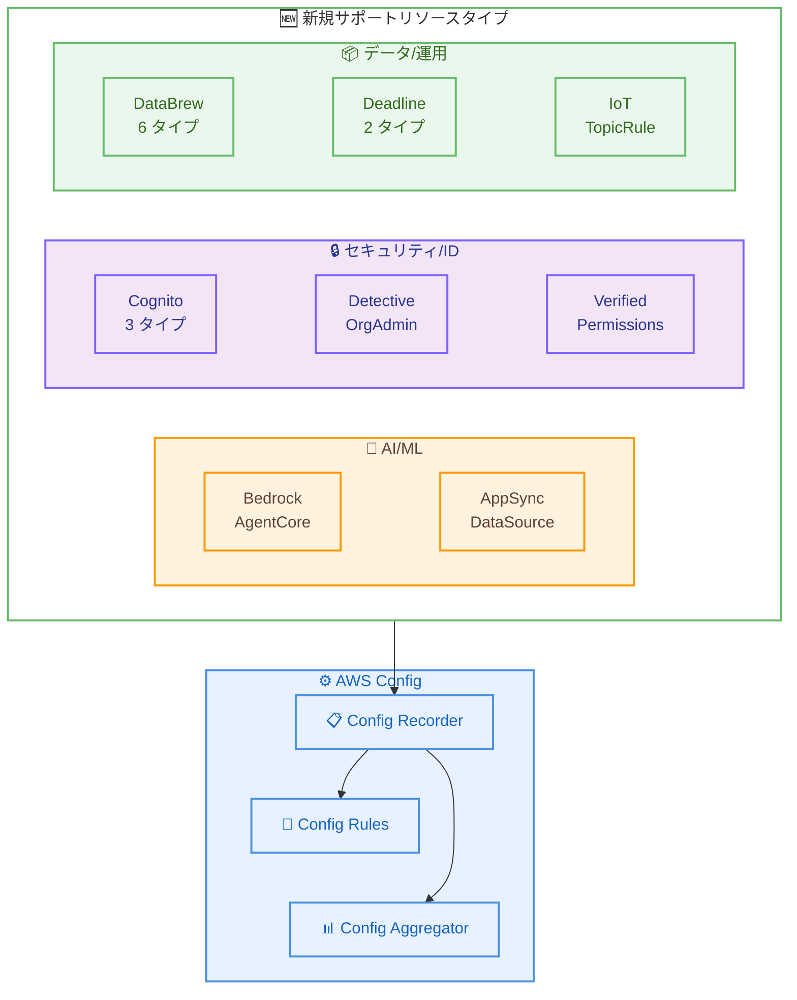

# AWS Config - 30 の新しいリソースタイプをサポート

**リリース日**: 2026 年 3 月 2 日
**サービス**: AWS Config
**機能**: 新規リソースタイプのサポート追加

📊 [このアップデートのインフォグラフィックを見る](https://takech9203.github.io/aws-news-summary/20260302-aws-config-new-resource-types.html)

## 概要

AWS Config が 30 の新しい AWS リソースタイプのサポートを追加した。今回のアップデートでは、Amazon Bedrock AgentCore、Amazon Cognito、AWS AppSync、AWS DataBrew、AWS Deadline、AWS IoT、Amazon Connect など、幅広いサービスのリソースタイプが対象となっている。

すべてのリソースタイプの記録を有効にしている場合、AWS Config は今回追加されたリソースタイプを自動的に追跡する。新しくサポートされたリソースタイプは、Config ルールおよび Config アグリゲーターでも利用可能である。

このアップデートにより、AWS 環境全体のリソースをより効果的に検出、評価、監査、修正できるようになり、コンプライアンスとガバナンスの範囲が拡大する。

**アップデート前の課題**

- Bedrock AgentCore の Gateway や Memory などの AI/ML 関連リソースを AWS Config で追跡・監査できなかった
- Cognito の IdentityPoolRoleAttachment や LogDeliveryConfiguration など、セキュリティ上重要なリソースの設定変更を自動検出できなかった
- DataBrew のワークフロー全体 (Dataset、Job、Project、Recipe、Ruleset、Schedule) を Config ルールで一元管理できなかった

**アップデート後の改善**

- Bedrock AgentCore の Gateway と Memory リソースを Config で追跡し、AI エージェント基盤のガバナンスを強化できるようになった
- Cognito のロールアタッチメントやログ配信設定を自動監査し、ID 管理のセキュリティを向上できるようになった
- DataBrew のすべてのコンポーネントを Config ルールで管理し、データ処理パイプライン全体のコンプライアンスを確保できるようになった

## アーキテクチャ図



AWS Config が新たにサポートした 30 のリソースタイプは、AI/ML、セキュリティ、データ処理など多岐にわたるカテゴリに分類される。Config Recorder が自動的にこれらのリソースを追跡し、Config ルールとアグリゲーターで評価・集約できる。

## サービスアップデートの詳細

### 主要機能

1. **AI/ML 関連リソースのサポート**
   - `AWS::BedrockAgentCore::Gateway`: Bedrock AgentCore のゲートウェイリソースを追跡
   - `AWS::BedrockAgentCore::Memory`: Bedrock AgentCore のメモリリソースを追跡
   - `AWS::Bedrock::DataSource`: Bedrock のデータソースリソースを追跡
   - `AWS::AppSync::DataSource`: AppSync のデータソースを追跡

2. **セキュリティ/ID 管理リソースのサポート**
   - `AWS::Cognito::IdentityPoolRoleAttachment`: ID プールのロールアタッチメント
   - `AWS::Cognito::LogDeliveryConfiguration`: ログ配信設定
   - `AWS::Cognito::UserPoolUICustomizationAttachment`: ユーザープール UI カスタマイズ
   - `AWS::Detective::OrganizationAdmin`: Detective の組織管理者
   - `AWS::VerifiedPermissions::IdentitySource`: Verified Permissions の ID ソース
   - `AWS::PCAConnectorAD::Template`: PCA Connector AD テンプレート
   - `AWS::PCAConnectorSCEP::Challenge`: PCA Connector SCEP チャレンジ

3. **データ処理・運用リソースのサポート**
   - `AWS::DataBrew::Dataset`: DataBrew データセット
   - `AWS::DataBrew::Job`: DataBrew ジョブ
   - `AWS::DataBrew::Project`: DataBrew プロジェクト
   - `AWS::DataBrew::Recipe`: DataBrew レシピ
   - `AWS::DataBrew::Ruleset`: DataBrew ルールセット
   - `AWS::DataBrew::Schedule`: DataBrew スケジュール

4. **その他のリソースタイプ**
   - `AWS::Batch::ConsumableResource`: Batch 消費可能リソース
   - `AWS::Connect::RoutingProfile`: Connect ルーティングプロファイル
   - `AWS::Deadline::LicenseEndpoint`: Deadline ライセンスエンドポイント
   - `AWS::Deadline::QueueEnvironment`: Deadline キュー環境
   - `AWS::IoT::TopicRule`: IoT トピックルール
   - `AWS::Omics::ReferenceStore`: Omics リファレンスストア
   - `AWS::ResourceExplorer2::View`: Resource Explorer ビュー
   - `AWS::ResourceGroups::Group`: Resource Groups グループ
   - `AWS::Scheduler::ScheduleGroup`: EventBridge Scheduler スケジュールグループ
   - `AWS::GameLift::ContainerFleet`: GameLift コンテナフリート
   - `AWS::GameLift::ContainerGroupDefinition`: GameLift コンテナグループ定義
   - `AWS::GameLift::GameServerGroup`: GameLift ゲームサーバーグループ
   - `AWS::GameLift::Location`: GameLift ロケーション

## 技術仕様

### 新規サポートリソースタイプ一覧

| カテゴリ | リソースタイプ | 説明 |
|----------|---------------|------|
| AI/ML | `AWS::AppSync::DataSource` | AppSync データソース |
| AI/ML | `AWS::Bedrock::DataSource` | Bedrock データソース |
| AI/ML | `AWS::BedrockAgentCore::Gateway` | AgentCore ゲートウェイ |
| AI/ML | `AWS::BedrockAgentCore::Memory` | AgentCore メモリ |
| Batch | `AWS::Batch::ConsumableResource` | Batch 消費可能リソース |
| セキュリティ | `AWS::Cognito::IdentityPoolRoleAttachment` | ID プールロール |
| セキュリティ | `AWS::Cognito::LogDeliveryConfiguration` | ログ配信設定 |
| セキュリティ | `AWS::Cognito::UserPoolUICustomizationAttachment` | UI カスタマイズ |
| セキュリティ | `AWS::Detective::OrganizationAdmin` | 組織管理者 |
| セキュリティ | `AWS::PCAConnectorAD::Template` | AD テンプレート |
| セキュリティ | `AWS::PCAConnectorSCEP::Challenge` | SCEP チャレンジ |
| セキュリティ | `AWS::VerifiedPermissions::IdentitySource` | ID ソース |
| コンタクトセンター | `AWS::Connect::RoutingProfile` | ルーティングプロファイル |
| データ処理 | `AWS::DataBrew::Dataset` | データセット |
| データ処理 | `AWS::DataBrew::Job` | ジョブ |
| データ処理 | `AWS::DataBrew::Project` | プロジェクト |
| データ処理 | `AWS::DataBrew::Recipe` | レシピ |
| データ処理 | `AWS::DataBrew::Ruleset` | ルールセット |
| データ処理 | `AWS::DataBrew::Schedule` | スケジュール |
| レンダリング | `AWS::Deadline::LicenseEndpoint` | ライセンスエンドポイント |
| レンダリング | `AWS::Deadline::QueueEnvironment` | キュー環境 |
| ゲーム | `AWS::GameLift::ContainerFleet` | コンテナフリート |
| ゲーム | `AWS::GameLift::ContainerGroupDefinition` | コンテナグループ定義 |
| ゲーム | `AWS::GameLift::GameServerGroup` | ゲームサーバーグループ |
| ゲーム | `AWS::GameLift::Location` | ロケーション |
| IoT | `AWS::IoT::TopicRule` | トピックルール |
| ゲノミクス | `AWS::Omics::ReferenceStore` | リファレンスストア |
| リソース管理 | `AWS::ResourceExplorer2::View` | リソースエクスプローラービュー |
| リソース管理 | `AWS::ResourceGroups::Group` | リソースグループ |
| スケジューリング | `AWS::Scheduler::ScheduleGroup` | スケジュールグループ |

### 自動記録の動作

| 項目 | 詳細 |
|------|------|
| 記録方法 | すべてのリソースタイプの記録を有効にしている場合、自動的に追跡開始 |
| Config ルール | 新しいリソースタイプに対してカスタムルールおよびマネージドルールを適用可能 |
| Config アグリゲーター | マルチアカウント・マルチリージョンでの集約に対応 |
| リージョン | サポートされるリソースが利用可能なすべての AWS リージョンで使用可能 |

## 設定方法

### 前提条件

1. AWS Config が有効化されていること
2. 対象リソースタイプの記録が有効であること
3. 適切な IAM 権限が設定されていること

### 手順

#### ステップ 1: 記録設定の確認

```bash
# 現在の記録設定を確認
aws configservice describe-configuration-recorders
```

すべてのリソースタイプの記録を有効にしている場合、新しいリソースタイプは自動的に追跡される。

#### ステップ 2: 特定のリソースタイプの記録を追加

```bash
# 特定のリソースタイプのみ記録している場合、新しいリソースタイプを追加
aws configservice put-configuration-recorder \
  --configuration-recorder name=default,roleARN=arn:aws:iam::123456789012:role/config-role \
  --recording-group '{"resourceTypes":["AWS::BedrockAgentCore::Gateway","AWS::BedrockAgentCore::Memory","AWS::Cognito::IdentityPoolRoleAttachment"]}'
```

特定のリソースタイプのみ記録している場合、手動で新しいリソースタイプを追加する必要がある。

#### ステップ 3: Config ルールの設定

```bash
# 新しいリソースタイプに対するカスタムルールの例
aws configservice put-config-rule \
  --config-rule '{
    "ConfigRuleName": "bedrock-agentcore-gateway-check",
    "Source": {
      "Owner": "CUSTOM_LAMBDA",
      "SourceIdentifier": "arn:aws:lambda:us-east-1:123456789012:function:config-rule-function"
    },
    "Scope": {
      "ComplianceResourceTypes": ["AWS::BedrockAgentCore::Gateway"]
    }
  }'
```

新しいリソースタイプに対してカスタム Config ルールを作成し、コンプライアンス評価を実行する。

## メリット

### ビジネス面

- **コンプライアンス範囲の拡大**: 30 の新しいリソースタイプにより、AWS 環境全体のガバナンスカバレッジが向上
- **AI/ML ワークロードの監査強化**: Bedrock AgentCore リソースの追跡により、AI エージェント基盤のコンプライアンスを確保
- **運用効率の向上**: DataBrew や Deadline などのデータ処理・レンダリングリソースの一元管理が可能

### 技術面

- **自動追跡**: すべてのリソースタイプの記録を有効にしている場合、追加設定なしで自動的に新しいリソースを追跡
- **Config ルール対応**: 新しいリソースタイプに対してカスタムルールやマネージドルールを即座に適用可能
- **マルチアカウント対応**: Config アグリゲーターで新しいリソースタイプをマルチアカウント・マルチリージョンで集約可能

## デメリット・制約事項

### 制限事項

- 特定のリソースタイプのみ記録している場合、新しいリソースタイプを手動で追加する必要がある
- リソースタイプの利用可否は、そのリソースが利用可能なリージョンに依存する
- Config ルールの評価はリソースタイプごとに設定が必要

### 考慮すべき点

- すべてのリソースタイプの記録を有効にしている場合、記録量の増加に伴いコストが上がる可能性がある
- 新しいリソースタイプに対応するカスタムルールの開発・テストが必要な場合がある

## ユースケース

### ユースケース 1: AI エージェント基盤のガバナンス

**シナリオ**: Bedrock AgentCore を使用して AI エージェントを構築している組織が、Gateway と Memory リソースの設定変更を追跡し、セキュリティポリシーに準拠していることを確認したい。

**実装例**:
```json
{
  "ConfigRuleName": "agentcore-gateway-encryption-check",
  "Source": {
    "Owner": "CUSTOM_LAMBDA",
    "SourceIdentifier": "arn:aws:lambda:us-east-1:123456789012:function:check-gateway-encryption"
  },
  "Scope": {
    "ComplianceResourceTypes": [
      "AWS::BedrockAgentCore::Gateway",
      "AWS::BedrockAgentCore::Memory"
    ]
  }
}
```

**効果**: AI エージェント基盤のリソース設定変更をリアルタイムで追跡し、非準拠リソースを自動検出できる。

### ユースケース 2: データ処理パイプラインのコンプライアンス

**シナリオ**: DataBrew を使用したデータ処理パイプラインを運用している組織が、すべての DataBrew コンポーネントの設定をコンプライアンス基準に照らして監査したい。

**実装例**:
```json
{
  "ConfigRuleName": "databrew-compliance-check",
  "Scope": {
    "ComplianceResourceTypes": [
      "AWS::DataBrew::Dataset",
      "AWS::DataBrew::Job",
      "AWS::DataBrew::Project",
      "AWS::DataBrew::Recipe",
      "AWS::DataBrew::Ruleset",
      "AWS::DataBrew::Schedule"
    ]
  }
}
```

**効果**: DataBrew の全コンポーネントを一元的に監査し、データ処理パイプラインのコンプライアンスを確保できる。

### ユースケース 3: ID 管理のセキュリティ強化

**シナリオ**: Amazon Cognito を使用している組織が、ID プールのロールアタッチメントやログ配信設定の変更を追跡し、不正な権限変更を検出したい。

**実装例**:
```json
{
  "ConfigRuleName": "cognito-security-audit",
  "Scope": {
    "ComplianceResourceTypes": [
      "AWS::Cognito::IdentityPoolRoleAttachment",
      "AWS::Cognito::LogDeliveryConfiguration",
      "AWS::Cognito::UserPoolUICustomizationAttachment"
    ]
  }
}
```

**効果**: Cognito の設定変更履歴を自動記録し、不正な権限変更やログ設定の変更をリアルタイムで検出できる。

## 料金

AWS Config の料金は既存の料金体系に従う。

### 料金例

| 項目 | 料金 |
|------|------|
| 設定項目の記録 | $0.003/設定項目 (リージョンごと) |
| Config ルール評価 | $0.001/評価 (最初の 100,000 件) |
| コンフォーマンスパック評価 | $0.0012/評価 (最初の 100,000 件) |

新しいリソースタイプの追加により、記録される設定項目が増加するため、コストの増加が見込まれる。

## 利用可能リージョン

サポートされるリソースが利用可能なすべての [AWS リージョン](https://docs.aws.amazon.com/config/latest/developerguide/what-is-resource-config-coverage.html)で使用可能。

## 関連サービス・機能

- **Amazon Bedrock AgentCore**: AI エージェント基盤のゲートウェイとメモリリソースを Config で追跡可能に
- **Amazon Cognito**: ID プールのロールアタッチメントやログ設定を Config で監査可能に
- **AWS DataBrew**: データ処理パイプラインの全コンポーネントを Config で一元管理可能に
- **AWS Config ルール**: 新しいリソースタイプに対してコンプライアンスルールを適用可能
- **AWS Config アグリゲーター**: マルチアカウント・マルチリージョンでの集約に対応

## 参考リンク

- 📊 [インフォグラフィック](https://takech9203.github.io/aws-news-summary/20260302-aws-config-new-resource-types.html)
- [公式発表 (What's New)](https://aws.amazon.com/about-aws/whats-new/2026/03/aws-config-new-resource-types/)
- [ドキュメント - リソースカバレッジ](https://docs.aws.amazon.com/config/latest/developerguide/what-is-resource-config-coverage.html)
- [料金ページ](https://aws.amazon.com/config/pricing/)

## まとめ

AWS Config が 30 の新しいリソースタイプをサポートしたことで、特に Bedrock AgentCore、Cognito、DataBrew などのサービスにおけるガバナンスとコンプライアンスの範囲が大幅に拡大した。すべてのリソースタイプの記録を有効にしている環境では追加設定なしで自動的に追跡が開始されるため、早急な対応は不要だが、特定のリソースタイプのみ記録している場合は、必要に応じて新しいリソースタイプを追加することを推奨する。
