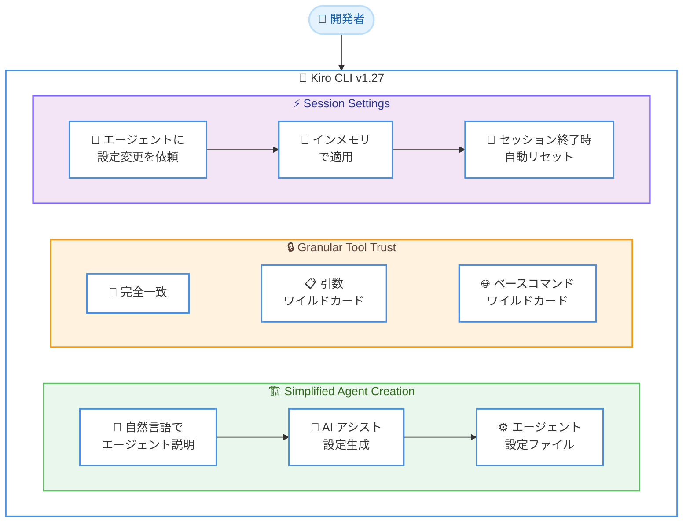

# Kiro - バージョン 1.27 リリース

**リリース日**: 2026 年 3 月 2 日
**サービス**: Kiro
**機能**: Simplified Agent Creation、Granular Tool Trust、Session Settings

📊 [このアップデートのインフォグラフィックを見る](https://takech9203.github.io/aws-news-summary/20260302-kiro-changelog-2026-03-02.html)

## 概要

Kiro CLI のバージョン 1.27 がリリースされた。このリリースでは、エージェントの作成プロセスの簡素化、ツール信頼のきめ細かな制御、セッション設定ツールの 3 つの主要な機能強化が含まれている。

今回のアップデートは Kiro CLI のエージェント管理体験を大幅に改善するものである。エージェント作成では AI アシストがデフォルトとなり、自然言語で説明するだけでエージェント設定が自動生成される。ツール信頼ではシェルコマンドやファイル操作に対して段階的なスコープを設定でき、セキュリティと利便性のバランスを最適化できる。

これらの機能強化により、Kiro CLI のエージェント開発ワークフローがより直感的かつ安全になり、開発者の生産性向上に寄与する。

**アップデート前の課題**

- エージェント作成には `/agent create` と `/agent generate` の 2 つの別々のコマンドが存在し、使い分けが分かりにくかった
- ツールの信頼設定は「許可」か「拒否」の二択で、きめ細かな制御ができなかった
- セッション中に設定を変更するには設定ファイルを直接編集する必要があり、作業の中断が発生していた

**アップデート後の改善**

- `/agent create` コマンドが AI アシストモードをデフォルトとし、自然言語でエージェント設定を自動生成できるようになった
- シェルコマンドやファイル操作に対して段階的なスコープ (完全一致、引数ワイルドカード、ベースコマンドワイルドカード) で信頼を設定できるようになった
- セッション設定ツールにより、設定ファイルを編集せずにセッション内で一時的に設定を変更できるようになった

## アーキテクチャ図



Kiro CLI v1.27 の 3 つの主要機能。エージェント作成の AI アシスト、段階的なツール信頼制御、セッション内設定変更がシームレスに統合されている。

## サービスアップデートの詳細

### 主要機能

1. **Simplified Agent Creation**
   - `/agent create` コマンドが AI アシストモードをデフォルトに変更
   - 以前の `/agent generate` ワークフローが `/agent create` に統合
   - 自然言語でエージェントの目的を説明するだけで、設定ファイルを自動生成
   - `--manual` フラグで従来のエディタベースの作成フローも利用可能
   - コマンド引数を直接指定することで、インタラクティブメニューをバイパス可能

2. **Granular Tool Trust**
   - ツール使用時にインタラクティブピッカーで信頼範囲を選択可能
   - `shell` コマンドの場合: 完全一致、引数ワイルドカード、ベースコマンドワイルドカードの段階的スコープ
   - `read`/`write` ツールの場合: 特定のファイルパス、含有ディレクトリ、ツール全体のスコープ
   - 各アクションに応じてピッカーが適応し、無意味な段階はスキップ
   - チェーンされたシェルコマンドも自動的に処理

3. **Session Settings Tool**
   - エージェントに設定変更を依頼するだけで、セッション内で一時的に設定を調整可能
   - モデル設定、機能のトグル、動作の微調整などが対象
   - すべてのセッションオーバーライドはインメモリで適用
   - セッション終了時に自動的にリセットされ、設定ファイルは変更されない

## 技術仕様

### コマンド変更

| コマンド | v1.26 以前 | v1.27 |
|----------|-----------|-------|
| `/agent create` | エディタベースの手動作成 | AI アシストがデフォルト |
| `/agent generate` | AI によるエージェント生成 | `/agent create` に統合 |
| `/agent create --manual` | - | 従来のエディタベース作成 |

### ツール信頼スコープ

| ツールタイプ | スコープレベル | 説明 |
|-------------|--------------|------|
| shell | 完全一致 | 指定されたコマンドと引数に完全一致する場合のみ許可 |
| shell | 引数ワイルドカード | 同じコマンドで任意の引数を許可 |
| shell | ベースコマンドワイルドカード | ベースコマンド全体をワイルドカードで許可 |
| read/write | ファイルパス | 特定のファイルパスのみ許可 |
| read/write | ディレクトリ | 指定ディレクトリ内のすべてのファイルを許可 |
| read/write | ツール全体 | ツールのすべての操作を許可 |

## 設定方法

### 前提条件

1. Kiro CLI v1.27 以降がインストールされていること
2. Kiro アカウントでログイン済みであること

### 手順

#### ステップ 1: エージェントの作成 (AI アシスト)

```bash
# AI アシストモードでエージェントを作成 (デフォルト)
/agent create
```

プロンプトに従い、エージェントの目的を自然言語で説明すると、Kiro が自動的にエージェント設定を生成する。

#### ステップ 2: エージェントの作成 (手動モード)

```bash
# 従来のエディタベースで作成
/agent create --manual
```

手動モードでは従来どおりエディタベースでエージェント設定を直接編集できる。

#### ステップ 3: セッション設定の変更

エージェントとの会話中に、設定変更を自然言語で依頼する。

```
「モデルを Claude Opus に変更して」
「詳細なログ出力を有効にして」
```

エージェントがセッション設定ツールを使用して、インメモリで設定を変更する。セッション終了時に自動的にリセットされる。

## メリット

### ビジネス面

- **開発者体験の向上**: エージェント作成の簡素化により、AI エージェント開発の学習曲線を低減
- **セキュリティとアジリティの両立**: 段階的なツール信頼により、チームのセキュリティポリシーに準拠しつつ開発速度を維持
- **作業効率の改善**: セッション設定ツールにより、設定変更のための作業中断を排除

### 技術面

- **統合コマンド**: `/agent create` と `/agent generate` の統合により、コマンド体系が簡素化
- **きめ細かなアクセス制御**: シェルコマンドの完全一致からワイルドカードまで、段階的な信頼制御を実現
- **非永続的設定変更**: セッションオーバーライドはインメモリで管理され、設定ファイルの意図しない変更を防止

## デメリット・制約事項

### 制限事項

- セッション設定の変更はインメモリのみで、永続化するには設定ファイルを手動で編集する必要がある
- `/agent generate` コマンドは非推奨となるため、既存のスクリプトやワークフローの更新が必要な場合がある

### 考慮すべき点

- AI アシストモードがデフォルトになったため、従来のエディタベース作成を好むユーザーは `--manual` フラグの追加が必要
- ツール信頼の段階的スコープは、初めて使用するユーザーにとって選択肢が多く感じる可能性がある

## ユースケース

### ユースケース 1: 新しい AI エージェントの迅速な作成

**シナリオ**: 開発者がコードレビュー用の AI エージェントを素早く作成したい。

**実装例**:
```bash
/agent create
# プロンプト: 「コードレビューを行うエージェントを作成したい。
# PR の差分を分析し、バグ、セキュリティ問題、パフォーマンスの改善点を指摘する。」
```

**効果**: 自然言語による説明だけで、適切な設定を持つエージェントが自動生成され、開発時間を大幅に短縮できる。

### ユースケース 2: セキュアな運用環境でのエージェント利用

**シナリオ**: 本番環境に近い環境でエージェントを使用する際、シェルコマンドの実行範囲を最小限に制限したい。

**実装例**:
```
# エージェントが `kubectl get pods` を実行しようとした場合
# ピッカーで「引数ワイルドカード」を選択
# → `kubectl get *` は許可されるが、`kubectl delete *` は別途承認が必要
```

**効果**: 読み取り系コマンドは柔軟に許可しつつ、破壊的操作は個別に承認することで、セキュリティと利便性を両立できる。

### ユースケース 3: 一時的な設定調整によるデバッグ

**シナリオ**: デバッグセッション中に一時的にモデルを変更し、詳細なログを有効にしたい。

**実装例**:
```
# セッション中にエージェントに依頼
「デバッグのため、モデルを Claude Opus に変更し、verbose モードを有効にして」

# デバッグ完了後、セッションを終了すれば元の設定に自動復帰
```

**効果**: 設定ファイルを変更せずに一時的な設定調整が可能で、デバッグ後に手動で設定を元に戻す手間が不要。

## 料金

Kiro CLI の料金体系に変更はない。既存のサブスクリプションプランに含まれる。

## 利用可能リージョン

グローバル (Kiro はグローバルサービス)

## 関連サービス・機能

- **Kiro Powers**: エージェントが利用できる拡張機能セット
- **Kiro Autonomous Agent**: 自律型エージェント機能との連携
- **MCP サーバー**: エージェントが外部ツールやサービスと連携するためのプロトコル

## 参考リンク

- 📊 [インフォグラフィック](https://takech9203.github.io/aws-news-summary/20260302-kiro-changelog-2026-03-02.html)
- [Kiro Changelog](https://kiro.dev/changelog/)
- [Kiro ドキュメント](https://kiro.dev/docs/)

## まとめ

Kiro CLI v1.27 では、エージェント作成の AI アシスト化、段階的なツール信頼制御、セッション設定ツールの 3 つの重要な機能強化が行われた。特にエージェント作成の簡素化と Granular Tool Trust は、AI エージェント開発のセキュリティと開発効率を同時に向上させるアップデートである。Kiro CLI を利用している開発者は、v1.27 にアップデートして新機能を活用することを推奨する。
