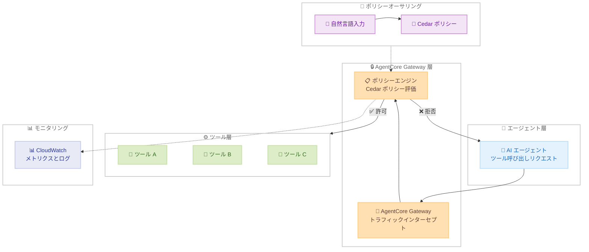

# Amazon Bedrock AgentCore - Policy 機能の一般提供開始

**リリース日**: 2026 年 3 月 3 日
**サービス**: Amazon Bedrock AgentCore
**機能**: Policy in Amazon Bedrock AgentCore

📊 [このアップデートのインフォグラフィックを見る](https://takech9203.github.io/aws-news-summary/20260303-policy-amazon-bedrock-agentcore-generally-available.html)

## 概要

Amazon Bedrock AgentCore の Policy 機能が一般提供 (GA) を開始しました。この機能は、AI エージェントとツール間のインタラクションに対して、一元的かつきめ細かなアクセス制御を提供します。エージェントコードの外部で動作するため、セキュリティチーム、コンプライアンスチーム、運用チームがエージェントコードを変更することなく、ツールアクセスや入力バリデーションのルールを定義できます。

Policy 機能では、自然言語でポリシーを記述すると、AWS のオープンソースポリシー言語である Cedar に自動変換されます。作成されたポリシーはポリシーエンジンに保存され、AgentCore Gateway に関連付けられます。Gateway はエージェントとツール間のトラフィックをインターセプトし、各リクエストをポリシーに照らして評価した上で、ツールへのアクセスを許可または拒否します。

この機能は、エンタープライズ環境で自律型 AI エージェントを安全にデプロイするために設計されており、ユーザー ID やツール入力パラメータに基づくきめ細かな権限制御をサポートしています。セキュリティ制御をエージェントコードから分離することで、開発者はエージェントの革新的な機能構築に集中しながら、強固なセキュリティ保証を維持できます。

**アップデート前の課題**

- AI エージェントのツールアクセス制御をエージェントコード内に直接実装する必要があり、セキュリティロジックとビジネスロジックが混在していた
- エージェントがビジネスルールを誤解釈したり、意図された権限の範囲外で動作したりするリスクがあった
- 複数のエージェントにわたる一貫したセキュリティポリシーの適用が困難で、各エージェントごとに個別のセキュリティ実装が必要だった
- ポリシーの変更にはエージェントコードの修正とデプロイが必要であり、セキュリティチームと開発チーム間の調整コストが高かった

**アップデート後の改善**

- エージェントコードの外部でポリシーを定義・適用できるようになり、セキュリティとビジネスロジックの分離が実現された
- 自然言語でポリシーを記述し、Cedar ポリシーに自動変換できるため、ポリシー作成の敷居が大幅に下がった
- AgentCore Gateway を通じた決定論的なポリシー適用により、エージェントの実装方法に依存しない一貫した制御が可能になった
- CloudWatch との統合によるポリシー評価のモニタリングと監査ログにより、組織全体の可視性とガバナンスが向上した

## アーキテクチャ図



AI エージェントからのツール呼び出しリクエストが AgentCore Gateway でインターセプトされ、ポリシーエンジンが Cedar ポリシーに基づいて許可/拒否を判定するフローを示しています。ポリシーは自然言語から Cedar に自動変換され、すべての判定結果は CloudWatch に記録されます。

## サービスアップデートの詳細

### 主要機能

1. **ポリシー適用 - エージェントとツール間のトラフィック制御**
   - AgentCore Gateway を通じてすべてのエージェントリクエストをインターセプト
   - 定義されたポリシーに基づいて各リクエストを評価し、ツールアクセスの許可/拒否を決定
   - エージェントコードの外部で動作するため、エージェントの実装に依存しない決定論的な制御を実現

2. **きめ細かなアクセス制御**
   - ユーザー ID に基づくアクセス制御により、特定のユーザーに対するツールアクセスを制限
   - ツール入力パラメータに基づくバリデーションルールの定義が可能
   - エージェントが呼び出せるツールと、その実行条件を詳細に指定可能

3. **自然言語によるポリシーオーサリング**
   - 英語の自然言語でルールを記述すると、Cedar ポリシーに自動変換
   - ツールスキーマに対するバリデーションを自動的に実行
   - 自動推論 (automated reasoning) により、過度に許容的なポリシー、過度に制限的なポリシー、決して満たされない条件を含むポリシーなどの安全性条件を検出

4. **Cedar ポリシー言語のサポート**
   - AWS のオープンソースポリシー言語である Cedar を使用して、正確で検証可能なポリシーを記述
   - Cedar は Amazon Verified Permissions でも使用されている実績のある言語
   - きめ細かな認可ポリシーの記述に最適化された構文を提供

5. **ポリシーモニタリングと監査**
   - CloudWatch メトリクスおよびログとの統合
   - すべてのポリシー評価と判定結果の詳細なログを記録
   - セキュリティチームやコンプライアンスチームによる監査と動作検証が可能

6. **インフラストラクチャ統合**
   - VPC セキュリティグループおよびその他の AWS セキュリティインフラとの統合
   - 既存の AWS セキュリティ体制との整合性を維持

## 技術仕様

### Policy の主要コンポーネント

| コンポーネント | 説明 |
|---------------|------|
| ポリシーエンジン | ポリシーの保存と評価を行うコンポーネント。Cedar ポリシーを管理 |
| AgentCore Gateway | エージェントとツール間のトラフィックをインターセプトし、ポリシーエンジンに評価を委譲 |
| Cedar ポリシー | アクセス制御ルールを記述するポリシー言語。宣言的な構文で許可/拒否条件を定義 |
| 自然言語オーサリング | 英語の自然言語記述を Cedar ポリシーに変換する機能 |
| 自動推論 | ポリシーの安全性を自動検証する機能。過度な許容/制限、充足不可能な条件を検出 |

### API 変更履歴

直近の AgentCore 関連 API 変更は以下のとおりです。

| 日付 | サービス | 変更内容 |
|------|----------|----------|
| 2026/02/10 | [Amazon Bedrock AgentCore](https://awsapichanges.com/archive/changes/56b6d8-bedrock-agentcore.html) | 2 updated methods - ブラウザプロキシ設定サポートの追加 |
| 2026/02/05 | [Amazon Bedrock AgentCore](https://awsapichanges.com/archive/changes/7c51a6-bedrock-agentcore.html) | 1 new 2 updated methods - ブラウザプロファイル永続化サポート |
| 2026/02/05 | [Amazon Bedrock AgentCore Control](https://awsapichanges.com/archive/changes/7c51a6-bedrock-agentcore-control.html) | 4 new methods - ブラウザプロファイル永続化サポート |

Policy 機能の GA に伴う API 変更は、今後 [awsapichanges.com](https://awsapichanges.com/) で公開される見込みです。

### Cedar ポリシーの例

```cedar
// エージェントが特定のツールにアクセスすることを許可するポリシー例
permit (
    principal,
    action == Action::"InvokeTool",
    resource == Tool::"OrderLookup"
) when {
    principal.role == "customer-service-agent"
};

// 特定の条件下でツールアクセスを拒否するポリシー例
forbid (
    principal,
    action == Action::"InvokeTool",
    resource == Tool::"DeleteRecord"
) unless {
    principal.role == "admin-agent" &&
    context.approval_status == "approved"
};
```

## 設定方法

### 前提条件

1. AWS アカウントと適切な IAM 権限
2. Amazon Bedrock AgentCore が有効なリージョンでの利用
3. AgentCore Gateway のセットアップ

### 手順

#### ステップ 1: ポリシーエンジンの作成

AgentCore コンソールまたは API を使用して、ポリシーエンジンを作成します。ポリシーエンジンは Cedar ポリシーを保存・管理するコンテナとして機能します。

#### ステップ 2: ポリシーの作成

自然言語または Cedar を使用してポリシーを作成します。自然言語で記述した場合は自動的に Cedar ポリシーに変換され、ツールスキーマに対するバリデーションが実行されます。

```
自然言語の例:
"カスタマーサービスエージェントは、注文検索ツールと返品処理ツールにのみアクセスできる。
 レコード削除ツールへのアクセスは管理者エージェントに限定する。"
```

自動推論により、ポリシーの安全性条件が検証されます。

#### ステップ 3: ポリシーエンジンを Gateway に関連付け

作成したポリシーエンジンを AgentCore Gateway に関連付けます。これにより、Gateway を通過するすべてのエージェントリクエストがポリシーに基づいて評価されます。

#### ステップ 4: モニタリングの設定

CloudWatch を使用して、ポリシー評価の結果をモニタリングします。許可/拒否の判定ログを確認し、ポリシーが意図どおりに動作していることを検証します。

## メリット

### ビジネス面

- **ガバナンスの強化**: エージェントの動作に対する組織全体の可視性と制御を確保し、コンプライアンス要件への対応を容易にする
- **運用効率の向上**: セキュリティポリシーの変更がエージェントコードの修正なしに行えるため、セキュリティチームと開発チームの独立した作業が可能
- **リスク軽減**: エージェントが定義されたパラメータ内で動作することを保証し、意図しない動作や権限の逸脱を防止

### 技術面

- **関心の分離**: セキュリティ制御をエージェントコードから完全に分離することで、コードの保守性と品質が向上
- **決定論的な制御**: ポリシーの適用がエージェントの実装に依存しないため、一貫した動作を保証
- **自動推論による安全性検証**: ポリシーの論理的な整合性を自動的に検証し、人的ミスによる設定ミスを低減

## デメリット・制約事項

### 制限事項

- 自然言語によるポリシーオーサリングは現時点で英語のみをサポート
- ポリシーの適用には AgentCore Gateway を経由する必要があり、Gateway を使用しないエージェント構成では利用不可
- Cedar ポリシー言語の学習コストが発生する場合がある (ただし自然言語変換機能で軽減可能)

### 考慮すべき点

- ポリシー評価の追加による、リクエストあたりのわずかなレイテンシ増加の可能性
- 複雑なポリシー構成の場合、テストと検証に十分な時間を確保する必要がある
- 既存のエージェントシステムへの導入には、AgentCore Gateway を経由するようアーキテクチャの変更が必要になる場合がある

## ユースケース

### ユースケース 1: カスタマーサービスエージェントの権限制御

**シナリオ**: カスタマーサービスの AI エージェントが、注文検索、返品処理、顧客情報更新など複数のツールにアクセスする環境で、エージェントごとに適切な権限を設定する必要がある。

**実装例**:
```cedar
// カスタマーサービスエージェントは注文検索と返品処理のみ許可
permit (
    principal,
    action == Action::"InvokeTool",
    resource in [Tool::"OrderLookup", Tool::"ProcessReturn"]
) when {
    principal.role == "customer-service-agent"
};

// 顧客情報の削除はスーパーバイザーのみ許可
permit (
    principal,
    action == Action::"InvokeTool",
    resource == Tool::"DeleteCustomerData"
) when {
    principal.role == "supervisor-agent"
};
```

**効果**: エージェントの権限を明確に定義することで、顧客データへの不正アクセスや誤操作を防止し、コンプライアンス要件を満たすことができる。

### ユースケース 2: 金融サービスにおける取引エージェントの入力バリデーション

**シナリオ**: 金融取引を行う AI エージェントに対して、取引金額や取引先の制限を設定し、不正取引やエラーによる損失を防止する。

**実装例**:
```cedar
// 取引金額に上限を設定
permit (
    principal,
    action == Action::"InvokeTool",
    resource == Tool::"ExecuteTrade"
) when {
    principal.role == "trading-agent" &&
    context.amount <= 10000
};

// 承認済み取引先のみに制限
forbid (
    principal,
    action == Action::"InvokeTool",
    resource == Tool::"ExecuteTrade"
) unless {
    context.counterparty in principal.approved_counterparties
};
```

**効果**: エージェントの取引行動に対する定量的な制約を設定することで、リスクを管理しながら自動化のメリットを享受できる。

### ユースケース 3: マルチテナント SaaS アプリケーションのエージェント分離

**シナリオ**: 複数のテナントが利用する SaaS プラットフォームで、各テナントの AI エージェントが自身のテナントデータにのみアクセスできるように制御する。

**実装例**:
```cedar
// エージェントは自身のテナントのデータのみアクセス可能
permit (
    principal,
    action == Action::"InvokeTool",
    resource == Tool::"QueryDatabase"
) when {
    context.tenant_id == principal.tenant_id
};

// 他テナントのデータへのアクセスを明示的に拒否
forbid (
    principal,
    action == Action::"InvokeTool",
    resource == Tool::"QueryDatabase"
) when {
    context.tenant_id != principal.tenant_id
};
```

**効果**: テナント間のデータ分離をポリシーレベルで保証し、エージェントコードにデータ分離ロジックを埋め込む必要がなくなる。

## 料金

Policy 機能は従量課金制で提供されており、初期費用やミニマムチャージはありません。

| 課金項目 | 料金 |
|----------|------|
| 認可リクエスト | $0.000025/リクエスト |
| 自然言語ポリシーオーサリング (入力トークン) | $0.13/1,000 入力トークン |

### 料金例

| 使用量 | 月額料金 (概算) |
|--------|-----------------|
| 100 万認可リクエスト/月 | $25 |
| 1,000 万認可リクエスト/月 | $250 |
| 1 億認可リクエスト/月 | $2,500 |

- 自然言語ポリシーオーサリングの料金は、自然言語を Cedar に変換する際にのみ発生します
- 新規 AWS ユーザーは最大 $200 の無料利用枠クレジットを利用可能
- AgentCore の各サービス (Runtime、Gateway、Policy、Identity など) は独立して利用でき、使用した分のみ課金されます

## 利用可能リージョン

以下の 13 リージョンで利用可能です。

| リージョン名 | リージョンコード |
|-------------|-----------------|
| US East (N. Virginia) | us-east-1 |
| US East (Ohio) | us-east-2 |
| US West (Oregon) | us-west-2 |
| Asia Pacific (Mumbai) | ap-south-1 |
| Asia Pacific (Seoul) | ap-northeast-2 |
| Asia Pacific (Singapore) | ap-southeast-1 |
| Asia Pacific (Sydney) | ap-southeast-2 |
| Asia Pacific (Tokyo) | ap-northeast-1 |
| Europe (Frankfurt) | eu-central-1 |
| Europe (Ireland) | eu-west-1 |
| Europe (London) | eu-west-2 |
| Europe (Paris) | eu-west-3 |
| Europe (Stockholm) | eu-north-1 |

## 関連サービス・機能

- **Amazon Bedrock AgentCore Gateway**: エージェントとツール間のトラフィックを仲介するゲートウェイ。Policy はこの Gateway に関連付けて使用する
- **Amazon Verified Permissions**: Cedar ポリシー言語を使用したアプリケーション向け認可サービス。Policy と同じ Cedar 言語基盤を共有
- **Cedar**: AWS が開発したオープンソースのポリシー言語。宣言的な構文できめ細かなアクセス制御を記述可能
- **Amazon CloudWatch**: Policy の評価結果やメトリクスのモニタリングに使用。監査ログの保存と分析が可能
- **AgentCore Identity**: エージェントの ID 管理とアクセス管理を簡素化するサービス。Policy と組み合わせて包括的なセキュリティ体制を構築

## 参考リンク

- 📊 [インフォグラフィック](https://takech9203.github.io/aws-news-summary/20260303-policy-amazon-bedrock-agentcore-generally-available.html)
- [公式発表 (What's New)](https://aws.amazon.com/about-aws/whats-new/2026/03/policy-amazon-bedrock-agentcore-generally-available/)
- [ドキュメント - Policy in Amazon Bedrock AgentCore](https://docs.aws.amazon.com/bedrock-agentcore/latest/devguide/policy.html)
- [AgentCore Starter Toolkit](https://docs.aws.amazon.com/bedrock-agentcore/latest/devguide/starter-toolkit.html)
- [Cedar Policy Language](https://www.cedarpolicy.com/)
- [料金ページ - Amazon Bedrock AgentCore](https://aws.amazon.com/bedrock/agentcore/pricing/)

## まとめ

Amazon Bedrock AgentCore の Policy 機能の GA により、AI エージェントのツールアクセスに対するエンタープライズレベルのガバナンスが実現しました。Cedar ポリシー言語と自然言語オーサリングの組み合わせにより、セキュリティチームと開発チームの両方がポリシー管理に参加できる柔軟な運用が可能です。自律型 AI エージェントを本番環境にデプロイする際には、Policy 機能を活用してエージェントの動作範囲を明確に定義し、安全かつ制御されたエージェント運用を構築することを推奨します。
