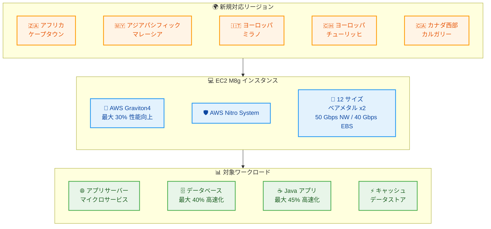

# Amazon EC2 - M8g インスタンスが追加リージョンで利用可能に

**リリース日**: 2026年03月04日
**サービス**: Amazon EC2
**機能**: M8g 汎用インスタンス (AWS Graviton4 搭載)

[このアップデートのインフォグラフィックを見る](https://takech9203.github.io/aws-news-summary/20260304-amazon-ec2-m8g-instances-africa-cape-town-asia-pacific-malaysia-europe-milan-zurich-canada-west-calgary-regions.html)

## 概要

AWS は 2026 年 3 月 4 日、Amazon EC2 M8g インスタンスがアフリカ (ケープタウン)、アジアパシフィック (マレーシア)、ヨーロッパ (ミラノ、チューリッヒ)、カナダ西部 (カルガリー) の 5 リージョンで利用可能になったことを発表しました。M8g インスタンスは AWS Graviton4 プロセッサーを搭載し、AWS Graviton3 ベースのインスタンスと比較して最大 30% 優れたパフォーマンスを提供します。

M8g インスタンスは、アプリケーションサーバー、マイクロサービス、ゲームサーバー、中規模データストア、キャッシュフリートなどの汎用ワークロード向けに設計されています。AWS Nitro System 上に構築されており、CPU 仮想化、ストレージ、ネットワーク機能を専用のハードウェアとソフトウェアにオフロードすることで、ワークロードのパフォーマンスとセキュリティを強化します。

**アップデート前の課題**

- アフリカ (ケープタウン)、アジアパシフィック (マレーシア)、ヨーロッパ (ミラノ、チューリッヒ)、カナダ西部 (カルガリー) リージョンでは M8g インスタンスが利用できず、Graviton4 の性能を汎用ワークロードに活用できなかった
- これらのリージョンのユーザーは前世代の M7g (Graviton3) インスタンスを使用する必要があり、最新のパフォーマンス向上の恩恵を受けられなかった
- Graviton3 ベースのインスタンスでは、データベースや Java アプリケーションなどのワークロードで十分なパフォーマンスを得られないケースがあった

**アップデート後の改善**

- 上記 5 リージョンで M8g インスタンスが利用可能になり、Graviton4 プロセッサーによる最大 30% のパフォーマンス向上を活用できるようになった
- データベースで最大 40% 高速化、Web アプリケーションで最大 30% 高速化、大規模 Java アプリケーションで最大 45% 高速化を実現
- M7g と比較して最大 3 倍の vCPU とメモリを持つ大型インスタンスサイズを利用できるようになった

## アーキテクチャ図



M8g インスタンスが 5 つの追加リージョンで利用可能になり、Graviton4 プロセッサーの性能を幅広いワークロードに活用できるようになりました。

## サービスアップデートの詳細

### 主要機能

1. **AWS Graviton4 プロセッサー搭載**
   - Graviton3 と比較して最大 30% 優れた全体パフォーマンス
   - データベースワークロードで最大 40% 高速化
   - Web アプリケーションで最大 30% 高速化
   - 大規模 Java アプリケーションで最大 45% 高速化

2. **大型インスタンスサイズのサポート**
   - M7g (Graviton3) と比較して最大 3 倍の vCPU とメモリ
   - 12 種類のインスタンスサイズ (2 つのベアメタルサイズを含む)
   - 小規模から大規模まで幅広いワークロードに対応

3. **高性能ネットワーキングと EBS 帯域幅**
   - 最大 50 Gbps の拡張ネットワーキング帯域幅
   - 最大 40 Gbps の Amazon EBS 帯域幅
   - AWS Nitro System による CPU 仮想化、ストレージ、ネットワーク機能のオフロード

## 技術仕様

### インスタンス仕様

| 項目 | 詳細 |
|------|------|
| プロセッサー | AWS Graviton4 (Arm ベース) |
| インスタンスファミリー | M8g (汎用) |
| インスタンスサイズ数 | 12 (ベアメタル 2 サイズ含む) |
| 最大ネットワーク帯域幅 | 50 Gbps |
| 最大 EBS 帯域幅 | 40 Gbps |
| 基盤システム | AWS Nitro System |
| vCPU/メモリ比率 | M7g 比最大 3 倍 |

### パフォーマンス比較 (Graviton3 比)

| ワークロード | パフォーマンス向上 |
|-------------|-------------------|
| 全般 | 最大 30% 高速化 |
| データベース | 最大 40% 高速化 |
| Web アプリケーション | 最大 30% 高速化 |
| 大規模 Java アプリケーション | 最大 45% 高速化 |

## 設定方法

### 前提条件

1. 対象リージョンの AWS アカウント
2. Arm (aarch64/arm64) アーキテクチャ対応の AMI
3. 適切な IAM 権限 (EC2 インスタンスの起動権限)

### 手順

#### ステップ 1: AMI の選択

```bash
# Graviton 対応の Amazon Linux 2023 AMI を検索
aws ec2 describe-images \
  --region af-south-1 \
  --filters "Name=name,Values=al2023-ami-*-arm64-*" \
            "Name=state,Values=available" \
  --query 'Images | sort_by(@, &CreationDate) | [-1].ImageId' \
  --output text
```

対象リージョンで Arm アーキテクチャ (arm64) に対応した AMI を選択します。Amazon Linux 2023、Ubuntu、RHEL などが利用可能です。

#### ステップ 2: M8g インスタンスの起動

```bash
# M8g インスタンスを起動
aws ec2 run-instances \
  --region af-south-1 \
  --instance-type m8g.xlarge \
  --image-id ami-xxxxxxxxxxxxxxxxx \
  --key-name my-key-pair \
  --security-group-ids sg-xxxxxxxxxxxxxxxxx \
  --subnet-id subnet-xxxxxxxxxxxxxxxxx
```

M8g インスタンスタイプを指定してインスタンスを起動します。m8g.medium から m8g.metal-48xl まで 12 サイズから選択できます。

#### ステップ 3: 既存ワークロードの移行 (必要に応じて)

```bash
# Porting Advisor for Graviton を使用して互換性を確認
# https://github.com/aws/porting-advisor-for-graviton
pip install porting-advisor-for-graviton
porting-advisor /path/to/your/application
```

既存の x86 ワークロードを Graviton4 に移行する場合、Porting Advisor for Graviton を使用してアプリケーションの互換性を事前に確認できます。

## メリット

### ビジネス面

- **コスト効率の向上**: Graviton4 は同等の x86 インスタンスと比較して優れた価格パフォーマンスを提供し、コンピューティングコストを削減できる
- **リージョン選択肢の拡大**: アフリカ、東南アジア、ヨーロッパ、カナダのユーザーに近いリージョンでワークロードを実行でき、レイテンシーを低減できる
- **エネルギー効率**: Graviton4 は x86 ベースのインスタンスと比較してエネルギー効率が高く、サステナビリティ目標の達成に貢献できる

### 技術面

- **大幅なパフォーマンス向上**: データベースで最大 40%、Java アプリケーションで最大 45% の高速化を実現
- **スケーラビリティ**: M7g 比最大 3 倍の vCPU とメモリにより、より大規模なワークロードを単一インスタンスで処理可能
- **高帯域幅ネットワーキング**: 50 Gbps のネットワーク帯域幅と 40 Gbps の EBS 帯域幅により、データ集約的なワークロードに対応

## デメリット・制約事項

### 制限事項

- Arm (aarch64) アーキテクチャのみサポートしており、x86 向けにコンパイルされたバイナリはそのまま実行できない
- すべてのリージョンで利用可能なわけではなく、今回追加された 5 リージョンを含む対応リージョンに限定される
- 一部のサードパーティソフトウェアは Arm アーキテクチャに未対応の場合がある

### 考慮すべき点

- x86 アーキテクチャからの移行時には、アプリケーションの互換性テストが必要
- ベアメタルインスタンスはライセンス管理やカスタムハイパーバイザーの要件がある場合に適しているが、一般的なワークロードでは仮想化インスタンスで十分

## ユースケース

### ユースケース 1: アフリカ地域向け Web アプリケーション

**シナリオ**: アフリカ市場向けの Web アプリケーションを運用しており、ケープタウンリージョンでのレイテンシー低減と性能向上が求められている。

**実装例**:
```bash
# ケープタウンリージョンで M8g インスタンスを起動
aws ec2 run-instances \
  --region af-south-1 \
  --instance-type m8g.2xlarge \
  --image-id ami-xxxxxxxxxxxxxxxxx \
  --count 3
```

**効果**: Graviton3 ベースの M7g と比較して Web アプリケーションで最大 30% の高速化を実現しつつ、アフリカのユーザーに近いリージョンでサービスを提供できる。

### ユースケース 2: ヨーロッパでのデータベースワークロード

**シナリオ**: ヨーロッパの GDPR 準拠要件に基づき、ミラノまたはチューリッヒリージョンでデータベースを運用する必要がある。

**実装例**:
```bash
# チューリッヒリージョンで大型 M8g インスタンスを起動
aws ec2 run-instances \
  --region eu-central-2 \
  --instance-type m8g.16xlarge \
  --image-id ami-xxxxxxxxxxxxxxxxx \
  --block-device-mappings '[{"DeviceName":"/dev/xvda","Ebs":{"VolumeSize":500,"VolumeType":"gp3","Iops":16000,"Throughput":1000}}]'
```

**効果**: Graviton4 のデータベース性能最大 40% 向上により、高い処理能力を必要とするデータベースワークロードを欧州リージョンで効率的に実行できる。

### ユースケース 3: 大規模 Java マイクロサービス

**シナリオ**: Java ベースのマイクロサービスアーキテクチャを運用しており、コンピューティングコストの最適化とパフォーマンス向上を同時に実現したい。

**実装例**:
```bash
# M8g インスタンスで Java アプリケーションを実行
# JDK 17 以降を推奨 (Graviton 最適化が含まれる)
aws ec2 run-instances \
  --region ap-southeast-5 \
  --instance-type m8g.4xlarge \
  --image-id ami-xxxxxxxxxxxxxxxxx \
  --user-data file://java-app-setup.sh
```

**効果**: Graviton4 による Java アプリケーション最大 45% 高速化と、大型インスタンスサイズによるスケーラビリティ向上を実現。JDK 17 以降では Graviton 向けの最適化が含まれており、追加のチューニングなしでパフォーマンス向上が期待できる。

## 料金

M8g インスタンスの料金はリージョンとインスタンスサイズによって異なります。一般的に Graviton ベースのインスタンスは、同等の x86 ベースインスタンスと比較して最大 20% 低い料金で提供されます。

### 料金例

| インスタンスサイズ | vCPU | メモリ | 料金 (概算、米国東部) |
|-------------------|------|--------|----------------------|
| m8g.medium | 1 | 4 GiB | オンデマンド料金は EC2 料金ページを参照 |
| m8g.xlarge | 4 | 16 GiB | オンデマンド料金は EC2 料金ページを参照 |
| m8g.16xlarge | 64 | 256 GiB | オンデマンド料金は EC2 料金ページを参照 |

具体的な料金は [Amazon EC2 料金ページ](https://aws.amazon.com/ec2/pricing/) で確認してください。Savings Plans やリザーブドインスタンスの適用で追加の割引が可能です。

## 利用可能リージョン

今回のアップデートで追加されたリージョン:

- アフリカ (ケープタウン) - af-south-1
- アジアパシフィック (マレーシア) - ap-southeast-5
- ヨーロッパ (ミラノ) - eu-south-1
- ヨーロッパ (チューリッヒ) - eu-central-2
- カナダ西部 (カルガリー) - ca-west-1

M8g インスタンスの全リージョンの利用状況については、[Amazon EC2 M8g インスタンスページ](https://aws.amazon.com/ec2/instance-types/m8g/)を参照してください。

## 関連サービス・機能

- **AWS Graviton**: M8g の基盤となる Arm ベースのプロセッサーファミリー。Graviton4 は最新世代で、パフォーマンスとエネルギー効率の両方を向上
- **AWS Nitro System**: EC2 インスタンスの基盤となるハードウェアとソフトウェアプラットフォーム。仮想化オーバーヘッドを最小化
- **Amazon EBS**: M8g インスタンスは最大 40 Gbps の EBS 帯域幅を提供し、高スループットのストレージアクセスが可能
- **AWS Graviton Fast Start プログラム**: Graviton への移行を支援する AWS プログラム
- **Porting Advisor for Graviton**: x86 から Arm への移行時の互換性チェックツール

## 参考リンク

- [インフォグラフィック](https://takech9203.github.io/aws-news-summary/20260304-amazon-ec2-m8g-instances-africa-cape-town-asia-pacific-malaysia-europe-milan-zurich-canada-west-calgary-regions.html)
- [公式発表 (What's New)](https://aws.amazon.com/about-aws/whats-new/2026/03/amazon-ec2-m8g-instances-africa-cape-town-asia-pacific-malaysia-europe-milan-zurich-canada-west-calgary-regions)
- [Amazon EC2 M8g インスタンス](https://aws.amazon.com/ec2/instance-types/m8g/)
- [AWS Graviton プロセッサー](https://aws.amazon.com/ec2/graviton/)
- [AWS Graviton Fast Start プログラム](https://aws.amazon.com/ec2/graviton/fast-start/)
- [Porting Advisor for Graviton](https://github.com/aws/porting-advisor-for-graviton)
- [Amazon EC2 料金ページ](https://aws.amazon.com/ec2/pricing/)

## まとめ

Amazon EC2 M8g インスタンスが 5 つの追加リージョンで利用可能になり、AWS Graviton4 プロセッサーによる最大 30% のパフォーマンス向上を、アフリカ、東南アジア、ヨーロッパ、カナダの幅広い地域で活用できるようになりました。特にデータベース (最大 40% 高速化) や Java アプリケーション (最大 45% 高速化) で大きな性能向上が期待できます。既存の Graviton3 ベースのワークロードを運用しているユーザーは、M8g への移行を検討することを推奨します。
