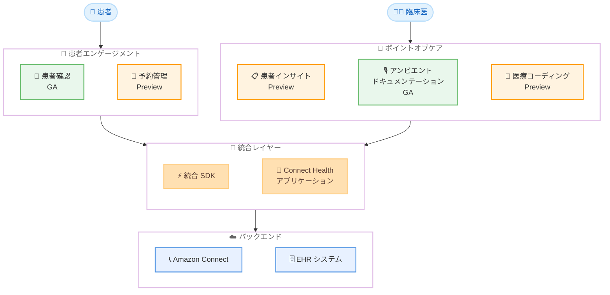

# Amazon Connect Health - ヘルスケア向けエージェント AI

**リリース日**: 2026 年 3 月 5 日
**サービス**: Amazon Connect Health
**機能**: ヘルスケア向け目的特化型エージェント AI (5 つの AI エージェント)

[このアップデートのインフォグラフィックを見る](https://takech9203.github.io/aws-news-summary/20260305-amazon-connect-health-agentic-ai-healthcare.html)

## 概要

Amazon Connect Health が一般提供 (GA) となり、ヘルスケア組織向けに目的特化型のエージェント AI が利用可能になった。患者エンゲージメントとポイントオブケアワークフローを効率化する 5 つの AI エージェントを提供し、ケアの連続体全体にわたる管理負担を軽減する。

5 つの AI エージェントは、患者アクセスセンター (コンタクトセンター)、電子カルテ (EHR) アプリケーション、遠隔医療ソリューションなど、既存の患者・臨床・ヘルスケアワークフローに数日で展開可能である。すべての機能は責任ある AI のベストプラクティスに従い、安全ガードレールを実装し、HIPAA 対象サービスとして提供される。

**アップデート前の課題**

- ヘルスケア組織では患者確認、予約管理、臨床ドキュメント作成などの管理業務が臨床スタッフの大きな負担となっていた
- EHR システムとコンタクトセンターソリューションの統合に数か月の開発期間が必要だった
- 臨床医は診察前の患者情報の確認や診察後の臨床ノート作成に多くの時間を費やしていた
- 医療コーディング (ICD-10、CPT コード) の手動作成は時間がかかりエラーが発生しやすかった

**アップデート後の改善**

- 5 つの AI エージェントにより、患者確認から医療コーディングまでケアの連続体全体をカバー
- Amazon Connect とのネイティブ統合により、数日で既存ワークフローに展開可能
- 統合 SDK によりポイントオブケア機能を既存の EHR アプリケーションに直接組み込み可能
- HIPAA 対象サービスとして、AWS の標準的なセキュリティと信頼性を維持

## アーキテクチャ図



Amazon Connect Health は、患者エンゲージメント (コンタクトセンター側) とポイントオブケア (臨床側) の 2 つの領域に分かれた 5 つの AI エージェントを提供する。統合 SDK とアプリケーションを通じて Amazon Connect や既存の EHR システムと連携する。

## サービスアップデートの詳細

### 主要機能

1. **患者確認 (Patient Verification) - GA**
   - EHR レコードに対してリアルタイムで患者の身元を確認
   - 予約の検索機能を備え、着信通話の対応時間を短縮
   - Amazon Connect のコンタクトフローにネイティブ統合

2. **予約管理 (Appointment Management) - Preview**
   - 自然言語による音声対話で予約を管理
   - 24 時間 365 日対応が可能で、営業時間外の予約スケジューリングを実現
   - リアルタイムの保険資格チェック機能を搭載
   - スタッフの負担を軽減しながら患者アクセスを改善

3. **患者インサイト (Patient Insights) - Preview**
   - 診察前に関連する患者の病歴と臨床コンテキストを表示
   - 臨床医が準備された状態で診察に臨めるよう支援
   - FHIR サーバーや S3 からの患者データ入力に対応

4. **アンビエントドキュメンテーション (Ambient Documentation) - GA**
   - 診察中の患者と臨床医の会話をキャプチャ
   - リアルタイムで臨床ノートを自動生成
   - HISTORY_AND_PHYSICAL、GIRPP、DAP、SIRP、BIRP、BEHAVIORAL_SOAP、PHYSICAL_SOAP など複数のノートテンプレートに対応
   - カスタムテンプレートもサポート

5. **医療コーディング (Medical Coding) - Preview**
   - 診察後の臨床ノートから ICD-10 および CPT コードを自動生成
   - 完全な監査証跡を提供
   - レベニューサイクル管理の効率化に貢献

## 技術仕様

### AI エージェント提供状況

| エージェント | ステータス | 領域 |
|------|------|------|
| 患者確認 | GA | 患者エンゲージメント |
| 予約管理 | Preview | 患者エンゲージメント |
| 患者インサイト | Preview | ポイントオブケア |
| アンビエントドキュメンテーション | GA | ポイントオブケア |
| 医療コーディング | Preview | ポイントオブケア |

### API 変更履歴

| 日付 | サービス | 変更内容 |
|------|----------|----------|
| 2026/03/05 | [Connect Health](https://awsapichanges.com/archive/changes/d66a4c-health-agent.html) | 16 new api methods - 統合 SDK の初回リリース |

### 主要 API メソッド

Connect Health SDK として 16 の新しい API メソッドが追加された。

```python
# ドメインの作成
client.create_domain(
    name='string',
    kmsKeyArn='string',
    webAppSetupConfiguration={
        'ehrRole': 'string',
        'idcInstanceId': 'string',
        'idcRegion': 'string'
    }
)

# 患者インサイトジョブの開始
client.start_patient_insights_job(
    domainId='string',
    patientContext={
        'patientId': 'string',
        'dateOfBirth': 'string',
        'pronouns': 'HE_HIM'|'SHE_HER'|'THEY_THEM'
    },
    insightsContext={
        'insightsType': 'PRE_VISIT'
    },
    inputDataConfig={
        'fhirServer': {
            'fhirEndpoint': 'string',
            'oauthToken': 'string'
        }
    }
)

# アンビエントリスニングセッションの開始
client.start_medical_scribe_listening_session(
    sessionId='string',
    domainId='string',
    subscriptionId='string',
    languageCode='en-US',
    mediaSampleRateHertz=123,
    mediaEncoding='pcm'|'flac'
)
```

### IAM とセキュリティ

- AWS KMS カスタマーマネージドキーによる暗号化をサポート
- AWS IAM Identity Center との統合 (Web アプリケーション設定)
- HIPAA 対象サービス
- リソースタグ付けによるアクセス制御に対応

## 設定方法

### 前提条件

1. AWS アカウントと適切な IAM 権限
2. Amazon Connect インスタンス (患者エンゲージメント機能を使用する場合)
3. FHIR 対応の EHR システム (患者インサイト機能を使用する場合)
4. AWS KMS キー (カスタマーマネージドキーで暗号化する場合)

### 手順

#### ステップ 1: ドメインの作成

```python
import boto3

client = boto3.client('health-agent', region_name='us-east-1')

response = client.create_domain(
    name='my-health-domain',
    kmsKeyArn='arn:aws:kms:us-east-1:123456789012:key/my-key-id',
    webAppSetupConfiguration={
        'ehrRole': 'arn:aws:iam::123456789012:role/EHRAccessRole',
        'idcInstanceId': 'my-idc-instance',
        'idcRegion': 'us-east-1'
    }
)
domain_id = response['domainId']
```

Connect Health ドメインを作成する。ドメインは Connect Health リソースの論理的なコンテナとなる。

#### ステップ 2: サブスクリプションの作成とアクティベート

```python
# サブスクリプションの作成
sub_response = client.create_subscription(domainId=domain_id)
subscription_id = sub_response['subscriptionId']

# サブスクリプションのアクティベート
client.activate_subscription(
    domainId=domain_id,
    subscriptionId=subscription_id
)
```

サブスクリプションを作成し、アクティベートすることで、AI エージェント機能の利用が開始される。

#### ステップ 3: AI エージェントの利用開始

```python
# アンビエントドキュメンテーション: リスニングセッションの開始
session = client.start_medical_scribe_listening_session(
    sessionId='session-001',
    domainId=domain_id,
    subscriptionId=subscription_id,
    languageCode='en-US',
    mediaSampleRateHertz=16000,
    mediaEncoding='pcm'
)
```

ユースケースに応じて適切な AI エージェントの API を呼び出す。上記はアンビエントドキュメンテーション機能の例である。

## メリット

### ビジネス面

- **管理業務の効率化**: 患者確認、予約管理、臨床ドキュメント作成の自動化により、スタッフの管理負担を大幅に軽減
- **患者アクセスの改善**: 24 時間 365 日の予約管理やリアルタイムの保険資格チェックにより、患者が迅速にケアにアクセス可能
- **レベニューサイクルの最適化**: 医療コーディングの自動化により、コーディングの正確性向上と請求処理の迅速化を実現

### 技術面

- **迅速な展開**: 数か月ではなく数日で既存ワークフローに展開可能
- **統合 SDK**: 単一の SDK でポイントオブケア機能を既存の EHR アプリケーションに組み込み可能
- **HIPAA 対応**: すべての機能が HIPAA 対象サービスとして提供され、コンプライアンス要件を満たす
- **責任ある AI**: 安全ガードレールと監査証跡により、医療分野で求められる透明性と信頼性を確保

## デメリット・制約事項

### 制限事項

- 5 つの AI エージェントのうち GA は 2 つ (患者確認、アンビエントドキュメンテーション) のみで、残り 3 つは Preview
- 利用可能リージョンは US East (N. Virginia) と US West (Oregon) の 2 リージョンに限定
- 言語サポートは現時点で英語 (en-US) のみ

### 考慮すべき点

- Preview 機能は本番環境での使用には推奨されず、仕様が変更される可能性がある
- 既存の EHR システムとの統合には FHIR 対応が前提となるため、レガシーシステムでは追加の対応が必要
- 医療コーディング機能は自動生成だが、最終的な確認は臨床医が行う必要がある

## ユースケース

### ユースケース 1: 大規模病院ネットワークの患者アクセスセンター

**シナリオ**: 複数の病院を運営するヘルスケアシステムで、毎日数千件の着信通話を処理する患者アクセスセンターを運営している。患者確認に平均 3-5 分かかり、対応時間が長くなっている。

**実装例**:
```python
# Amazon Connect コンタクトフローに患者確認エージェントを統合
# 着信通話で自動的に患者 ID を確認し、予約情報を検索
# 確認完了後、適切なキューにルーティング
```

**効果**: 患者確認の自動化により、1 通話あたりの対応時間を短縮し、スタッフはより複雑な問い合わせに集中可能

### ユースケース 2: プライマリケアクリニックの臨床ワークフロー最適化

**シナリオ**: プライマリケアクリニックの臨床医が、診察前の患者情報確認と診察後の臨床ノート作成に多くの時間を費やしている。

**実装例**:
```python
# 診察前: 患者インサイトで関連する病歴を自動要約
client.start_patient_insights_job(
    domainId='clinic-domain',
    patientContext={'patientId': 'P001', 'dateOfBirth': '1980-01-01'},
    insightsContext={'insightsType': 'PRE_VISIT'},
    userContext={'role': 'CLINICIAN', 'specialty': 'PRIMARY_CARE'}
)

# 診察中: アンビエントドキュメンテーションで会話をキャプチャ
# 診察後: 臨床ノートが自動生成
```

**効果**: 臨床医の管理業務を削減し、患者対応に集中する時間を増加

### ユースケース 3: 遠隔医療プラットフォームへの統合

**シナリオ**: 遠隔医療サービスを提供するプラットフォームが、ビデオ診察中のドキュメンテーションと診察後のコーディングを効率化したい。

**実装例**:
```python
# 統合 SDK を使用して遠隔医療アプリに組み込み
# ビデオ通話の音声をアンビエントドキュメンテーションに入力
client.start_medical_scribe_listening_session(
    sessionId='telehealth-session-001',
    domainId='telehealth-domain',
    subscriptionId='sub-001',
    languageCode='en-US',
    mediaSampleRateHertz=16000,
    mediaEncoding='pcm'
)

# 診察後: 医療コーディングで ICD-10/CPT コードを自動生成
```

**効果**: 遠隔医療の臨床ワークフロー全体を効率化し、臨床医と患者の体験を向上

## 料金

料金の詳細は公式発表時点では明示されていない。Amazon Connect Health の料金は、使用する AI エージェントの種類と利用量に基づく従量課金が想定される。最新の料金情報は Amazon Connect Health の料金ページを確認されたい。

## 利用可能リージョン

- US East (N. Virginia) - us-east-1
- US West (Oregon) - us-west-2

## 関連サービス・機能

- **Amazon Connect**: Amazon Connect Health のコアプラットフォーム。患者エンゲージメント機能はネイティブに統合されている
- **Amazon Transcribe Medical**: 医療分野の音声文字起こし。アンビエントドキュメンテーション機能の基盤技術として関連
- **Amazon Comprehend Medical**: 医療テキストからの情報抽出。患者インサイトや医療コーディング機能と補完的
- **AWS HealthLake**: FHIR 対応の医療データストア。Connect Health の患者データソースとして連携可能

## 参考リンク

- [インフォグラフィック](https://takech9203.github.io/aws-news-summary/20260305-amazon-connect-health-agentic-ai-healthcare.html)
- [公式発表 (What's New)](https://aws.amazon.com/about-aws/whats-new/2026/03/amazon-connect-health-agentic-ai-healthcare/)
- [Amazon Connect Health 製品ページ](https://aws.amazon.com/connect/health/)
- [Amazon Connect Health ドキュメント](https://docs.aws.amazon.com/connect/latest/health/)
- [Amazon Connect Health SDK ドキュメント](https://docs.aws.amazon.com/connect/latest/health-sdk/)

## まとめ

Amazon Connect Health は、ヘルスケア業界に特化した初の本格的なエージェント AI ソリューションとして、患者確認から医療コーディングまでケアの連続体全体をカバーする。HIPAA 対応かつ Amazon Connect にネイティブ統合されているため、既存のコンタクトセンターインフラを活用した迅速な展開が可能である。ヘルスケア組織の IT リーダーや開発者は、まず GA 機能である患者確認とアンビエントドキュメンテーションから評価を開始し、統合 SDK を用いた EHR 統合の概念実証 (PoC) を計画することを推奨する。
