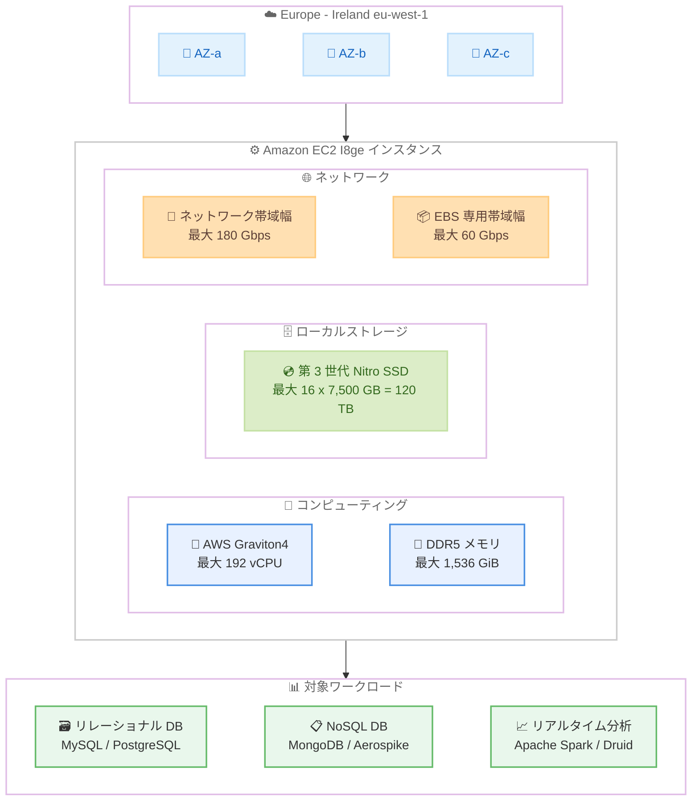

# Amazon EC2 I8ge - Europe (Ireland) リージョンで一般提供開始

**リリース日**: 2026 年 3 月 5 日
**サービス**: Amazon EC2
**機能**: I8ge インスタンスの Europe (Ireland) リージョン拡大

📊 [このアップデートのインフォグラフィックを見る](https://takech9203.github.io/aws-news-summary/20260305-amazon-ec2-I8ge-expansion-ireland.html)

## 概要

Amazon EC2 I8ge インスタンスが Europe (Ireland) リージョン (eu-west-1) で一般提供 (GA) されました。I8ge インスタンスは AWS Graviton4 プロセッサを搭載した高密度ストレージ最適化インスタンスで、前世代の Graviton2 ベースのストレージ最適化インスタンス (Im4gn) と比較して最大 60% 優れたコンピューティング性能を提供します。

I8ge インスタンスは最新の第 3 世代 AWS Nitro SSD を使用しており、TB あたり最大 55% 優れたリアルタイムストレージ性能を実現するとともに、ストレージ I/O レイテンシーを最大 60% 削減、レイテンシーのばらつきを最大 75% 削減しています。最大 120 TB のローカル NVMe ストレージを提供し、AWS Graviton ベースのストレージ最適化インスタンスの中で最高のストレージ密度を実現しています。

11 種類のインスタンスサイズ (2 つのメタルサイズを含む) が提供され、最大 180 Gbps のネットワーク帯域幅と 60 Gbps の Amazon EBS 専用帯域幅をサポートしています。

**アップデート前の課題**

- Europe (Ireland) リージョンで I8ge インスタンスを利用できず、欧州の顧客がストレージ密度の高い Graviton4 ベースインスタンスを使用するには他リージョンに依存する必要があった
- 前世代の Im4gn インスタンスではストレージ I/O レイテンシーとそのばらつきが大きく、リアルタイムデータアクセスが必要なワークロードで一貫した性能を確保することが困難だった
- 欧州のデータレジデンシー要件がある顧客が、大容量ローカルストレージと高いコンピューティング性能を両立するインスタンスを EU 内で利用できなかった

**アップデート後の改善**

- Europe (Ireland) リージョンで I8ge インスタンスが利用可能になり、欧州のデータレジデンシー要件に準拠しながら高密度ストレージ最適化インスタンスを利用可能に
- 第 3 世代 AWS Nitro SSD による最大 60% のストレージ I/O レイテンシー削減と最大 75% のレイテンシーばらつき削減により、一貫した低レイテンシーのデータアクセスを実現
- Graviton4 プロセッサにより前世代比 60% のコンピューティング性能向上を実現し、より少ないリソースで同等以上のワークロードを処理可能に

## アーキテクチャ図



I8ge インスタンスは AWS Graviton4 プロセッサと第 3 世代 AWS Nitro SSD を搭載し、Europe (Ireland) リージョンで高密度ストレージ最適化ワークロードに対応しています。リレーショナルデータベース、NoSQL データベース、リアルタイム分析など I/O 集約型ワークロードに最適化されています。

## サービスアップデートの詳細

### 主要機能

1. **AWS Graviton4 プロセッサ搭載**
   - 前世代の Graviton2 ベース Im4gn インスタンスと比較して最大 60% 優れたコンピューティング性能
   - DDR5-5600 メモリを採用し、メモリ帯域幅が改善
   - 常時メモリ暗号化、vCPU ごとの専用キャッシュ、ポインタ認証によるセキュリティ強化

2. **第 3 世代 AWS Nitro SSD**
   - TB あたり最大 55% 優れたリアルタイムストレージ性能を実現
   - ストレージ I/O レイテンシーを最大 60% 削減
   - ストレージ I/O レイテンシーのばらつきを最大 75% 削減
   - 常時暗号化によるセキュリティ確保

3. **最高のストレージ密度**
   - 最大 120 TB のローカル NVMe ストレージ (i8ge.48xlarge / i8ge.metal-48xl)
   - AWS Graviton ベースのストレージ最適化インスタンスの中で最高のストレージ密度
   - ストレージ最適化 Amazon EC2 インスタンスの中で最高のネットワーク帯域幅 (最大 180 Gbps)

4. **柔軟なインスタンスサイズ**
   - 11 種類のサイズで小規模から大規模ワークロードまで対応
   - 2 つのメタルサイズ (metal-24xl、metal-48xl) でベアメタルアクセスが可能

## 技術仕様

### I8ge インスタンスファミリー全サイズ

| インスタンスサイズ | vCPU | メモリ (GiB) | ストレージ (GB) | ネットワーク帯域幅 (Gbps) | EBS 帯域幅 (Gbps) |
|-------------------|------|-------------|----------------|--------------------------|-------------------|
| i8ge.large | 2 | 16 | 1 x 1,250 = 1,250 | 最大 25 | 最大 10 |
| i8ge.xlarge | 4 | 32 | 1 x 2,500 = 2,500 | 最大 25 | 最大 10 |
| i8ge.2xlarge | 8 | 64 | 2 x 2,500 = 5,000 | 最大 25 | 最大 10 |
| i8ge.3xlarge | 12 | 96 | 1 x 7,500 = 7,500 | 最大 25 | 最大 10 |
| i8ge.6xlarge | 24 | 192 | 2 x 7,500 = 15,000 | 37.5 | 最大 10 |
| i8ge.12xlarge | 48 | 384 | 4 x 7,500 = 30,000 | 75 | 15 |
| i8ge.18xlarge | 72 | 576 | 6 x 7,500 = 45,000 | 112.5 | 22.5 |
| i8ge.24xlarge | 96 | 768 | 8 x 7,500 = 60,000 | 150 | 30 |
| i8ge.48xlarge | 192 | 1,536 | 16 x 7,500 = 120,000 | 180 | 60 |
| i8ge.metal-24xl | 96 | 768 | 8 x 7,500 = 60,000 | 150 | 30 |
| i8ge.metal-48xl | 192 | 1,536 | 16 x 7,500 = 120,000 | 180 | 60 |

### 前世代との性能比較

| 項目 | I8ge vs Im4gn |
|------|--------------|
| コンピューティング性能 | 最大 60% 向上 |
| リアルタイムストレージ性能 (TB あたり) | 最大 55% 向上 |
| ストレージ I/O レイテンシー | 最大 60% 削減 |
| ストレージ I/O レイテンシーばらつき | 最大 75% 削減 |

### I8g と I8ge の比較

| 項目 | I8g | I8ge |
|------|-----|------|
| 最大ローカルストレージ | 45 TB | 120 TB |
| 最大ネットワーク帯域幅 | 100 Gbps | 180 Gbps |
| 比較対象 (前世代) | I4g | Im4gn |
| 用途 | 高性能 I/O ワークロード | 高密度ストレージワークロード |

## 設定方法

### 前提条件

1. AWS アカウントが有効化されている
2. Europe (Ireland) リージョン (eu-west-1) でリソースを作成する権限がある
3. 適切な IAM 権限が設定されている
4. I8ge インスタンスのサービスクォータが十分に確保されている

### 手順

#### ステップ 1: I8ge インスタンスの起動

```bash
# AWS CLI で I8ge インスタンスを Europe (Ireland) リージョンで起動
aws ec2 run-instances \
  --region eu-west-1 \
  --instance-type i8ge.12xlarge \
  --image-id ami-xxxxxxxxxxxxxxxxx \
  --key-name my-key-pair \
  --security-group-ids sg-xxxxxxxxxxxxxxxxx \
  --subnet-id subnet-xxxxxxxxxxxxxxxxx \
  --block-device-mappings '[{"DeviceName":"/dev/xvda","Ebs":{"VolumeSize":100,"VolumeType":"gp3"}}]' \
  --tag-specifications 'ResourceType=instance,Tags=[{Key=Name,Value=i8ge-storage-db}]'
```

このコマンドは、Europe (Ireland) リージョンで I8ge.12xlarge インスタンスを起動します。AMI は ARM アーキテクチャ (Graviton) 対応のものを指定する必要があります。

#### ステップ 2: ローカル NVMe ストレージの確認と設定

```bash
# インスタンスに SSH 接続後、NVMe デバイスを確認
lsblk

# 複数の NVMe ドライブを RAID 0 で構成して最大スループットを確保
sudo mdadm --create /dev/md0 --level=0 --raid-devices=4 \
  /dev/nvme1n1 /dev/nvme2n1 /dev/nvme3n1 /dev/nvme4n1
sudo mkfs.xfs /dev/md0
sudo mkdir -p /data
sudo mount /dev/md0 /data

# ストレージ性能の確認
sudo fio --name=randread --ioengine=libaio --iodepth=32 \
  --rw=randread --bs=4k --direct=1 --size=1G \
  --numjobs=4 --runtime=60 --filename=/data/testfile
```

これらのコマンドで NVMe ローカルストレージデバイスの確認、RAID 0 構成、フォーマット、マウント、および I/O 性能のベンチマークテストを実行します。I8ge.12xlarge では 4 本の NVMe ドライブ (各 7,500 GB) にアクセスできます。

#### ステップ 3: データベースワークロードの設定

```bash
# MongoDB の設定例 - ローカル NVMe ストレージをデータディレクトリに使用
cat > /etc/mongod.conf << 'EOF'
storage:
  dbPath: /data/mongodb
  engine: wiredTiger
  wiredTiger:
    engineConfig:
      cacheSizeGB: 256
    collectionConfig:
      blockCompressor: snappy
net:
  port: 27017
  bindIp: 0.0.0.0
replication:
  replSetName: rs0
EOF

# MongoDB の起動
sudo systemctl start mongod
```

I8ge.12xlarge の 384 GiB メモリと 30 TB ローカル NVMe ストレージを活用した MongoDB 設定例です。WiredTiger キャッシュを 256 GB に設定し、頻繁にアクセスされるデータをメモリ内に保持します。

## メリット

### ビジネス面

- **欧州データレジデンシー対応**: Europe (Ireland) リージョンでの利用が可能になり、GDPR 等の欧州データ保護規制に準拠しながら高性能ストレージ最適化インスタンスを活用可能
- **コスト効率の向上**: Graviton4 プロセッサのエネルギー効率改善と TB あたりのストレージ性能向上により、同等のワークロードをより少ないインスタンスで処理可能
- **データベース性能の大幅改善**: ストレージ I/O レイテンシーの最大 60% 削減とばらつきの 75% 削減により、エンドユーザー体験が向上

### 技術面

- **最高のストレージ密度**: 最大 120 TB のローカル NVMe ストレージにより、大規模データセットをローカルに保持可能
- **一貫した低レイテンシー**: 第 3 世代 Nitro SSD によるレイテンシーばらつきの大幅削減で、予測可能な性能を提供
- **最高のネットワーク帯域幅**: 最大 180 Gbps のネットワーク帯域幅で、ストレージ最適化 EC2 インスタンス中最高の転送性能
- **広範な OS サポート**: Amazon Linux、Ubuntu、RHEL、SUSE、Debian など主要な Linux ディストリビューションに対応

## デメリット・制約事項

### 制限事項

- ローカル NVMe ストレージはインスタンスストアのため、インスタンスの停止や終了時にデータが失われる。永続化が必要なデータは別途 EBS や S3 へのバックアップが必須
- ARM アーキテクチャ (Graviton4) のため、x86 専用のソフトウェアは直接実行できない
- 大規模なインスタンスサイズではサービスクォータの引き上げが必要な場合がある

### 考慮すべき点

- Im4gn インスタンスからの移行は比較的容易だが、アプリケーションが ARM アーキテクチャに対応しているか事前に確認が必要
- I8ge は高密度ストレージ向けに最適化されているため、ストレージ密度よりも I/O 性能を重視する場合は I8g インスタンスも検討すること
- インスタンスストアの揮発性を考慮し、データベースのレプリケーションやバックアップ戦略を事前に設計することを推奨

## ユースケース

### ユースケース 1: 欧州向け大規模 NoSQL データベース

**シナリオ**: 欧州に顧客基盤を持つ EC サイトが、GDPR に準拠しながら Aerospike クラスターを Europe (Ireland) リージョンの I8ge インスタンス上で運用し、数十億レコードのリアルタイムアクセスを実現する。

**実装例**:
```bash
# I8ge.24xlarge インスタンスで Aerospike を構成
aws ec2 run-instances \
  --region eu-west-1 \
  --instance-type i8ge.24xlarge \
  --image-id ami-xxxxxxxxxxxxxxxxx \
  --key-name db-key \
  --security-group-ids sg-xxxxxxxxxxxxxxxxx \
  --subnet-id subnet-xxxxxxxxxxxxxxxxx \
  --count 3 \
  --tag-specifications 'ResourceType=instance,Tags=[{Key=Name,Value=aerospike-cluster-eu}]'
```

**効果**: 1 ノードあたり 60 TB のローカルストレージと 150 Gbps のネットワーク帯域幅により、大規模データセットの分散処理とリアルタイムアクセスを EU 内で実現。Aerospike の実測では I8ge インスタンスで最大 6 倍のスループット向上と 90% のテールレイテンシー改善が報告されている。

### ユースケース 2: Elasticsearch / OpenSearch クラスター

**シナリオ**: メディア分析企業が Elasticsearch クラスターを I8ge インスタンスで構成し、数十億のドキュメントに対する全文検索とリアルタイムインデキシングを Europe (Ireland) リージョンで実行する。

**実装例**:
```yaml
# Elasticsearch の設定 - I8ge の大容量ストレージを活用
cluster.name: media-analytics-eu
node.name: node-1
path.data: /data/elasticsearch
path.logs: /var/log/elasticsearch
indices.memory.index_buffer_size: 30%
thread_pool.write.queue_size: 2000
```

**効果**: I8ge インスタンスでは前世代 I7ie と比較して最大 21% のインデキシングスループット向上が報告されており、120 TB のローカルストレージにより大量のシャードをローカルに保持可能。Meltwater の実測では前世代 I3en と比較して 2 倍以上の性能向上が確認されている。

### ユースケース 3: リアルタイムデータ分析基盤

**シナリオ**: 金融機関が Apache Druid クラスターを I8ge インスタンスで構成し、マーケットデータのリアルタイム取り込みとサブ秒レベルのクエリ応答を Europe (Ireland) リージョンで実現する。

**実装例**:
```bash
# I8ge.48xlarge で Apache Druid のヒストリカルノードを構成
# RAID 0 で 16 本の NVMe ドライブを束ねて最大スループットを確保
sudo mdadm --create /dev/md0 --level=0 --raid-devices=16 \
  /dev/nvme{1..16}n1
sudo mkfs.xfs /dev/md0
sudo mkdir -p /data/druid/segments
sudo mount /dev/md0 /data/druid/segments
```

**効果**: 120 TB のローカルストレージに大量のセグメントデータを保持し、180 Gbps のネットワーク帯域幅でクラスター間のデータ転送を高速化。ストレージ I/O レイテンシーのばらつきが 75% 削減されることで、クエリ応答時間がより予測可能に。

## 料金

Amazon EC2 I8ge インスタンスは、オンデマンド、Savings Plans、リザーブドインスタンス、スポットインスタンス、専用インスタンス、Dedicated Hosts の各購入オプションで利用可能です。

### コスト最適化のポイント

| 購入オプション | 説明 |
|--------------|------|
| オンデマンド | 時間単位の従量課金。コミットメント不要 |
| Savings Plans | 1 年または 3 年のコミットメントで最大割引 |
| スポットインスタンス | 未使用の EC2 容量を大幅割引で利用 |
| 専用インスタンス | 専用ハードウェア上でインスタンスを実行 |
| Dedicated Hosts | 専用の物理サーバーを割り当て |

- Graviton4 プロセッサのエネルギー効率改善により、同等の x86 インスタンスと比較してコストパフォーマンスが向上
- 前世代の Im4gn から移行することで、同じワークロードをより少ないリソースで処理可能
- ストレージ密度の向上により、同じデータ量を保持するために必要なインスタンス数を削減可能

※ 料金の詳細は [Amazon EC2 料金ページ](https://aws.amazon.com/ec2/pricing/) を参照してください。

## 利用可能リージョン

I8ge インスタンスは以下のリージョンで利用可能です。

- 米国東部 (バージニア北部) - us-east-1
- 米国西部 (オレゴン) - us-west-2
- **Europe (Ireland) - eu-west-1** (今回追加)

※ 今後さらにリージョンが拡大される見込みです。

## 関連サービス・機能

- **Amazon EC2 I8g インスタンス**: I8ge と同じ Graviton4 プロセッサと第 3 世代 Nitro SSD を搭載し、最大 45 TB のローカルストレージを提供する I/O 最適化インスタンスファミリー
- **Amazon EBS**: I8ge は最大 60 Gbps の EBS 専用帯域幅を提供し、永続ストレージとの高速データ転送が可能
- **AWS Graviton**: Graviton4 プロセッサは広範なワークロード向けに最高の性能とエネルギー効率を提供する AWS 設計のプロセッサ
- **AWS Nitro System**: CPU 仮想化、ストレージ、ネットワーキング機能を専用ハードウェアにオフロードし、性能とセキュリティを強化

## 参考リンク

- 📊 [インフォグラフィック](https://takech9203.github.io/aws-news-summary/20260305-amazon-ec2-I8ge-expansion-ireland.html)
- [公式発表 (What's New)](https://aws.amazon.com/about-aws/whats-new/2026/03/amazon-ec2-I8ge-expansion-ireland/)
- [I8g / I8ge インスタンス](https://aws.amazon.com/ec2/instance-types/i8g/)
- [Graviton](https://aws.amazon.com/ec2/graviton/level-up-with-graviton/)
- [料金ページ](https://aws.amazon.com/ec2/pricing/)

## まとめ

Amazon EC2 I8ge インスタンスの Europe (Ireland) リージョンへの拡大により、欧州のデータレジデンシー要件に準拠しながら、AWS Graviton4 プロセッサと第 3 世代 AWS Nitro SSD による高密度ストレージ最適化ワークロードの実行が可能になりました。最大 120 TB のローカル NVMe ストレージと 180 Gbps のネットワーク帯域幅を活用し、リレーショナルデータベース、NoSQL データベース、リアルタイム分析など大規模データセットへの高速アクセスが求められるワークロードを欧州で運用しているお客様は、Im4gn からの移行を評価することを推奨します。
