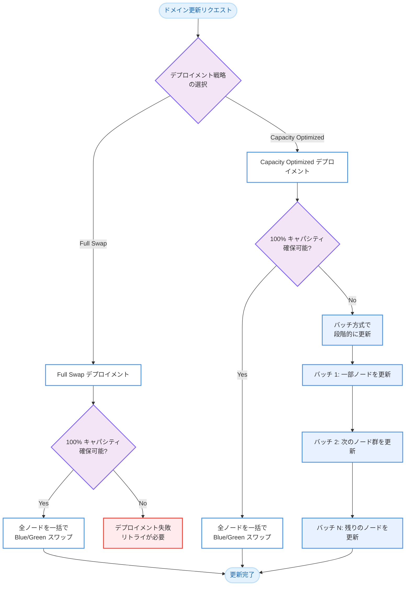

# Amazon OpenSearch Service - Capacity Optimized Blue/Green デプロイメント

**リリース日**: 2026 年 3 月 5 日
**サービス**: Amazon OpenSearch Service
**機能**: Capacity Optimized Blue/Green デプロイメント

[このアップデートのインフォグラフィックを見る](https://takech9203.github.io/aws-news-summary/20260305-amazon-opensearch-service-bg.html)

## 概要

Amazon OpenSearch Service に、Blue/Green デプロイメントの新しいオプションとして Capacity Optimized が追加された。これにより、利用可能なインスタンスキャパシティがフルスワップに必要な量に満たない場合でも、ドメインの更新を完了できるようになった。

従来の Blue/Green デプロイメントでは、更新時にクラスター全体の 100% のインスタンスキャパシティを事前に確保する必要があった。例えば、100 データノードのクラスターでは、追加で 100 ノード分のキャパシティが必要であり、十分なキャパシティが利用できない場合は待機してリトライする必要があった。今回のアップデートにより、バッチ方式での段階的な更新が可能となり、大規模クラスターの運用における課題が解消された。

**アップデート前の課題**

- Blue/Green デプロイメントにはクラスター全体の 100% のインスタンスキャパシティを事前に確保する必要があった
- 大規模クラスター (30 ノード以上) では十分なキャパシティの確保が困難な場合があった
- キャパシティ不足時はデプロイメントを実行できず、待機してリトライする必要があった

**アップデート後の改善**

- Capacity Optimized オプションにより、キャパシティ不足時でもバッチ方式で段階的にデプロイメントを実行可能になった
- OpenSearch Service がクラスターサイズと利用可能インスタンスに基づいて適切なバッチサイズを自動決定する
- コンソールまたは API からデプロイメント戦略を選択可能になった

## アーキテクチャ図



Capacity Optimized オプションでは、フルキャパシティが確保できない場合に自動的にバッチ方式へフォールバックし、段階的にノードを更新していく。

## サービスアップデートの詳細

### 主要機能

1. **2 つのデプロイメント戦略**
   - Full Swap (Default): 従来の方式。100% のキャパシティを事前に確保し、一括でスワップを実行する
   - Capacity Optimized: フルキャパシティでのデプロイメントを最初に試み、キャパシティ不足の場合は自動的にバッチ方式にフォールバックする

2. **バッチ方式による段階的更新**
   - OpenSearch Service がクラスターサイズと利用可能なインスタンス数に基づいてバッチサイズを自動決定する
   - 更新をインクリメンタルなバッチで実行することで、必要な追加インスタンス数を削減する
   - バッチ方式のため、Full Swap と比較してデプロイメント完了までの時間が長くなる場合がある

3. **コンソールおよび API からの設定**
   - OpenSearch Service コンソールのデプロイメント設定から戦略を選択可能
   - API 経由でも `DeploymentStrategyOptions` パラメータで設定可能

## 技術仕様

### デプロイメント戦略の比較

| 項目 | Full Swap (Default) | Capacity Optimized |
|------|--------------------|--------------------|
| 必要キャパシティ | 100% (全ノード分) | 可変 (バッチサイズ分) |
| デプロイメント速度 | 高速 (一括) | 可変 (バッチ方式は低速) |
| キャパシティ不足時 | 失敗 | バッチ方式にフォールバック |
| 推奨クラスターサイズ | 全サイズ | 30 ノード以上 |
| 動作 | 全ノード同時スワップ | フル試行後、必要に応じてバッチ |

### API 変更履歴

| 日付 | サービス | 変更内容 |
|------|----------|----------|
| 2026/03/04 | [Amazon OpenSearch Service](https://awsapichanges.com/archive/changes/91f8bd-es.html) | 7 updated api methods - DeploymentStrategyOptions のサポート追加 |

### 更新された API メソッド

`DeploymentStrategyOptions` パラメータが以下の 7 つの API メソッドに追加された。

- `CreateDomain` - ドメイン作成時にデプロイメント戦略を指定可能
- `UpdateDomainConfig` - 既存ドメインのデプロイメント戦略を変更可能
- `DescribeDomain` - ドメイン情報にデプロイメント戦略を含む
- `DescribeDomains` - 複数ドメイン情報にデプロイメント戦略を含む
- `DescribeDomainConfig` - ドメイン設定にデプロイメント戦略を含む
- `DescribeDryRunProgress` - ドライラン進行状況にデプロイメント戦略を含む
- `DeleteDomain` - ドメイン削除時のレスポンスにデプロイメント戦略を含む

### DeploymentStrategyOptions の設定

```json
{
  "DeploymentStrategyOptions": {
    "DeploymentStrategy": "CapacityOptimized"
  }
}
```

`DeploymentStrategy` に指定可能な値:
- `Default` - Full Swap 方式 (従来の動作)
- `CapacityOptimized` - Capacity Optimized 方式

## 設定方法

### 前提条件

1. Amazon OpenSearch Service ドメインが作成済みであること
2. ドメインの設定変更権限を持つ IAM ロールまたはユーザーがあること

### 手順

#### ステップ 1: コンソールからの設定

OpenSearch Service コンソールでドメインを選択し、デプロイメント設定 (Deployment configuration) セクションから Capacity Optimized オプションを選択する。

#### ステップ 2: AWS CLI からの設定

```bash
aws opensearch update-domain-config \
  --domain-name my-domain \
  --deployment-strategy-options '{"DeploymentStrategy": "CapacityOptimized"}'
```

既存ドメインのデプロイメント戦略を Capacity Optimized に変更するコマンド。この設定により、以降の Blue/Green デプロイメントで Capacity Optimized 方式が使用される。

#### ステップ 3: 設定の確認

```bash
aws opensearch describe-domain-config \
  --domain-name my-domain \
  --query 'DomainConfig.DeploymentStrategyOptions'
```

現在のデプロイメント戦略設定を確認するコマンド。

## メリット

### ビジネス面

- **運用の安定性向上**: キャパシティ不足によるデプロイメント失敗のリスクが軽減され、計画通りのメンテナンスが可能になる
- **ダウンタイムの削減**: デプロイメント失敗時のリトライ待機時間がなくなり、サービスレベルの維持が容易になる
- **大規模クラスターの管理効率化**: 30 ノード以上の大規模クラスターにおいて、キャパシティの制約を意識せずに更新を実行できる

### 技術面

- **自動フォールバック**: フルスワップ方式を最初に試み、不可能な場合のみバッチ方式に切り替えるため、最適な方式が自動選択される
- **バッチサイズの自動決定**: OpenSearch Service がクラスターサイズと利用可能なインスタンスに基づいてバッチサイズを自動計算する
- **既存 API との互換性**: DeploymentStrategyOptions を追加するだけで利用可能であり、既存のワークフローへの影響が最小限である

## デメリット・制約事項

### 制限事項

- Capacity Optimized のバッチ方式は Full Swap と比較してデプロイメント完了までの時間が長くなる場合がある
- バッチ方式の実行中はクラスターの一部ノードが更新途中の状態となる
- AWS GovCloud リージョンでは利用不可 (AWS Commercial Regions のみ)

### 考慮すべき点

- 30 ノード未満の小規模クラスターでは Full Swap (Default) が引き続き推奨される
- バッチ更新中のクラスターパフォーマンスへの影響を考慮し、トラフィックの少ない時間帯での実行を推奨する

## ユースケース

### ユースケース 1: 大規模ログ分析基盤の更新

**シナリオ**: 50 データノード以上の大規模 OpenSearch クラスターで、セキュリティパッチの適用が必要だが、リージョン内のインスタンスキャパシティが逼迫している状況。

**実装例**:
```bash
aws opensearch update-domain-config \
  --domain-name production-logs \
  --deployment-strategy-options '{"DeploymentStrategy": "CapacityOptimized"}'
```

**効果**: キャパシティ不足でデプロイメントが失敗することなく、段階的にセキュリティパッチを適用できる。

### ユースケース 2: マルチテナント SaaS プラットフォーム

**シナリオ**: 複数のテナント向けに OpenSearch クラスターを運用しており、バージョンアップグレードを計画的に実施したい。クラスターサイズが大きく、フルスワップでは常にキャパシティ確保が課題となっている。

**実装例**:
```json
{
  "DomainName": "saas-search-cluster",
  "DeploymentStrategyOptions": {
    "DeploymentStrategy": "CapacityOptimized"
  },
  "OpenSearchVersion": "2.17"
}
```

**効果**: バージョンアップグレードがキャパシティの制約に依存せず実行可能となり、アップグレード計画の遅延リスクが軽減される。

### ユースケース 3: ピーク時のクラスター設定変更

**シナリオ**: EC2 インスタンスの需要が高い時期に、OpenSearch クラスターのインスタンスタイプ変更やストレージ拡張が必要な場合。

**実装例**:
```bash
aws opensearch update-domain-config \
  --domain-name analytics-cluster \
  --deployment-strategy-options '{"DeploymentStrategy": "CapacityOptimized"}' \
  --cluster-config '{"InstanceType": "r6g.2xlarge.search"}'
```

**効果**: インスタンス需要のピーク時でも設定変更が可能となり、ビジネス要件に合わせたタイムリーなスケーリングが実現できる。

## 料金

Capacity Optimized オプション自体に追加料金は発生しない。Blue/Green デプロイメント中に使用される追加インスタンスの料金は、デプロイメント方式に関わらず通常のインスタンス料金が適用される。バッチ方式では一度に使用する追加インスタンス数が少ないため、ピーク時の一時的なコストが軽減される可能性がある。

## 利用可能リージョン

すべての AWS Commercial Regions で利用可能。OpenSearch Service が提供されているすべてのリージョンが対象。すべての OpenSearch および Elasticsearch バージョンで利用可能。

## 関連サービス・機能

- **Amazon OpenSearch Service Blue/Green デプロイメント**: ドメイン更新時にダウンタイムを最小化するための基盤機能
- **Amazon OpenSearch Service ドライラン**: ドメイン設定変更の事前検証機能。DescribeDryRunProgress API でデプロイメント戦略の確認が可能
- **Amazon RDS Blue/Green Deployments**: RDS における同様の Blue/Green デプロイメント機能

## 参考リンク

- [インフォグラフィック](https://takech9203.github.io/aws-news-summary/20260305-amazon-opensearch-service-bg.html)
- [公式発表 (What's New)](https://aws.amazon.com/about-aws/whats-new/2026/03/amazon-opensearch-service-bg/)
- [ドキュメント](https://docs.aws.amazon.com/opensearch-service/latest/developerguide/managedomains-configuration-changes.html)
- [料金ページ](https://aws.amazon.com/opensearch-service/pricing/)

## まとめ

Amazon OpenSearch Service の Capacity Optimized Blue/Green デプロイメントは、大規模クラスター (30 ノード以上) の運用において特に有用なアップデートである。キャパシティ不足時に自動的にバッチ方式へフォールバックすることで、デプロイメント失敗のリスクを大幅に軽減する。大規模な OpenSearch クラスターを運用している場合は、デプロイメント戦略を Capacity Optimized に変更することを推奨する。
