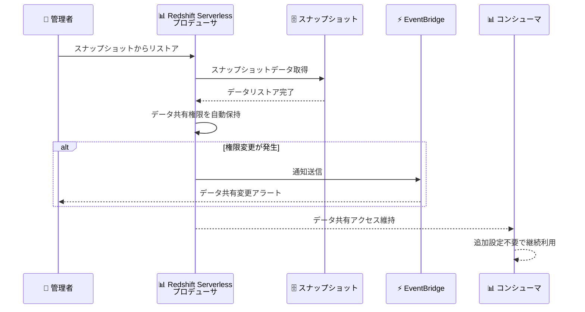

# Amazon Redshift Serverless - スナップショットリストア時のデータ共有権限の自動保持

**リリース日**: 2026年03月05日
**サービス**: Amazon Redshift Serverless
**機能**: スナップショットリストア時のデータ共有権限保持

## 概要

Amazon Redshift Serverless は、スナップショットを同一ネームスペースにリストアする際に、データ共有 (datashare) の権限を自動的に保持する機能を追加しました。この機能強化により、リストア後にデータ共有権限を手動で再付与する必要がなくなり、データ共有ワークフローの簡素化と管理オーバーヘッドの削減を実現します。

従来、サーバーレスネームスペースをスナップショットからリストアすると、コンシューマクラスターへのデータ共有権限が失われ、管理者が手動で権限を再付与し、コンシューマデータベースを再作成する必要がありました。今回の機能強化では、スナップショット取得時と現在のネームスペースの両方にデータ共有権限が存在する場合、リストア後も自動的に権限が維持されます。

さらに、Amazon Redshift は Amazon EventBridge 通知を提供し、リストア操作中にデータ共有が削除された場合、コンシューマアクセスが取り消された場合、またはパブリックアクセス設定が変更された場合にアラートを受け取ることができます。この機能は Amazon Redshift をサポートするすべての AWS リージョンで利用可能です。

**アップデート前の課題**

- スナップショットからリストアすると、コンシューマクラスターへのデータ共有権限が失われていた
- 管理者がリストア後に手動でデータ共有権限を再付与する必要があった
- コンシューマデータベースの再作成が必要であり、災害復旧やテストワークフローの所要時間が増大していた

**アップデート後の改善**

- 同一プロデューサネームスペースへのリストア時にデータ共有権限が自動的に保持されるようになった
- コンシューマネームスペース側でもリストア後のデータ共有アクセスが維持され、プロデューサ側の再付与が不要になった
- EventBridge 通知によりリストア中のデータ共有変更をリアルタイムで検知できるようになった

## アーキテクチャ図



同一ネームスペースへのスナップショットリストア時に、データ共有権限が自動的に保持されます。権限変更が発生した場合は EventBridge 経由で通知されます。

## サービスアップデートの詳細

### 主要機能

1. **データ共有権限の自動保持**
   - 同一プロデューサネームスペースへのスナップショットリストア時に、データ共有権限が自動的に維持される
   - スナップショット取得時と現在のネームスペースの両方に権限が存在することが条件
   - コンシューマ側の追加設定は不要

2. **コンシューマアクセスの継続**
   - コンシューマネームスペースでは、リストア後もデータ共有アクセスが変更されない
   - プロデューサ管理者による権限の再付与が不要
   - データ共有を利用するクエリやアプリケーションの中断を最小化

3. **EventBridge 通知との統合**
   - リストア操作中にデータ共有が削除された場合に通知
   - コンシューマアクセスが取り消された場合に通知
   - パブリックアクセス設定が変更された場合に通知
   - 自動化されたリカバリワークフローのトリガーとして活用可能

## 技術仕様

### 権限保持の条件

| 項目 | 詳細 |
|------|------|
| リストア先 | 同一ネームスペース (同一プロデューサ) |
| 権限存在条件 | スナップショット取得時と現在のネームスペースの両方に権限が存在 |
| コンシューマ側 | リストア後もアクセスが自動的に維持される |
| 通知方法 | Amazon EventBridge による変更通知 |

### EventBridge 通知イベント

| イベントタイプ | 説明 |
|---------------|------|
| データ共有削除 | リストア中にデータ共有が削除された場合 |
| アクセス取り消し | コンシューマアクセスが取り消された場合 |
| パブリックアクセス変更 | パブリックアクセス設定が変更された場合 |

### EventBridge ルール設定例

```json
{
  "source": ["aws.redshift"],
  "detail-type": ["Redshift Datashare Event"],
  "detail": {
    "EventCategories": ["datashare"]
  }
}
```

## 設定方法

### 前提条件

1. Amazon Redshift Serverless ネームスペースとワークグループが作成されている
2. データ共有が設定され、コンシューマに権限が付与されている
3. EventBridge 通知を受け取る場合は、EventBridge ルールが設定されている

### 手順

#### ステップ 1: スナップショットの作成

```bash
aws redshift-serverless create-snapshot \
  --namespace-name my-namespace \
  --snapshot-name my-snapshot
```

データ共有権限が設定された状態のネームスペースのスナップショットを作成します。

#### ステップ 2: 同一ネームスペースへのリストア

```bash
aws redshift-serverless restore-from-snapshot \
  --namespace-name my-namespace \
  --snapshot-name my-snapshot \
  --workgroup-name my-workgroup
```

同一ネームスペースにリストアすることで、データ共有権限が自動的に保持されます。

#### ステップ 3: EventBridge 通知の設定

```bash
aws events put-rule \
  --name "RedshiftDatashareChangeRule" \
  --event-pattern '{
    "source": ["aws.redshift"],
    "detail-type": ["Redshift Datashare Event"]
  }'

aws events put-targets \
  --rule "RedshiftDatashareChangeRule" \
  --targets "Id"="1","Arn"="arn:aws:sns:us-east-1:123456789012:my-topic"
```

リストア中にデータ共有に変更が発生した場合に通知を受け取るための EventBridge ルールを設定します。

## メリット

### ビジネス面

- **災害復旧時間の短縮**: リストア後の手動設定が不要になり、RTO (目標復旧時間) を短縮できる
- **運用コストの削減**: データ共有権限の再付与作業が不要になり、管理者の工数を削減できる
- **データ共有の信頼性向上**: 権限の再付与漏れによるデータアクセス障害のリスクを排除できる

### 技術面

- **自動化ワークフローの簡素化**: リストア後のスクリプトからデータ共有権限再付与ロジックを削除できる
- **EventBridge 統合による可観測性**: データ共有の変更をリアルタイムで監視し、自動アクションを設定できる
- **コンシューマ側の影響最小化**: プロデューサ側のリストアがコンシューマ側のアクセスに影響を与えない

## デメリット・制約事項

### 制限事項

- 同一ネームスペースへのリストアのみが対象であり、異なるネームスペースへのリストアでは権限は保持されない
- スナップショット取得時に存在しなかったデータ共有権限は対象外
- スナップショット取得後に追加された新しいデータ共有権限はリストアで失われる可能性がある

### 考慮すべき点

- 異なるネームスペースへのリストアが必要な場合は、従来通り手動での権限再付与が必要
- EventBridge 通知を活用して、リストア後のデータ共有状態を確認することが推奨される

## ユースケース

### ユースケース 1: 災害復旧

**シナリオ**: 本番環境のプロデューサネームスペースに障害が発生し、スナップショットからリストアが必要になった場合。

**実装例**:
```bash
# スナップショットからの復旧
aws redshift-serverless restore-from-snapshot \
  --namespace-name production-namespace \
  --snapshot-name daily-backup-20260305 \
  --workgroup-name production-workgroup
```

**効果**: リストア後にデータ共有権限が自動的に保持されるため、コンシューマ側のアプリケーションやクエリが中断なく再開できます。

### ユースケース 2: テスト環境でのスナップショットリストア

**シナリオ**: 本番環境のスナップショットを同一ネームスペースにリストアして、スキーマ変更やパフォーマンステストを実施する場合。

**実装例**:
```bash
# テスト用にスナップショットを作成
aws redshift-serverless create-snapshot \
  --namespace-name test-namespace \
  --snapshot-name pre-migration-test

# テスト後にスナップショットからリストア
aws redshift-serverless restore-from-snapshot \
  --namespace-name test-namespace \
  --snapshot-name pre-migration-test \
  --workgroup-name test-workgroup
```

**効果**: テスト後のリストアでデータ共有権限が維持されるため、テストサイクルごとに権限を再設定する手間が不要になります。

### ユースケース 3: EventBridge による自動監視

**シナリオ**: リストア操作時にデータ共有の変更を自動検知し、運用チームに通知する場合。

**実装例**:
```json
{
  "source": ["aws.redshift"],
  "detail-type": ["Redshift Datashare Event"],
  "detail": {
    "EventCategories": ["datashare"]
  }
}
```

**効果**: リストア中にデータ共有が削除された場合やアクセス権限が変更された場合に、即座に運用チームに通知され、迅速な対応が可能になります。

## 料金

データ共有権限の自動保持機能に追加料金は発生しません。Amazon Redshift Serverless の通常の料金が適用されます。EventBridge 通知については Amazon EventBridge の料金が適用されます。

### 料金例

| 項目 | 料金 (概算) |
|------|-------------|
| Redshift Serverless (8 RPU) | $0.36/時間 |
| EventBridge カスタムイベント | $1.00/100 万イベント |
| クロスアカウントデータ共有 | 追加料金なし |

*料金は変動する可能性があります。最新の料金については AWS 料金ページを参照してください。

## 利用可能リージョン

Amazon Redshift をサポートするすべての AWS リージョンで利用可能です。

## 関連サービス・機能

- **Amazon Redshift データ共有**: ネームスペース間でデータをリアルタイムに共有する機能。今回の機能強化の基盤となる機能
- **Amazon EventBridge**: リストア時のデータ共有変更を検知し、自動化されたワークフローをトリガーするために使用
- **Amazon Redshift スナップショット**: ネームスペースのバックアップと復元に使用。今回の機能強化の対象操作

## 参考リンク

- [公式発表 (What's New)](https://aws.amazon.com/about-aws/whats-new/2026/03/amazon-redshift-serverless-maintains-datashare-permissions-on-restore/)
- [ドキュメント - Amazon Redshift Management Guide](https://docs.aws.amazon.com/redshift/latest/mgmt/)
- [ドキュメント - データ共有](https://docs.aws.amazon.com/redshift/latest/dg/datashare-overview.html)
- [料金ページ](https://aws.amazon.com/redshift/pricing/)

## まとめ

Amazon Redshift Serverless のスナップショットリストア時のデータ共有権限自動保持は、災害復旧やテストワークフローを大幅に簡素化する実用的な機能強化です。手動での権限再付与が不要になることで、RTO の短縮と運用ミスのリスク低減を実現します。データ共有を利用している環境では、EventBridge 通知と組み合わせてリストア操作の監視体制を構築することが推奨されます。
