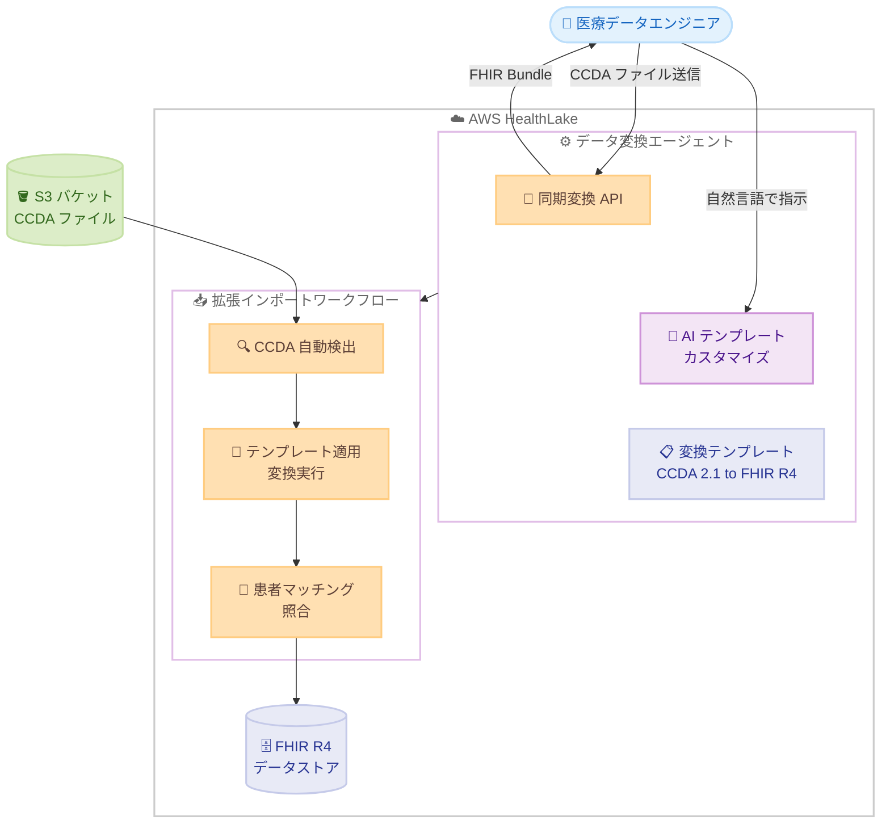

# AWS HealthLake - データ変換エージェントによる CCDA-to-FHIR 自動変換 (プレビュー)

**リリース日**: 2026年3月5日
**サービス**: AWS HealthLake
**機能**: データ変換エージェント (Data Transformation Agent)

[このアップデートのインフォグラフィックを見る](https://takech9203.github.io/aws-news-summary/20260305-aws-healthlake-data-transformation-agent.html)

## 概要

AWS HealthLake が、AI を活用したデータ変換エージェント (プレビュー) を発表しました。この新機能により、医療機関はレガシーな臨床文書である CCDA (Consolidated Clinical Document Architecture) ファイルを FHIR R4 (Fast Health Interoperability Resources Release 4) 準拠のリソースに自動変換できるようになります。従来は数か月かかっていたデータ変換プロセスを数日に短縮し、患者の縦断的記録生成、集団健康分析、臨床データ交換などのユースケースを実現します。

データ変換エージェントは、CCDA 2.1 から FHIR R4 への変換用テンプレート、同期変換 API、AI による自然言語でのテンプレートカスタマイズ、拡張インポートワークフローを統合的に提供します。専門的な FHIR の知識がなくても、リアルタイムの変換テスト、AI アシスト付きテンプレートカスタマイズ、スケーラブルな一括インポートを通じてデータ変換を実行できます。

すべての機能は AWS コンソールおよび API の両方で利用可能で、既存のワークフローへのシームレスな統合が可能です。

**アップデート前の課題**

- CCDA から FHIR への変換には専門的な FHIR の知識と数か月に及ぶ開発期間が必要だった
- 変換テンプレートのカスタマイズにはプログラミングスキルと FHIR 仕様の深い理解が求められた
- 大量の CCDA ファイルの一括変換とインポートには独自のパイプライン構築が必要だった
- 変換結果の検証とイテレーションに時間がかかり、品質管理が困難だった

**アップデート後の改善**

- すぐに使えるテンプレートにより、専門知識なしで CCDA 2.1 から FHIR R4 への変換が可能になった
- 自然言語での指示によりテンプレートを AI がカスタマイズするため、プログラミング不要でカスタマイズ可能
- 同期変換 API で個別ファイルを数秒で変換し、結果をプレビュー・検証できる
- 拡張インポートワークフローにより CCDA ファイルの自動検出、テンプレート適用、患者マッチング、FHIR リソースのインジェストまでを自動化

## アーキテクチャ図



データ変換エージェントは CCDA ファイルの受信からテンプレート適用、患者マッチング、FHIR データストアへのインジェストまでの一連のフローを自動化します。

## サービスアップデートの詳細

### 主要機能

1. **CCDA 2.1 to FHIR R4 変換テンプレート**
   - すぐに使えるテンプレートが用意されており、追加開発なしで CCDA 2.1 から FHIR R4 への変換を開始可能
   - テンプレートは CCDA 仕様に準拠した主要な臨床データ要素をカバー
   - テンプレートの検証と承認のワークフローにより、本番使用前の品質確認が可能

2. **同期変換 API**
   - 個別の CCDA ファイルをリアルタイムで変換し、数秒で FHIR Bundle を返却
   - コンソールワークフローからも変換を実行可能
   - 変換結果のプレビュー、対話型の検証、本番使用前のテンプレート承認が可能

3. **AI によるテンプレートカスタマイズ**
   - 自然言語で変換ルールの変更を指示可能
   - 例: 「status が entered-in-error の薬剤をスキップする」「procedure の日付を performedPeriod ではなく performedDateTime にマッピングする」
   - AI エージェントが指示に基づいてテンプレートを自動修正
   - サンプルファイルに対するテスト、会話形式でのイテレーション、完了後のパブリッシュが可能
   - パワーユーザー向けに手動でのテンプレート編集も利用可能

4. **拡張インポートワークフロー**
   - アップロードされた CCDA ファイルを自動検出
   - アクティブなテンプレートを自動適用
   - 識別子に基づく患者マッチングと照合を実施
   - 変換後の FHIR リソースをターゲットの HealthLake データストアにインジェスト
   - 詳細なログによるトラッキングが可能

## 技術仕様

### 対応フォーマット

| 項目 | 詳細 |
|------|------|
| 入力形式 | CCDA 2.1 (Consolidated Clinical Document Architecture) |
| 出力形式 | FHIR R4 (Fast Health Interoperability Resources Release 4) |
| 変換方式 | テンプレートベース + AI カスタマイズ |
| API タイプ | 同期変換 API |
| 利用方法 | AWS コンソール / API |

### IAM ポリシー例

```json
{
    "Version": "2012-10-17",
    "Statement": [
        {
            "Effect": "Allow",
            "Action": [
                "healthlake:CreateFHIRDatastore",
                "healthlake:StartFHIRImportJob",
                "healthlake:DescribeFHIRImportJob"
            ],
            "Resource": "arn:aws:healthlake:*:*:datastore/*"
        }
    ]
}
```

## 設定方法

### 前提条件

1. AWS アカウントと適切な IAM 権限
2. AWS HealthLake データストアの作成済み環境
3. 変換対象の CCDA 2.1 ファイル

### 手順

#### ステップ 1: HealthLake データストアの準備

AWS コンソールで HealthLake データストアを作成します。データストアは FHIR R4 形式のデータを格納するリポジトリとして機能します。

#### ステップ 2: テンプレートの確認とカスタマイズ

コンソール上でデフォルトの CCDA 2.1 to FHIR R4 変換テンプレートを確認します。カスタマイズが必要な場合は、自然言語で指示を入力して AI エージェントにテンプレートを修正させます。

#### ステップ 3: 同期変換 API でテスト

```bash
# 個別の CCDA ファイルを変換テスト
aws healthlake start-fhir-import-job \
    --datastore-id <datastore-id> \
    --input-data-config S3Uri=s3://<bucket>/<ccda-file>.xml \
    --job-output-data-config S3Uri=s3://<output-bucket>/output/
```

サンプルの CCDA ファイルを使用して変換結果をプレビューし、品質を検証します。問題があれば AI カスタマイズ機能でテンプレートを調整します。

#### ステップ 4: 拡張インポートワークフローの実行

テンプレートの検証が完了したら、拡張インポートワークフローを有効化して CCDA ファイルのバルクインポートを実行します。ワークフローが自動的にファイルを検出、変換、患者マッチング、データストアへのインジェストを行います。

## メリット

### ビジネス面

- **データ変換期間の大幅短縮**: 従来数か月かかっていた CCDA から FHIR への変換を数日に短縮し、医療データ活用のタイムトゥバリューを改善
- **専門人材コストの削減**: FHIR 専門家がいなくても変換が可能になり、人材確保の課題を解消
- **医療データ活用の促進**: 縦断的患者記録、集団健康分析、臨床データ交換などの高度な分析ユースケースを迅速に実現

### 技術面

- **AI 支援テンプレートカスタマイズ**: 自然言語による指示でテンプレートを修正でき、プログラミング不要で柔軟なカスタマイズが可能
- **エンドツーエンドの自動化**: ファイル検出から患者マッチング、データストアへのインジェストまでを自動化し、手動作業を最小化
- **API とコンソールの両対応**: 既存のワークフローへのシームレスな統合が可能で、開発者と非開発者の両方が利用可能

## デメリット・制約事項

### 制限事項

- プレビュー版であり、本番環境での利用には注意が必要
- 現時点では CCDA 2.1 から FHIR R4 への変換のみをサポートしており、他の臨床文書形式 (HL7 v2 など) は未対応
- AI によるテンプレートカスタマイズの精度は変換ルールの複雑さに依存する可能性がある

### 考慮すべき点

- プレビュー期間中の SLA やサポートレベルは GA 版と異なる場合がある
- 医療データの取り扱いには HIPAA 等のコンプライアンス要件への準拠を確認する必要がある
- テンプレートのカスタマイズ結果は必ず検証し、臨床的な正確性を確保することが重要

## ユースケース

### ユースケース 1: 病院システムの FHIR 対応移行

**シナリオ**: 大規模病院が、既存の電子カルテシステムから出力される大量の CCDA ファイルを FHIR R4 形式に変換し、HealthLake を活用した縦断的患者記録の構築を目指している。

**実装例**:
```
1. S3 バケットに既存の CCDA ファイルをアップロード
2. データ変換エージェントのデフォルトテンプレートで変換テスト
3. 必要に応じて AI カスタマイズでテンプレートを調整
4. 拡張インポートワークフローでバルク変換を実行
5. HealthLake データストアで FHIR R4 リソースとしてクエリ可能に
```

**効果**: 数か月の FHIR マッピング開発を数日に短縮し、医療データの相互運用性を迅速に実現

### ユースケース 2: 集団健康分析プラットフォームの構築

**シナリオ**: 医療保険会社が複数の医療機関から受領する CCDA ファイルを統合し、集団レベルの健康分析を実施したい。

**実装例**:
```
1. 各医療機関から受領した CCDA ファイルを S3 に集約
2. 拡張インポートワークフローで自動的に FHIR に変換
3. 患者マッチング機能で識別子に基づく患者レコードの統合
4. HealthLake の FHIR API で分析クエリを実行
```

**効果**: 複数ソースの臨床データを標準化された FHIR 形式で統合し、集団健康の傾向分析やリスク評価が可能に

### ユースケース 3: 臨床データ交換の標準化

**シナリオ**: 地域医療連携ネットワークで、参加施設間の臨床データ交換を FHIR 標準で実現したい。

**実装例**:
```
1. 各施設の CCDA ファイルをデータ変換エージェントで FHIR R4 に変換
2. 施設固有のマッピング要件は自然言語でテンプレートをカスタマイズ
   例: 「施設コード A001 を Organization リソースの identifier にマッピング」
3. 変換後の FHIR リソースを HealthLake データストアに格納
4. FHIR API を通じて施設間でデータを安全に共有
```

**効果**: 施設間のデータ形式の差異を吸収し、標準化された FHIR 形式で臨床データの交換を実現

## 料金

AWS HealthLake データ変換エージェントはプレビュー版として提供されています。料金の詳細は AWS HealthLake の料金ページを参照してください。

| 項目 | 詳細 |
|------|------|
| データ変換エージェント | プレビュー期間中の料金は公式ページで確認 |
| HealthLake データストア | ストレージ、読み取り/書き込みリクエストに基づく従量課金 |

## 利用可能リージョン

以下の 7 リージョンで利用可能です。

| リージョン | コード |
|-----------|--------|
| US East (N. Virginia) | us-east-1 |
| US East (Ohio) | us-east-2 |
| US West (Oregon) | us-west-2 |
| Asia Pacific (Mumbai) | ap-south-1 |
| Asia Pacific (Sydney) | ap-southeast-2 |
| Europe (Ireland) | eu-west-1 |
| Europe (London) | eu-west-2 |

## 関連サービス・機能

- **AWS HealthLake**: HIPAA 対応の FHIR データストアサービス。データ変換エージェントはこのサービスの新機能として追加
- **Amazon S3**: CCDA ファイルの保存先として使用。拡張インポートワークフローが S3 から自動的にファイルを検出
- **Amazon Comprehend Medical**: 医療テキストから臨床情報を抽出する NLP サービス。HealthLake と連携して医療データの活用を支援

## 参考リンク

- [インフォグラフィック](https://takech9203.github.io/aws-news-summary/20260305-aws-healthlake-data-transformation-agent.html)
- [公式発表 (What's New)](https://aws.amazon.com/about-aws/whats-new/2026/03/aws-healthlake-data-transformation-agent/)
- [AWS HealthLake ドキュメント](https://docs.aws.amazon.com/healthlake/)
- [AWS HealthLake 料金ページ](https://aws.amazon.com/healthlake/pricing/)

## まとめ

AWS HealthLake データ変換エージェント (プレビュー) は、医療機関が直面する CCDA から FHIR への変換の課題を AI の力で解決する重要なアップデートです。自然言語によるテンプレートカスタマイズと拡張インポートワークフローの自動化により、FHIR 専門知識がなくても医療データの標準化と活用を迅速に開始できます。医療データの相互運用性を推進する組織は、プレビュー期間中に検証を開始することを推奨します。
