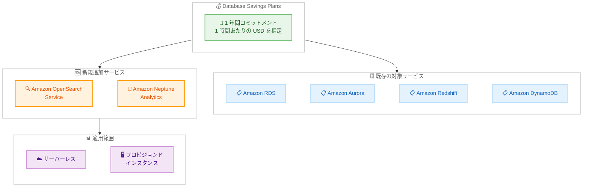

# Database Savings Plans - Amazon OpenSearch Service / Amazon Neptune Analytics 対応

**リリース日**: 2026 年 03 月 05 日
**サービス**: AWS Savings Plans
**機能**: Database Savings Plans の Amazon OpenSearch Service および Amazon Neptune Analytics サポート

[このアップデートのインフォグラフィックを見る](https://takech9203.github.io/aws-news-summary/20260305-dbsp-opensearch-service-neptune-analytics.html)

## 概要

AWS は Database Savings Plans (DBSP) の対象サービスを拡大し、Amazon OpenSearch Service および Amazon Neptune Analytics のサポートを追加しました。これにより、1 年間のコミットメントで最大 35% のコスト削減が可能になります。Database Savings Plans は、エンジン、インスタンスファミリー、サイズ、デプロイオプション、AWS リージョンに関係なく、対象となるサーバーレスおよびプロビジョンドインスタンスの使用量に自動的に適用されます。

この機能拡張は、OpenSearch Service や Neptune Analytics を利用しているお客様で、長期的なコスト最適化を検討している組織にとって特に価値があります。既存の Database Savings Plans をお持ちのお客様は、対象サービスの拡大により自動的に新しいサービスの使用量にも割引が適用される可能性があります。

**アップデート前の課題**

- Database Savings Plans の対象サービスが限定されており、OpenSearch Service や Neptune Analytics の利用コストは割引対象外だった
- OpenSearch Service や Neptune Analytics のコスト削減には、リザーブドインスタンスなど個別の割引モデルを検討する必要があった
- 複数のデータベースサービスを横断した統一的なコスト最適化が困難だった

**アップデート後の改善**

- Database Savings Plans で OpenSearch Service および Neptune Analytics の使用量に最大 35% の割引が自動適用される
- 1 時間あたりの使用量 (USD) をコミットするだけで、エンジンやインスタンスファミリーを問わず柔軟に割引が適用される
- サーバーレス (OpenSearch Serverless など) とプロビジョンドインスタンスの両方が対象となる
- 既存の Database Savings Plans の恩恵が自動的に新しいサービスにも拡大される

## アーキテクチャ図



Database Savings Plans が OpenSearch Service と Neptune Analytics に拡大され、サーバーレスとプロビジョンドインスタンスの両方に自動適用される構成を示しています。

## サービスアップデートの詳細

### 主要機能

1. **Amazon OpenSearch Service のサポート**
   - OpenSearch Service のプロビジョンドインスタンスおよび OpenSearch Serverless の使用量が Database Savings Plans の対象に追加
   - エンジンバージョン、インスタンスファミリー、サイズに関係なく自動適用
   - 最大 35% のコスト削減が可能

2. **Amazon Neptune Analytics のサポート**
   - Neptune Analytics の使用量 (OCU-hours 単位) が Database Savings Plans の対象に追加
   - グラフ分析ワークロードのコスト最適化が容易に
   - リージョンを問わず自動的に割引が適用

3. **自動適用メカニズム**
   - コミットした使用量に対して、最も割引率の高い使用量から自動的に適用
   - エンジン、インスタンスファミリー、サイズ、デプロイオプション、リージョンに関係なく柔軟に適用
   - 既存の Database Savings Plans にも自動的に拡大対象サービスが反映

## 技術仕様

### 対応状況

| 項目 | 詳細 |
|------|------|
| コミットメント期間 | 1 年間 |
| 最大割引率 | 最大 35% |
| 支払いオプション | 全額前払い、一部前払い、前払いなし |
| 対象デプロイタイプ | サーバーレス、プロビジョンドインスタンス |
| 対象 OpenSearch 使用量 | プロビジョンドインスタンス、OpenSearch Serverless (OCU-hours) |
| 対象 Neptune Analytics 使用量 | OCU-hours、Jobs |

### API 変更履歴

| 日付 | サービス | 変更内容 |
|------|----------|----------|
| 2026/03/05 | [savingsplans](https://awsapichanges.com/archive/changes/d66a4c-savingsplans.html) | 4 updated api methods - OpenSearch および Neptune Analytics の Database Savings Plans サポートを追加 |

### API の変更内容

Database Savings Plans の API に以下の変更が加えられています。

- `DescribeSavingsPlanRates`: `productType` に `OpenSearch` を追加、`serviceCode` に `AmazonES` を追加、`unit` に `Jobs` および `OCU-hours` を追加
- `DescribeSavingsPlans`: `productTypes` に `OpenSearch` を追加
- `DescribeSavingsPlansOfferingRates`: `products` に `OpenSearch` を追加、`serviceCodes` に `AmazonES` を追加
- `DescribeSavingsPlansOfferings`: `productType` に `OpenSearch` を追加

## 設定方法

### 前提条件

1. AWS アカウントで Savings Plans の購入権限があること
2. Amazon OpenSearch Service または Amazon Neptune Analytics を利用中、もしくは利用を予定していること
3. AWS Cost Explorer が有効化されていること

### 手順

#### ステップ 1: 現在の使用量を確認

```bash
# AWS CLI で Savings Plans の推奨事項を取得
aws ce get-savings-plans-purchase-recommendation \
  --savings-plans-type "DATABASE_SAVINGS_PLANS" \
  --term-in-years "ONE_YEAR" \
  --payment-option "NO_UPFRONT" \
  --lookback-period-in-days "THIRTY_DAYS"
```

Cost Explorer の推奨事項機能を使用して、過去の使用パターンに基づいた最適なコミットメント額を確認します。

#### ステップ 2: Database Savings Plans を購入

```bash
# AWS CLI で Savings Plans のオファリングを確認
aws savingsplans describe-savings-plans-offerings \
  --product-type "OpenSearch" \
  --plan-types "SavingsPlans"
```

AWS マネジメントコンソールの Savings Plans ページ、または AWS CLI を使用して Database Savings Plans を購入します。購入時にコミットメント額 (1 時間あたりの USD)、期間 (1 年)、支払いオプション (全額前払い、一部前払い、前払いなし) を指定します。

#### ステップ 3: 適用状況をモニタリング

```bash
# 購入済みの Savings Plans を確認
aws savingsplans describe-savings-plans \
  --filter '{"key":"start","values":["2026-03-05"]}'
```

購入後、Cost Explorer の Savings Plans 利用率レポートで適用状況を定期的に確認します。使用量がコミットメント額を下回っている場合はリソースの最適化を検討してください。

## メリット

### ビジネス面

- **最大 35% のコスト削減**: 1 年間のコミットメントにより、オンデマンド料金から最大 35% のコスト削減を実現
- **統合的なコスト管理**: 複数のデータベースサービスを横断した単一の Savings Plan で管理可能
- **柔軟な適用**: サービスやリージョンを変更しても自動的に割引が適用されるため、アーキテクチャ変更の自由度が維持される

### 技術面

- **自動適用**: 手動での割引適用や管理が不要で、最も割引率の高い使用量から自動的に適用
- **サーバーレス対応**: OpenSearch Serverless や Neptune Analytics のサーバーレスワークロードにも適用
- **リージョン横断**: AWS リージョンに関係なく割引が適用されるため、マルチリージョン構成でも恩恵を受けられる

## デメリット・制約事項

### 制限事項

- 中国リージョンでは利用不可
- コミットメント期間中のキャンセルや変更は不可
- コミットメント額を超過した使用量にはオンデマンド料金が適用される

### 考慮すべき点

- コミットメント額の設定には、過去の使用パターンの分析が必要 (過小設定は割引の恩恵を十分に受けられず、過大設定は未使用分のコストが発生)
- リザーブドインスタンスとの併用時は適用優先順位を理解する必要がある (リザーブドインスタンスが先に適用され、残りの使用量に Savings Plans が適用される)

## ユースケース

### ユースケース 1: OpenSearch Service を利用するログ分析基盤

**シナリオ**: 大規模なログ分析基盤で OpenSearch Service のプロビジョンドインスタンスを複数リージョンで運用しているお客様が、コスト最適化を検討している。

**実装例**:
```bash
# OpenSearch Service の使用量推奨を確認
aws ce get-savings-plans-purchase-recommendation \
  --savings-plans-type "DATABASE_SAVINGS_PLANS" \
  --term-in-years "ONE_YEAR" \
  --payment-option "ALL_UPFRONT" \
  --lookback-period-in-days "SIXTY_DAYS"
```

**効果**: 月額 $10,000 の OpenSearch Service 使用量に対して、全額前払いの 1 年コミットメントで最大 $3,500/月のコスト削減が見込める。

### ユースケース 2: Neptune Analytics によるグラフ分析

**シナリオ**: 不正検知やレコメンデーションエンジンで Neptune Analytics を定常的に利用しているお客様が、予測可能なワークロードに対するコスト最適化を行いたい。

**実装例**:
```bash
# Neptune Analytics の使用量を確認
aws ce get-cost-and-usage \
  --time-period Start=2026-02-01,End=2026-03-01 \
  --granularity MONTHLY \
  --metrics "UsageQuantity" \
  --filter '{"Dimensions":{"Key":"SERVICE","Values":["Amazon Neptune"]}}'
```

**効果**: 定常的な Neptune Analytics の OCU-hours 使用量に対して、Database Savings Plans を適用することで最大 35% のコスト削減を実現。

### ユースケース 3: マルチデータベース環境の統合コスト最適化

**シナリオ**: RDS、Aurora、OpenSearch Service、Neptune Analytics を組み合わせて利用しているお客様が、個別のリザーブドインスタンスではなく統合的なコスト最適化を行いたい。

**実装例**:
```bash
# Database Savings Plans の利用率を確認
aws ce get-savings-plans-utilization \
  --time-period Start=2026-03-01,End=2026-03-07 \
  --granularity DAILY \
  --filter '{"Dimensions":{"Key":"SAVINGS_PLAN_TYPE","Values":["DatabaseSavingsPlans"]}}'
```

**効果**: 複数のデータベースサービスにまたがる使用量を単一の Savings Plan で管理でき、サービス間の使用量変動を吸収しながら最大限の割引を適用可能。

## 料金

Database Savings Plans は、コミットした 1 時間あたりの使用量 (USD) に対して割引料金が適用されます。割引率は支払いオプションにより異なります。

### 料金例

| 支払いオプション | 割引率目安 | 特徴 |
|-----------------|-----------|------|
| 全額前払い | 最大 35% | 最大の割引率 |
| 一部前払い | 約 30% | 前払いと月額のバランス |
| 前払いなし | 約 20% | 初期コスト不要 |

※ 割引率はサービス、インスタンスタイプ、リージョンにより異なります。正確な割引率は AWS Cost Explorer の Savings Plans 推奨事項で確認してください。

## 利用可能リージョン

中国リージョンを除くすべての AWS リージョンで利用可能です。

## 関連サービス・機能

- **Amazon OpenSearch Service**: フルマネージドの検索・分析サービス。ログ分析、全文検索、アプリケーションモニタリングなどに使用
- **Amazon Neptune Analytics**: グラフデータに対する分析クエリを高速に実行するサービス。不正検知やナレッジグラフ分析に活用
- **AWS Cost Explorer**: コスト分析と Savings Plans の推奨事項、利用率モニタリングに使用
- **Compute Savings Plans**: EC2、Lambda、Fargate に対する同様の柔軟な割引モデル

## 参考リンク

- [このアップデートのインフォグラフィックを見る](https://takech9203.github.io/aws-news-summary/20260305-dbsp-opensearch-service-neptune-analytics.html)
- [公式発表 (What's New)](https://aws.amazon.com/about-aws/whats-new/2026/03/dbsp-opensearch-service-neptune-analytics/)
- [Savings Plans ドキュメント](https://docs.aws.amazon.com/savingsplans/latest/userguide/what-is-savings-plans.html)
- [Savings Plans 料金ページ](https://aws.amazon.com/savingsplans/pricing/)

## まとめ

Database Savings Plans の対象サービスに Amazon OpenSearch Service と Amazon Neptune Analytics が追加され、1 年間のコミットメントで最大 35% のコスト削減が可能になりました。特に OpenSearch Service や Neptune Analytics を定常的に利用しているお客様は、Cost Explorer の推奨事項を確認し、適切なコミットメント額での Savings Plans 購入を検討することを推奨します。
