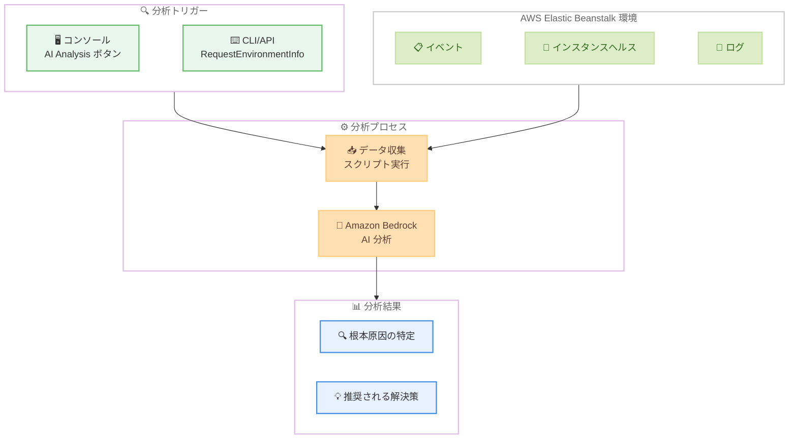

# AWS Elastic Beanstalk - AI を活用した環境分析

**リリース日**: 2026 年 3 月 5 日
**サービス**: AWS Elastic Beanstalk
**機能**: AI-Powered Environment Analysis

[このアップデートのインフォグラフィックを見る](https://takech9203.github.io/aws-news-summary/20260305-elastic-beanstalk-ai-analysis.html)

## 概要

AWS Elastic Beanstalk が Amazon Bedrock を活用した AI 環境分析機能を提供開始した。この機能により、環境のヘルスステータスが Warning、Degraded、Severe のいずれかになった際に、AI が自動的にイベント、インスタンスヘルス、ログを収集・分析し、根本原因の特定と推奨される解決策を提示する。

これまで環境のヘルス問題が発生した場合、運用担当者はログやイベントを手動で確認し、問題の原因を特定する必要があった。この新機能により、Elastic Beanstalk コンソールの AI Analysis ボタンをクリックするだけで、Bedrock による包括的な分析結果を即座に取得できるようになる。CLI からも RequestEnvironmentInfo / RetrieveEnvironmentInfo API を使用してプログラマティックにアクセス可能である。

**アップデート前の課題**

- 環境のヘルス問題が発生した際、ログやイベントを手動で確認して根本原因を特定する必要があった
- 複数のデータソース (イベント、インスタンスヘルス、ログ) を横断的に分析するには専門知識と時間が必要だった
- 問題の診断から解決策の特定まで、経験の浅い運用担当者にとって難易度が高かった

**アップデート後の改善**

- AI がイベント、インスタンスヘルス、ログを自動収集し、包括的な分析を実行する
- 根本原因の特定と推奨される解決策が自動的に提示される
- コンソールの AI Analysis ボタンまたは CLI/API からワンアクションで分析を開始できる

## アーキテクチャ図



ユーザーがコンソールまたは CLI から分析をリクエストすると、Elastic Beanstalk が環境内のインスタンスでスクリプトを実行してデータを収集し、Amazon Bedrock に送信して AI 分析を行う。

## サービスアップデートの詳細

### 主要機能

1. **AI 環境分析**
   - 環境のヘルスステータスが Warning、Degraded、Severe の場合に利用可能
   - イベント、インスタンスヘルス、ログの 3 つのデータソースを自動収集
   - Amazon Bedrock を使用して収集データを分析し、根本原因と解決策を提示

2. **コンソールからのアクセス**
   - 環境のヘルスが正常でない場合に AI Analysis ボタンが表示される
   - ボタンをクリックするだけで分析が開始される
   - 分析結果はコンソール上で直接確認可能

3. **CLI/API からのアクセス**
   - RequestEnvironmentInfo API に新しい InfoType `analyze` が追加
   - RetrieveEnvironmentInfo API で分析結果を取得
   - プログラマティックなワークフローへの統合が可能

## 技術仕様

### API 変更

| 項目 | 詳細 |
|------|------|
| 対象 API | RequestEnvironmentInfo、RetrieveEnvironmentInfo |
| 新しい InfoType 値 | `analyze` (既存の `tail`、`bundle` に追加) |
| 分析データソース | イベント、インスタンスヘルス、ログ |
| AI エンジン | Amazon Bedrock |

### API 変更履歴

| 日付 | サービス | 変更内容 |
|------|----------|----------|
| 2026/03/04 | [elasticbeanstalk](https://awsapichanges.com/archive/changes/91f8bd-elasticbeanstalk.html) | 2 updated api methods - RequestEnvironmentInfo と RetrieveEnvironmentInfo に InfoType `analyze` を追加 |

### API 使用例

```python
import boto3

client = boto3.client('elasticbeanstalk')

# AI 分析をリクエスト
client.request_environment_info(
    EnvironmentName='my-environment',
    InfoType='analyze'
)

# 分析結果を取得
response = client.retrieve_environment_info(
    EnvironmentName='my-environment',
    InfoType='analyze'
)

for info in response['EnvironmentInfo']:
    print(f"InfoType: {info['InfoType']}")
    print(f"Instance: {info['Ec2InstanceId']}")
    print(f"Analysis: {info['Message']}")
```

## 設定方法

### 前提条件

1. AWS Elastic Beanstalk 環境が作成済みであること
2. Amazon Bedrock が利用可能なリージョンであること
3. 環境のヘルスステータスが Warning、Degraded、または Severe であること

### 手順

#### ステップ 1: コンソールから分析を実行する場合

1. AWS マネジメントコンソールで Elastic Beanstalk サービスを開く
2. 対象の環境を選択
3. ヘルスステータスが Warning、Degraded、Severe のいずれかであることを確認
4. AI Analysis ボタンをクリック

分析が開始され、結果がコンソール上に表示される。

#### ステップ 2: CLI から分析を実行する場合

```bash
# AI 分析をリクエスト
aws elasticbeanstalk request-environment-info \
    --environment-name my-environment \
    --info-type analyze
```

RequestEnvironmentInfo API を使用して、指定した環境の AI 分析を開始する。InfoType に `analyze` を指定することで、従来のログ取得 (`tail`) やバンドル取得 (`bundle`) とは異なる AI 分析モードが実行される。

#### ステップ 3: 分析結果を取得する

```bash
# 分析結果を取得
aws elasticbeanstalk retrieve-environment-info \
    --environment-name my-environment \
    --info-type analyze
```

RetrieveEnvironmentInfo API を使用して、AI 分析の結果を取得する。レスポンスの `Message` フィールドに根本原因の分析と推奨される解決策が含まれる。

## メリット

### ビジネス面

- **トラブルシューティング時間の短縮**: AI による自動分析により、問題の診断から解決までの時間を大幅に短縮できる
- **運用コストの削減**: 専門知識がなくても環境の問題を迅速に特定・解決できるため、運用負荷が軽減される
- **サービス可用性の向上**: 問題の早期検出と迅速な解決により、アプリケーションのダウンタイムを最小化できる

### 技術面

- **包括的なデータ分析**: イベント、インスタンスヘルス、ログの 3 つのデータソースを横断的に分析し、単一のデータソースでは見落としがちな問題も検出できる
- **API 統合の容易さ**: 既存の RequestEnvironmentInfo / RetrieveEnvironmentInfo API に新しい InfoType が追加されただけのため、既存のワークフローへの統合が容易である
- **自動化対応**: CLI/API からアクセス可能なため、モニタリングツールやアラートシステムとの統合が可能である

## デメリット・制約事項

### 制限事項

- 環境のヘルスステータスが Warning、Degraded、Severe の場合にのみ利用可能であり、正常な環境では分析を実行できない
- Elastic Beanstalk と Amazon Bedrock の両方が利用可能なリージョンでのみ使用できる
- 分析にはインスタンス上でスクリプトが実行されるため、インスタンスが応答可能な状態である必要がある

### 考慮すべき点

- Amazon Bedrock の利用に伴う追加コストが発生する可能性がある
- AI の分析結果はあくまで推奨であり、最終的な判断は運用担当者が行う必要がある
- 分析対象のデータ (ログ等) が Amazon Bedrock に送信されるため、データの取り扱いポリシーを確認する必要がある

## ユースケース

### ユースケース 1: デプロイ失敗時の迅速な原因特定

**シナリオ**: 新しいバージョンのアプリケーションをデプロイした後、環境のヘルスが Degraded に変化した。原因が設定ミスなのか、アプリケーションのバグなのか、リソース不足なのかを迅速に特定したい。

**実装例**:
```bash
# 環境のヘルスが Degraded になったことをアラートで検知後
aws elasticbeanstalk request-environment-info \
    --environment-name production-env \
    --info-type analyze

# 数分後に結果を取得
aws elasticbeanstalk retrieve-environment-info \
    --environment-name production-env \
    --info-type analyze
```

**効果**: AI がデプロイイベント、エラーログ、インスタンスヘルスを横断的に分析し、デプロイ失敗の根本原因と推奨される対処法を即座に提示する。

### ユースケース 2: 断続的なヘルス問題の調査

**シナリオ**: 環境のヘルスが断続的に Warning と OK を繰り返しており、根本原因が特定できない状況。複数のログファイルやイベントを手動で調査するのに時間がかかっている。

**実装例**:
```bash
# Warning 状態の際に分析を実行
aws elasticbeanstalk request-environment-info \
    --environment-name staging-env \
    --info-type analyze
```

**効果**: AI が複数のデータソースを統合的に分析し、断続的な問題のパターンや根本原因 (メモリリーク、接続プールの枯渇など) を特定する。

### ユースケース 3: 運用自動化パイプラインへの統合

**シナリオ**: CloudWatch アラームと連携して、環境のヘルス問題を自動的に検知・分析・通知するパイプラインを構築したい。

**実装例**:
```python
import boto3
import json

def lambda_handler(event, context):
    eb_client = boto3.client('elasticbeanstalk')
    sns_client = boto3.client('sns')

    env_name = event['detail']['environmentName']

    # AI 分析をリクエスト
    eb_client.request_environment_info(
        EnvironmentName=env_name,
        InfoType='analyze'
    )

    # 結果を取得して SNS で通知
    response = eb_client.retrieve_environment_info(
        EnvironmentName=env_name,
        InfoType='analyze'
    )

    for info in response['EnvironmentInfo']:
        sns_client.publish(
            TopicArn='arn:aws:sns:us-east-1:123456789012:ops-alerts',
            Subject=f'Beanstalk AI Analysis: {env_name}',
            Message=info['Message']
        )
```

**効果**: ヘルス問題の検知から AI 分析、運用チームへの通知までを自動化し、対応時間を大幅に短縮する。

## 料金

AI 環境分析機能自体に追加料金は明示されていない。ただし、分析時に Amazon Bedrock が使用されるため、Bedrock の利用料金が適用される可能性がある。詳細は AWS の料金ページで確認することを推奨する。

## 利用可能リージョン

AWS Elastic Beanstalk と Amazon Bedrock の両方が利用可能なリージョンで使用できる。具体的なリージョンの一覧は、各サービスのリージョン別サービス一覧ページで確認が必要である。

## 関連サービス・機能

- **Amazon Bedrock**: AI 分析のバックエンドとして使用される生成 AI サービス
- **AWS Elastic Beanstalk Enhanced Health Reporting**: 環境ヘルスの詳細なモニタリング機能。AI 分析のトリガーとなるヘルスステータスを提供
- **Amazon CloudWatch**: Elastic Beanstalk 環境のメトリクスとアラームを管理。AI 分析の自動化トリガーとして活用可能

## 参考リンク

- [このアップデートのインフォグラフィック](https://takech9203.github.io/aws-news-summary/20260305-elastic-beanstalk-ai-analysis.html)
- [公式発表 (What's New)](https://aws.amazon.com/about-aws/whats-new/2026/03/elastic-beanstalk-ai-analysis/)
- [AWS Elastic Beanstalk ドキュメント](https://docs.aws.amazon.com/elasticbeanstalk/latest/dg/)
- [AWS Elastic Beanstalk 料金](https://aws.amazon.com/elasticbeanstalk/pricing/)
- [Amazon Bedrock 料金](https://aws.amazon.com/bedrock/pricing/)

## まとめ

AWS Elastic Beanstalk の AI 環境分析機能は、Amazon Bedrock を活用して環境のヘルス問題の根本原因を自動的に特定し、解決策を提示する実用的な機能である。コンソールのボタンクリックまたは既存 API の新しい InfoType `analyze` でアクセスでき、導入の敷居が低い。Elastic Beanstalk を使用している環境では、トラブルシューティングの効率化と運用負荷の軽減が期待できるため、ヘルス問題が発生した際に積極的に活用することを推奨する。
