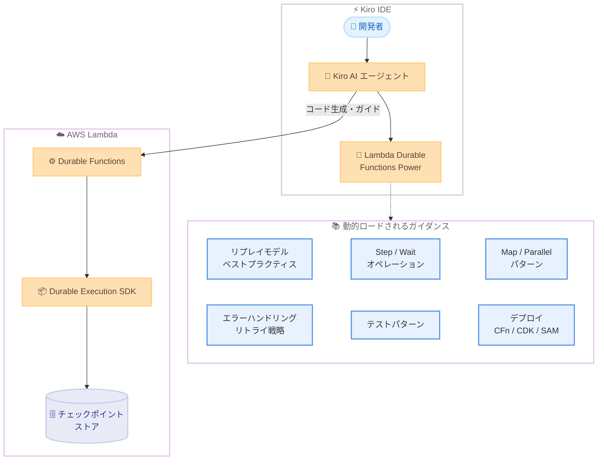

# AWS Lambda - Lambda Durable Functions Kiro Power

**リリース日**: 2026 年 3 月 5 日
**サービス**: AWS Lambda / Kiro
**機能**: Lambda Durable Functions Kiro Power

## 概要

AWS は Lambda Durable Functions の開発を支援する新しい Kiro Power を発表した。この Power により、Kiro IDE のエージェントが Lambda Durable Functions に関する専門知識を動的にロードし、開発者がローカル開発環境でレジリエントな長時間実行マルチステップアプリケーションや AI ワークフローをより迅速に構築できるようになる。

Lambda Durable Functions は、チェックポイントとリプレイメカニズムを使用して最大 1 年間実行可能な耐障害性のあるワークフローを構築する機能である。今回の Kiro Power は、この Durable Functions の開発に必要なベストプラクティスやパターンを AI エージェントが理解し、開発者をガイドすることで、アイデアから動作する Durable Function までの開発を加速する。

**アップデート前の課題**

- Lambda Durable Functions のリプレイモデルやベストプラクティスを開発者が個別に学習する必要があった
- Step と Wait オペレーション、Map/Parallel パターンなどの複雑な実行パターンを正しく実装するために、ドキュメントを逐一参照する必要があった
- エラーハンドリングやリトライ戦略、補償トランザクションの設計に時間がかかっていた
- CloudFormation、CDK、SAM を使用したデプロイ設定を手動で構成する必要があった

**アップデート後の改善**

- Kiro の AI エージェントが Durable Functions の開発コンテキストを動的にロードし、リアルタイムでガイダンスを提供する
- リプレイモデルのベストプラクティス、並行実行パターン、エラーハンドリング戦略が AI エージェントの支援のもとで迅速に実装可能になった
- 注文処理パイプライン、Human-in-the-Loop 承認を伴う AI エージェントオーケストレーション、決済連携ワークフローなどのユースケースを素早く開発できるようになった
- ワンクリックインストールで即座に利用を開始できる

## アーキテクチャ図



Kiro IDE 内で開発者が Durable Functions の開発を行う際に、AI エージェントが Power を通じて関連するガイダンスを動的にロードし、コード生成やベストプラクティスの適用を支援する流れを示している。

## サービスアップデートの詳細

### 主要機能

1. **動的ガイダンスのロード**
   - 開発者が Durable Functions に関する作業を行うと、Kiro の AI エージェントが関連するガイダンスと開発専門知識を自動的にロードする
   - コンテキストに応じて必要な情報のみが活性化されるため、エージェントが集中した状態を維持できる

2. **包括的な開発パターンのサポート**
   - リプレイモデルのベストプラクティス: チェックポイントとリプレイの正しい実装方法
   - Step と Wait オペレーション: ビジネスロジックの実行と、課金なしの一時停止操作
   - 並行実行パターン: Map と Parallel を使用した同時処理
   - エラーハンドリング: リトライ戦略と補償トランザクション
   - テストパターン: Durable Functions のテスト手法
   - デプロイ: CloudFormation、CDK、SAM による構成

3. **ワンクリックインストール**
   - Kiro IDE または Kiro Powers ページから即座にインストール可能
   - 追加の設定やコンフィグレーションは不要

## 技術仕様

### Lambda Durable Functions の基本概念

| 項目 | 詳細 |
|------|------|
| 最大実行時間 | 最大 1 年間 |
| 対応言語 | JavaScript、TypeScript、Python、Java (Preview) |
| 実行モデル | チェックポイント / リプレイ方式 |
| 主要オペレーション | Step (ビジネスロジック実行)、Wait (一時停止) |
| 並行実行パターン | Map、Parallel |
| デプロイ対応 | CloudFormation、CDK、SAM |

### Kiro Power の仕組み

| 項目 | 詳細 |
|------|------|
| インストール方法 | Kiro IDE またはKiro Powers ページからワンクリック |
| 動作方式 | 会話コンテキストに基づいて動的にロード |
| 構成要素 | MCP ツール、ステアリングファイル、フックのバンドル |
| 追加料金 | なし |

### IAM ポリシーの例

```json
{
  "Version": "2012-10-17",
  "Statement": [
    {
      "Effect": "Allow",
      "Action": [
        "lambda:CreateFunction",
        "lambda:UpdateFunctionCode",
        "lambda:UpdateFunctionConfiguration",
        "lambda:InvokeFunction"
      ],
      "Resource": "arn:aws:lambda:*:*:function:*"
    }
  ]
}
```

## 設定方法

### 前提条件

1. Kiro IDE バージョン 0.7 以上がインストールされていること
2. AWS アカウントが設定されていること
3. Lambda Durable Functions の実行に必要な IAM 権限が付与されていること

### 手順

#### ステップ 1: Kiro Power のインストール

Kiro IDE 内の Powers メニュー、または [Kiro Powers ページ](https://kiro.dev/powers/) から「Lambda Durable Functions」Power を検索し、ワンクリックでインストールする。

#### ステップ 2: Durable Functions プロジェクトの開始

Kiro IDE で新しい会話を開始し、Durable Functions に関する開発を依頼する。AI エージェントが自動的に関連するガイダンスをロードする。

```bash
# Durable Functions SDK のインストール例 (Node.js)
npm install @aws-lambda/durable-functions
```

SDK をインストールし、Kiro の AI エージェントのガイドに従って Durable Functions のコードを作成する。

#### ステップ 3: デプロイ

Kiro の AI エージェントが CloudFormation、CDK、または SAM を使用したデプロイ設定の生成を支援する。

```bash
# SAM を使用したデプロイ例
sam build
sam deploy --guided
```

SAM CLI を使用して Durable Functions をビルドし、ガイド付きデプロイを実行する。

## メリット

### ビジネス面

- **開発速度の向上**: AI エージェントの支援により、Durable Functions の学習曲線が大幅に短縮され、アイデアから動作するコードまでの時間を削減できる
- **品質の向上**: ベストプラクティスが自動的に適用されるため、堅牢なワークフローを最初から構築できる
- **コスト効率**: Wait オペレーション中は課金されないため、長時間実行ワークフローのコストを最適化できる

### 技術面

- **包括的なパターンサポート**: リプレイモデル、並行実行、エラーハンドリングなど、Durable Functions の主要パターンすべてをカバーする
- **デプロイ自動化の支援**: CloudFormation、CDK、SAM の 3 つのデプロイツールに対応したガイダンスを提供する
- **コンテキスト認識型の支援**: 開発中の作業内容に応じて、必要なガイダンスのみが動的にロードされる

## デメリット・制約事項

### 制限事項

- Kiro IDE でのみ利用可能であり、他の IDE やエディタでは使用できない
- Kiro IDE バージョン 0.7 以上が必要
- Lambda Durable Functions 自体の Java サポートはプレビュー段階

### 考慮すべき点

- AI エージェントが生成するコードは、プロダクション環境へのデプロイ前にレビューが必要
- Durable Functions のリプレイモデルを理解することは、デバッグやトラブルシューティングのために依然として重要

## ユースケース

### ユースケース 1: 注文処理パイプライン

**シナリオ**: EC サイトの注文処理で、バリデーション、決済認証、在庫確保、配送手配を順序立てて実行し、障害時には自動ロールバックする必要がある。

**実装例**:
```typescript
import { durable, step, wait } from '@aws-lambda/durable-functions';

export const handler = durable(async (ctx, event) => {
  const validated = await ctx.step('validate', () => validateOrder(event.order));
  const payment = await ctx.step('authorize', () => authorizePayment(validated));
  const inventory = await ctx.step('allocate', () => allocateInventory(validated));
  await ctx.step('fulfill', () => fulfillOrder(payment, inventory));
});
```

**効果**: Kiro の AI エージェントがリトライ戦略や補償トランザクションのパターンを提案し、堅牢な注文処理パイプラインを迅速に構築できる。

### ユースケース 2: Human-in-the-Loop AI エージェントオーケストレーション

**シナリオ**: AI エージェントが文書を分析し、人間の承認を待ってから次のアクションを実行するワークフローを構築する。

**実装例**:
```typescript
export const handler = durable(async (ctx, event) => {
  const analysis = await ctx.step('analyze', () => analyzeDocument(event.document));
  const approval = await ctx.wait('human-approval', {
    type: 'event',
    event: 'approval-received'
  });
  if (approval.approved) {
    await ctx.step('execute', () => executeAction(analysis));
  }
});
```

**効果**: Wait オペレーション中は課金されないため、人間の承認を待つ間のコストを抑えながら、AI エージェントのワークフローを実装できる。

### ユースケース 3: 決済連携ワークフロー

**シナリオ**: 複数の決済プロバイダーにまたがる認証、不正検知、決済処理を、トランザクション状態を維持しながら実行する。

**実装例**:
```typescript
export const handler = durable(async (ctx, event) => {
  const fraud = await ctx.step('fraud-check', () => checkFraud(event.payment));
  const auth = await ctx.step('authorize', () => authorizeWithProvider(event.payment));
  const settlement = await ctx.step('settle', () => settlePayment(auth));
  await ctx.step('notify', () => notifyCompletion(settlement));
});
```

**効果**: 障害発生時もトランザクション状態が自動保存され、リプレイにより中断箇所から再開できるため、決済の信頼性が向上する。

## 料金

Kiro Power 自体の利用に追加料金は発生しない。Lambda Durable Functions の実行には、通常の Lambda の料金体系が適用される。

| 項目 | 料金 |
|------|------|
| Kiro Power インストール・利用 | 無料 |
| Lambda 実行時間 | Lambda の標準料金に準拠 |
| Wait オペレーション中 | 課金なし |

## 利用可能リージョン

Kiro Power はグローバルに利用可能。Lambda Durable Functions 自体のリージョン対応については、[AWS Lambda のドキュメント](https://docs.aws.amazon.com/lambda/latest/dg/durable-functions.html) を参照。

## 関連サービス・機能

- **AWS Lambda Durable Functions**: チェックポイントとリプレイによる耐障害性のあるワークフロー実行基盤
- **AWS Step Functions**: グラフベースの DSL やビジュアルデザイナーを使用したワークフローオーケストレーション。220 以上の AWS サービスとのネイティブ統合が強み
- **Kiro IDE**: AWS が提供する AI 搭載の統合開発環境。Powers によりエージェントに専門知識を付与できる
- **AWS CloudFormation / CDK / SAM**: Durable Functions のデプロイに使用する Infrastructure as Code ツール

## 参考リンク

- [公式発表 (What's New)](https://aws.amazon.com/about-aws/whats-new/2026/03/lambda-durable-kiro-power/)
- [Lambda Durable Functions ドキュメント](https://docs.aws.amazon.com/lambda/latest/dg/durable-functions.html)
- [Kiro Powers ページ](https://kiro.dev/powers/)
- [Kiro IDE](https://kiro.dev/)
- [AWS Lambda 料金ページ](https://aws.amazon.com/lambda/pricing/)

## まとめ

Lambda Durable Functions Kiro Power は、Durable Functions の開発を AI エージェントで加速する実用的なツールである。リプレイモデルのベストプラクティスから並行実行パターン、エラーハンドリング、デプロイまで包括的にカバーしており、Durable Functions を活用したワークフロー開発の立ち上げを大幅に効率化できる。Kiro IDE を利用している開発者は、ワンクリックでインストールして即座に活用を開始することを推奨する。
