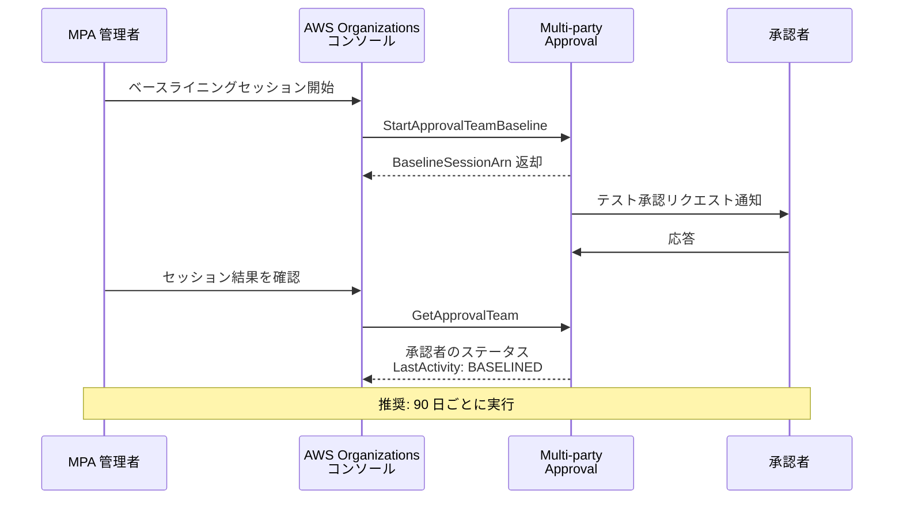

# Multi-party Approval - 承認チームベースライニングのサポート

**リリース日**: 2026年03月05日
**サービス**: AWS Multi-party Approval (MPA)
**機能**: 承認チームベースライニング (Approval Team Baselining)

## 概要

AWS Multi-party Approval (MPA) が、承認チームのベースライニング機能をサポートしました。MPA 管理者は、テスト承認セッションを実行して、承認チームが正しくセットアップされていること、および承認者がアクティブで連絡可能であることを事前に確認できるようになりました。

この機能により、実際の承認リクエストが発生する前に、承認チームの健全性をプロアクティブに管理できます。AWS Organizations コンソールから手動でテスト承認セッションを開始し、承認者の応答状況を確認することで、重要な承認プロセスが必要なときにチームが機能することを保証します。AWS は 90 日ごとのベースライニング実行を推奨しています。

**アップデート前の課題**

- 承認チームが正しく構成されているかどうかを、実際の承認リクエストが発生するまで検証する手段がなかった
- 承認者がアクティブで連絡可能かどうかを事前に確認できず、重要な操作の承認が遅延するリスクがあった
- 承認チームのメンバー変更後に設定の正当性を確認するプロセスが存在しなかった

**アップデート後の改善**

- テスト承認セッションを使用して、承認チームの構成と承認者の応答性を事前に検証できるようになった
- AWS Organizations コンソールからワンクリックでベースライニングセッションを開始可能になった
- 定期的なベースライニング (推奨: 90 日ごと) により、承認チームの健全性を継続的に維持できるようになった

## アーキテクチャ図



MPA 管理者がコンソールからベースライニングセッションを開始し、承認者の応答性を確認するフローを示しています。

## サービスアップデートの詳細

### 主要機能

1. **テスト承認セッションの実行**
   - MPA 管理者が手動でテスト承認セッションを開始し、承認チームの動作を検証
   - 実際のリソース操作を伴わない安全なテスト環境で実施
   - 承認者がアクティブで応答可能かを確認

2. **承認者の応答性確認**
   - 各承認者に通知が送信され、応答状況を追跡
   - 応答がない承認者や無効な承認者を特定
   - `LastActivity` フィールドに `BASELINED` ステータスが記録される

3. **定期的な健全性管理**
   - AWS は 90 日ごとのベースライニング実行を推奨
   - 承認チームの構成変更後にも実行を推奨
   - チーム全体の応答性を継続的にモニタリング

## 技術仕様

### API 変更内容

| 項目 | 詳細 |
|------|------|
| 新規 API | `StartApprovalTeamBaseline` |
| 更新 API | `GetApprovalTeam`, `GetSession`, `ListSessions` |
| 新規ステータスコード | `ALL_APPROVERS_IN_SESSION` |
| 新規 LastActivity 値 | `BASELINED` |

### API 変更履歴

| 日付 | サービス | 変更内容 |
|------|----------|----------|
| 2026/03/05 | [AWS Multi-party Approval](https://awsapichanges.com/archive/changes/d66a4c-mpa.html) | 1 new 3 updated api methods - 承認チームベースライン操作のサポート追加 |

### StartApprovalTeamBaseline API

```python
# ベースライニングセッションの開始
response = client.start_approval_team_baseline(
    Arn='string',           # 承認チームの ARN
    ApproverIds=[           # テスト対象の承認者 ID リスト
        'string',
    ]
)

# レスポンス
{
    'BaselineSessionArn': 'string'  # ベースラインセッションの ARN
}
```

### GetApprovalTeam レスポンスの変更

ベースライニング機能に伴い、`GetApprovalTeam` レスポンスの承認者情報に以下のフィールドが追加されました。

```json
{
    "Approvers": [
        {
            "ApproverId": "string",
            "LastActivity": "VOTED | BASELINED | RESPONDED_TO_INVITATION",
            "LastActivityTime": "timestamp",
            "PendingBaselineSessionArn": "string",
            "MfaMethods": [
                {
                    "Type": "EMAIL_OTP",
                    "SyncStatus": "IN_SYNC | OUT_OF_SYNC"
                }
            ]
        }
    ]
}
```

## 設定方法

### 前提条件

1. AWS Organizations が有効化されていること
2. Multi-party Approval が設定済みで、承認チームが作成されていること
3. MPA 管理者権限を持つ IAM プリンシパルでアクセスしていること

### 手順

#### ステップ 1: AWS Organizations コンソールでベースライニングを開始

AWS Organizations コンソールにアクセスし、対象の承認チームを選択してベースライニングセッションを開始します。

#### ステップ 2: AWS CLI でベースライニングを開始する場合

```bash
# 承認チームのベースライニングセッションを開始
aws mpa start-approval-team-baseline \
    --arn "arn:aws:mpa:us-east-1:123456789012:approval-team/my-team" \
    --approver-ids "approver-1" "approver-2"
```

このコマンドは、指定した承認チームに対してテスト承認セッションを開始し、指定した承認者に通知を送信します。

#### ステップ 3: ベースライニング結果の確認

```bash
# 承認チームの状態を確認
aws mpa get-approval-team \
    --arn "arn:aws:mpa:us-east-1:123456789012:approval-team/my-team"
```

各承認者の `LastActivity` が `BASELINED` に更新されていることを確認します。応答がない承認者がいる場合は、連絡先情報の確認やチームメンバーの更新を検討します。

## メリット

### ビジネス面

- **運用リスクの低減**: 重要な操作の承認が必要なときにチームが機能しないリスクを事前に排除
- **コンプライアンス強化**: 定期的なベースライニングにより、承認プロセスの健全性を証跡として記録
- **ダウンタイムの防止**: 承認者の不在や設定ミスによる承認プロセスの遅延を未然に防止

### 技術面

- **プロアクティブな監視**: 実際の承認リクエスト発生前にチームの健全性を検証
- **API による自動化**: `StartApprovalTeamBaseline` API を使用して、定期的なベースライニングを自動化可能
- **詳細なステータス追跡**: `LastActivity` フィールドと `MfaMethods` の `SyncStatus` により、各承認者の状態を詳細に把握

## デメリット・制約事項

### 制限事項

- ベースライニングセッションは手動で開始する必要がある (自動スケジュール機能は現時点では提供されていない)
- テスト承認セッションへの応答は承認者の協力が必要であり、全承認者の応答を保証するものではない

### 考慮すべき点

- ベースライニングの頻度が高すぎると、承認者に通知疲れを引き起こす可能性がある
- 組織の規模や承認チームの数に応じて、ベースライニングの運用プロセスを設計する必要がある

## ユースケース

### ユースケース 1: 定期的なチーム健全性チェック

**シナリオ**: 大規模な組織で複数の承認チームを運用しており、四半期ごとにチームの健全性を確認したい。

**実装例**:
```bash
# 四半期ごとのベースライニング実行スクリプト
aws mpa start-approval-team-baseline \
    --arn "arn:aws:mpa:us-east-1:123456789012:approval-team/critical-ops-team"
```

**効果**: 90 日ごとに承認チームの健全性を検証し、重要な操作の承認プロセスが常に機能することを保証。

### ユースケース 2: チームメンバー変更後の検証

**シナリオ**: 承認チームのメンバーが異動や退職により変更された後、新しいチーム構成が正しく機能するかを確認したい。

**実装例**:
```bash
# メンバー変更後のベースライニング
aws mpa start-approval-team-baseline \
    --arn "arn:aws:mpa:us-east-1:123456789012:approval-team/security-team" \
    --approver-ids "new-approver-1" "new-approver-2"
```

**効果**: 新しいチームメンバーが承認通知を受信し応答できることを確認し、チーム移行のリスクを軽減。

### ユースケース 3: インシデント対応準備

**シナリオ**: セキュリティインシデント対応計画の一環として、緊急時の承認プロセスが迅速に機能するかを事前に検証したい。

**実装例**:
```bash
# インシデント対応チームのベースライニング
aws mpa start-approval-team-baseline \
    --arn "arn:aws:mpa:us-east-1:123456789012:approval-team/incident-response"
```

**効果**: インシデント発生時に承認者が迅速に応答できることを事前に確認し、対応時間を短縮。

## 料金

Multi-party Approval は AWS Organizations の機能として追加料金なしで利用できます。ベースライニング機能も追加料金は発生しません。

## 利用可能リージョン

すべての AWS 商用リージョンで利用可能です。

## 関連サービス・機能

- **AWS Organizations**: MPA の基盤となるサービスで、組織レベルのポリシー管理を提供
- **AWS IAM Identity Center**: 承認者の ID 管理とアクセス制御に使用
- **AWS CloudTrail**: ベースライニングセッションや承認操作の監査ログを記録

## 参考リンク

- [公式発表 (What's New)](https://aws.amazon.com/about-aws/whats-new/2026/03/multi-party-approval-team-baselining/)
- [Multi-party Approval ドキュメント](https://docs.aws.amazon.com/multi-party-approval/latest/userguide/)
- [AWS Organizations ドキュメント](https://docs.aws.amazon.com/organizations/latest/userguide/)

## まとめ

Multi-party Approval の承認チームベースライニング機能は、重要な操作の承認プロセスを事前に検証できる実用的な機能です。90 日ごとの定期的なベースライニング実行により、承認チームの健全性を継続的に維持し、重要な場面での承認プロセスの遅延や失敗を未然に防止することを推奨します。
