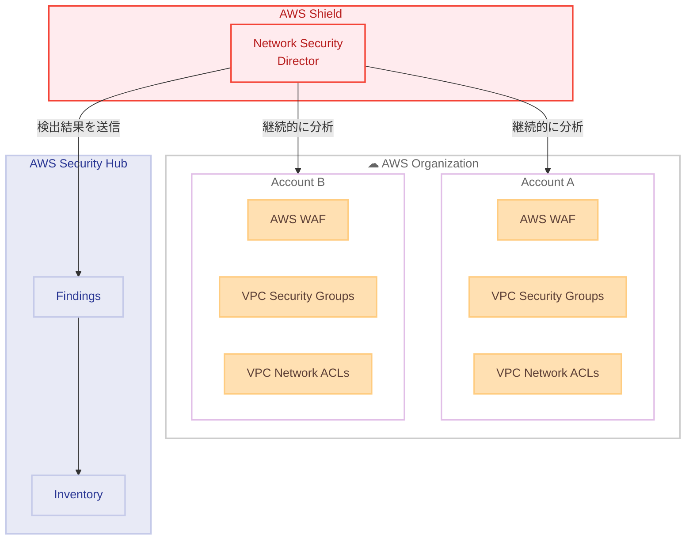

# AWS Shield - Network Security Director の検出結果が AWS Security Hub で利用可能に

**リリース日**: 2026 年 3 月 5 日
**サービス**: AWS Shield
**機能**: Network Security Director の Security Hub 統合

[このアップデートのインフォグラフィックを見る](https://takech9203.github.io/aws-news-summary/20260305-network-security-director-findings.html)

## 概要

AWS Shield は、現在プレビュー中の Network Security Director の検出結果が AWS Security Hub で利用可能になったことを発表した。Network Security Director は、AWS Organization 内の AWS WAF、VPC セキュリティグループ、VPC ネットワーク ACL などのネットワークセキュリティサービスの欠落や設定ミスを特定し、修復に関する推奨事項を提供する機能である。

Network Security Director の検出結果は、Security Hub コンソールの Inventory セクションにも表示されるようになった。この機能により、AWS Organization 内のアカウントまたは組織単位 (OU) 全体のネットワークを継続的に分析し、AWS のベストプラクティスに基づいてネットワークセキュリティサービスの欠落や設定ミスを示す検出結果を受け取ることができる。各検出結果の重大度は、特定された設定ミスの種類と、検出結果に関連するリソースのネットワークトポロジーの組み合わせに基づいて決定される。

**アップデート前の課題**

- ネットワークセキュリティサービスの設定ミスや欠落を組織全体で把握するには、各アカウントを個別に確認する必要があった
- AWS WAF、セキュリティグループ、ネットワーク ACL の設定状況を一元的に可視化する手段が限られていた
- セキュリティ検出結果が分散しており、Security Hub で統合的に管理・トリアージすることが困難だった

**アップデート後の改善**

- Network Security Director が組織全体のネットワークセキュリティ設定を継続的に分析し、問題を自動検出するようになった
- 検出結果が Security Hub の Inventory セクションに統合され、他のセキュリティ検出結果と一元管理できるようになった
- ネットワークトポロジーと設定ミスの種類に基づいた重大度評価により、優先度の高い問題から対処できるようになった

## アーキテクチャ図



Network Security Director が AWS Organization 内の各アカウントのネットワークセキュリティサービス (AWS WAF、VPC セキュリティグループ、VPC ネットワーク ACL) を継続的に分析し、検出結果を Security Hub に送信する流れを示している。

## サービスアップデートの詳細

### 主要機能

1. **組織全体のネットワークセキュリティ分析**
   - AWS Organization 内のアカウントまたは OU 全体を対象にネットワークを継続的に分析
   - AWS WAF、VPC セキュリティグループ、VPC ネットワーク ACL の設定状況を評価
   - AWS のベストプラクティスに基づいて欠落や設定ミスを検出

2. **Security Hub との統合**
   - 検出結果が Security Hub コンソールの Inventory セクションに表示
   - 他のセキュリティサービスの検出結果と統合的に管理可能
   - Security Hub のワークフロー機能を活用した自動対応やチケット連携が可能

3. **重大度ベースの優先度付け**
   - 設定ミスの種類とネットワークトポロジーの組み合わせに基づいて重大度を決定
   - リソースのネットワーク上の位置関係を考慮した実質的なリスク評価
   - 優先度の高い問題から効率的に対処可能

## 技術仕様

### 検出対象サービス

| 対象サービス | 検出内容 |
|------|------|
| AWS WAF | Web ACL の欠落、ルール設定の不備 |
| VPC セキュリティグループ | 過度に許可的なインバウンド/アウトバウンドルール |
| VPC ネットワーク ACL | サブネットレベルのアクセス制御設定の不備 |

### 重大度の決定要素

| 要素 | 説明 |
|------|------|
| 設定ミスの種類 | 欠落、過度な許可、ベストプラクティスからの逸脱など |
| ネットワークトポロジー | リソースがインターネットに面しているか、内部ネットワークに限定されているかなど |

### API 変更履歴

現時点で Network Security Director に関連する新しい API 変更は確認されていない。プレビュー機能であるため、今後 API が追加・更新される可能性がある。

## 設定方法

### 前提条件

1. AWS Shield Advanced のサブスクリプションが有効であること
2. AWS Security Hub が有効化されていること
3. AWS Organizations が設定されていること

### 手順

#### ステップ 1: AWS Shield コンソールで Network Security Director を有効化

AWS Shield コンソールにアクセスし、Network Security Director (プレビュー) の設定画面から機能を有効化する。分析対象のアカウントまたは OU を指定する。

#### ステップ 2: Security Hub での検出結果の確認

```bash
# Security Hub で Shield の検出結果を確認する CLI コマンド例
aws securityhub get-findings \
  --filters '{"ProductName": [{"Value": "Shield", "Comparison": "EQUALS"}]}' \
  --max-items 10
```

Security Hub コンソールの Inventory セクション、または AWS CLI を使用して Network Security Director の検出結果を確認する。

#### ステップ 3: 検出結果に基づく修復

検出結果に含まれる修復推奨事項に従い、該当するネットワークセキュリティサービスの設定を修正する。

## メリット

### ビジネス面

- **セキュリティ態勢の可視化**: 組織全体のネットワークセキュリティ設定状況を一元的に把握でき、ガバナンスが向上する
- **運用効率の向上**: 手動での設定確認作業が不要になり、セキュリティチームの工数を削減できる
- **コンプライアンス対応の強化**: ベストプラクティスに基づく継続的な評価により、監査対応が容易になる

### 技術面

- **自動検出と優先度付け**: ネットワークトポロジーを考慮した重大度評価により、実質的なリスクに基づいた対応が可能
- **Security Hub との統合**: 既存のセキュリティ運用ワークフローにシームレスに組み込める
- **マルチアカウント対応**: AWS Organizations を通じて複数アカウントの一括分析が可能

## デメリット・制約事項

### 制限事項

- 現在プレビュー段階であり、GA (一般提供) 時に機能や仕様が変更される可能性がある
- AWS Shield Advanced のサブスクリプションが必要であり、追加コストが発生する
- 検出対象は AWS WAF、VPC セキュリティグループ、VPC ネットワーク ACL に限定されている

### 考慮すべき点

- プレビュー機能であるため、本番環境での利用前に十分な検証が推奨される
- 大規模な Organization では検出結果の量が多くなる可能性があり、適切なフィルタリングやワークフローの設計が重要

## ユースケース

### ユースケース 1: マルチアカウント環境のセキュリティ監査

**シナリオ**: 数百のアカウントを持つ大企業で、各アカウントのネットワークセキュリティ設定がベストプラクティスに準拠しているかを定期的に確認したい。

**実装例**:
```bash
# Organization 全体の Shield 関連検出結果をエクスポート
aws securityhub get-findings \
  --filters '{"ProductName": [{"Value": "Shield", "Comparison": "EQUALS"}], "SeverityLabel": [{"Value": "HIGH", "Comparison": "EQUALS"}]}' \
  --output json > high-severity-findings.json
```

**効果**: 手動確認が不要になり、重大度の高い設定ミスを迅速に特定・修復できる。

### ユースケース 2: インターネット公開リソースの保護確認

**シナリオ**: インターネットに面した EC2 インスタンスや ALB に対して、WAF やセキュリティグループが適切に設定されているかを継続的に監視したい。

**実装例**:
```bash
# ネットワークトポロジーに基づく高重大度の検出結果を取得
aws securityhub get-findings \
  --filters '{"ProductName": [{"Value": "Shield", "Comparison": "EQUALS"}], "SeverityLabel": [{"Value": "CRITICAL", "Comparison": "EQUALS"}]}' \
  --sort-criteria '{"Field": "SeverityLabel", "SortOrder": "desc"}'
```

**効果**: インターネットに公開されたリソースの設定不備をネットワークトポロジーに基づいて優先的に検出し、攻撃リスクを低減できる。

### ユースケース 3: Security Hub を活用した自動修復ワークフロー

**シナリオ**: Network Security Director の検出結果を Security Hub のカスタムアクションと EventBridge を連携させ、特定の設定ミスを自動修復したい。

**実装例**:
```json
{
  "source": ["aws.securityhub"],
  "detail-type": ["Security Hub Findings - Custom Action"],
  "detail": {
    "findings": {
      "ProductName": ["Shield"],
      "Severity": {
        "Label": ["HIGH", "CRITICAL"]
      }
    }
  }
}
```

**効果**: 検出から修復までのプロセスを自動化し、セキュリティインシデントの対応時間を短縮できる。

## 料金

Network Security Director は AWS Shield Advanced の機能として提供されている。Shield Advanced のサブスクリプション料金が必要となる。

### 料金例

| 項目 | 料金 |
|--------|------------------|
| Shield Advanced サブスクリプション | $3,000/月 |
| Security Hub 検出結果の取り込み | 検出結果 10,000 件あたり $0.30 (最初の 10,000 件/アカウント/リージョン/月は無料) |

Network Security Director 自体の追加料金はプレビュー期間中は発生しない可能性があるが、GA 時の料金については公式ドキュメントを確認すること。

## 利用可能リージョン

公式発表では特定のリージョン制限について記載されていない。AWS Shield Advanced が利用可能なリージョンで Network Security Director (プレビュー) を使用できる。詳細は [AWS Shield の概要ページ](https://aws.amazon.com/shield/) を確認すること。

## 関連サービス・機能

- **AWS Shield Advanced**: Network Security Director の親サービス。DDoS 保護に加え、ネットワークセキュリティの設定監査機能を提供
- **AWS Security Hub**: セキュリティ検出結果の集約・管理プラットフォーム。Network Security Director の検出結果を統合表示
- **AWS WAF**: Web アプリケーションファイアウォール。Network Security Director の検出対象サービスの 1 つ
- **VPC セキュリティグループ**: インスタンスレベルのファイアウォール。Network Security Director の検出対象
- **VPC ネットワーク ACL**: サブネットレベルのアクセス制御。Network Security Director の検出対象
- **AWS Organizations**: マルチアカウント環境の管理。Network Security Director の分析範囲を定義

## 参考リンク

- [インフォグラフィック](https://takech9203.github.io/aws-news-summary/20260305-network-security-director-findings.html)
- [公式発表 (What's New)](https://aws.amazon.com/about-aws/whats-new/2026/03/network-security-director-findings/)
- [AWS Shield 概要ページ](https://aws.amazon.com/shield/)
- [AWS Security Hub ドキュメント](https://docs.aws.amazon.com/securityhub/latest/userguide/)
- [AWS Shield Advanced 料金](https://aws.amazon.com/shield/pricing/)

## まとめ

AWS Shield の Network Security Director (プレビュー) が Security Hub と統合されたことで、組織全体のネットワークセキュリティ設定の可視化と一元管理が大幅に改善された。AWS WAF、セキュリティグループ、ネットワーク ACL の設定ミスを継続的に検出し、ネットワークトポロジーに基づく重大度評価により効率的な対応が可能になる。Shield Advanced を利用中の組織は、このプレビュー機能を評価し、セキュリティ態勢の強化に活用することを推奨する。
