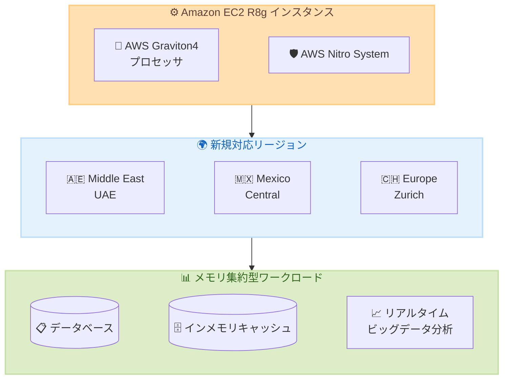

# Amazon EC2 R8g インスタンス - 追加リージョンでの提供開始

**リリース日**: 2026 年 3 月 6 日
**サービス**: Amazon EC2
**機能**: R8g インスタンスのリージョン拡大

📊 [このアップデートのインフォグラフィックを見る](https://takech9203.github.io/aws-news-summary/20260306-amazon-ec2-r8g-instances-additional-regions.html)

## 概要

Amazon EC2 R8g インスタンスが、AWS Middle East (UAE)、AWS Mexico (Central)、AWS Europe (Zurich) の各リージョンで利用可能になりました。R8g インスタンスは AWS Graviton4 プロセッサを搭載し、Graviton3 ベースの R7g インスタンスと比較して最大 30% 優れたパフォーマンスを提供します。

R8g インスタンスはメモリ集約型ワークロードに最適化されており、データベース、インメモリキャッシュ、リアルタイムビッグデータ分析などのユースケースに適しています。AWS Nitro System 上に構築されており、CPU 仮想化、ストレージ、ネットワーキング機能を専用ハードウェアとソフトウェアにオフロードすることで、ワークロードのパフォーマンスとセキュリティを強化します。

**アップデート前の課題**

- R8g インスタンスは限られたリージョンでのみ利用可能であり、中東、メキシコ、スイスのユーザーは Graviton4 ベースのメモリ最適化インスタンスを利用できなかった
- これらのリージョンではメモリ集約型ワークロードに対して、前世代の Graviton3 ベースインスタンスを使用する必要があった
- データレジデンシー要件がある場合、最新のメモリ最適化インスタンスを利用できないリージョンがあった

**アップデート後の改善**

- AWS Middle East (UAE)、AWS Mexico (Central)、AWS Europe (Zurich) で Graviton4 ベースのメモリ最適化インスタンスが利用可能になった
- これらのリージョンで最大 30% のパフォーマンス向上を享受でき、メモリ集約型ワークロードの処理効率が向上した
- データレジデンシー要件を満たしながら、最新世代のインスタンスを活用できるようになった

## アーキテクチャ図

R8g インスタンスが 3 つの新しいリージョンで利用可能になり、メモリ集約型ワークロードを各リージョンで実行できるようになりました。

## サービスアップデートの詳細

### 主要機能

1. **AWS Graviton4 プロセッサ**
   - 最新世代の Graviton4 プロセッサを搭載
   - Graviton3 ベースの R7g インスタンスと比較して最大 30% 優れたパフォーマンス
   - Web アプリケーションで最大 30%、データベースで最大 40%、大規模 Java アプリケーションで最大 45% の高速化

2. **大容量インスタンスサイズ**
   - R7g と比較して最大 3 倍の vCPU (最大 48xlarge) とメモリ (最大 1.5TB)
   - 12 種類のインスタンスサイズを提供
   - 2 つのベアメタルサイズを含む

3. **高性能ネットワークおよびストレージ**
   - 最大 50 Gbps の拡張ネットワーク帯域幅
   - Amazon EBS への最大 40 Gbps の帯域幅
   - AWS Nitro System によるパフォーマンスとセキュリティの強化

## 技術仕様

### インスタンス仕様

| 項目 | 詳細 |
|------|------|
| プロセッサ | AWS Graviton4 (Arm ベース) |
| 基盤 | AWS Nitro System |
| 最大インスタンスサイズ | 48xlarge |
| 最大メモリ | 1.5TB |
| 最大ネットワーク帯域幅 | 50 Gbps |
| 最大 EBS 帯域幅 | 40 Gbps |
| インスタンスサイズ数 | 12 (ベアメタル 2 つを含む) |

### パフォーマンス比較 (R7g 比)

| ワークロード | パフォーマンス向上 |
|-------------|-------------------|
| 全般 | 最大 30% |
| Web アプリケーション | 最大 30% |
| データベース | 最大 40% |
| 大規模 Java アプリケーション | 最大 45% |
| vCPU / メモリ | 最大 3 倍 |

## メリット

### ビジネス面

- **コスト最適化**: Graviton4 の優れた価格パフォーマンスにより、メモリ集約型ワークロードのコストを削減できる
- **グローバル展開**: 中東、メキシコ、ヨーロッパの追加リージョンで利用可能になり、データレジデンシー要件を満たしながら最新インスタンスを活用できる
- **エネルギー効率**: Graviton4 プロセッサの優れたエネルギー効率により、サステナビリティ目標の達成に貢献

### 技術面

- **高メモリ容量**: 最大 1.5TB のメモリにより、大規模なインメモリデータベースやキャッシュの実行が可能
- **高スループット**: 50 Gbps のネットワーク帯域幅と 40 Gbps の EBS 帯域幅により、データ集約型ワークロードに対応
- **セキュリティ強化**: AWS Nitro System による仮想化、ストレージ、ネットワーキングのハードウェアオフロードでセキュリティを向上

## デメリット・制約事項

### 制限事項

- Arm ベースのプロセッサであるため、x86 向けにコンパイルされたアプリケーションはそのままでは動作しない
- 一部のソフトウェアやライブラリが Arm アーキテクチャに対応していない場合がある
- すべてのリージョンで利用可能ではないため、利用可能リージョンの確認が必要

### 考慮すべき点

- x86 から Graviton への移行には、アプリケーションの再コンパイルやテストが必要
- AWS Graviton Fast Start プログラムや Porting Advisor for Graviton を活用して移行計画を立てることを推奨

## ユースケース

### ユースケース 1: 大規模データベース

**シナリオ**: 中東リージョンで大規模な PostgreSQL や MySQL データベースを運用しており、クエリパフォーマンスの向上とメモリ容量の拡大が必要。

**効果**: R8g インスタンスの最大 1.5TB のメモリと Graviton4 のデータベースワークロードに対する最大 40% のパフォーマンス向上により、データベースの応答時間を大幅に短縮できる。

### ユースケース 2: インメモリキャッシュ

**シナリオ**: メキシコリージョンで Redis や Memcached を使用した大規模なキャッシュレイヤーを構築し、低レイテンシーのデータアクセスを実現したい。

**効果**: 大容量メモリにより、より多くのデータをキャッシュに保持でき、Graviton4 の高いパフォーマンスでキャッシュヒット率とスループットが向上する。

### ユースケース 3: リアルタイムビッグデータ分析

**シナリオ**: ヨーロッパ (チューリッヒ) リージョンで Apache Spark や Presto を使用したリアルタイムデータ分析を実行し、データレジデンシー要件を満たす必要がある。

**効果**: 大容量メモリとネットワーク帯域幅により、大規模なデータセットをメモリ内で効率的に処理でき、スイスのデータ保護規制に準拠しながら高速な分析が可能になる。

## 料金

R8g インスタンスは、オンデマンドインスタンス、Savings Plans、スポットインスタンス、または専用インスタンスおよび専用ホストとして購入できます。料金はリージョンとインスタンスサイズによって異なります。

詳細な料金については、[Amazon EC2 料金ページ](https://aws.amazon.com/ec2/pricing/)を参照してください。

## 利用可能リージョン

今回のアップデートで以下のリージョンが追加されました。

- AWS Middle East (UAE)
- AWS Mexico (Central)
- AWS Europe (Zurich)

R8g インスタンスが利用可能な全リージョンについては、[Amazon EC2 R8g Instances](https://aws.amazon.com/ec2/instance-types/r8g/) ページを参照してください。

## 関連サービス・機能

- **AWS Graviton4**: 最新世代の AWS 設計の Arm ベースプロセッサで、最高のパフォーマンスとエネルギー効率を提供
- **AWS Nitro System**: EC2 インスタンスに高パフォーマンス、高セキュリティを提供する基盤テクノロジー
- **Amazon EBS**: EC2 インスタンス向けの高性能ブロックストレージサービス
- **AWS Graviton Fast Start**: Graviton ベースインスタンスへの移行を支援するプログラム
- **Porting Advisor for Graviton**: x86 から Graviton への移行時のコード互換性を評価するツール

## 参考リンク

- 📊 [インフォグラフィック](https://takech9203.github.io/aws-news-summary/20260306-amazon-ec2-r8g-instances-additional-regions.html)
- [公式発表 (What's New)](https://aws.amazon.com/about-aws/whats-new/2026/03/amazon-ec2-r8g-instances-additional-regions/)
- [Amazon EC2 R8g Instances](https://aws.amazon.com/ec2/instance-types/r8g/)
- [AWS Graviton Fast Start](https://aws.amazon.com/ec2/graviton/fast-start/)
- [Porting Advisor for Graviton](https://github.com/aws/porting-advisor-for-graviton)
- [料金ページ](https://aws.amazon.com/ec2/pricing/)

## まとめ

Amazon EC2 R8g インスタンスが AWS Middle East (UAE)、AWS Mexico (Central)、AWS Europe (Zurich) の 3 リージョンで利用可能になり、Graviton4 ベースのメモリ最適化インスタンスのグローバルカバレッジが拡大しました。これらのリージョンでメモリ集約型ワークロードを実行している場合は、R8g インスタンスへの移行を検討し、最大 30% のパフォーマンス向上と優れたエネルギー効率を活用してください。
